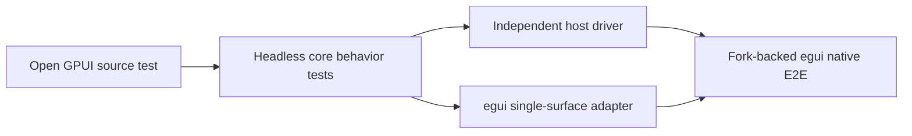

# Open GPUI Docking Conformance Catalog

## Purpose

This catalog selects the smallest high-value behavior set from
`repo-ref/open-gpui/crates/gpui_docking` for the `dockspace` refactor. Each
case records its source evidence and the executor that must prove it. The
catalog prevents a core-only replay or a fake provider from being described as
native multi-viewport product evidence.

## Non-goals

- Porting GPUI `Entity`, `View`, `Window`, panel factory, focus-handle, or
  animation runtime code into `dockspace`.
- Requiring pixel-identical rendering or animation between GPUI and egui.
- Treating a direct `DockEngine` harness as adapter replaceability proof.
- Advertising crates.io egui native multi-viewport support before the
  fork-backed runtime passes its required cases.

## Execution Model

| Executor | Definition | Product claim it may support |
| --- | --- | --- |
| `core-behavior` | Focused Rust tests owned by the headless core. | Graph, transaction, policy, lifecycle, and failure semantics only. |
| `host-driver` | Independently implemented renderer-neutral adapter using public host-frame contracts. | Adapter-neutral semantic parity; never native-window behavior. |
| `egui-single-surface` | crates.io egui adapter using `show_single_surface` and contained floating presentations. | Single logical surface and contained workflow only. |
| `fork-native-e2e` | Upstream-based egui/eframe provider with two real OS windows and typed platform facts. | Native tear-off, cross-window docking, lifecycle, focus, and mixed-DPI support. |

## Minimal Case Catalog

A case is complete only when every listed executor has a passing implementation;
an empty executor cell means that executor is not a required proof for that
case. The status column records complete-case status, while the executor evidence
below records partial progress without promoting an incomplete case.

| ID | Open GPUI source evidence | Required executors | Key assertion | Status |
| --- | --- | --- | --- | --- |
| `OGC-01` | `graph_split_tests.rs::repeated_same_axis_edge_docks_flatten_into_nary_split`; `graph_move_tests.rs::checked_move_item_rejects_stale_edge_plan_without_replanning` | `core-behavior`, `host-driver`, `egui-single-surface` | N-ary canonical topology is deterministic; stale plans fail without mutation. | Planned |
| `OGC-02` | `dock_op_fixture_tests.rs::dock_op_sequence_fixtures_hold_canonical_invariants`; `workspace_move_tests.rs::workspace_merge_space_preserves_target_tab_mru_for_followup_close` | `core-behavior`, `host-driver` | Move, merge, and close preserve item ownership, selection, and target-local MRU atomically. | Planned |
| `OGC-03` | `host_interaction_tests.rs::local_release_on_first_target_hit_does_not_commit`; `...::source_only_release_does_not_commit_cached_local_delivery_without_hover_signal` | `core-behavior`, `host-driver`, `egui-single-surface` | A release commits only an acknowledged current preview; cached or first-hit delivery is inert. | Planned |
| `OGC-04` | `host_viewport_route_tests.rs::viewport_runtime_rejects_cached_local_delivery_after_window_facts_go_stale`; `host_viewport_preview_cleanup_tests.rs::viewport_runtime_replacement_clears_routed_preview_for_old_window`; `host_viewport_close_tests.rs::viewport_runtime_late_close_for_replaced_window_keeps_current_viewport_state` | `core-behavior`, `host-driver`, `fork-native-e2e` | Route/scene/binding changes invalidate old previews and repaint every affected surface; a delayed observation for binding A1 cannot mutate replacement binding A2 even when both reuse one native token. | Planned |
| `OGC-05` | `host_viewport_placement_tests.rs::viewport_runtime_tear_off_opens_viewport_then_moves_item`; `...::viewport_runtime_tear_off_bounds_preserve_drag_cursor_offset` | `core-behavior`, `host-driver`, `fork-native-e2e` | Tear-off freezes payload, source size, and grab offset. Hidden staging output must precede Show; exact show acknowledgement, Visible observation, and a post-show presented staging output must precede topology transfer; the target remains non-interactive until its first committed output. | Planned |
| `OGC-06` | `host_viewport_placement_tests.rs::viewport_runtime_handle_tear_off_is_not_route_ready_before_first_host_scene`; `...::viewport_runtime_tear_off_fails_closed_when_platform_viewport_windows_unsupported` | `core-behavior`, `fork-native-e2e` | A created, minimized, unsupported, or unpainted viewport is not routeable or admissible. | Planned |
| `OGC-07` | `host_tests.rs::cross_window_tab_drag_can_drop_into_target_controller_host`; `host_viewport_placement_tests.rs::runtime_opened_viewports_support_cross_window_stack_drag` | `core-behavior`, `host-driver`, `fork-native-e2e` | Cross-window redock preserves payload order and selection, then performs ownership-aware source vacancy handling. | Planned |
| `OGC-08` | `host_viewport_close_tests.rs::viewport_runtime_merge_back_should_close_records_pending_plan_without_graph_mutation`; `...::runtime_opened_cross_window_drag_clears_state_when_source_window_closes_before_release`; `...::runtime_opened_cross_window_drag_clears_target_preview_when_target_window_closes` | `core-behavior`, `host-driver`, `fork-native-e2e` | Two-phase close uses exact `Allow`, `Veto`, or `Deferred` tokens and commits one complete-roster transaction only after exact destruction proof. Source destruction cancels the global gesture; target destruction clears only that route and preview while preserving the source gesture. | Planned |
| `OGC-09` | `host_viewport_lifecycle_tests.rs::backend_confirmed_activation_consumes_pending_viewport_activation`; `host_viewport_close_tests.rs::close_recovery_does_not_steal_activation_from_another_active_docking_window` | `core-behavior`, `host-driver`, `fork-native-e2e` | Focus uses exact backend confirmation and priority; close recovery never guesses a panel or steals newer activation. | Planned |
| `OGC-10` | `viewport_coordinates.rs::coordinate_conversion_requires_current_bounds_snapshots`; `...::platform_resize_stales_route_until_host_scene_republishes` | `core-behavior`, `host-driver`, `fork-native-e2e` | Physical and logical coordinates remain distinct; resize, scale, work-area, and incarnation changes stale old route authority. | Planned |
| `OGC-11` | `host_interaction_tests.rs::runtime_rendered_mouse_up_with_unknown_button_state_does_not_tear_off`; `host_viewport_matrix_tests.rs::source_only_known_viewport_release_rejects_overlapping_geometry_without_backend_route_selection` | `core-behavior`, `host-driver`, `fork-native-e2e` | A global pointer edge plus current receiver/capture receipt is required; unknown or blocked facts cannot infer a release or target. | Planned |
| `OGC-12` | `host_accessibility_tests.rs::accessibility_gpui_mapping_exposes_stable_roles_ids_and_final_tab_actions`; `host_transition_tests.rs::transition_executor_replaces_active_execution_and_completes_reduced_motion_immediately` | `core-behavior`, `host-driver`, `egui-single-surface` | Final presentation identity and geometry drive accessibility; motion retargets from the sampled state while hit testing remains final-plan based. | Planned |

## Executor Evidence

| Case | Executor | Evidence | Status |
| --- | --- | --- | --- |
| `OGC-01` | `host-driver` | `dockspace_host_conformance::tests::ogc_01_repeated_same_axis_docks_flatten_and_stale_targets_are_inert` | Passing |
| `OGC-02` | `host-driver` | `dockspace_host_conformance::tests::ogc_02_merge_and_close_preserve_target_local_mru_atomically` | Passing |
| `OGC-03` | `host-driver` | `dockspace_host_conformance::tests::ogc_03_release_on_first_target_hit_is_inert_without_a_painted_preview`; `...::ogc_03_cached_or_stale_receiver_cannot_authorize_release`; `...::ogc_03_current_painted_preview_commits_exactly_once` | Passing |
| `OGC-04` | `host-driver` | `dockspace_host_conformance::tests::ogc_04_stale_window_facts_clear_preview_and_require_repaint`; `...::ogc_04_late_a1_close_cannot_mutate_same_token_a2_binding` | Passing |
| `OGC-05` | `fork-native-e2e` | `integration/egui-native-e2e` dynamically creates a real child window from an outside-all release and waits for first-live interaction authority before continuing; grab-offset and multi-item payload assertions remain outstanding. | Partial |
| `OGC-06` | `fork-native-e2e` | `integration/egui-native-e2e` refuses to continue until the created child has a live authoritative scene; minimized, unsupported, and failed-create negative cases remain helper-level tests. | Partial |
| `OGC-07` | `fork-native-e2e` | `integration/egui-native-e2e` redocks the dynamically created child into the real root window, then verifies exact item ownership and source-surface retirement; multi-item order and selection remain outstanding. | Partial |

The host-driver crate depends on the public `dockspace::runtime` facade and
never imports or owns `DockEngine`. Its deterministic driver explicitly marks
every unpainted surface unavailable. For interaction it measures and paints a
core-derived plan, retains an affine output capability until the renderer
reports exact presentation, and submits independently observed framework
receiver facts. It does not turn callback absence into a fact, construct core
receipts, or use the core hit resolver as an external geometry oracle.

The OGC-04 host slice additionally uses opaque native-surface leases. The host
retains its reusable window token while the core privately mints each binding
incarnation. Complete native snapshots must exactly cover the current binding
roster, and their observation generations advance only with a successful host
frame commit. This proves binding ABA isolation and presentation invalidation;
desktop-global cross-window route parity remains assigned to the native
executor rather than being inferred from surface-local pointer input.

## Explicitly Rejected Fallbacks

The following Open GPUI behaviors are evidence of constraints or historical
fallbacks, not core semantics to copy. They must become fail-closed negative
cases where applicable.

- `host_viewport_route_tests.rs::viewport_runtime_hovered_host_release_uses_last_hovered_viewport_when_hover_backend_unavailable`.
- `host_viewport_route_tests.rs::viewport_runtime_source_only_release_uses_current_backend_fallback_not_last_routed_viewport`.
- `host_viewport_route_adapter_tests.rs::global_screen_rectangle_route_records_front_to_back_fallback_source`.
- `interaction.rs::outside_release_poll_*` polling as a substitute for a typed
  global pointer release.
- Radial guide selection, best-valid-after-rejection resolution, geometry
  overlap routing, and callback absence as authority.

`Unknown`, stale, cross-binding, opaque-blocked, or missing facts must reject
the affected action. A rejected geometric winner must not fall through to a
lower-priority target.

## Alternatives Considered

### Copy the Open GPUI runtime

Rejected. It would import GPUI entities, window ownership, scheduling, and
focus implementation into a renderer-neutral core and create a second runtime.

### Treat direct-engine tests as complete conformance

Rejected. Core-local tests can prove reducer behavior but cannot prove adapter
ordering, real receiver ownership, or OS lifecycle facts.

### Selected contract catalog with layered executors

Chosen. It keeps portable graph semantics in the core while reserving actual
window facts and framework execution for the appropriate adapter.

## Success Criteria

| Metric | Target | Measurement |
| --- | --- | --- |
| Catalog completeness | 12/12 cases have provenance and required executor assignments. | This document and named source-test review. |
| Core parity | Every `core-behavior` case passes deterministically. | Focused core Rust tests in CI. |
| Adapter parity | Every `host-driver` and `egui-single-surface` assignment passes without direct engine ownership. | Cross-adapter conformance suite. |
| Native claim gate | Every `fork-native-e2e` case passes on the fork-backed provider. | Two-window harness on supported native platforms. |

## Risks

| Risk | Mitigation |
| --- | --- |
| A fake provider is mistaken for production evidence. | Keep it test-only and require the `fork-native-e2e` column before any native claim. |
| Open GPUI fallback behavior leaks into the core. | Keep the rejected-fallback list as negative conformance coverage. |
| The catalog expands into every historical test. | Add a case only when it protects a distinct invariant or externally visible workflow. |
| Core and adapter behavior drift. | Require the same source case to run through the designated layered executors. |
