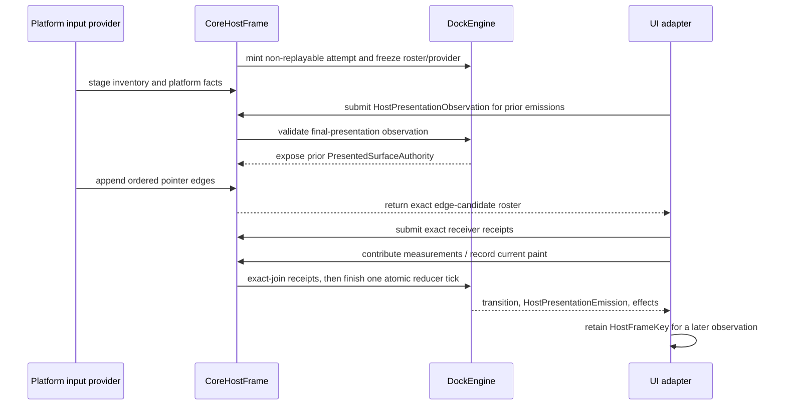
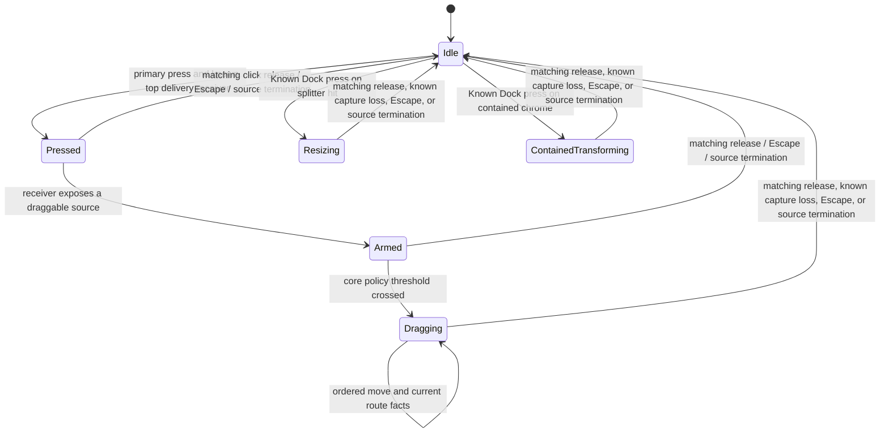

# Pointer Edge Journal Contract

## Purpose

This document defines the target input contract for `dockspace`. The lossless
edge/journal types and core-owned provider authority ledger are implemented in
`dockspace::pointer_journal`. The exact receiver-attempt, candidate-roster, and
presentation-authority-bound receipt types are implemented in
`dockspace::pointer_receiver`. `CoreHostFrame` now freezes the live provider,
requires exactly one complete journal and exact receipt batch, validates the
receipt against post-observation interactive output, and advances the provider
watermark only in the successful candidate transaction. Interaction-FSM wiring
and the surface-local egui producer path are implemented. Remaining work is
native capability hardening, broader host conformance, and public API sealing.

`dockspace` must be the sole authority for docking interaction semantics. A UI
adapter supplies measured presentation facts, actual event-receiver facts, and
platform facts. It must not infer docking targets, reorder input, or transition
drag state on its own.

## Problem Statement

The current input path represents the final state seen during a frame rather
than the ordered input edges that produced it.

- `PointerObservation` carries a final button roster, not press and release
  edges. A batch containing `release(A)` followed by `press(B)` cannot be
  replayed faithfully.
- The egui renderer reduces a release to a boolean and takes the last pointer
  position in `InputState.events`; it therefore loses per-edge position and
  causality.
- Per-surface drafts are collected through a `BTreeMap<SurfaceId, _>`. Surface
  identity, not source order, determines reducer order.
- Raw rectangle scanning is used for some splitter and drag decisions. It does
  not prove that a docking widget, rather than a modal, popup, `Area`, or
  application widget, was the actual receiver.
- A local `PointerGone` or focus loss is correctly insufficient evidence of a
  global capture loss, but the protocol has no authoritative global terminal
  event either.

The result is a strict scene protocol with an incomplete interaction protocol.
It is not sufficient for native multi-viewport docking.

## Decision

Replace adapter-authored pointer `RendererIntent`s and snapshot-derived route
proofs with one core-owned, ordered pointer edge journal. Every docking pointer
operation is derived by the core from an opaque edge ticket, a core-minted
`PresentedSurfaceAuthority`, and explicit `Known` or `Unknown` platform facts.



`HostPresentationObservation` is the existing frame-start prelude. It observes
only pending emissions created by an earlier successful host frame. A valid
observation may promote that prior output before later pointer edges reduce in
the current frame. By contrast, a paint recorded in the current frame only
stages a `HostPresentationEmissionRequest`; `finish` later creates the concrete
`HostPresentationEmission` and its `HostFrameKey`. That emission can be
observed and promoted only in a later host frame. A current paint therefore
never authorizes a pointer edge in the same host frame.

For a known final presentation, the later observation has the existing shape
below. `Known(None)` and `Unknown(...)` settle lifecycle state but do not mint
interaction authority.

```rust
let key = emission.output().key();
let observation = HostPresentationObservation::Batch(vec![
    HostPresentationObservationEntry::new(
        key.stream(),
        HostPresentationStreamObservation::Captured {
            generation,
            progress: HostPresentationProgress::Retired {
                settled_through: key,
                presented: Authority::Known(Some(key)),
            },
        },
    ),
]);
```

## Terms

| Term | Meaning |
| --- | --- |
| Presentation output ticket | `SurfacePresentationOutputTicket`: opaque core-minted capability for one committed ready scene output; it is not interaction authority. |
| Presentation emission request | `HostPresentationEmissionRequest`: frame-local record returned by `record_presentation_output` or `record_painted_surface_contribution`; it is not presentation proof. |
| Presentation emission | `HostPresentationEmission`: record returned in `EngineTransition::presentation_emissions()` only after `finish` succeeds. Its `HostFrameKey` may be reported in a later observation. |
| Presentation observation | `HostPresentationObservation`: one frame-start `NoUpdate` or exact-set `Batch` over streams pending at frame begin. A `Retired` progress fact may prove a prior emission's final state. |
| Presented surface authority | `PresentedSurfaceAuthority`: opaque capability minted by core only after an accepted final-presentation observation proves an emitted paint at an exact headless or native target and the retained scene/coordinate authority still matches. |
| Pointer provider | The sole live ordered input source admitted by one engine. Its frozen scope is either `DesktopGlobal` or one `SurfaceLocal` presentation endpoint. It is not a per-widget callback. |
| Provider scope | `PointerProviderScope`: immutable for one provider incarnation. `DesktopGlobal` can report desktop physical position and global hovered-window facts; `SurfaceLocal` freezes one `PresentationHostLease` and logical/native surface endpoint and cannot report global hover or outside-all facts. |
| Provider incarnation | Opaque core-minted `PointerInputLease` for one provider lifetime and scope. The same lease spans host frames; recreating, resetting, or changing scope requires a new lease. |
| Provider sequence | Strictly monotonic total order within one live provider incarnation. A desktop-global lease orders every pointer and viewport it reports; a surface-local lease orders every pointer delivered through its one endpoint. |
| Journal interval | One complete contiguous `(previous, through]` sequence interval. Equal watermarks explicitly prove an empty interval; missing or gapped edges reject atomically. |
| Pointer stream | Opaque `PointerStreamId` composed from the exact provider lease, provider-owned `PointerId`, and a core-minted stream incarnation. `StreamCancelled` terminates that incarnation; later reuse of the same pointer number, even under the same lease, creates a different stream. |
| Pointer journal ledger | Core-owned `PointerJournalLedger`: admits at most one live provider, freezes its scope, tracks its exact committed watermark, and retains retired-incarnation tombstones. It is not an adapter facade. |
| Host-frame receiver attempt | Opaque, non-replayable core identity issued outside rollbackable engine state. A failed frame retry receives a new attempt even when lease and edge sequence are unchanged. |
| Pointer receiver candidate | Core-frozen question for one journal edge. It asks for the event's independent click/drag delivery routes, a point-bound hover hit, both, or neither according to the abstract interaction phase. Adapters cannot mint or add candidates. |
| Delivery receipt | Exact adapter answer containing independent click and drag dispositions (`Dock(region)`, `DockCanvas`, `Blocked`, `NoReceiver`, or typed `Unknown`) bound to one complete `PresentedSurfaceAuthority`. A dock claim is valid only in the exact lane declared by the core manifest. |
| Hover-hit receipt | Separate point-bound answer for active or potentially active drag targeting. It binds the edge location, presentation authority, source suppression, and the manifest's unique frontmost `HoverDrop` winner. It never substitutes for event delivery. |
| Pointer edge ticket | Opaque core-minted identity for one accepted journal entry. It is minted only after journal and exact receipt-set validation. Its identity is the exact provider lease plus accepted sequence. |
| Receiver | The actual UI layer that accepted an edge at a point. Geometry alone is not a receiver. |
| Capture | The authoritative platform owner of pointer delivery, optionally bound to a core-issued capture lease. |
| Hover | Desktop-only authoritative native target under a global physical pointer, independent of capture. Surface-local locations carry no hover field. |
| Desktop work-area route | `DesktopWorkAreaRoute`: the exact platform-provider lease, core work-area generation, and selected work-area token attached to one explicit desktop `NoWindow` edge. It authorizes placement only while all three remain current. |

## Invariants

1. A renderer never constructs a drag session id, drop target, route proof, or
   pointer edge ticket.
2. A pointer edge is processed exactly once, in its exact lease's provider
   sequence order. Cross-viewport order requires a `DesktopGlobal` lease.
3. No source-order, callback-order, `SurfaceId`, focus stamp, z-order, or
   geometry heuristic may synthesize missing provider order or upgrade a local
   scope into desktop-global authority.
4. A docking receiver or target must name a current presentation authority;
   naked scene stamps and adapter-provided logical points are not authority.
5. A desktop location is converted to a surface against current coordinate
   authority. A surface-local logical location is valid only for its lease's
   frozen host and endpoint. A stale binding, DPI, bounds, host, scope, or
   incarnation fails closed.
6. `Known(Foreign)`, `Known(None)`, and `Unknown` are semantically distinct.
   `Unknown` is never upgraded into a target, release, capture loss, or
   tear-off opportunity. `Known(None)` authorizes native placement only with a
   known desktop-physical point and an exact current `DesktopWorkAreaRoute`.
7. A current contribution may stage only a `HostPresentationEmissionRequest`.
   Its later `HostPresentationEmission` can become interaction authority only
   through a later `HostPresentationObservation`; no current-frame output
   ticket, request, emission, or candidate plan authorizes input already being
   reduced.
8. The core owns drag, resize, contained-transform, preview, release, and
   cancellation state transitions. Adapters only report facts.
9. Location lanes never mix: `DesktopGlobal` accepts only `Desktop` locations,
   while `SurfaceLocal` accepts only logical `SurfaceLocal` locations. Rejection
   is atomic and does not advance the provider watermark.

## Protocol Interface

The structural scope, lease, stream, sequence, edge, journal, ticket, receiver
attempt, candidate roster, receipt model, and atomic HostFrame join now exist.
The pointer interaction reducer remains the target. The public surface should
remain small, and the ownership rules must not change.

```rust
pub enum SurfaceLocalPointerEndpoint {
    Logical(SurfaceId),
    Native(ViewportBinding),
}

pub struct SurfaceLocalPointerScope {
    host: PresentationHostLease,
    endpoint: SurfaceLocalPointerEndpoint, // sole surface authority
}

pub enum PointerProviderScope {
    DesktopGlobal,
    SurfaceLocal(SurfaceLocalPointerScope),
}

pub struct PointerInputLease {
    /* opaque engine domain + provider incarnation + frozen scope */
}
pub struct SurfaceLocalPointerProvider {
    /* non-cloneable producer ownership + last core-committed watermark */
}
pub struct SurfaceLocalPointerDrainReceipt {
    /* affine proof that the sole local producer has stopped */
}
pub struct PointerStreamId {
    /* opaque exact lease + pointer id + core-minted stream incarnation */
}
pub struct PointerEdgeSequence(u64); // total order inside the exact lease
pub struct PointerEdgeTicket { /* opaque exact lease + accepted sequence */ }

pub enum PointerEdgeKind {
    Moved,
    ButtonPressed(PointerButton),
    ButtonReleased(PointerButton),
    ContactEnded(PointerButton),
    StreamEnded,
    CaptureChanged,
    StreamCancelled(PointerStreamCancelReason),
}

pub enum PointerEdgeLocation {
    Desktop {
        position: Authority<PhysicalPoint>,
        hovered: Authority<PointerWindow>,
    },
    SurfaceLocal {
        position: Authority<LogicalPoint>,
    },
}

pub struct PointerEdge {
    sequence: PointerEdgeSequence,
    pointer: PointerId,
    kind: PointerEdgeKind,
    location: PointerEdgeLocation,
    capture_owner: Authority<PointerCaptureOwner>,
}

pub struct PointerEdgeJournal {
    previous: PointerEdgeSequence,
    through: PointerEdgeSequence,
    edges: Vec<PointerEdge>, // exact contiguous coverage of the interval
}
```

`CaptureChanged` deliberately has no payload. Its value comes only from that
edge's event-time `capture_owner: Authority<PointerCaptureOwner>` fact.
`Known(None)` or `Known(Foreign)` may prove capture loss for the active session;
`Unknown` keeps the session alive and blocks actions that require capture proof.
It must never be rewritten as a move, a known owner, or `StreamCancelled`.
`ButtonReleased` is a mouse-like release whose provider-local pointer identity
remains live. `ContactEnded` is the normal touch or pen terminal: it applies the
release first, freezes that edge's post-release button and capture authority,
and then retires the exact pointer stream. `StreamEnded` terminates a
buttonless pointer identity without inventing a release. `StreamCancelled` is
reserved for an abnormal typed lifecycle terminal. A provider reset or shutdown
is not a pointer edge; it retires or replaces the provider lease. Terminality
is therefore carried by the event algebra rather than by an independent
boolean which could otherwise make `Moved` or `ButtonPressed` illegally
terminal.

When the enrollment checkpoint made button state complete, the ledger enforces
the button algebra exactly: a known-down button cannot be pressed twice, a
known-up button cannot be released, `ContactEnded(button)` must release that
button, and `StreamEnded` requires no button to remain down for the pointer.
A pointer-local cancellation removes only that pointer's known buttons and
capture; it does not revoke completeness for unrelated pointers. Provider-wide
reset or shutdown belongs to lease retirement and replacement, not a synthetic
pointer-local edge.

A complete pointer-authority checkpoint is an enrollment baseline only. It may
be submitted at the provider's initial committed watermark before the first
physical edge. Once any edge is accepted, the checkpoint lane is permanently
closed for that provider incarnation. A later checkpoint cannot rewrite
aggregate buttons or capture while leaving active streams and interaction
owners unchanged; it is rejected atomically instead.

`SurfaceLocalPointerEndpoint` is the sole surface authority inside a local
scope; there is no duplicate surface field to drift. The ledger validates the
local presentation host's engine domain and, for `Native`, the exact binding's
engine domain before minting a lease. It then rejects any journal edge whose
location lane differs from the immutable lease scope before advancing the
watermark. Consequently a local edge cannot smuggle desktop hover, foreign
window, or outside-all semantics into the reducer.

Receiver evidence is a separate exact-set protocol. A core-frozen candidate
roster names the required lanes and prior interactive outputs. The adapter
answers every candidate exactly once with `NotApplicable`, typed `Unknown`, or
a `PresentedPointerReceiverObservation` created from one indivisible
`SurfaceInteractionProjection`. That observation stores the complete
`PresentedSurfaceAuthority`, including concrete emission provenance, rather
than merely an output ticket. It cannot be constructed from a scene stamp,
naked output ticket, emission request, or newly emitted key.

The existing presentation lifecycle and the implemented journal insertion point
are intentionally narrow:

```rust
let host: PresentationHostLease = engine.create_presentation_host()?;
let provider = engine.create_surface_local_pointer_provider(
    local_scope,
    committed_through,
)?;
let mut frame = engine.begin_host_frame(host)?;

// Future native U9a prelude. The final phase guard will permit this one
// dedicated platform-fact operation before the existing observation call.
frame.stage_platform_facts(snapshot)?;

// Current API: exact facts for streams pending when this frame began.
// Each known `HostFrameKey` came from an earlier successful transition.
frame.submit_presentation_observation(observation)?;

// Implemented HostFrame integration. The complete contiguous journal is
// constructed by the provider; current-frame paint is ineligible here.
let submitted_through = journal.through();
frame.submit_surface_pointer_journal(&provider, journal)?;
let candidates = frame.pointer_receiver_candidates()
    .expect("a staged journal freezes one candidate roster");
let receipts = adapter.collect_exact_receiver_receipts(&candidates)?;
frame.submit_pointer_receiver_receipts(receipts)?;

// Current API: this records a paint request, not presentation authority.
let request = frame.record_painted_surface_contribution(token)?;
// The retained-token call contributes its own surface. Every other rostered
// surface receives exactly one `push_surface_contribution` before `finish`.
let transition = frame.finish(&mut engine)?;
assert_eq!(provider.committed_through(), submitted_through);

// Current API: only now does core mint a concrete emission/key.
let emission = transition.presentation_emissions()
    .iter()
    .find(|emission| emission.request() == request)
    .expect("the committed paint request emits once");

// In a later host frame, the provider reports `emission.output().key()` in a
// `HostPresentationObservation::Batch`. Core, not the adapter, may then mint
// `PresentedSurfaceAuthority` after validating the retired/presented fact.

// Once every adapter submission path is detached, retirement and tombstone
// compaction occur atomically. Rejected settlement leaves the receipt retryable.
let mut drained = provider.drain()?;
engine.retire_quiesced_surface_local_pointer_provider(&mut drained)?;
```

The core validates the submitted journal's `previous` watermark against the
last committed watermark for that exact lease, freezes the candidate roster,
and validates the receipt batch as an exact set after presentation observations
have reduced. Only after that join succeeds does it mint
`PointerEdgeTicket { lease, sequence }` and advance the provider watermark.
There is no later public method that accepts a manually constructed edge
ticket. A second provider of either scope cannot be admitted concurrently.
Native multiview must feed one desktop aggregator (or establish an ingress total
order before constructing its journal); a surface-local lease is deliberately
restricted to one endpoint.

Surface-local producer ownership is distinct from the copyable
`PointerInputLease` transport identity. Renderer adapters submit through the
non-cloneable producer. A private guard retained by the matching host frame
advances the producer watermark only after the core candidate publishes; frame
rollback releases the lane without acknowledging the journal. The adapter then
consumes the producer into a drain receipt before retirement. Settlement
accepts both an exact active provider and an exact tombstone created earlier by
core scope reconciliation. Frame age, callback absence, and a missing current
provider are never quiescence proof. The raw create, submit, and retirement
entry points reject `SurfaceLocal`; copying `provider.lease()` therefore cannot
continue production or bypass quiesced retirement after the affine owner drains.

The core retains only a weak monitor for the producer state. The provider, an
in-flight frame guard, and a drain receipt each retain the corresponding strong
capability. If an adapter accidentally drops all three without settling the
receipt, `reap_abandoned_surface_local_pointer_provider` can prove that no
future journal exists and reclaim either the active lane or an implicitly
retired detailed tombstone fail-closed. It cannot race a live frame or a
retained receipt. Active reclamation reports the same typed presentation
invalidation as ordinary retirement; tombstone-only reclamation advances only
the retention revision and requests no second repaint or reducer tick.

A surface-local provider also cannot establish desktop-global drag routing or
pointer pass-through obligations. Native tear-off and cross-window docking must
enter through the joined desktop-global backend ingress, whose ordered journal,
platform facts, and effect acknowledgements share one host transaction.

The journal-driven interaction cutover is complete: pointer variants of
`RendererIntent` no longer exist, and the crates.io egui outer-frame path uses
the surface-local producer directly. A host frame with an active provider has
exactly one pointer reducer. Future adapters must not reintroduce a second
gesture path or translate one physical edge into both semantic and journal
input.

Keyboard, accessibility, and explicit menu commands are separate semantic
inputs. Pointer-originated close, tab, splitter, and contained-chrome actions
must flow through the journal.

## Host-Frame Ordering

The host frame enforces the implemented phases below. The platform inventory
prelude remains the future U9a extension; the named presentation calls describe
the current protocol it must preserve.

1. Freeze the `PresentationHostLease` host scope, complete logical surface
   roster, and pending presentation-stream scope.
2. Future: stage one complete inventory/platform fact sample in a dedicated
   prelude, rather than through ordinary `EngineInput`.
3. Call `submit_presentation_observation` exactly once. Its `Batch` is an exact
   set over streams pending at frame begin; any known `HostFrameKey` names a
   previously emitted output.
4. Reduce that observation before pointer edges. Core may mint
   `PresentedSurfaceAuthority` only from an accepted
   `HostPresentationProgress::Retired` fact and a still-valid retained scene.
5. Submit pointer edges in exact provider order through the complete journal
   and freeze one non-replayable receiver attempt/candidate roster. Desktop-
   global leases may also carry hovered-window facts; surface-local leases
   cannot. Candidate questions distinguish event delivery from drag hover.
6. After probing the prior output, submit one exact answer for every candidate.
   A delivery answer names the independent click and drag lane receivers; a
   hover answer names the unique point-bound frontmost target after source suppression. Missing, duplicate,
   extra, stale-authority, point-mismatched, or contradictory answers poison
   the frame before any watermark or session state advances.
7. Append non-pointer semantic inputs with their own source ordering, then
   submit the complete surface contribution roster.
8. Record current paint through `record_presentation_output` or
   `record_painted_surface_contribution`; these produce only
   `HostPresentationEmissionRequest` values during the frame.
9. Reduce atomically and, on success, expose core-minted
   `HostPresentationEmission` values in `EngineTransition`.
10. In a later frame, report those emission keys through
   `HostPresentationObservation`; only then can core promote them to
   `PresentedSurfaceAuthority`.

No second adapter-facing acknowledgement API is needed. If journal internals
need a narrower frame-local handle, core may derive it from an already promoted
`PresentedSurfaceAuthority`; it must never derive one from a current candidate,
paint request, or newly emitted key.

## Known and Unknown Semantics

### Receiver

An edge has one click disposition and one drag disposition. `Dock(hit)` means
the adapter proved that the core-compiled region named by
`PresentationHitRegionId` received that exact lane. `DockCanvas` means the
presentation-owned canvas received the lane outside a control. `Blocked` means
a higher framework layer received or blocked the lane. `NoReceiver` means the
framework authoritatively found no receiver for that lane. Core verifies
manifest membership, exact lane capability, the unique lane winner, and the
complete `PresentedSurfaceAuthority` frozen for the candidate. Both lanes are
bound to the same output authority, but may name different receivers.

Drag hover is a separate fact. `PointerHoverHitReceipt` binds the exact edge
position, presentation output, and source-suppression set. Core recomputes the
manifest's unique `HoverDrop` winner and accepts only the same region,
`Blocked`, `NoReceiver`, or typed `Unknown`. A passive guide activation is not
a receiver, and a foreground contained frame blocks lower targets unless it is
the explicitly suppressed complete-root source.

`PointerReceiverObservation::Unknown(reason)` means the adapter lacks a
receiver fact and is never replaced with a geometry hit. Desktop `Foreign` and
outside-all facts remain properties of the desktop hover observation; they are
not duplicated as receiver dispositions.

An egui adapter obtains a docking receiver from a real `Response` or an
equivalent framework receiver record. A raw `Rect::contains` test, an
`InputState` position, or a docking-owned hit graph alone is insufficient.

### Capture

Capture may be `Known(ProviderEndpoint)`, `Known(Native(binding))`,
`Known(Foreign)`, `Known(None)`, or `Unknown`. `ProviderEndpoint` is legal only
for the exact surface-local provider; a desktop-global provider must name an
exact native binding instead. A local provider cannot manufacture arbitrary
native capture, and a native binding must match the provider's frozen scope and
engine incarnation. `CaptureChanged` is a unit edge kind; the event-time
`capture` field is its sole owner observation. A plain local pointer
disappearance is not a capture transition.

Only an explicit `CaptureChanged` edge in the active provider stream whose
capture fact is a matching known loss, a source lifecycle termination, or a
semantic Escape can terminate an active session. `Unknown` preserves the
session but prevents any new action that requires capture proof.

### Hover

`Known(Dock(authority))` identifies the exact current docking viewport under
the physical pointer. `Known(Foreign)` is an opaque blocker. `Known(None)` can
mean outside all native surfaces only when a physical position and all required
native placement facts are known. `Unknown` clears an authoritative preview and
cannot authorize delivery or tear-off.

The canonical outside-all path carries `DesktopWorkAreaRoute` on the same
desktop journal edge. Core rechecks the exact platform-provider lease,
work-area generation and token, then derives placement from the event's
desktop-physical point, the frozen grab offset, source logical size and the
selected work-area scale. It reserves the future surface/root/floating
identities in core, requires the exact source-hosted native tear-off cue to
have been presented, and starts the existing hidden-window lifecycle saga on
release without moving workspace ownership. The prospective target cannot
acknowledge this preview before it exists; its later hidden staging, visible,
and first-live barriers remain separate lifecycle proofs. A stale generation,
missing work area, foreign/unknown
hover or changed release placement fails closed and never falls back to a local
target.

This route does not by itself prove that a platform snapshot and pointer edge
were captured in one atomic backend envelope. The production native runtime
must derive both facts from one ordered ingress record. Legacy
`PlatformSnapshot::pointers` cannot mint `DesktopWorkAreaRoute` and therefore
cannot authorize the canonical native path.

These hover meanings exist only in `PointerEdgeLocation::Desktop`. A
`SurfaceLocal` location has one logical position and no hover field at all; it
cannot authorize cross-surface routing, outside-all tear-off, or native
multiview behavior.

## Interaction State Machine

The existing checked transaction path and policy enforcement may remain
internal implementation details. Session storage changes to use an opaque
stream incarnation, while external transition authority changes to the
journal:



The drag threshold, guide extent, split ratio, and dwell timing are explicit UX
policy. They are not authority heuristics. A release always resolves against
its own edge facts and an acknowledged current preview; it never consumes a
cached target from an earlier move.

Candidate planning is state-aware but batch-safe. It walks the ordered journal
with an abstract phase and asks only for facts that can affect that edge. When
an earlier receipt determines whether a later edge is a drag or a non-hover
resize, the later candidate contains the union of possible probe kinds; those
facts do not transition state until the exact receipt join succeeds.

| Abstract phase and edge | Candidate facts |
| --- | --- |
| Idle + primary press | One delivery receipt; the region declares click and/or drag capability. |
| Idle + move/release or any non-primary edge | `NotApplicable`. |
| Pressed/Armed + move | Event-time position/capture and a possible hover-hit probe; crossing the configured threshold is core-owned. |
| Pressed/Armed + release | Delivery for click completion and a possible hover-hit probe for a same-batch drag; reducer consumes only the phase-valid fact. |
| Active drag + move/release | Event-time route/capture plus one hover-hit receipt. |
| Active splitter/contained transform + move/release | Event-time position/capture only; no ordinary delivery or hover target. |
| Any active phase + `CaptureChanged`/`StreamEnded`/`StreamCancelled` | No receiver probe; exact stream/capture terminal facts drive termination. |

For `release(A) -> press(B)` in one batch, the reducer settles A before it
processes B. B therefore starts a distinct session after A's commit or cancel.

## Migration Map

| Current surface | Action | Replacement |
| --- | --- | --- |
| `dockspace::platform::{PointerObservation, ButtonObservation}` | Remove from interaction authority; optionally retain only as non-authorizing diagnostics. | Ordered provider journal. |
| `PlatformSnapshot::pointers` | Remove from docking reducer input. | `PointerJournal` batch and provider watermark. |
| `viewport_route::{ViewportRouteProof, ViewportRouteState}` | Remove as adapter-supplied interaction proof. | Scope-bound location/capture facts plus separately proven receiver evidence; retain only reusable coordinate helpers. |
| `intent::{TargetAuthority, LocalTargetObservation}` | Delete. | Scope-bound edge locations, future `PresentedDockHit` receiver evidence, and core-minted `PresentedSurfaceAuthority`. |
| Pointer variants of `RendererIntent` | Delete: arm, begin, update, release, cancel, resize, and contained pointer paths. | Journal-driven core state transitions. |
| `InteractionState::set_drag_observation` and similar external state mutation | Make private to journal reduction or delete. | One internal interaction reducer. |
| `egui_dockspace::RenderAction` pointer gesture variants | Delete. | Ordered edge extraction plus real receiver evidence. |
| `primary_released`, `pointer_event_position`, `local_target*`, raw splitter activation | Delete. | Per-edge facts and `Response`/layer receiver evidence. |
| `HostInputLedger` equality dedup and surface-sorted flattening | Delete. | Edge-ticket idempotency and exact provider order. |
| `PlatformObservations::pointers` in private native scaffold | Replace. | Fork-backed native journal provider. |

## Alternatives Considered

### Keep snapshot routing and repair edge cases

Rejected. Adding flags for release, hover, focus, pointer loss, or a callback
rank cannot recover an order that the snapshot discarded. It also leaves
receiver ownership inferred from geometry.

### Let each UI adapter own its drag state and submit checked commands

Rejected. This creates one interaction state machine per adapter, prevents
cross-adapter conformance, and makes native lifecycle behavior diverge from
headless semantics.

### Core-owned ordered journal with presentation-observation-bound authority

Chosen. It gives the core one interaction authority while keeping framework
event extraction, painting, and platform integration in adapters. The added
complexity is concentrated behind one deep host-frame module rather than spread
through every renderer callback.

## Test Matrix

| ID | Executor | Required assertion |
| --- | --- | --- |
| `PEJ-01` | Core trace | A same-batch `release(A) -> press(B)` settles A before arming B; positions and buttons do not cross. |
| `PEJ-02` | Core trace and host driver | Reversing surface callback order while preserving global input sequence produces identical graph, session, preview, and effects. |
| `PEJ-03` | Core trace | Duplicate, non-increasing, gap, replayed, and old-incarnation provider sequences fail atomically and do not advance watermarks. |
| `PEJ-04` | Core trace | Foreign, stale, replayed, wrong-binding, and wrong-coordinate presentation authorities cannot start, update, or release a gesture. |
| `PEJ-05` | Core trace | A final button snapshot without an explicit release edge never delivers a drop. |
| `PEJ-06` | Core trace | `Known(Foreign)`, `Known(None)`, and `Unknown` have distinct preview, delivery, and tear-off outcomes. |
| `PEJ-07` | Egui single-surface | A modal, popup, or `Area` covering a tab or splitter blocks docking even when the core geometry intersects. |
| `PEJ-08` | Egui single-surface | Multiple ordered `InputState.events` are emitted once each; equality dedup never removes a legitimate second edge. |
| `PEJ-09` | Core trace and adapter | Local `PointerGone`, focus loss, and `CaptureChanged` with `Unknown` retain an active session; a matching authoritative `CaptureChanged` with known capture loss cancels exactly once. |
| `PEJ-10` | Core trace and fork-native E2E | Source close cancels the session; target close clears only target preview; no stale delivery occurs. |
| `PEJ-11` | Fork-native E2E | Two real OS windows support cross-window redock, release retargeting, binding recreation, and mixed-DPI conversion. |
| `PEJ-12` | Cross-adapter conformance | Open GPUI-derived cases reject missing backend route facts and cached preview delivery. |
| `PEJ-13` | Headless journal ledger | Provider scope survives every watermark; foreign local host/binding and scope/location/capture mismatch reject atomically; cancelled stream A and a later same-lease reuse of its `PointerId` have different core-minted incarnations. |
| `PEJ-14` | Core trace | One edge preserves independent click/drag receivers, each claim matches that lane's unique manifest winner, and two different executable docking actions reject atomically; hover receipts remain point-bound and source-aware. |
| `PEJ-15` | Headless journal/native lifecycle | A painted `DesktopGlobal::NoWindow` preview with exact work-area authority starts one hidden native-create saga while source ownership remains unchanged; unknown or stale work-area authority fails closed, and mixed-DPI placement scales the frozen grab offset and source size exactly once. |

The Open GPUI cases are behavior sources, not runtime implementation sources.
Do not port its front-to-back/focus/last-hovered fallbacks, outside-release
polling, or wrapping session counter. They become negative tests under this
contract.

## crates.io egui Scope

The public crates.io egui adapter remains single-surface until a native runtime
exists. It must use a `SurfaceLocal` provider scope and may derive ordered local
edges from `InputState.events`. A `Response` plus current layer ownership can
reject obvious modal/popup/area penetration, but upstream egui does not prove a
per-edge unique receiver across passes; ambiguity therefore remains typed
`Unknown` until the graph-agnostic fork hit snapshot exists. Global hover and
native outside-all facts are unrepresentable in that lane; unavailable capture
remains explicit `Unknown`.

Therefore the crates.io path must not advertise or attempt native tear-off,
cross-window drop, native capture recovery, or multi-viewport routing. Contained
floating presentations remain valid single-surface behavior.

## Fork-Backed Native Preconditions

The native runtime is a separate adapter/runtime crate. Its egui/eframe fork
integration must provide typed facts rather than context-key strings or geometry
guesses:

- global physical pointer identity, position, and ordered press/release edges;
- exact hovered viewport binding or explicit `Unknown`;
- explicit capture-transition edges with an event-time exact owner or explicit `Unknown`;
- window token plus incarnation, physical rect, scale factor, and work area;
- widget/layer receiver evidence for the edge;
- effect acknowledgement correlated to the exact request and binding.

Only a provider satisfying these preconditions may mint `Known` native routing
facts. A test scaffold or synthetic provider cannot support a product native
multi-viewport claim.

## Error and Poison Semantics

| Condition | Required behavior |
| --- | --- |
| Foreign capability, duplicate or incomplete `HostPresentationObservation` batch, impossible frame phase, conflicting same-frame provider sequence, or malformed provider incarnation | Poison the host frame; commit nothing. |
| Old/replayed edge, foreign lease, retired incarnation, or `previous` not equal to the exact committed lease watermark | Typed rejection; no topology or interaction mutation. |
| Foreign surface-local host/binding or edge location lane different from the frozen lease scope | Typed rejection; do not mint/advance the provider lease or watermark. |
| Current authority is stale, receiver is foreign, hover is unknown, policy rejects an operation, or release has no valid preview | Normal fail-closed interaction outcome; do not poison unrelated facts. |
| Provider sequence gap after the provider declared a complete interval | Reject the journal/frame atomically; do not silently skip causality. |
| `PointerGone` or local focus loss | Valid local observation with no global terminal effect. |

## Success Criteria

| Metric | Target | Measurement |
| --- | --- | --- |
| Ordered edge coverage | 100% of pointer-originated docking actions enter through `PointerJournal`. | Static search and conformance tests; no pointer `RendererIntent` variants remain. |
| Causality preservation | `PEJ-01` through `PEJ-06` and `PEJ-15` pass deterministically. | Core trace and headless lifecycle suites. |
| Adapter receiver correctness | `PEJ-07` and `PEJ-08` pass without raw geometry activation. | Egui adapter tests. |
| Scope isolation | `PEJ-13` proves immutable scope, lane separation, local authority-domain validation, and stream ABA resistance. | Headless pointer-journal tests. |
| Native claim gate | `PEJ-10` through `PEJ-12` pass with two real OS windows. | Fork-backed native E2E suite. |
| Performance guardrail | One pointer-update host tick performs one engine candidate reduction, not one full workspace clone per target. | 16/128/1024 pane benchmark and structural counter. |

## Risks and Mitigations

| Risk | Mitigation |
| --- | --- |
| The journal becomes a large public protocol surface. | Keep provider handles, authority references, tickets, and frame state opaque; expose only append and outcome operations. |
| A current paint is mistaken for interaction authority. | Preserve the existing request -> committed emission -> later observation -> `PresentedSurfaceAuthority` chain; never grant authority by adapter plan inspection. |
| Current crates.io egui cannot prove per-edge receiver/capture state. | Restrict it to a surface-local lane where global hover/outside facts are unrepresentable, keep unavailable capture as `Unknown`, and add fork hooks before native work. |
| Multi-provider event order cannot be proven. | Admit only one live provider. Native multiview requires one desktop aggregator or an ingress-assigned total order; a surface-local provider remains confined to one endpoint. |
| Native lifecycle changes invalidate a live drag. | Bind all route facts to `PresentedSurfaceAuthority`, binding incarnation, coordinate generation, and explicit lifecycle terminal events. |
| Input processing regresses pointer-motion latency. | Batch all accepted edges into one host tick and benchmark 16/128/1024 pane workspaces before enabling native product claims. |
