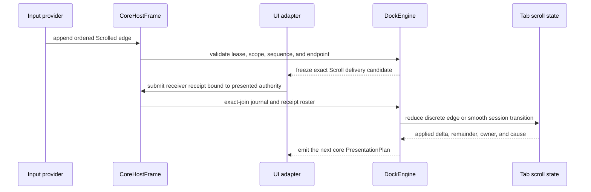
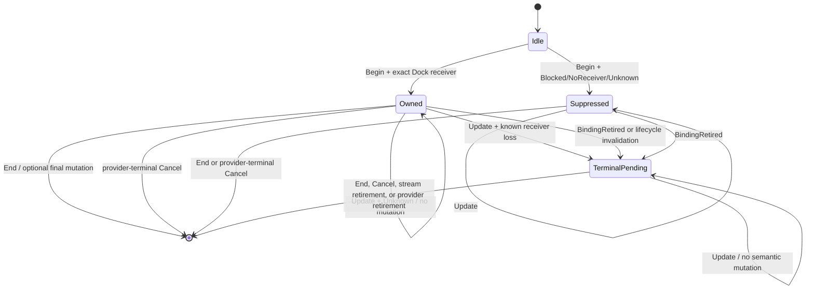

# Pointer Scroll Journal Contract

## Status

This document is the binding contract for wheel and trackpad edges in the U9
`PointerEdgeJournal` cutover. Current implementation anchors include
`dockspace::pointer_journal`, `dockspace::pointer_receiver`,
`dockspace::presentation_hit`, `dockspace::tab_strip`,
`dockspace::scene_compiler`, and `dockspace::engine`.

The existing press, move, release, capture, and cancellation contract remains
defined by [Pointer Edge Journal Contract](pointer-edge-journal-contract.md).
This document extends that contract without creating a second input channel or
an adapter-owned scroll state machine.

## Scope

This contract covers:

- lossless, ordered wheel and trackpad edges in `PointerEdgeJournal`;
- core-owned scrolling for overflowing dock tab strips;
- core-owned scrolling for the active tab-list menu;
- exact event-delivery receipts for docking scroll receivers and blockers;
- discrete wheel input and phaseful smooth-scroll sessions;
- deterministic unit conversion, axis selection, clamping, and reveal;
- popup routing, provider retirement, binding incarnation, and sequence ABA;
- the graph-agnostic egui fork seam required by native multi-viewport;
- trace, conformance, lifecycle, and structural-performance gates.

## Non-Goals

- Replacing application-owned `egui::ScrollArea` or GPUI scroll views.
- Building a general-purpose nested scrolling framework in `dockspace`.
- Sharing animation clocks, inertial sampling, overscroll decoration, repaint
  scheduling, or framework widget trees between adapters.
- Inferring a missing receiver, pointer position, phase, device, or terminal
  event from final frame state, elapsed time, callback order, or geometry.
- Making a crates.io egui callback a production native multi-viewport provider.
- Preserving the current egui tab-scroll action queue or duplicate adapter
  state as a compatibility path.
- Adding drag-edge auto-scroll to wheel semantics. That behavior requires a
  separate explicit dwell and velocity policy.

## Problem

The current egui adapter consumes `egui::Event::MouseWheel` after selecting a
tab strip from the frame's final pointer position. It converts line and page
units with adapter style values, clears global smooth-scroll input, and mutates
adapter-owned tab/menu state. The tab-list menu separately uses
`egui::ScrollArea`. These paths are visible in
`crates/egui_dockspace/src/tabs.rs`,
`crates/egui_dockspace/src/renderer.rs`, and
`crates/egui_dockspace/src/projection.rs`.

That design loses event-time receiver facts, competes with application scroll
containers, and gives egui a second semantic authority beside `dockspace`.
It also cannot represent a smooth sequence whose delivery remains captured by
one window while desktop hover moves to another window.

The base journal in `crates/dockspace/src/pointer_journal.rs` currently has no
scroll edge. The hit manifest in `crates/dockspace/src/presentation_hit.rs` has
no scroll lane, and the receiver protocol in
`crates/dockspace/src/pointer_receiver.rs` cannot prove a docking scroll
receiver. Extending only one of these layers would create another partial
protocol. They must change as one atomic authority boundary.

## Decision

Scroll is a first-class pointer-journal edge. A provider preserves raw ordered
facts, the core freezes exact receiver questions, an adapter supplies exact
delivery receipts, and the core alone mutates tab-strip or menu scroll state.



No adapter may mutate a docking scroll offset before this join succeeds. A
failed frame leaves the journal watermark, scroll session, popup routing,
workspace, and presentation state unchanged.

## Authority Invariants

1. `dockspace` is the sole semantic authority for dock tab-strip and tab-list
   menu scrolling.
2. Every scroll sample is an ordered journal edge. Aggregated frame deltas are
   diagnostics only and cannot drive docking interaction.
3. Provider facts and UX policy are separate. The provider reports observed
   unit, delta, phase, device, modifiers, endpoint, location, and momentum. The
   core chooses axis mapping, line/page extent, containment, and reveal.
4. A scroll receiver is an actual event-delivery fact, not the rectangle under
   a final pointer position. Geometry alone never upgrades a receipt to known.
5. The event-delivery endpoint is independent of desktop hover. Capture may
   continue delivery to surface A while the global pointer is over surface B.
6. `Unknown` is a first-class result. It advances an accepted provider
   watermark but cannot start, retarget, apply, or cancel a docking scroll.
7. One edge has one top delivery receiver. A rejected or saturated winner does
   not fall through to another docking receiver or an ancestor.
8. Smooth scrolling locks one semantic owner for the full provider sequence.
   It never spatially retargets from an update sample.
9. No timeout, velocity threshold, dominant-axis heuristic, callback absence,
   focus loss, `PointerGone`, or final hover may synthesize `End` or `Cancel`.
10. Scroll offset changes are presentation changes, not popup routing changes.
    Opening, closing, replacing, moving, or re-layering a popup is a routing
    change and invalidates old receiver proofs.
11. Physical-pixel conversion requires the exact binding incarnation,
    coordinate generation, and scale authority associated with the edge.
12. Provider retirement, binding retirement, surface removal, popup
    replacement, and explicit stream cancellation terminate every affected
    smooth session exactly once.
13. The adapter may decorate a core result with animation or overscroll, but
    decoration is pointer-transparent and never changes hit testing,
    accessibility, or canonical offset.
14. Multiple scroll edges may occur in one host boundary, but the host submits
    them as edgewise journal segments so each edge receives evidence against
    the state produced by its predecessor. They reduce in provider order and
    use the current canonical offset; they never reorder through a per-widget
    callback queue.

## Typed Schema

The names below are the intended internal vocabulary. They may be adjusted to
fit existing module conventions, but their information content and validation
rules are mandatory.

```rust
pub enum PointerEdgeKind {
    Moved,
    ButtonPressed { button: PointerButton },
    ButtonReleased { button: PointerButton },
    CaptureChanged { owner: Authority<PointerCaptureOwner> },
    StreamCancelled { reason: PointerStreamCancelReason },
    Scrolled(ScrollEdge),
}

pub struct ScrollEdge {
    pub device: ScrollDeviceId,
    pub sequence: Option<ScrollSequenceToken>,
    pub phase: ScrollPhase,
    pub delta: Option<ScrollDelta>,
    pub momentum: Authority<ScrollMomentum>,
    pub modifiers: Authority<ScrollModifiers>,
    pub delivery: Authority<ScrollDeliveryEndpoint>,
}

pub enum ScrollPhase {
    Discrete,
    Begin,
    Update,
    End,
    Cancel(ScrollCancelReason),
}

pub enum ScrollDelta {
    PhysicalPixels {
        delta: FiniteScrollVector,
        coordinates: Authority<PhysicalScrollCoordinates>,
    },
    LogicalPoints(FiniteScrollVector),
    Lines(FiniteScrollVector),
    Pages(FiniteScrollVector),
}

pub struct PhysicalScrollCoordinates {
    pub binding: ViewportBinding,
    pub coordinate_generation: CoordinateGeneration,
}

pub struct ScrollDeliveryEndpoint {
    pub host: PresentationHostLease,
    pub surface: SurfaceId,
    pub binding: Option<ViewportBinding>,
    pub coordinate_generation: CoordinateGeneration,
}
```

`FiniteScrollVector` has private fields and a validating constructor. NaN and
infinite components reject the complete journal transaction. Positive
components mean that content moves right or down, matching egui's documented
content-movement convention; the canonical offset therefore applies
`new = clamp(old - content_delta, 0, maximum)`.

The phase rules are structural:

| Phase | Sequence token | Delta | Meaning |
| --- | --- | --- | --- |
| `Discrete` | Forbidden | Required, including an explicit zero | One independent wheel step; it never owns a session |
| `Begin` | Required | Optional | Start one provider-defined smooth sequence |
| `Update` | Required | Required | Continue exactly that sequence |
| `End` | Required | Optional | Apply an optional final sample, then terminate |
| `Cancel` | Required | Forbidden | Terminate without applying a sample |

A platform which cannot prove a stable sequence identity and terminal phase
must emit independent `Discrete` edges. It must not construct a synthetic
smooth sequence or infer an end from inactivity.

`ScrollMomentum::{Direct, Momentum}` is metadata. Momentum does not start a
new core session and does not extend one after `End`. `Authority::Unknown`
momentum may still be reduced because it does not alter receiver ownership.
Unknown modifiers fail closed whenever the configured policy distinguishes
plain scroll from modified scroll.

`ScrollDeviceId` and `ScrollSequenceToken` are provider-owned observations.
Sequence tokens increase across every scroll device in one pointer stream, so
the retained watermark is bounded by live streams rather than historical
devices. The core additionally mints an opaque `ScrollSessionId`; provider
token reuse can therefore never resurrect a prior session.

## Delivery Candidates And Receipts

### Hit Manifest

`PresentationPointerLane` gains `Scroll`. The scene compiler publishes only
semantic docking regions:

| Region | Bounds | Scroll behavior |
| --- | --- | --- |
| `TabStripScroll(TabBarSceneId)` | Exact overflowing tab viewport | Horizontal owner using explicit strip policy |
| `TabListMenuScroll(TabListMenuSessionId)` | Exact active menu frame or viewport | Vertical menu owner, including the clamped boundary |
| `TabListMenuBackdrop` | Full surface roster while the popup plane is active | Authoritative popup blocker; never mutates an offset |

The deterministic stack is:

```text
tab-list menu scroll
    > tab-list menu backdrop
    > tab-strip scroll
    > framework or application receiver
```

Framework overlays are not synthesized as core regions. A modal, popup,
window, `Area`, pane widget, or application scroll container reports the actual
top result as `Blocked` or a future typed framework-handled disposition.

### Candidate Rules

Every `Scrolled` edge requests one `PointerReceiverProbe::Delivery` candidate
for the `Scroll` lane. Unlike point-only hover probing, a smooth continuation
may request delivery even when its desktop location is unknown because the
event has an exact delivery endpoint and a core-locked owner.

For `Discrete` and `Begin`, a known docking receipt must match the unique
frontmost scroll region at the exact event location. For `Update` and `End`, it
must corroborate the already locked semantic owner; it may not select a new
one. A surface-local provider can name only its frozen endpoint. A
desktop-global provider may preserve delivery to one binding while separately
reporting another hover route.

The core candidate carries both the locked `PresentationHitRegionId` and a
core-projected receiver-probe vector. The adapter validates a continuation
against the exact scroll-receiver roster retained by the current presented
egui pass; it does not need an event position and must not run a new spatial
winner search. Modifier interpretation and full-precision delta application
remain in core. The adapter may normalize the already-projected vector only to
prove direction admission.

### Receipt Outcomes

The existing delivery dispositions retain their fail-closed meaning:

- `Dock(region)` means that exact core region was the top receiver.
- `DockCanvas` is not a scroll owner unless a future explicit canvas scroll
  capability is added.
- `Blocked` means a known higher framework receiver accepted or blocked the
  edge.
- `NoReceiver` proves that no receiver accepted it.
- typed `Unknown` means the adapter cannot prove the receiver.

The complete receipt roster remains exact. Missing, duplicate, extra,
wrong-attempt, stale-output, wrong-binding, wrong-coordinate-generation,
point-mismatched, lane-incompatible, or contradictory receipts reject the host
frame before any offset or watermark advances.

If the current renderer omitted a core-required scroll receiver, `NoReceiver`
is an exact loss proof and terminates an existing owner; it never falls through
to another receiver. A `Dock(region)` absent from the current core manifest is
contradictory. `Blocked` is valid evidence of an external receiver. `Unknown`
consumes no docking semantics.

At a minimum or maximum offset, a valid docking owner remains the sole
receiver even when the applied delta is zero. There is no fallback to an
ancestor or lower target. Adding propagation-at-boundary later would require a
synchronous, exact receiver-chain preflight; it cannot be approximated from
the remaining delta.

## Discrete Reduction

A valid discrete edge is reduced as follows:

1. Validate the provider lease, exact journal sequence, scope, delivery
   endpoint, location lane, binding incarnation, coordinate generation, and
   finite delta.
2. Exact-join its core-minted candidate with one receipt.
3. Resolve the unique frontmost `Scroll` region against the immutable routing
   authority presented to the adapter.
4. If the receipt is `Dock(region)`, convert the raw unit through the frozen
   policy and receiver geometry.
5. Apply the resulting content delta to the current canonical offset and clamp
   once.
6. Return an outcome containing receiver identity, requested delta, applied
   delta, unapplied delta, resulting offset, and a typed reduction cause.

`Blocked`, `NoReceiver`, and `Unknown` produce no docking state change. A
discrete edge never creates residual state or a smooth session. Fractional
logical deltas remain fractional `f64` canonical offsets; no integer remainder
accumulator is required.

## Smooth Scroll FSM

Smooth sessions are independent of button drag/resize ownership. They are
stored in a dedicated `ScrollInteractionState` keyed by provider lease, pointer
stream, scroll device, sequence token, and a core-minted session generation.



The transition rules are:

- `Begin` with an exact docking owner freezes the semantic receiver, delivery
  endpoint, binding incarnation, coordinate generation, routing revision, and
  current policy revision.
- `Begin` without an exact docking owner creates a suppressed sequence record.
  A later `Update` cannot opportunistically acquire a docking owner.
- `Update` applies only when the receipt proves the same semantic receiver and
  a compatible current routing authority.
- `Update` with `Unknown` preserves an owned session without applying delta.
- A known different dock receiver, blocker, endpoint, binding incarnation, or
  routing revision terminates with `ReceiverLost` or the corresponding typed
  lifecycle reason. It never retargets.
- `End` applies its optional final delta only if the same owner remains known,
  then terminates unconditionally. An unknown receiver still terminates.
- A provider-terminal `Cancel` never applies a delta and terminates
  unconditionally.
- `Cancel(BindingRetired)` terminates the semantic owner but retains the
  sequence tombstone because retiring one viewport binding does not prove that
  the physical pointer stream or provider sequence ended. Late updates are
  inert; the exact provider `End` or terminal `Cancel` consumes the tombstone.
- A semantic termination observed before the provider's terminal edge retains a
  sequence tombstone. Later updates cannot reopen the owner, and the exact
  provider `End` or `Cancel` consumes the tombstone without emitting a second
  semantic terminal outcome.
- `Update`, `End`, or `Cancel` without an existing matching owned or suppressed
  sequence or terminal tombstone is a structural protocol error, not an
  implicit `Discrete` edge.
- A second `Begin` for an active token, token replacement without terminal
  phase, or cross-device token mutation rejects atomically.

Scroll does not occupy the existing pointer-button `GestureOwner`. A provider
may report scroll while a button gesture exists, but both still reduce in one
total journal order and popup/topology mutations may invalidate the later
edge's routing authority.

State-dependent receipt validation must therefore occur in the ordered
reducer, or in an equivalent ordered prepared-reduction plan. Validating every
receipt only against the frame-start state would incorrectly allow a later
edge to use a popup or surface invalidated by an earlier edge in the same host
boundary. Engine candidate rollback preserves atomicity if a later reduction
fails.

## Unit Conversion And UX Policy

Raw units are retained until the core knows the exact semantic receiver and
its measured viewport. Conversion is controlled by a frozen `ScrollPolicy`,
not by adapter style or delta magnitude.

The initial policy is deliberately small and deterministic:

| Receiver | Primary component | Fallback component | `Lines` extent | `Pages` extent |
| --- | --- | --- | --- | --- |
| Tab strip | X when non-zero | Y | Explicit `tab_strip_line_extent` | Exact tab viewport width |
| Tab-list menu | Y when non-zero | X | Exact row pitch or explicit menu line extent | Exact menu viewport height |

When both components are non-zero, the receiver's primary component wins. The
core does not compare magnitudes, maintain a dominant-axis average, or split
one event between receivers. Shift-axis swapping and Ctrl/Command reservation
are explicit policy choices evaluated from the event-time modifier snapshot.
Unknown required modifiers fail closed.

Physical pixels convert only through the exact current scale factor for the
edge's known `ViewportBinding` and `CoordinateGeneration`. Unknown coordinate
authority preserves the journal edge and advances its watermark, but disables
the dependent docking mutation. Logical points are applied one-to-one. Line
and page units never use `tab_min_width`, frame duration, or an adapter's
current animation sample.

For every receiver:

```text
requested_offset_delta = -converted_content_delta
new_offset = clamp(old_offset + requested_offset_delta, 0, maximum)
applied_offset_delta = new_offset - old_offset
unapplied_offset_delta = requested_offset_delta - applied_offset_delta
```

Wheel scrolling does not snap to tab boundaries. Existing overflow buttons may
continue to align the nearest partially hidden tab. Selection, focus, keyboard
navigation, and explicit activation create separate reveal obligations which
move only enough to make the exact item range visible. A manual scroll does
not repeatedly re-run an old reveal obligation.

The scene must therefore retain complete unscrolled ranges for every ordered
tab, including currently hidden members. Menu rows already have complete
ordered geometry and must use the same canonical offset.

## Popup Routing And Presentation Revisions

Popup event routing and popup visual state are different authorities. The
current `PopupPlaneRevision` behavior in `crates/dockspace/src/tab_strip.rs`
must be split before smooth scrolling is enabled.

`PopupRoutingRevision` advances when any fact that can change the top scroll
receiver changes, including:

- popup open, close, replacement, or session owner;
- owner surface, presentation endpoint, or surface roster;
- popup receiver bounds, layer, occlusion, or policy admission;
- binding incarnation or coordinate authority;
- tab-strip/menu receiver identity or membership.

A transient presentation or scroll-state revision advances for:

- strip or menu scroll offset;
- focused menu row;
- selection/focus reveal state;
- paint-only hover, highlight, or decoration.

Offset changes must not advance `PopupRoutingRevision`; otherwise every smooth
update would invalidate its own owner. They still produce a new presentation
plan and visual geometry. A smooth owner may rebind to a newer concrete
presented output only when its stable receiver identity, routing revision,
endpoint, binding incarnation, coordinate generation, and policy revision are
unchanged.

Multiple scroll edges in one frozen journal interval are submitted as
successive edgewise core segments and accumulate against the current canonical
offset and the frozen receiver viewport. If an earlier edge opens, closes,
moves, or replaces the popup, a later receipt bound to the old routing revision
is stale and applies nothing. The inverse order remains legal: a valid scroll
may reduce before a later popup mutation.

## Lifecycle And ABA Safety

Scroll authority binds all of the following identities:

```text
PointerInputLease
PointerStreamId
ScrollDeviceId
ScrollSequenceToken
ScrollSessionId
PresentationHostLease
SurfaceId
ViewportBinding + binding incarnation
CoordinateGeneration
semantic scroll receiver + routing revision
```

An external device or sequence number is never sufficient by itself. The core
mints `ScrollSessionId` for each admitted `Begin`, so delayed updates from an
old provider or binding cannot authorize a new session with reused numbers.

The exact affected sessions terminate once on:

- pointer-provider retirement or reset;
- an ordinary pointer edge marked as ending its exact stream;
- `PointerEdgeKind::StreamCancelled` for their pointer stream;
- exact viewport-binding retirement or replacement;
- presentation-host retirement;
- logical surface removal or receiver removal;
- popup close/replacement or routing-revision invalidation;
- policy change which no longer admits the receiver;
- explicit platform scroll cancellation.

Retirement tombstones must reject delayed `Update`, `End`, and `Cancel` edges
without cancelling a successor incarnation. Host-frame rollback restores both
the scroll FSM and provider watermark. No failed attempt, stale receipt, or
late terminal edge may partially advance one of them.

## egui Fork Boundary

Upstream `egui::Event::MouseWheel`, in
`repo-ref/egui-release/crates/egui/src/data/input/event.rs`, preserves unit, delta,
touch phase, and modifiers, but not event-time position, device identity,
delivery endpoint, binding incarnation, or actual receiver. The current
`repo-ref/egui-release/crates/egui-winit/src/lib.rs` converts physical pixel deltas to
logical points before enqueueing and discards device identity. egui later
aggregates and smooths wheel input, and an `egui::ScrollArea` may clear the
aggregate.

The production fork seam must remain graph-agnostic and expose a typed,
per-edge snapshot before aggregation or widget consumption:

- raw platform sequence and provider/device identity;
- raw pixel/line/page delta with direction convention and source provenance;
- native phase, momentum, and event-time modifiers;
- exact delivery window token, binding incarnation, and coordinate generation;
- exact event-time physical/local position, or typed `Unknown` when the backend
  cannot prove it;
- stable derivative correlation preserved through `RawInput::take` and append;
- a per-edge top receiver or blocker result bound to the immutable presented
  hit graph, pass, viewport, widget `Id`, `LayerId`, enabled/sense state, and
  interaction rectangle;
- structured handled/default-prevented acknowledgement so one edge enters only
  one semantic scroll path.

The fork does not receive dock graph IDs, topology, OS handles owned by the
runtime, or `DockEngine`. `egui_dockspace` maps stable egui response identities
to core `PresentationHitRegionId` values.

`EventEnvelope` correlation is not a raw-input journal or an authority token.
The eframe coordinator records global pointer edges before egui-winit performs
surface-local conversion, because `CursorLeft` may erase the local position and
prevent egui from emitting a later release derivative. A `Known` derivative is
usable only when the native runtime also proves its private provider lease and
exact viewport incarnation. Input hooks may retain correlation only by stable
the longest unchanged prefix of the original envelope sequence. Inserting,
deleting, duplicating, mutating, or reordering an envelope invalidates every
later `Known` derivative.

If winit or a platform backend does not expose an exact event-time position,
the provider reports `Unknown`; the last cursor move is not relabelled as the
wheel event's position. A crates.io egui callback consequently cannot claim
strict docking wheel authority merely because the final pointer lies over a
tab strip. It remains paint-only for this capability unless the application
supplies an independently conforming authoritative provider.

For the current winit 0.30 fork, AppKit can bind a callback to its current
`NSEvent` and extract that event's position. Win32 `GetCursorPos` and X11
`XQueryPointer` expose callback-time current state rather than the coordinates
of the translated wheel message; Wayland exposes neither global fact. Those
backends therefore publish `Unknown` for wheel event-time hit authority until a
raw backend event envelope carries the original coordinates through winit.

Every native scroll record also carries a producer-minted derivative
disposition: either `RequiredDerivative` or `ExplicitNoDerivative(reason)`.
The host never infers absence by scanning a possibly rewritten `RawInput`.
Required derivatives must correlate exactly once; explicit absence is affine
and fails if a matching derivative exists.

After an edge is claimed by the journal provider, egui's aggregate
`WheelState`, `smooth_scroll_delta`, and docking `ScrollArea` must not consume
it again. Conversely, an edge whose actual top receiver is an application
scroll container is `Blocked` for docking and remains available to that
framework receiver.

## Behavioral Test Contract

Focused core and public-host tests must preserve every scroll fact required to
expose a provider or reducer defect. Tests use typed Rust fixtures directly,
without a serialized protocol schema or caller-supplied core tickets:

- provider lease/incarnation, journal sequence, pointer stream, and device;
- the algebraic pointer edge kind, including `ContactEnded` for a normal
  touch/pen release terminal, `StreamEnded` for a buttonless normal terminal,
  and `StreamCancelled` for an abnormal terminal;
- scroll sequence token and phase;
- exact unit, both delta components, momentum, and modifiers;
- event location, delivery endpoint, binding incarnation, and coordinate
  generation;
- explicit expected receipt disposition and semantic receiver symbol;
- expected owner/session transition, requested/applied/unapplied delta, offset,
  and `ReductionCause::PointerEdge`;
- expected terminal or suppression reason.

Core-local fixtures must not choose the frontmost receiver from the same
manifest under test and then present that choice as adapter evidence. Core tests
prove transport, validation, causality, and rollback; independent host and UI
tests supply receiver evidence and are required for conformance.

## Test Matrix

| Area | Required cases | Pass condition |
| --- | --- | --- |
| Typed facts | Finite and non-finite vectors; every unit; valid and invalid phase/token/delta combinations | Invalid journals reject atomically; valid facts retain their exact values without aggregation |
| Discrete conversion | Point, physical pixel, line, page, both signs, fractional values, simultaneous axes, modifiers | Exact policy conversion and deterministic primary-axis result |
| Clamp and containment | Minimum, maximum, partial application, zero delta | Exact applied/remainder values; no lower or ancestor fallthrough |
| Receiver proof | Menu over backdrop; backdrop over strip; external modal; application scroll area; no receiver; unknown | Only the exact top receiver mutates docking state |
| Smooth FSM | Begin/update/end; optional begin/end delta; cancel; momentum; unknown update; known receiver loss | One stable owner, no retarget, no timeout, exactly one terminal outcome |
| Suppressed sequence | Unknown, blocked, or no-receiver begin followed by known updates | The sequence never acquires a docking owner mid-stream |
| Same-segment causality | move/scroll/button ordering; scroll then popup open; popup open/close then stale scroll | Provider order is preserved and old routing receipts fail closed |
| Cross-surface | Discrete A then B; smooth owner A while hover is B; update delivered by B; outside/foreign/unknown route | Discrete edges may select per event; smooth ownership never retargets across bindings |
| Lifecycle and ABA | Provider reset; stream cancel; surface removal; binding recreation; token reuse; delayed end | Old events cannot mutate or cancel successor state |
| Tab strip | Hidden members; manual fractional scroll; selected/focused reveal; buttons; resize clamp | Full ranges remain exact and reveal is a separate obligation |
| Tab-list menu | Popup open/close; backdrop; focus; row removal; scroll then selection | Routing and presentation revisions change independently and deterministically |
| Rollback | Late invalid receipt after earlier valid scroll edges | Offset, session, popup state, tick, and watermark all roll back |
| Adapter parity | In-memory, fork-backed egui, and Open GPUI runners execute the same named scenarios | Canonical outcomes and causes match without shared hit-resolution code |
| Scale | 16, 128, and 1024 tabs across representative surfaces | No workspace clone or fingerprint build per scroll edge; hit lookup is bounded by the hit index and offset mutation is constant-time |

Property tests must cover journal segmentation, sequence ABA, phase-state
transitions, arbitrary finite deltas, clamp monotonicity, host-frame rollback,
popup routing invalidation, and provider lifecycle sequences.

## Success Criteria

This contract is satisfied only when all of the following are measurable:

| Criterion | Target | Evidence |
| --- | --- | --- |
| Lossless input | Every admitted sample retains sequence, unit, delta, phase, device, endpoint, and receipt correlation | Protocol round-trip and mutation tests |
| Single authority | Zero adapter mutations of docking tab/menu offsets and zero docking uses of aggregated wheel state | Source audit plus adapter integration tests |
| Deterministic FSM | All smooth sequences have one owner or one suppressed record and exactly one terminal outcome | State-machine and property tests |
| Fail-closed routing | Unknown or stale receiver facts produce zero semantic mutation | Receipt, popup, binding, and lifecycle tests |
| No heuristic terminality | Zero timeout, frame-count, focus-loss, pointer-gone, or callback-absence session transitions | Source audit and negative tests |
| Cross-adapter parity | In-memory, egui provider, and Open GPUI runner produce identical canonical outcomes for the shared matrix | Independent conformance suite |
| Structural cost | One scroll edge performs zero workspace clones and zero root fingerprint builds | 16/128/1024 structural counters |
| No dual wheel path | Docking code no longer owns `tab_scroll_owner`, clears `smooth_scroll_delta`, or uses `egui::ScrollArea` for the tab-list menu | Post-cutover source audit |

The adapter-owned wheel state is deleted only after the core/provider path
passes the P0 migration matrix against the same behavior. Once deleted, no
compatibility reducer or mirrored offset store remains.

## Alternatives Considered

### Keep egui-Owned Wheel State

**Advantages:** Small local change and immediate access to `ScrollArea` and
egui smoothing.

**Disadvantages:** Loses event-time receiver and cross-window facts, duplicates
canonical offsets, competes with ancestor scrolling, and cannot provide adapter
parity.

**Decision:** Rejected. It violates the single-authority objective.

### Add Scroll To PointerEdgeJournal

**Advantages:** Preserves total input order, reuses exact provider and receipt
authority, supports native delivery/capture, and gives every adapter the same
FSM and canonical offsets.

**Disadvantages:** Requires coordinated core, scene, adapter, fork, trace, and
lifecycle changes.

**Decision:** Selected. The additional work is the required authority boundary,
not optional abstraction.

### Build A General Nested Scroll Propagation Engine

**Advantages:** Could model arbitrary application containers and propagate
remaining delta across a receiver chain.

**Disadvantages:** Pulls framework layout and widget ownership into
`dockspace`, requires synchronous preflight for every receiver, and greatly
expands the stable API.

**Decision:** Rejected for this crate. `dockspace` owns only its tab-strip and
tab-list-menu receivers; application scrolling remains framework-owned.

## Reference Semantics

### Open GPUI

Adopt from `repo-ref/open-gpui/crates/gpui/src/interactive.rs`,
`repo-ref/open-gpui/crates/gpui/src/window.rs`, and the div scroll dispatch
implementation:

- per-event position, delta unit, modifiers, and touch phase;
- a scroll-specific receiver capability distinct from click hover;
- typed handled/default and propagation outcomes;
- nested receiver and blocker behavior tests.

Reject:

- GPUI `Entity`, `View`, `Window`, element-tree, or scheduler ownership;
- lossy event coalescing, especially across direction changes;
- copying GPUI docking runtime state into the headless core.

The current Open GPUI docking tab renderer is not the source of tab-overflow
semantics; its framework input dispatch is the useful reference.

### Dear ImGui

Adopt from `repo-ref/imgui/imgui.cpp` and
`repo-ref/imgui/imgui_widgets.cpp`:

- locking one semantic scrolling owner during a phaseful sequence;
- deterministic containment at a saturated scrolling boundary;
- exact clamp, tab target, and selected-tab reveal semantics;
- separation between semantic destination and visual animation.

Reject:

- timer and frame-liveness ownership;
- mouse-distance thresholds, exponential moving averages, dominant-axis
  magnitude selection, or unavailable-hover fallbacks;
- copying ImGui's animation progress or binary docking-tree writeback.

## Risks And Mitigations

| Risk | Severity | Mitigation |
| --- | --- | --- |
| Scroll and button reducers diverge in ordering | High | Use one journal sequence and the existing core-minted host causal lane; add mixed-edge traces |
| Popup offset invalidates every smooth update | High | Split routing revision from transient presentation revision before enabling sessions |
| egui double-consumes a claimed edge | High | Add structured per-edge acknowledgement and suppress only the correlated aggregate input |
| Unknown platform position makes crates.io behavior less capable | Medium | Fail closed and keep the capability claim honest; require the fork-backed or external provider |
| Smooth sequence never receives a terminal edge | High | Require explicit provider phase; non-conforming providers emit `Discrete` only and expose provider-unhealthy obligations |
| Old token or window observation authorizes a successor | High | Bind lease, stream incarnation, core session generation, viewport incarnation, and coordinate generation |
| Boundary containment surprises nested-scroll users | Medium | Document deterministic ownership; revisit only with an exact synchronous receiver-chain design |
| Per-edge validation harms pointer latency | Medium | Reuse the presentation hit index, mutate offsets in O(1), and gate structural counters at 16/128/1024 tabs |

## Implementation Phases

### P0: Core Contract And Executable Vertical Slice

- Add the typed scroll edge and structural validation to
  `crates/dockspace/src/pointer_journal.rs`.
- Add scroll candidate/receipt support to
  `crates/dockspace/src/pointer_receiver.rs`.
- Add the Scroll lane and strip/menu/backdrop records to
  `crates/dockspace/src/presentation_hit.rs`, `crates/dockspace/src/scene.rs`,
  and `crates/dockspace/src/scene_compiler.rs`.
- Split popup routing and transient presentation revisions in
  `crates/dockspace/src/tab_strip.rs`.
- Add the discrete reducer, smooth FSM, lifecycle cancellation, and atomic
  outcomes to `crates/dockspace/src/engine.rs` or a focused internal
  `scroll_interaction` module.
- Break the protocol trace schema in place and land the core test matrix.
- Keep the existing adapter behavior only as a temporary differential oracle;
  do not add a compatibility path to the core.

P0 completes when the core/provider path passes the migration behavior matrix.
Adapter-owned wheel state must not be deleted earlier because doing so would
remove the only runnable behavior before its replacement is proven.

### P1: egui Provider Cutover And Legacy Deletion

- Add the graph-agnostic per-edge snapshot and receiver acknowledgement to the
  egui/egui-winit fork and native host boundary.
- Route the crates.io single-surface path only through a conforming
  `SurfaceLocal` provider; report unavailable facts as `Unknown`.
- Run old and new behavior differentially without allowing both paths to
  mutate one production engine.
- Switch tab strip and tab-list menu painting to canonical core offsets and
  records.
- Delete adapter `tab_scroll_owner`, wheel event aggregation, direct
  `smooth_scroll_delta` clearing, docking-menu `ScrollArea`, mirrored
  `TabStripStateMap`, and the corresponding action queue in one breaking cut.
- Prove pane/application scroll containers still receive events when they are
  the exact top receiver.

### P2: Native And Cross-Adapter Release Gates

- Connect the fork-backed `DesktopGlobal` provider with exact window binding,
  mixed-DPI coordinates, receiver observations, and lifecycle termination.
- Run the same traces through an independently implemented Open GPUI adapter
  runner.
- Add the 16/128/1024 structural counters and property-state sequences.
- Complete real two-window tab-strip/menu scroll, cross-window drag, popup,
  close, focus, binding-recreation, and mixed-DPI tests.
- Narrow the public API only after scroll journal/provider types have stable
  facade ownership; keep reducer and receipt construction internal.
