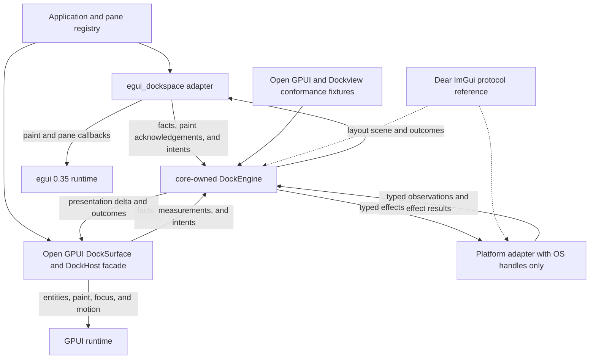
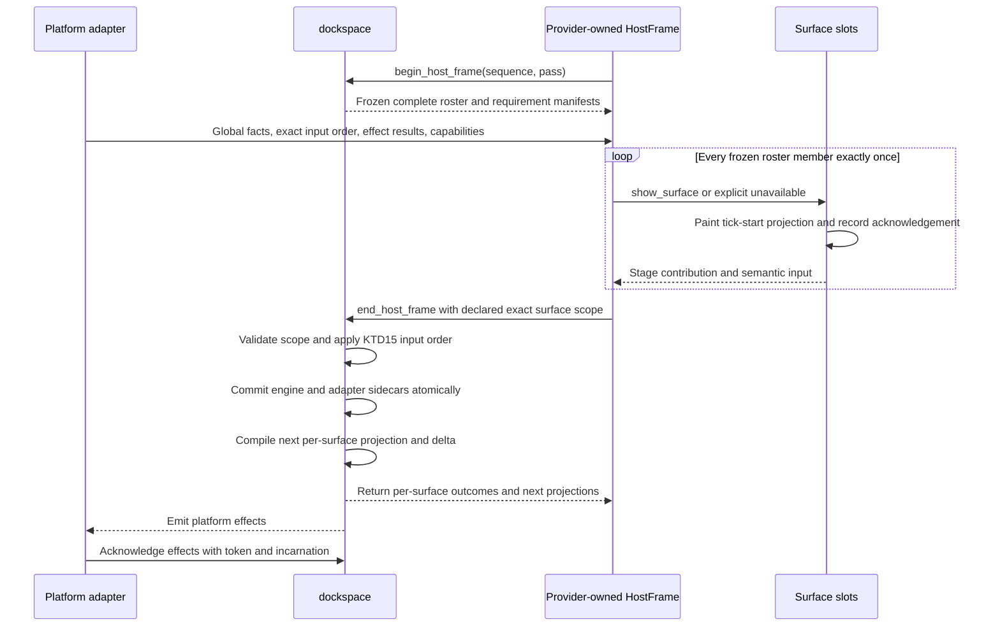
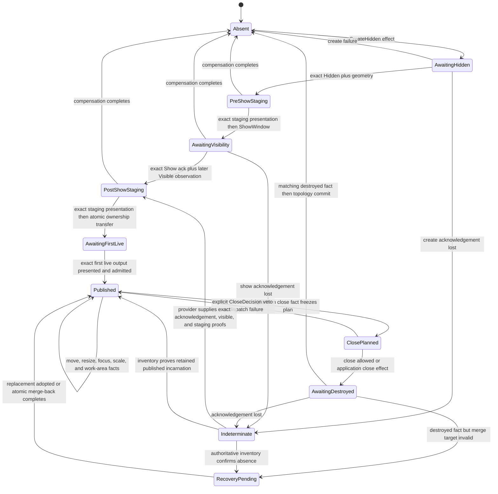
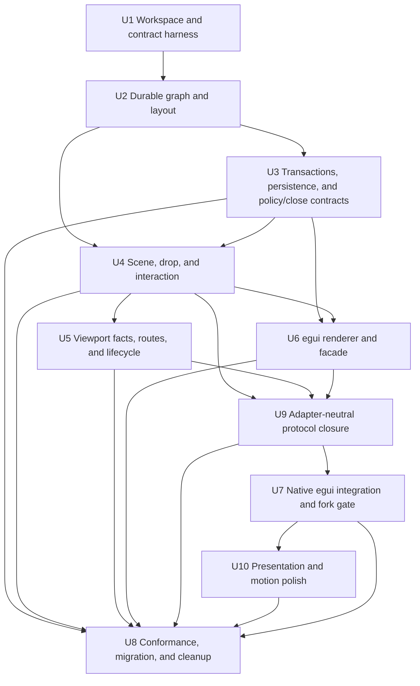

# Headless Dockspace and egui_dockspace Fearless Refactor - Plan

## Goal Capsule

| Field | Contract |
| --- | --- |
| Objective | Replace the current `egui_tiles` bridge with `dockspace` as the sole semantic authority, an official-egui `egui_dockspace` product adapter for single-surface and contained-floating workflows, and an unpublished fork-backed `egui_dockspace_native` runtime for native multi-viewport. Add renderer-neutral motion only after the interaction and native lifecycle gates pass. |
| Authority | User requirements and session-settled decisions override this plan. This plan overrides prior architecture documentation. Open GPUI is the primary semantic source, Dear ImGui is the platform/docking protocol reference, Dockview is a regression corpus, and the current implementation is characterization evidence only. |
| Execution profile | Breaking refactor on a feature branch. Delete obsolete code and APIs. Land reviewable Conventional Commits as dependency-complete units pass their gates. |
| Stop conditions | Stop rather than guess if a change requires publishing, pushing, or another irreversible remote mutation that has not been authorized; if a platform cannot provide an authoritative fact, report the capability as unavailable and take the specified deterministic fallback. |
| Tail ownership | The top-level `ce-work` goal owns implementation, local verification, simplification, code review, commits, and final cleanup. Upstream PR submission and remote publication are separate external actions. |

---

## Current Execution State - 2026-08-01

This section supersedes every earlier execution-order statement in this plan.
The implementation is now a runnable native trial, not merely a headless
protocol prototype, but it is still not a production-ready egui docking or
native multi-viewport crate. Keep the durable workspace graph, checked
transactions, policy, persistence, scene compiler, close plans, validated
interaction invariants, ordered backend ingress, and three-phase native host
cycle. Continue to replace the broad public API boundary and oversized error
and reducer modules without restoring compatibility layers.

Verified checkpoint on 2026-08-01:

- The root all-feature/all-target nextest matrix passes 1448 tests with one
  fixture writer intentionally skipped. The registry-egui downstream harness
  passes 39/39; the fork seam passes 8/8; the native runtime passes 27/27.
- A self-driving real-OS-window E2E now performs dynamic outside-all tear-off,
  waits for first-live child interaction authority, redocks across windows,
  retires the vacant child surface, and preserves the exact item multiset in 23
  committed native cycles. This is partial OGC-05/06/07 evidence, not mixed-DPI,
  hardware-input, close/focus-failure, or multi-item ordering proof.
- Scroll is carried losslessly through core trace, official egui, the fork, and
  native ingress. Ordinary pointer-stream retirement terminates phaseful scroll
  sessions, and runtime retention accounting now includes semantic source
  watermarks plus scroll sessions and per-stream sequence guards.
- Presentation-host retirement terminally fails pending release authority;
  joined backend replacement remains retryable after validation failure; exact
  close resolution reaches the public headless facade; same-batch clicks and
  CoreBackend AccessKit actions follow the ordered input journal.
- Fork viewport retirement clears only state owned by the retired binding;
  focus requests have correlated acknowledgement through native ingress;
  outer-rect resizing remeasures decoration at the destination DPI; failed or
  unsupported restored-child creation is viewport-local rather than app-fatal.
- The core protocol suite passes 40/40 with one fixture writer intentionally
  skipped. Exact replay now compares interaction events, every platform-effect
  variant, focus deltas, and surface-scene deltas; independent negative tests
  prove that forged values in each domain are rejected. `ShowWindow` records
  the exact pre-show presentation stream and emission, and the core lifecycle
  test rejects an older output for a reissued staging basis. A protocol trace
  which drives a complete native-create saga and forges that exact reference is
  still missing; do not describe the platform-effect oracle as complete until
  that black-box trace exists.
- Strict rustdoc, formatting, and diff hygiene pass. Strict Clippy still reports
  802 diagnostics in `dockspace`; the dominant structural issue is one oversized
  error family expanding `Result` and transition variants across deep call
  paths. Correctness and suspicious lint classes are treated as immediate gates;
  performance and pedantic debt must be removed through module and error-boundary
  redesign rather than blanket allows.
- The release remains blocked on a pushed immutable egui fork revision, the
  complete native platform/failure matrix, public API sealing, full retention
  and long-session soak evidence, performance gates, CI, and final module
  deepening.

The remaining active gates are ordered as follows:

1. Make the fork reproducible. Split the dirty `repo-ref/egui-release` delta
   into independently compiling commits rooted at the pinned `0.35.0` release,
   publish one immutable revision, and make the native runtime and fork harness
   consume that revision. Keep the registry-egui harness as a clean-checkout
   gate; no root path patch or ignored sibling checkout may be required.
2. Complete native product evidence. Extend the real-window executor from the
   current deterministic tear-off/redock path to exact focus, close
   veto/accept, destroy/recovery, decorated outer-rect acknowledgement, and
   mixed-DPI placement. Keep platform-specific physical-input acceptance
   separate from typed event-loop injection; neither test lane may fabricate a
   `Known` platform fact.
3. Close the remaining black-box protocol gaps without growing a second engine
   inside the harness. Add a native-create trace which reaches pre-show
   presentation and rejects wrong-but-valid `ShowWindow.after_pre_show`
   stream/emission references. Extend the independent host conformance facade
   only with opaque presentation settlement, pointer enrollment, and receiver
   receipts required by OGC-03; do not expose raw `DockEngine` identities.
   Eliminate official-egui semantic event-shape correlation by upstreaming or
   consuming a typed event envelope. Until then, duplicate-shape frames must
   remain explicitly unavailable rather than being guessed or advertised as
   full keyboard/scroll causality.
4. Establish bounded-resource and performance gates before optimizing. Measure
   16/128/1024-pane pointer motion and host-frame commit, candidate clone volume,
   authority-map rebuilds, effect/close retirement, presentation sidecars, and
   fork/native tombstones. Add a 10k-cycle soak and compact only after the core
   publishes an exact retention watermark.
5. Seal and deepen the public modules. Make `DockspaceSession` plus an explicit
   backend SPI the supported core boundary, remove the egui crate's broad core
   re-exports and raw engine access, and keep moving owned state/invariants out
   of the remaining 5.7k-line engine orchestrator and 3.8k-line frame
   coordinator. Do not create forwarding-only files or line-count scripts.
6. Finish strict Clippy, CI, public documentation, accessibility/platform
   matrices, persistence distribution checks, and only then motion/polish.
   Motion remains pointer-transparent and never grants semantic authority.

The following numbered gate definitions are retained only as historical design
detail. Their execution order is superseded by the active list above.

1. Restore a reproducible green workspace while completing the core-minted
   `PlatformObservationLease` cutover. Exactly one platform provider is active
   per engine authority domain. Replacement is a typed two-phase handoff. A
   cutover fence first stops new A1 ingress, ends A1-owned gestures, and either
   drains its already-issued causal property lanes or preserves their semantic
   obligations as indeterminate. Begin then revokes A1 and its capability,
   inventory, coordinate, work-area, route, focus, capture, presentation, and
   effect-result authority; the runtime stops and joins A1's dispatch worker;
   finish mints A2. An independent unemitted request may first emit to A2, but
   an A1-lane queued successor is invalidated and later recreated as an A2
   reconciliation request from fresh exact facts. Emitted unresolved A1 effects
   cannot be reported, acknowledged, chained, or blindly redispatched by A2.
   Recovery anchors, terminal destruction facts, and unresolved close,
   cleanup, and pass-through obligations survive. Late inputs return typed
   `Superseded` or `Retired` outcomes and cannot poison a successor provider.
   This gate is not complete until the local egui fork delta is split into
   independently compiling commits on the exact `0.35.0` tag, referenced by
   one immutable resolvable revision, and an excluded clean harness proves the
   base crates resolve official registry egui without inheriting the workspace
   path patch.
2. Finish canonical journal parity without deleting the egui test bridge yet.
   **2A:** make receiver-candidate planning depend on the reducer's frozen
   interaction state: idle edges request no semantic receiver, active drag
   requests hover, and captured resize/contained-transform edges request no
   fresh receiver. Captured sessions use event-time position plus frozen source
   coordinates rather than an overlay-sensitive hover result. **2B:** derive
   persistent tri-state button/capture authority from the ordered journal for
   native focus and route consumers. A new provider starts `Unknown`; an
   optional complete checkpoint at the provider enrollment watermark is the
   only way to prove `KnownAllReleased`; the checkpoint lane closes permanently
   after the first accepted edge, and every accepted edge carries its own post-edge authority
   so later edges cannot leak backward within a batch. Only an explicit
   `CaptureChanged` edge can terminate for capture loss. Provider replacement
   retires desktop-global and native-bound surface-local providers, and no
   final snapshot may infer a release. Ordinary focus restore proceeds only on
   `KnownAllReleased`; `KnownDown` and `Unknown` both fail closed. **2C:** add an
   edge-bound native placement receipt carrying exact work-area authority. Keep
   its exact-set candidate/receipt roster parallel to, and type-distinct from,
   the UI receiver roster: both bind the same journal edge, but work-area
   selection is a platform-provider fact and must never be smuggled through a
   widget hit-test receipt. Core
   freezes stream-owned route/pass-through state, native surface/root/recovery
   identities, source size, minimum size, grab offset, and pointer anchor, then
   reuses the existing visible-before-transfer saga. A
   `DesktopGlobal::NoWindow` fact with unknown position or work area fails
   closed and never selects a monitor heuristically. **2D:** replace the coupled
   focus transient fields with one typed `FocusLane`: one semantic winner,
   zero or more already-emitted superseded effect hazards, one current
   platform-driving attempt, and a separate pane-command lane. Journal tab
   activation and drop commit mint their own caused viewport/pane focus claims
   with a three-way `Preserve | Set(ItemId) | Clear` disposition rather than
   collapsing no-history into explicit none. Closing or minimized targets
   cannot accept new activation, and ordinary platform/close recovery never
   reveals a hidden pane or guesses tree order. Effect delivery and exact
   provider/incarnation validation happen in `EffectLedger` before a focus
   envelope can reduce the lane; a raw acknowledgement never mutates focus
   state. `Unknown` is a same-provider focus tombstone and preserves winner,
   attempts, hazards, and pane obligation. Provider or workspace replacement
   clears the active winner namespace while retaining only documented history
   and the monotonic identity frontier. External (`Foreign | None`) winners,
   native reservations, and Dock winners are distinct typed states: an emitted
   old request remains a hazard, a Dock winner receives an ordered reassertion,
   and an external winner cannot be forged into a Dock focus effect. Native
   reservations carry an owner so cancellation removes only that claim and a
   temporarily missing baseline/control capability can replay the original
   release-time pane disposition.
   Migrate core traces and tests to journal receipts, including
   exact candidate rosters for every gesture phase, and add direct coverage for
   three/four-arm junctions, contained-title commit, Escape, capture loss,
   provider replacement, and outside-all native release.
   A superseded native create may still commit topology, but it must establish
   an exact winner-focus barrier after its visible proof. The stale binding is
   isolated only while that exact focus effect remains unsettled; no future
   `Focused(binding)` observation may be guessed to be an automatic-focus edge.
   Success closes the barrier, terminal failure performs one authoritative
   reconciliation even if the focused binding did not change, and provider
   replacement atomically retires both the old effect and its quarantine.
3. Introduce a narrow, explicitly unstable `DockspaceSession` application
   facade and intentional `dockspace::backend` SPI before writing another
   adapter. Migrate internal consumers through that boundary, then hide
   `DockEngine`, raw `EngineInput`, graph node identities, fingerprints, proof
   constructors, and internal FSM modules. Do not claim the facade is stable
   until the official-egui and independent conformance gates prove it.
   Document restore must accept the active
   `ExternalItemKeyMap` and return one indivisible reconciled publication;
   callers cannot extract an unreconciled historical map through a public
   `into_parts` escape hatch. `egui_dockspace` must not glob re-export the core.
4. Deliver a real official-egui single-surface and contained-floating product
   path through the clean harness established in Gate 1. Production and tests
   use one long-lived
   `SurfaceLocal` pointer provider, presentation host, ordered journal, receiver
   receipts, and terminal-output handoff. Establish this non-`cfg(test)` authority before
   migrating the existing egui behavior suite. Pointer-originated actions come
   only from journal reduction; keyboard, accessibility, focus, scroll, and
   paint acknowledgement use separately named narrow semantic inputs. Replace
   `semantic_split_before` with one raw-event-ordinal causal plan that can
   interleave any number of journal segments and semantic inputs. First replace
   adapter geometry ownership with an exact-set paint-resource index keyed by
   core scene IDs; rectangles, ordering, hit regions, and accessibility remain
   exclusively core-owned. After the same black-box tests pass through the
   production path, delete
   `RenderAction`, pointer-owned `RendererIntent`, `GestureOwner::Legacy`,
   snapshot release inference, adapter target/offer reconstruction, the
   duplicate `SurfacePlan`, and their legacy tests in one irreversible cut. A
   callback-only convenience function may remain paint-only, but it is not the
   product completion path.
5. Prove the public boundary through a non-published independent conformance
   crate after the official-egui clean harness is green. Run 16/128/1024-pane
   structural gates before native work.
6. Implement the full native staging barrier, the unpublished
   `egui_dockspace_native` runtime, and one two-real-window vertical slice for
   tear-off, four-edge/center redock, close veto/accept, focus, recovery,
   incarnation ABA, and mixed DPI. A minimized or hidden window is never a
   focus, route, placement, or recovery host. Viewport placement persistence
   must join document restore as an executable, generation-checked protocol;
   an independent placement sidecar is not completion evidence.
7. Finish viewport restoration, public-item inventory, motion, accessibility,
   polish, strict Clippy, documentation, and distribution checks. Motion never
   gates the first native vertical slice.

Verified implementation checkpoint on 2026-07-27:

- The core portion of gate 1 is complete. Provider replacement is a
  core-minted two-phase cutover, effect delivery and acknowledgement are bound
  to the exact provider, and capability, inventory, work-area, route, focus,
  pointer, registry, and presentation authority are revoked at the cutover
  boundary. Replacement regression tests cover late A1 input, foreign and
  duplicate tickets, A2 generation restart, gesture cancellation, and the rule
  that an A1 effect cannot be acknowledged by A2. Runtime worker shutdown
  remains owned by the later native runtime gate.
- The public dependency baseline is pinned to the official `egui`/`eframe`
  `=0.35.0` release, and `repo-ref/egui-release` still points at that exact tag.
  The root workspace has no local `[patch]`; the excluded official-egui harness
  therefore reproduces the registry dependency independently. The excluded
  `repo-ref/egui-release` worktree carries the 40-path typed-provider prototype
  above the exact tag, while `repo-ref/egui` carries a separate unconsumed
  13-path delta above commit `e6eb00a31c7089d4458c55fcbe5f1253311a7176`.
  Together they prove only partial event provenance, viewport-local receiver
  journaling, and terminal renderer
  results. It does not yet provide a global raw pointer journal, an immutable
  successfully-presented hit graph, exact binding/geometry/work-area/capture
  facts, effect acknowledgements, or a complete-roster hosted cycle. The fork
  half of Gate 1 is therefore not reproducible or sufficient: split it into
  independently compiling event-provenance, receiver-journal,
  presentation-result, and provider-facts/hosted-cycle commits; pass the
  fork-backed harness; then consume one immutable revision before native
  runtime work. `InitialWindowVisibility` is not part of this seam: automatic
  show-after-render would replace the runtime effect ledger's acknowledgement
  with a renderer heuristic. Remove it from the minimal patch, together with
  unproduced paint-failure variants and unrelated inspection-only wasm hunks.
  Do not update the fork to upstream `main` as part of this cutover.
- A causally valid unknown focus tombstone revokes focused-window authority but
  does not erase an exact focus-effect acknowledgement carried by the same
  envelope. The effect may settle while pane focus remains blocked until a
  later authoritative target observation. Unknown focus without that exact
  evidence cannot mint a focus request or pane intent.
- Gate 2D-a is complete, but Gate 2D-b remains active. Journal tab and drop activation use
  core-minted causal stamps and `Preserve | Set | Clear`; closing bindings may
  report existing focus but cannot accept activation. A first provider focus
  baseline establishes a causal floor only when no prior release reservation
  exists. A newer claim immediately retires an older unacknowledged pane intent;
  provider replacement preserves pane history but never resurrects that intent.
  Superseded tear-off completion now emits a post-visible winner-focus barrier
  instead of classifying a later focus observation heuristically. Ordinary
  emitted focus supersession is also retained as an exact hazard; a late
  predecessor can settle only its own effect and cannot install pane intent or
  replace the winner. `Unknown` no longer impersonates provider replacement,
  and raw ACKs are screened against exact ledger delivery before focus
  reduction. Remaining 2D-b work is the structural `FocusLane` cutover:
  external winners, owner-bound native reservation replay, ledger-admitted
  proof vectors, full terminal hazard retention, and a narrow `FocusDelta`.
  Focus is not a completed gate until those states replace the compatibility
  fields.
- `WorkspaceIndex` now derives root fingerprints once per workspace revision,
  and document/key-map reconciliation preserves the process-local `ItemId`
  allocation frontier. The audit findings about per-leaf fingerprint rebuilds
  and old-document allocator rollback are closed on the standard restore path,
  not future work. The public `RestoredDockspaceDocument::into_parts` escape
  hatch remains a Gate 3 API defect because it can bypass reconciliation with
  the active key map. Rebuilding an index once for repeated requirements at an
  unchanged revision is a later O(N) optimization, not the closed O(N^2)
  correctness blocker.
- The 2026-07-28 current-worktree baseline supersedes every earlier test count
  in this section. `cargo check --workspace --all-features --all-targets`,
  `cargo fmt --all --check`, and `git diff --check` pass. The complete local
  matrix, `cargo nextest run --workspace --all-features --all-targets
  --no-fail-fast`, runs 1416 tests with 1416 passing and one explicitly skipped.
  The core protocol crate contributes 25 passing tests and one skipped test.
  The two previously reported focus failures pass and remain regression
  coverage. This is a green correctness baseline, not evidence of a shipped
  product: the official-egui harness now passes 37 public, non-`cfg(test)`
  product-behavior tests through the explicit outer-host path and exact terminal
  presentation settlement. The crates.io `show_single_surface` convenience path
  remains deliberately paint-only, and neither a bundled event-loop host nor a
  native runtime exists. Strict Clippy remains tracked quality debt rather than
  a compiler or test gate: the same current worktree reports 619 `dockspace` lib
  errors and 718 lib-test errors under `-D warnings`, then stops before checking
  later crates.
- Gate 2A and the core portion of Gate 2B are complete. Candidate planning is
  derived from the frozen reducer phase; resize and contained transforms use
  event-time positions plus frozen coordinates and request no fresh hover.
  Provider replacement retires desktop-global and native-local ingress while
  preserving independent logical-local providers, and provider creation
  rejects an active legacy gesture instead of freezing it. The ordered pointer
  ledger starts with unknown button authority, accepts a complete checkpoint
  as `KnownAllReleased` only at provider enrollment, closes that lane after the
  first accepted edge, records per-edge post-state, and
  never lets a later edge leak authority backward. Active journal gestures
  freeze capture ownership; only explicit `CaptureChanged` can acquire or lose
  it, and exact Native(A)-to-Native(B) changes cancel even when B is otherwise a
  current admitted window. Ordinary focus recovery now consumes only
  desktop-global `KnownAllReleased`; platform pointer snapshots cannot mint
  that fact. A minimized host is no longer eligible for surface recovery.
  Core protocol traces now encode the exact state-aware receiver probe roster:
  active drag release requests hover only, pressed-click release requests
  delivery only, and idle or already-cancelled edges are explicitly
  `NotApplicable`. The harness remains fail-closed for extra or missing probes;
  its 25 trace tests pass, including the checked-in JSON fixtures.
  `cargo nextest run -p dockspace --all-features --all-targets --no-fail-fast`
  passes all 1196 tests after this cutover.
- Gate 2D focus behavior and the local correctness test gate are complete enough
  to move forward; no assertions should be weakened to accommodate the old
  bridge. The canonical journal/native core boundary is now implemented.
  `DesktopGlobal::NoWindow` carries an exact `DesktopWorkAreaRoute` bound to the
  current platform-provider lease and work-area generation; placement is solved
  from the journal edge's desktop-physical point plus the frozen grab offset,
  source size, and target scale. Core reserves the future surface/root/floating
  identities, requires an exact painted preview, and starts the existing hidden
  native-create saga on release without transferring source ownership. Unknown
  or stale work-area authority fails closed, mixed-DPI placement scales exactly
  once, and the old trace expectation was tightened from generic `KnownNone` to
  `NativePlacementUnavailable` when no placement authority exists. The next
  authority slice is to make platform facts and pointer edges one atomic backend
  ingress envelope, including delayed pointer facts, and replace the adapter's
  `semantic_split_before` with a raw-event-ordinal causal plan.
- The official-egui outer-host lane already consumes the canonical local journal
  path for production-interactive single-surface and contained behavior when the
  integrator supplies exact terminal presentation and receiver facts. The
  crates.io convenience path stays paint-only because it cannot supply those
  facts. The remaining release blockers are a bundled production host, a real
  native runtime and two-window vertical slice, atomic platform/pointer ingress,
  contained-origin native lifecycle coverage, the independent adapter
  conformance runner, the narrow public facade, bounded history retention, and
  deletion of `PlatformSnapshot::pointers`, duplicate adapter projection, and
  legacy intent after parity. Desktop-global threshold math, tri-state capture
  gating, hidden/minimized placement invalidation, canonical outside-all
  placement, and the green core/adapter behavior matrix are closed and must not
  be reimplemented.

The egui fork baseline is the exact upstream `0.35.0` tag
`f72eaf6be1d137b2f568f7c21d4569ab6304b2b4`. Local path patches are development
inputs only. Any Git-native consumer or integration harness must use the exact
tested, pushed fork commit rather than a branch or dirty worktree. The
publishable base crate must pass an excluded `integration/egui-official-harness`
which resolves `egui = "=0.35.0"` from the registry with `repo-ref` unavailable
and rejects every fork-only symbol or source in `cargo tree`.

## Product Contract

### Summary

Build `dockspace` as the sole semantic authority. Build `egui_dockspace`
against the official egui release as the production single-surface and
contained-floating adapter. Build the unpublished `egui_dockspace_native`
runtime above both crates for fork-backed native multi-viewport integration.
Add `dockspace_motion` only after presentation identity and the first native
vertical slice stabilize, as reusable math/runtime without a framework clock
or scheduler. The result must retain the mature docking behavior found in Open
GPUI and Dear ImGui without importing renderer state, DOM ownership, implicit
global state, or fallible remove-then-insert mutation paths into the core.

### Problem Frame

The current crate combines persistent layout, temporary interaction state, frame geometry, egui rendering, platform inference, persistence, and filesystem debugging inside one mutable bridge. `egui_tiles` and the bridge can both mutate topology, while cross-host operations extract source content before target insertion is known to succeed. This creates real pane-loss paths, render-order-dependent behavior, ambiguous release ownership, malformed-state panics, and mixed-DPI coordinate errors.

The prior direction was useful in proving desired UX and discovering missing egui platform capabilities. It is not a sound state ownership model. Correctness now requires a new core boundary rather than further patches to the bridge.

The replacement does not mean deleting the Open GPUI product layer. Its `DockSurface`, `DockHost`, panel factory, entity/focus lifecycle, rendering, motion executor, accessibility mapping, native-window integration, and DevTools hooks remain a framework facade. Graph, commands, transactions, drop resolution, interaction, viewport sagas, and persistence move behind that facade incrementally. Production may have one graph authority only; dual engines are restricted to differential tests.

### Actors

- A1. Application integrator: constructs a workspace, supplies pane identities and pane UI, persists layouts, and chooses docking policy.
- A2. Renderer/backend integrator: translates framework input and platform observations into typed facts, paints a core-produced scene, and executes typed effects.
- A3. End user: rearranges tabs and splits, tears content into contained or native surfaces, re-docks across surfaces, resizes regions, and closes or restores surfaces without losing content.

### Requirements

**Headless model and correctness**

- R1. `dockspace` must have no dependency on egui, eframe, egui-winit, Open GPUI, winit, DOM concepts, native window handles, or renderer callbacks.
- R2. The core must model stable item and dock-space identities, generational runtime node identities, N-ary split nodes, tab stacks, central regions, and validated presentation ownership that keeps dock-space roots, logical surfaces, contained floating placements, and native window incarnations distinct. Tab selection is stored by item identity with explicit deterministic MRU history; moving a stack preserves item order, selection, and history.
- R3. Every topology mutation must enter through a checked command or transaction that stages changes, validates invariants, and either commits completely or leaves the observable workspace unchanged.
- R4. The core layout solver must deterministically honor axis, ordered children, normalized weights, minimum and maximum extents, central-region semantics, and splitter constraints. Pane visibility is expressed by explicit topology or application content policy; the core does not carry a speculative hidden-node state.
- R5. Persistence must use a versioned renderer-neutral schema, preserve stable selection/MRU and presentation preferences, reject malformed or unsupported input without panic, detect cycles, invalid history, and duplicate ownership, resolve pane IDs through an application registry, and replace live state only after complete validation.

**Interaction and multi-viewport protocol**

- R6. `DockEngine` must own the complete active-surface roster, core-derived semantic manifests, and latest-authoritative independently revisioned surface scenes. A provider-owned `HostFrame` freezes that exact roster, paints the current typed `Ready`/paint-only `Stale`/`Bootstrap` projection for every member, supplies each member exactly once as measured or explicitly unavailable, and closes one atomic reducer tick through `end_host_frame`. The batch declares its exact host surface scope; core validates equality with the current manifest before assigning a tick, advancing an input watermark, or mutating candidate state. Missing, duplicate, unexpected, stale, poisoned, or incomplete scope rejects atomically. A new contribution is only a next surface revision and never changes the geometry currently being painted or authorizes input from the same host frame. A multi-surface frame requires a real backend-owned complete boundary and exact global event order; deferred framework callbacks cannot be accumulated, awaited, or inferred as siblings. A framework without that capability may drive only the strict one-surface convenience path when the complete roster has exactly one member. `Ready` requires positive surface bounds; a minimized or otherwise zero-area contribution remains explicit `Bootstrap` and cannot authorize placement or hit resolution.
- R7. Preview and delivery must share one resolved drop-target representation and policy path. Delivery must revalidate source, target, policy, and the exact source/target `SurfaceSceneStamp` values before committing.
- R8. Drag sessions must have explicit device, pointer, button, session, and source identities plus generations, consume at most one authoritative matching release, and define cancellation for provider-authoritative stale/unknown button state, authoritative capture loss, vanished content, unavailable targets, source closure, and explicit cancellation. Local egui focus, `PointerGone`, absence, or a button snapshot without a matching release is not capture authority and cannot cancel the global session.
- R9. Coordinate, scale, time, frame, surface, platform-window, and effect identities must be distinct typed concepts. Cross-surface calculations must never mix surface-local logical points with desktop physical pixels implicitly.
- R10. Platform knowledge must distinguish `Unknown`, authoritative `Known(None)`, and `Known(Some(value))`. The default policy must not infer hovered windows from rectangle area, focus recency, pointer deltas, elapsed-time thresholds, or window ordering.
- R11. Native surface lifecycle must use a core-owned coordinator and effect ledger with window tokens, incarnations, workspace epochs, and `Requested`, `DispatchFailed`, `ObservedApplied`, `Unsupported`, `Indeterminate`, and destroyed-result phases. Create, visibility, and close transitions preserve ownership until matching observations permit an atomic commit or compensation. Native creation follows `CreateHidden -> HiddenGeometryObserved -> PreShowStagingPresented -> ShowRequested -> ShowAcknowledged -> VisibleObserved -> PostShowStagingPresented -> OwnershipTransfer -> FirstLiveTargetOutputPresented -> InteractionAndFocusAdmitted -> RetireSourceTransition`. Both `CreateWindow` and `ShowWindow` must have been extracted from the ledger as emitted before any correlated platform fact may advance the saga. Effect extraction records an exact inventory-generation emission fence, and presentation observations record the inventory generation in which they entered the stream; hidden and acknowledgement evidence must be a new stream advancement strictly after the corresponding effect's fence. A pre-emission observation retained as the current sample can never be retroactively accepted after extraction. Ownership transfer requires a typed admission proof binding the exact viewport incarnation, create/show effect deliveries, pre-show presentation, exact provider acknowledgement, later visible observation, and post-show presentation. Interaction, focus, accessibility, and source-resource retirement require a second proof for the exact first live target output; no earlier phase may borrow that authority. `ObservedWindow::presentation` is replaced by a binding-scoped `WindowPresentationObservation` stream carrying `PresentationObservationGeneration`, observation `InventoryGeneration`, `Authority<WindowPresentationState>`, and `Authority<Option<EffectId>>` acknowledgement. The staging window remains non-routeable, non-focusable, inaccessible to semantic actions, and absent from hit-test authority until the exact first live target output is presented. A definitive `ShowWindow` dispatch failure or unsupported result compensates only the empty window and never retries automatically; an indeterminate result retains the same effect until exact acknowledgement, authoritative absence, or explicit cancellation and never blindly redispatches. A lost acknowledgement remains indeterminate, ordinary `Visible` is insufficient, and stale or not-yet-emitted results are harmless typed outcomes. Drag-source identity is frozen independently of pointer-hit-test control; missing source pass-through proof fails closed. Pointer-input effects for one binding form one causally ordered property lane: a restore may be queued as the explicit successor of an unresolved enable, and the provider cannot apply that successor before its predecessor terminates. A requested restoration remains a durable obligation until authoritative input observation causally proves restoration, including dispatch failure, indeterminate or lost results, late observations, and multiple pointer holders. A terminal restore report freezes the provider-observation watermark visible at report reduction; a sampled original state captured before that watermark cannot settle the restore, even when its generation is newer than effect issuance, while an exact restore acknowledgement may settle directly. The property-lane tail outlives semantic settlement until its effect terminates, so a later enable remains ordered after every unresolved predecessor. Every observation, including unknown state or acknowledgement, carries the provider capture generation so revocation advances authority rather than permitting stale resurrection. Close, destruction, registration, and rebind use one `SurfaceRecoveryTarget { host_surface, converted_main: Option<ConvertedMainRecovery> }` contract. Rootless children use `forest_only(host_surface)`; rooted children require a converted-main record naming the exact source root, reserved floating identity, and minimum size. Recovery geometry is re-derived from authoritative destruction-time source/host facts, so the contract contains no requested rectangle, scene proof, or insertion position. Recovery order is fixed as one frontmost block `converted main, A, B...`; rootless recovery is only `A, B...`. Delete `ContainedRecoveryPlan`, its compatibility constructors, geometry refresh, and every fabricated root/floating sentinel. No arbitrary workspace command or partial-root plan may claim that a composite surface was evacuated.

**egui integration and migration**

- R12. `egui_dockspace` must expose a new pane registry/view contract, workspace builder, frame/show API, style and policy configuration, persistence helpers, and structured capability/status reporting without exposing `egui_tiles` types.
- R13. The adapter must render tabs, tab bars, splitters, empty central regions, explicit docking-guide clusters, drop previews, contained floating chrome, drag ghosts, and focus/selection states from the core plan while the core remains the only mutation authority. Every ordinary leaf inner cluster is complete (`Center + Left + Right + Top + Bottom`), a root-level central leaf exposes a center-only inner merge target, every root outer cluster is complete (`Left + Right + Top + Bottom`), and hit, draw, and future-placement geometry are independent sealed facts. Core-owned tab-strip transient state preserves an operable minimum width, exposes explicit deterministic scrolling and overflow selection, reveals the actively dragged, authoritatively keyboard-focused, then selected item in that priority order, and publishes hit geometry only for the visible clipped strip. The adapter supplies intrinsic measurements, raw scroll/menu events, popup row measurements, paint, and framework popup-lifecycle facts; it never owns the scroll offset, reveal decision, hidden-item roster, menu selection/focus state, or command authority. External popup close or replacement becomes an explicit input and cannot reopen from stale state. The key which opens a popup cannot activate its first row in the same input edge, and wheel ownership consumes both raw and continued smooth-scroll motion while the pointer remains in the strip or popup so no delta leaks to an ancestor scroller.
- R14. Native egui viewports must support tear-off, cross-viewport preview and delivery, re-docking, close veto, merge-back, focus restoration, and placement clamping whenever the backend reports the required facts. Unsupported facts must disable only the affected operation and expose the reason.
- R15. The workspace must update to egui/eframe 0.35 and Rust 1.92. The old egui fork patch must be discarded. The crates.io egui adapter exposes `show_single_surface` only and must not advertise native multi-viewport. Full native support requires rebuilding from current upstream the smallest typed, tested backend snapshot/effect-acknowledgement seam required by the already-fired U7 evidence gate, then connecting it to the strict all-roster HostFrame with exact global causality. Until that fork-backed provider and its conformance harness pass, no public native feature, provider, mode, or runnable multiview example exists; the fake provider remains `cfg(test)` evidence only.
- R16. The UI package must be renamed to `egui_dockspace`, the neutral engine crate must be named `dockspace`, the optional renderer-neutral motion package must be named `dockspace_motion`, and production dependencies, APIs, tests, examples, documentation, IDs, and persistence formats tied to `egui_docking` or `egui_tiles` must be removed or replaced.

**Evidence and delivery quality**

- R17. Open GPUI operation/runtime fixtures and applicable graph, transaction, drop, route, tear-off, vacancy, close, focus, interaction, facade, presentation, and viewport behavior must become typed executable conformance evidence for `dockspace`; formal Open GPUI dependency migration must wait for a portable crate version or pinned remote revision.
- R18. Dockview split/normalization and popup-failure cases may be ported as behavior tests, but DOM ownership, raw windows, global DnD singletons, destructive restore, and threshold heuristics must not enter the design.
- R19. Unit, property/model, integration, documentation, examples, and CI gates must demonstrate item conservation, forest validity, atomic failure, deterministic executable replay, persistence totality, preview/delivery parity, lifecycle idempotence, ownership-aware vacancy, focus causality, presentation parity, and graceful platform degradation. Release scripts are orchestration adapters only: Cargo/rustc/rustdoc/public-api and executable conformance tests are the semantic authorities. Do not add a source-text Rust parser, closure/call-graph inference, receiver-type deduction, ABI-provenance checker, or multi-provider route solver to prove a public-API row; one claim has one authoritative gate, and scripts only pass configuration, inspect structured tool output, compare an explicit allowlist, and report failures.

**Protocol closure and cross-adapter maturity**

- R20. The core must derive a complete semantic scene requirement manifest from the workspace, frozen surface/viewport inventory, policy, and presentation ownership before adapters publish measurements. An adapter may satisfy only core-minted requirement keys with declared bounds, tab metrics, pane constraints, coordinates, platform observations, and an explicit typed available/unavailable disposition; it may not submit `DockTarget`, target identity, semantic layer, priority, policy outcome, or an omission standing for absence. Core compiles the only hit graph, guide plan, target commands, and unique winner after exact-set validation. An empty, partial, unexpected, or stale submission cannot become authoritative `Ready`, and neither a submitted low-priority target nor an empty hit list may become `Resolved` or `KnownNone` without one complete manifest proof. A per-surface `PreviewAuthorityDependencies` vector binds the exact workspace, inventory, requirement, scene, policy, route, coordinate, scale, work-area, and paint generations actually used by that preview; unrelated viewport facts do not invalidate it globally.
- R21. Exactly one device-independent global interaction session protocol must cover pointers inside a known surface, authoritatively outside every known surface, and `Unknown`. It carries exact pointer/button identity, source sequence, capture ownership, source presentation, and release authority. The legacy release/resolver protocol must be deleted after both adapters migrate; no egui callback or per-surface drag state may remain a second authority.
- R22. The core must own a complete `SurfaceSceneSet` whose entries have independent requirement and scene revisions. Every surface contribution carries the exact required contained-minimum measurements under a core-minted `SurfaceMeasurementTicket`; its semantic snapshot binds optional main-root membership, contained order and durable geometry, ownership, complete root fingerprints, policy/configuration dependencies, and surface-local coordinate authority without using global `WorkspaceVersion` as ticket identity. One provider-owned HostFrame submits an immutable exact-roster batch of contributions plus sequenced inputs, declares that complete surface scope, and receives one core-assigned monotonic `ReducerTickId` when `end_host_frame` commits. Cross-frame order is explicit causal order and is not retroactively reprioritized; multi-surface semantic input additionally requires backend-supplied exact global event sequence and ordinal rather than callback arrival order. Measured contributions become next surface revisions and cannot satisfy input in the same batch; input proofs may reference only authority present at tick start, subject to higher-priority invalidation within that tick. Every accepted contribution, including repeated unavailable disposition, consumes a new scene revision; unrelated surface changes do not advance another surface, and removed surfaces retain requirement/scene tombstones so same-epoch re-addition cannot replay an old ticket. `Ready`, `Stale(previous)`, and `Bootstrap` each carry a `SurfaceSceneStamp` binding engine authority domain, workspace epoch, surface, semantic/requirement revision, and scene revision. A Ready contribution installs an unconfirmed candidate only. Retaining that candidate requires a same-host-frame actual paint paired through a core entry point; a later typed `HostPresentationObservation` over the concrete emitted stream key proves that the final rendering pass survived framework multipass discard and was accepted for presentation. Only that observation may promote the candidate to paint fallback and interaction authority. `Stale` retains only a separately stamped paint fallback and exposes no pointer interaction authority. `Bootstrap` has no fallback and is mandatory for first contribution, workspace replacement, empty/minimized bounds, or unavailable facts without a valid previous plan. Headless and native-unavailable captures retain surface-local association/coordinate generations and absence watermarks, plus binding/incarnation when present. Missing host slots are typed errors unless the provider explicitly publishes an unavailable contribution; neither absence of a callback nor a delayed sibling may be inferred as a fact. Workspace/inventory/policy changes mark every no-longer-satisfied entry `Stale` or `Bootstrap`. Duplicate, missing, stale, wrong-owner, wrong-source, cross-engine, stale-coordinate, and late-presentation observations reject or fail closed with provider-order-stable errors. A terminal presentation-host retirement is a separate core control boundary: it freezes the lease's complete stream roster, reclaims pending outputs without promotion, removes only that lease's active ownership, revokes matching scene interaction authority, reconciles affected interactions, advances one reducer tick, and tombstones the lease. It never requires a rendering host, contribution batch, adapter-supplied stream list, timeout, or inferred `Known(None)`. Measurement reduction may install scene/presentation facts only: it emits no `WorkspaceCommand`, does not advance `WorkspaceVersion`, emits no `WorkspaceEvent`, and neither cancels nor retargets a still-valid source interaction. Local `PointerGone`, blur, callback absence, or same-sequence egui pass completion is never global capture or final-presentation authority; only exact provider facts, matching release, explicit cancellation, or an explicit host-accepted presentation boundary may advance those respective state machines.
- R23. `DockPolicy` must express dock class and source/item/target compatibility, no-undocking, axis-specific resize, tab-bar visibility and interaction, close and deferred-close capability, central-node restrictions, and presentation-mode permissions. Each reducer boundary freezes a renderer-neutral `PolicySnapshot` with a monotonic policy revision; scene availability, preview, release preflight, resize, pane-close, and surface-close proofs carry and revalidate that exact revision. Adapters may visualize policy outcomes but must not add framework-private docking semantics.
- R23a. Pane and surface close are explicit core protocols. A pane close hit first freezes an exact `ClosePlan` containing source fingerprint, item order, owner/roster, workspace and policy revisions, and a core-issued `CloseRequestId`/token. The application resolves the plan with `Allow`, `Veto`, or `Deferred`; all required items must allow before one atomic topology command, while veto, stale membership/policy, duplicate, expired, or missing decisions leave the workspace unchanged. Surface close freezes a complete `SurfaceRosterDisposition` for the optional main root and every contained root: `RetainLayout`, `RehomeAll` with an exact target proof, or `CloseContent`; native binding destruction is a separate provider fact. Only the complete disposition may drive close recovery, vacancy, and focus cleanup, and exactly one terminal outcome is accepted.
- R24. A graph commit must publish final semantic topology, stable visual identities, `PresentationDelta`, and transition cause immediately, but geometry is authoritative for interaction only after required measurements seal the new presentation. Before that, the core exposes an explicit provisional non-interactive plan. Spatial motion waits for measured final geometry. Adapters always paint final interactive content at the same measured rectangles used for hit testing; any spatial transition is a pointer-transparent decorative snapshot/outline that cannot be the only visible representation of a control. Drop-target identity changes animate only non-spatial presence at the new fixed bounds. The core owns no clock, interpolation progress, animation-frame scheduling, framework animation handle, or animated-position hit test.
- R25. Framework-facing stable item identities must map to core identities through an explicit persisted bijection. Open GPUI string `DockItemId` values must never be assigned numeric `ItemId` values by runtime enumeration, sort order, or current graph traversal; add/remove/reorder and process restart preserve the mapping.
- R26. Every reducer boundary captures its initial complete surface membership plus exact `role + ownership + binding`, reduces all ordered inputs on the candidate, and before effect extraction atomically derives one tick-final `SurfaceRosterDelta`; command, delivery, recovery, replacement, and native paths may not implement private vacancy hooks. Membership is `main: Option<RootId>` plus the normative back-to-front contained `(floating, root)` roster; geometry-only changes produce no roster change. Same-boundary vacate then repopulate is not vacancy. `ViewportRole` describes hierarchy/close protocol only, while independent `ViewportOwnership::{External, RuntimeOwned}` determines destructive authority: only `RuntimeOwned + Child` may emit one exact `ReleaseChild`, `External + Child/Root` only unbinds, and `RuntimeOwned + Root` is invalid. A destruction-driven recovery records `AuthoritativelyDestroyed` and never emits a duplicate release. Vacate first settles pass-through restoration, then clears the exact source route, global drag, preview, focus, activation, recovery, scene-coordinate, and native-saga state; losing only a target binding clears that target's routed preview while preserving a still-valid source drag. An exact-binding retirement tombstone makes late close/absence idempotent and prevents a stale token/incarnation from touching its replacement. All cleanup and effect allocation runs on the candidate in stable surface order, so exhaustion rolls back workspace, registry, interaction, ledger, events, and pending inputs together.
- R27. Cross-surface authority must preserve coordinate provenance as `GlobalPhysical`, `TrustedHoveredLocal`, exact `EventReceiverLocal`, or `SourceLocalOnly`, together with exact viewport binding/incarnation, surface scene revision, platform-facts generation, pointer identity, and drag session. The authority lattice distinguishes `Unknown`, trusted outside-all-surfaces, exact target, opaque blocker, unavailable, and rejected. Preview replacement and invalidation return every affected surface for deterministic repaint/cleanup, and structured reasons retain provenance. Focus or creation order is never default authority.
- R28. The core must coordinate viewport activation and pane focus separately. Platform snapshots expose one provider-generated `FocusObservationGeneration` envelope containing a globally consistent focused-window authority (`Dock(binding)`, `Foreign`, `None`, or `Unknown`), not contradictory independent booleans. Global focus observation and window-activation control are separate capabilities. An exact current focus binding depends on inventory/lifecycle identity, not pointer routeability, coordinates, scale, or presentation readiness. The core records three distinct per-surface states: no history, `PanelFocus::Item`, and explicit `PanelFocus::None`; activation freezes the separate `PaneFocusDisposition::{Preserve, Set(ItemId), Clear}` so no history remains a no-op instead of being collapsed into blur. It owns activation requests bound to exact incarnation, observation baseline, and a core-minted causal focus stamp; application-explicit activation and committed drop/tear-off may request platform focus, while pointer tab gestures and close recovery only observe the platform result caused elsewhere. Journal tab press and drop release mint focus state from their exact pointer-edge causes. A native tear-off reserves that release stamp and carries it through the saga, so a later-ready target cannot outrank an intervening user activation. Ordinary platform activation may restore pane history only when a core-derived gate proves there was no authoritative mouse-down and this is not the one-shot OS fallback after the previously focused viewport was destroyed; explicit activation bypasses that gate. `CloseRecovery` is observe-only: it applies or records pane intent without raising a window, and may act immediately only when its target is already the authoritative focused dock window. Drop and tear-off freeze the core panel-focus record before mutation: no history becomes `Preserve`, recorded none becomes `Clear`, a payload member becomes `Set(item)`, and a stale payload record rejects rather than guessing selection or traversal order. Source priority `CloseRecovery > ExplicitViewportActivation > PlatformActivation` applies only to same-cause pane-intent conflicts; any later causal activation or global focus observation supersedes older recovery intent. Hidden, minimized, closing, stale, or otherwise non-admitting bindings cannot accept a new activation, although a separate observation predicate may retain enough authority to settle an already-issued request. `EngineTransition` publishes one aggregate `FocusDelta` for activation, pane-intent install/clear/supersede, effect settlement, and cleanup; adapters consume only that delta and return exact pane-focus acknowledgement. Pane focus waits for causally newer matching backend confirmation where activation was requested, no item is guessed from tree order, and internal reducer generations alone never make published state or `FocusDelta` appear changed.
- R28a. Installing `PaneFocusIntent::Item` atomically validates exact membership and selects the item's containing tabs node as a core-owned reveal prerequisite before the adapter can focus it, matching Open GPUI's select-then-focus behavior. Selection is neither pane-focus observation nor acknowledgement. `CloseRecovery` performs this reveal only when its observe-only request becomes an active pane intent on an already-authoritatively-focused target. Stale membership or rejected selection clears the intent structurally; an unavailable adapter focus target leaves the valid intent pending and never permits selected-tab, tab-chrome focus, or a request call to masquerade as acknowledgement.
- R29. A sealed `PresentationPlan` must describe the complete surface roster, explicit rooted/rootless main presentation, every main and contained root including fully off-screen roots, every pane and tab in workspace order, tab bar/overflow state, splitter/junction, contained-floating outer/title/content, focus region, overlay anchor, drop body/insertion/payload, guide, and ghost records with stable structural visual ID, semantic state, optional draw/hit geometry, measurement authority (`Provisional` or `Measured`), and explicit layer. Policy-hidden, presentation-hidden, overflow-hidden, partially visible, and fully visible are typed states rather than omission; fully off-screen roots and inactive panes retain semantic records without mounting UI or inventing geometry. Pane size metadata is measured for every item, carries an explicit optional maximum, and the selected pane alone supplies the active leaf constraint. Hidden tab bars reserve zero extent and publish no hit/accessibility action while preserving the semantic tab roster. Paint, hit testing, accessibility, debug inspection, and motion derivation consume the same records without rereading workspace topology. Exact measured facts replace provisional layout; an interaction requiring exact geometry cannot fall back to an estimate. Layer order is `Content < ContainedFloating < CommittedTransition < DropBody/Insertion/Payload < Guides < Ghost`; overlapping floating targets use only explicit stack/occlusion facts, never area, traversal order, or node ID.
- R30. The ordinary `egui_dockspace` and retained Open GPUI facades must support item/surface-centric build, show, open, select, close, float, dock, raise, bring-into-view, query, persist, and typed viewport readiness/open/close outcomes such as `Opened`, `Reused`, `Replaced`, and `Unavailable`. Ordinary application code must not depend on runtime `NodeId`, `DockEngine` internals, provider types, effect-ledger types, or FSM modules; a clearly named advanced read-only/query escape hatch may expose stable snapshots. Durable layout and viewport-placement sidecars exclude live tokens, incarnations, proofs, and animation state.
- R31. A logical surface owns zero or one main root plus zero or more contained roots, and remains valid without a main root while contained membership is non-empty. Moving or closing the main root never implicitly promotes a contained root by z-order, tree order, focus, MRU, or area. Promotion is an explicit typed command naming the exact contained presentation; otherwise the stable surface remains rootless, and only evacuation of its final root removes the logical presentation. A rootless non-empty surface remains routeable and interactive, publishes exactly one explicit surface-background target below its contained roster if and only if `main_root == None`, and never becomes whole-window pointer-pass-through merely because its main root is absent. Installing a complete root as main preserves its `RootId`; installing an item, tabs payload, or subtree requires a frozen fresh `RootId` offer carried by preview and commit. Validation, persistence, layout, manifests, close/recovery rosters, and vacancy decisions use complete membership rather than treating the main root as an anchor identity.
- R32. `SurfacePresentation.contained` is the sole durable owner and back-to-front order for contained floating identities. A floating record stores only root and strictly positive durable geometry; it does not duplicate its map key, owner surface, or numeric z-order. That exact rectangle remains valid when a positive surface shrinks, expands, changes scale, or reports a larger pane minimum, including when it becomes partially or fully off-screen. The presentation compiler intersects durable geometry with authoritative surface bounds for draw, hit, accessibility, occlusion, and resize-affordance records without writing the clipped result back to the workspace. A fully clipped presentation owns content and persists normally but publishes no interactive region. A clipped resize affordance may exist only where an actual durable edge intersects the visible clip; the surface clip boundary never becomes an invented resize edge. A larger measured minimum constrains future explicit placement operations and may make current content presentation constrained, but it never auto-grows or relocates the durable rectangle. Shrink followed by expand therefore reveals the original rectangle exactly. Only an explicit create, contained tear-off, recovery, move, resize, or `BringIntoView` command may clamp geometry against acknowledged bounds and current minimums, advance `WorkspaceVersion`, and emit a workspace event. Creation and transfer use typed `Front`, `Before(id)`, or `After(id)` positions; raise stably moves the identity to the roster end without changing geometry; recovery appends the frozen source roster as one contiguous order-preserving block. Missing, self, or wrong-surface anchors reject atomically. Persistence stores exact durable geometry plus membership/order only in each surface roster, scene layers derive from roster index, and no `max + 1`, z collision, overflow, or compaction protocol exists.
- R33. Production modules must be divided by semantic ownership rather than line count. Each stateful subsystem owns its state, invariants, transitions, and typed failure model behind a narrow private interface; transaction coordinators may compose typed deltas but may not expose the whole mutable engine as a shared namespace. `DockEngine`, egui host-frame code, fork hosted-cycle code, platform-provider code, and native runtime code must separate input sequencing, rollback preparation, presentation settlement, surface lifecycle, renderer commit, and platform acknowledgement where those responsibilities have independent authority. Large files are a review trigger, not an invitation to mechanical splitting: every production module above roughly two thousand lines requires a documented deep-module justification, while oversized inline test suites move to focused test modules. Extracted modules need direct invariant tests and must not increase the public API or introduce compatibility forwarding layers.

### Key Flows

- F1. Frame projection and render: the core exposes the latest authoritative `SurfaceSceneSet` plus a semantic requirement manifest for every roster entry. A host with a real complete boundary calls `begin_host_frame`, supplies every frozen member exactly once through `show_surface` or `mark_surface_unavailable`, and calls `end_host_frame`; ordinary crates.io egui uses `show_single_surface` only when that roster contains one member. Each shown slot may acknowledge only an exact candidate from a previously accepted final host pass, paints the current exact candidate or retained fallback, and stages at most one immutable next-revision contribution. Inputs and preview proofs may reference only an exact acknowledged presentation stamp; a newly compiled contribution, a callback-local paint, or an egui pass later discarded by another widget cannot authorize the same HostFrame or masquerade as presented. `end_host_frame` declares the exact host surface scope, applies KTD15 order against tick-start authority, validates all acknowledgements and contributions, and commits engine plus adapter sidecars atomically. Multi-surface semantic input requires exact provider sequence/ordinal provenance; callback order is never a substitute. Deferred or independently scheduled viewport callbacks cannot be combined into a HostFrame, and absence is never inferred. Adapter resources are retained and pruned by the exact candidate/fallback stamp set published by the core. Stale projection disables pointer hit/actions while pane content and stable semantic focus paint through the retained fallback rather than a freshly guessed layout.
- F2. In-surface docking: a tab or subtree drag opens the one global device-independent session, activates the frontmost complete guide cluster from the current authoritative scene, paints every payload-eligible guide, resolves one geometric winner using exact half-open guide-button or visible tab-gap hits, validates only that winner, paints that exact future placement, and commits the same target on the matching release. A rejected winner remains visibly unavailable and cannot fall through. Pointer presence inside a cluster but outside every button produces a guide-only affordance and no deliverable preview. A contained-title drag freezes its presentation identity, source rectangle, initial global pointer, minimum size, and one optional new-presentation identity offer in the core; exact docking always wins, while authoritative outside-target state produces a core-calculated contained move or creation fallback selected only by explicit policy.
- F3. Tear-off and cross-surface docking: the same global session represents an exact target, authoritative outside all registered surfaces, an opaque blocker, or unknown authority without switching protocols. A valid outside release freezes the Open GPUI-compatible source fingerprint, grab offset, source size, pointer anchor, coordinate provenance, and optional native identity/geometry offer while leaving payload ownership unchanged, then requests a hidden native surface. Matching hidden geometry may request visibility only after the create effect was emitted; source ownership remains unchanged and the empty target remains non-routeable, non-focusable, and absent from hit authority. Only an exact show-effect acknowledgement followed by a strictly later authoritative visible observation triggers final source/policy/lifecycle revalidation and one atomic ownership move. Definitive show failure cleans up the empty window, while indeterminate show retains the same effect and waits for exact presentation authority without redispatch. Replacement, destruction, source close, or source invalidation before commit clears the reservation and compensates the empty window; a target close before commit aborts the reservation rather than entering logical surface recovery. Later exact hover or event-receiver authority over another committed ready surface resolves and transactionally merges the payload back. The same commit derives source vacancy from the complete tick-final structural roster: runtime-owned empty children retire exactly once, external hosts only unbind, a rootless surface with contained siblings remains live, and every truly vacated source-bound route, preview, focus, activation, recovery, and lease is cleared.
- F4. Native close: an OS close request creates a frozen full-surface-roster plan without mutating topology and produces a named `CloseDecision`. The plan gives the optional main root and every contained member an explicit atomic disposition plus recorded `PanelFocus` intent. A root-viewport veto maps to one `CancelClose` request; a child-viewport veto keeps submitting the same viewport, while acceptance removes it from the next viewport roster only after the full disposition is valid. Only an enhanced provider's matching destroyed observation may advance `ObservedApplied` and commit the revalidated roster transaction. Dispatch failure, stale incarnation, invalid target, unavailable recovery host, or missing source/target coordinate provenance retains the complete logical surface for replacement or later atomic recovery; generic "re-render" is not a close acknowledgement. Recovery converts each contained rectangle from its exact frozen source coordinate space into acknowledged target-local geometry, clamps it to acknowledged target bounds, and appends the stable source roster as one contiguous front block above every existing target floating. A rootless roster merge moves only its contained forest. Recovery never copies cross-surface local rectangles, guesses DPI, allocates numeric z values, or invents a main root. It restores recorded focus only after exact backend activation and never selects by tree order.
- F5. Restore: the application decodes a snapshot, resolves item IDs, validates the complete candidate workspace and placements, then atomically swaps it into service or returns a structured error with every durable and transient state unchanged. Success increments `WorkspaceEpoch`, invalidates all prior scenes, sessions, routes, close/tear-off plans, and effects, then emits reconciliation effects; late old-epoch window creation is compensated with close. Retired-window obligations outlive repeated restores: unresolved pointer-input restoration and emitted close/release cleanup migrate as explicit new-epoch obligations without losing their causal predecessor or blindly redispatching a non-idempotent effect, and authoritative inventory/effect evidence remains able to settle them. A retained child may rebind only when its complete recovery contract is revalidated and migrated to the new incarnation; otherwise restore must retire it rather than preserve a host whose later destruction cannot recover its roster.
- F6. Capability degradation: capability is reported as structured `Supported`, `Unsupported(reason)`, or `Unknown` status per operation. `Unsupported` disables native tear-off before drag and exposes no invalid native target; `Unknown` during an active operation cancels it with a structured reason. The adapter never silently changes the requested presentation mode. An application may opt into the separately named contained-floating fallback policy and owns any user-facing message.
- F7. Contained floating: an explicit create or opted-in tear-off fallback creates a stable contained-floating presentation at a typed roster position on a logical surface and clamps its durable rectangle to acknowledged bounds and current minimums. Explicit move, resize, recovery, and `BringIntoView` commands may likewise commit a newly clamped rectangle; passive surface or measurement changes only recompile a clipped presentation and preserve the durable rectangle byte-for-byte. Explicit contained activation raises the identity as a stable move to the back-to-front roster's end without changing geometry. Pointer activation, raise, and gesture arm share one reducer tick and scene proof; a rejected raise cannot start a gesture against an occluded source. The surface roster is the only owner and stack-order authority, while transient hit/paint layer is derived from roster index; a floating record owns only an arbitrary split/tabs root and durable rectangle. Move, resize, close-veto, re-dock, and empty-root cleanup use the same engine transaction boundary as tiled docking, and contained presentations remain surface-level siblings rather than recursively nested presentation nodes.
- F8. Presentation and motion: a committed graph change immediately produces final semantic topology, a provisional non-interactive plan when measurements are stale, and a cause such as `DropCommitted`, `SelectionChanged`, or `SurfaceRecovered`. The next manifest-complete contribution seals measured final geometry and a spatial motion destination. The adapter paints final interactive content at measured final hit rectangles; a pointer-transparent decorative snapshot/outline may move from the previous sample without hiding the final interactive representation. Provisional records may animate only non-spatial feedback. New measured transitions retarget decorative samples from their current position; direct drag/splitter tracking remains 1:1, unrelated drop identities never spatially interpolate, and reduced motion displays the final sample immediately.
- F9. Viewport activation and focus: a typed platform envelope first establishes one global focused-window authority and provider-owned `FocusObservationGeneration`. Exact focus binding validity is checked against lifecycle inventory independently of pointer routing and geometry. Explicit viewport activation, platform activation, pointer gestures, drop/tear-off, and close-recovery pane intents enter with exact binding, a core-minted causal focus stamp, and source priority used only for conflicts sharing that cause. Application-explicit activation and committed drop/tear-off request platform focus when needed and retain pane disposition until a causally newer matching observation confirms the exact incarnation. Platform activation consumes observation only and restores history only when core-owned pointer authority is `KnownAllReleased` and no one-shot destroyed-previous fallback suppression applies. Close recovery is `ObserveOnly`: it never raises its target, freezes pane disposition from the core's per-surface record at the close edge, preserves missing history as `Preserve`, and applies immediately only when that target is already authoritatively focused. Drop and tear-off freeze `Preserve | Set(ItemId) | Clear` before graph mutation and carry the exact release cause through prepare, visibility, commit, and first-live admission. A later causal activation or global focus observation supersedes older recovery or tear-off intent even if the earlier window becomes ready afterward. Rebind, vacate, close, foreign focus, and stale incarnation deterministically clear pending intent. Every install, clear, supersede, effect settlement, and cleanup enters the transition's aggregate `FocusDelta`; the adapter applies it and reports exact pane acknowledgement without inspecting internal reducer outcomes.
- F9a. When an item pane intent becomes active, the same engine candidate selects its exact containing tabs node so the pane will be rendered; failure rolls back or clears the focus transition atomically. The adapter then addresses the pane's explicitly registered focus target and reports acknowledgement only after a later real focused observation. `PanelFocus::None` likewise requires a real pane-focus-none observation rather than inference from selection or window focus.

### Acceptance Examples

- AE1. Given a cross-root move whose target insertion conflicts or violates policy, when delivery is attempted, then the command returns an error and every source item, root, selection, and placement remains unchanged.
- AE2. Given a release from drag generation N after generation N has been cancelled or replaced, when that release arrives, then no command or platform effect is produced.
- AE3. Given platform hover is `Unknown`, when a pointer is geometrically inside another native window, then the core does not infer that window as a target and reports cross-viewport delivery unavailable.
- AE4. Given two viewports on monitors with different scale factors, when a desktop-physical pointer is mapped into a target surface, then conversion uses the target's acknowledged origin and scale exactly once and resolves the expected logical drop zone.
- AE5. Given native window creation fails, or succeeds after the source moved, closed, or was superseded, when the tear-off saga revalidates, then the payload remains singly owned at its current source and any empty created window receives exactly one compensating close effect.
- AE6. Given a snapshot with an out-of-range node, cycle, duplicate item owner, invalid weight, or unknown schema version, when restore runs, then it returns a typed validation error without panic or live-state mutation.
- AE7. Given a preview resolved from exact source/target surface stamps and acknowledged as painted, when any source, target, policy, scene, route, paint, or workspace-epoch precondition changes before release, then delivery rejects the stale preview; it never commits a target the user did not see.
- AE8. Given non-closeable content receives an OS close request, when policy vetoes closure, then a root viewport emits one matching `CancelClose` request while a child viewport remains in the next submitted roster; neither path mutates content ownership, and only a matching enhanced-provider destruction observation may prove closure.
- AE9. Given a surface revision lacks any fact required by its core manifest, when release arrives, then the dependent operation deterministically resolves `Unavailable`; it never waits for another callback to complete that revision, and no partial scene or late fact can reopen it.
- AE10. Given an active matching drag and authoritative `Known(Released)`, when the sealed and painted scene resolves an eligible target, then an exact visible guide-button hit is the unique geometric winner; an exact tab gap participates only when no guide button is hit. A rejected winner remains visibly unavailable and never falls through to another guide, tab gap, root, or lower occluded surface. Cluster activation uses declared scene z-order and stable structural identity only; an overlapping explicit root outer button wins over its local inner counterpart, matching Dear ImGui's outer-preview selection. When payload removal will consume its complete source root, that root and its exact contained presentation occlusion are excluded from this query while every other occlusion remains authoritative. Partial payloads and central roots are never excluded. `Known(None)` may tear off only under an explicit native or contained presentation policy; `Unknown`, capture loss, or missing placement cancels without inference.
- AE10a. Given a single-tabs central root, when its guide activates, then its local cluster exposes only the center merge button and the root publishes one distinct complete four-way outer cluster. Given a nested ordinary leaf, its center and all four local edge buttons remain present even when that leaf touches any root boundary, and the root additionally publishes one complete four-way outer cluster.
- AE11. Given a create effect becomes `Indeterminate`, when another callback or explicit maintenance tick occurs, then the engine does not redispatch creation; it waits for authoritative inventory or explicit cancellation, then either adopts the matching incarnation or issues exactly one compensation.
- AE12. Given a contained-floating root is moved, resized, focused, veto-closed, or re-docked, then its stable presentation ID and single item ownership are preserved. An explicit move or resize commits one durable rectangle clamped to acknowledged bounds and current minimums; focus changes only stack order, veto-close changes no geometry, and re-dock removes the contained presentation only as part of its topology transaction. One title-bar drag owns both an exact dock candidate and an exact move fallback: an acknowledged dock target wins, otherwise release commits the last acknowledged translated placement. Existing contained presentations remain movable when creation of new tear-offs is disabled. A new contained presentation reserves identity at most once per drag session, retains that reservation across frames with no fallback, and recomputes geometry from the current pointer instead of reusing stale placement. Complete contained-root drags suppress the smaller tab ghost. No separate dock grip, distance threshold, pointer speed, dwell timer, or modifier inference selects between outcomes.
- AE13. Given a native window whose surface owns an optional main root and multiple contained members is accepted for close or unexpectedly destroyed, then a typed retain, prevent, or merge-back disposition freezes every root and the complete roster moves atomically, or the unchanged logical surface remains recoverable for replacement. The recovery target cannot be the closing surface, and no arbitrary workspace command may stand in for main-root disposition. Recovery across different bounds or scale factors uses one batch-frozen source/target coordinate-and-scene dependency and clamps every converted rectangle. When merge-back converts a source main root into a contained presentation, the block appended above every existing target floating is exactly `converted main, A, B...` in frozen source-roster order; a rootless source appends only `A, B...` and never invents a main root. It fails closed on missing or changed placement facts, never on numeric stack exhaustion. If the recovery host is not ready, one queryable pending surface roster owns all roots; a matching replacement incarnation may explicitly adopt that roster without moving it through a partial command, and no partial recovery may claim completion. Unplanned root-host destruction unbinds runtime presentation without deleting the logical roster, so the same surface can be registered again; content is never orphaned, hidden behind another recovered member, or placed outside acknowledged bounds.
- AE14. Given keyboard or accessibility input, then tab focus/activation/close, arrow/Home/End tab navigation, Escape drag cancellation, and splitter adjustment produce the same sequenced semantic inputs as pointer interaction; accessibility nodes expose selected, closeable, focused, and adjustable state from the current typed surface presentation.
- AE15. Given a cross-surface drag whose source cannot be proven pointer-pass-through, then the source binding remains explicit and routing is unavailable rather than being published without a source. Input mode is derived only from the accepted typed observation stream, independently of geometry readiness. Once pass-through may have been requested, restoration remains pending across failed, indeterminate, lost, or late results; the last holder immediately queues one idempotent restore after the enable on the same property lane, and only a causally newer authoritative observation of the original mode clears it. Concurrent pointer holders cannot restore early, and a generation-bearing unknown observation revokes authority without allowing an older fact to resurrect it.
- AE16. Given more tabs than the available strip can display at the operable minimum width, then tabs are not compressed into zero-width select or drag regions. Explicit scrolling and overflow selection reveal the selected/focused/dragged tab, hidden tabs publish no hit regions, and every visible closeable tab retains distinct select/drag and close geometry. The overflow selector has an acknowledged bounded viewport and deterministic vertical scrolling; only each measured row rectangle clipped to that viewport may receive pointer input. With at least 50 tabs in a small viewport, every item remains reachable by pointer, keyboard, and accessibility action. While the foreground selector overlaps a tiled or contained-floating tab strip, its viewport owns wheel and pointer input so the occluded strip cannot scroll or activate.
- AE17. Given a HostFrame omits, duplicates, or supplies an outside-roster surface, when `end_host_frame` is attempted, then the whole batch rejects before reducer tick assignment, input-watermark advancement, engine mutation, or adapter-sidecar commit. Given a roster member is explicitly marked unavailable or submits incomplete facts, then its next scene remains `Bootstrap`/`Stale` with no authoritative target. A preview proof cannot be reused after any dependency in its per-surface authority vector changes, while an unrelated viewport generation does not invalidate it.
- AE18. Given a provider paints the same complete roster in different surface orders with the same exact input sequence and ordinals, when each HostFrame ends, then canonical workspace, scene, effect, focus, preview, and per-surface outcomes are identical. Reordering only callback arrival never reorders semantic input. A multi-surface frame carrying `LocalOrUnknown` semantic causality rejects atomically; a delayed or missing child is not inferred and cannot be completed by a later callback. The crates.io `show_single_surface` path rejects any roster with more than one surface, while local focus, `PointerGone`, or callback absence cannot cancel global authority.
- AE19. Given pass-through enable effect E is requested and a restore becomes logically necessary before E is observed, then exactly one idempotent restore effect R is queued immediately with `after = E` on the same binding's pointer-input property lane. The provider treats dispatch failure as terminal for ordering and never applies R before E terminates, while lost or unknown acknowledgement of E cannot block R. A pre-existing authoritative pass-through state needs neither E nor R; otherwise routing requires either exact E acknowledgement or a pass-through observation whose provider generation is causally newer than E's request baseline. The obligation clears only when an authoritative observation causally proves R restored the original typed input mode, so a late enable can never leave the window permanently non-interactive.
- AE20. Given projection authority becomes stale while a pane remains selected, then the adapter still invokes and paints the pane UI using the exact retained paint-only projection selected by its core stamp. Until a current acknowledged `Ready` hit graph exists, docking, close, selection, resize, and drop actions from that projection are suppressed rather than suppressing application content, rebuilding fallback geometry from current measurements, or relying on a framework discard pass.
- AE41. Given egui pass P paints candidate B and any dockspace or unrelated widget later requests discard, then B remains unconfirmed and cannot authorize hit testing in any later pass of the same raw frame. Only advancing to an explicitly host-accepted final presentation boundary may acknowledge the last surviving pass's exact stamp. If core retains fallback A while B is unconfirmed, the adapter keeps both exact resource slots, paints the core-selected slot, and prunes neither until `retained_plan_stamps` releases it. Repeating stable frames converges to one acknowledged reusable stamp; it never alternates acknowledge-A/install-B indefinitely.
- AE42. Given a surface has an optional main root and contained roots whose durable rectangles are partially or fully off-screen, then the plan contains the exact complete root roster in structural order. Every root, pane, and tab remains semantically enumerable; unavailable geometry is `None`, never silent omission. Rootless background and rooted empty-central presentation are distinct. Every workspace item has one pane measurement and one ordered tab record, while only the selected pane is mounted. Policy-hidden tab bars consume no height and expose no actions without erasing those semantic records.
- AE43. Given a splitter touches nested perpendicular leaves and any pane has a finite maximum, then activation freezes the exact touching frontier and one common delta interval derived from every incident minimum and maximum. T and cross intersections are one `SplitterJunctionRecord` with three or four directional arms, not overlapping pair-corners. One pointer, keyboard, or accessibility action clamps every incident handle consistently and commits all distinct split updates in one revision. Scene compilation performs zero all-pairs splitter checks, and no same-priority overlap is resolved by stable ID, distance, or insertion order.
- AE21. Given equivalent Open GPUI-derived route, tear-off, close, focus, and drop behavior cases run through egui and an independently implemented renderer-neutral host driver, both produce identical core transitions and failure outcomes without either adapter owning topology or a second drag state machine. The core-owning `CoreProtocolHarness` is excluded from this parity claim.
- AE22. Given stable Open GPUI item IDs A and B, when items are inserted, removed, reordered, restored, or enumerated in a different process order, then their persisted core-ID mapping remains unchanged and collision-free; no transient enumeration determines identity.
- AE23. Given the core-owned global drag protocol observes an authoritative matching release outside every registered surface plus a policy-approved native geometry/identity offer, then that same session creates one native tear-off request preserving grab offset, source size, and pointer anchor. `Unknown`, stale binding, mismatched device/button, or missing offer produces no native request. After migration, no legacy input variant is needed for this successful path.
- AE24. Given cross-window delivery or native tear-off commits and vacates the source presentation, then the same atomic transition emits one exact ownership-aware roster delta, clears every active source-bound route/preview/focus/lease, records an incarnation-bound retirement tombstone, and retires only a runtime-owned child window. An external or root host remains open and merely unbinds or refreshes; a later close observation is idempotent and cannot recover already-delivered content.
- AE25. Given trusted hovered-window authority is unavailable but the receiving native callback provides exact local event provenance, then `EventReceiverLocal` may resolve only for that callback's current viewport binding/incarnation, scene revision, facts generation, pointer, and drag session. A stale callback or opaque blocker cannot deliver. Replacing or cancelling the routed preview returns both old and new affected surfaces for repaint cleanup.
- AE26. Given explicit viewport activation, platform activation, or close recovery contributes pane intent in one causal generation, then priority is `CloseRecovery > ExplicitViewportActivation > PlatformActivation`, `PanelFocus::None` blurs rather than guessing, and no-history is a distinct no-op state. Exact lifecycle binding remains valid through a coordinate or presentation-readiness gap and is not cancelled merely because pointer routing is unavailable. Only explicit viewport activation may emit `RequestFocus`; pane intent then waits for a matching exact-incarnation observation whose provider generation is newer than the request baseline. Ordinary platform activation with an authoritative mouse-down does not steal focus from the clicked chrome/tab by restoring old pane history, and the OS fallback after the previously focused viewport is destroyed is suppressed exactly once; explicit activation bypasses both gates. Close recovery never emits `RequestFocus`; if its target is not already the authoritative focused dock window it records state without raising or immediately focusing that pane. Given recovery A exists and the user later activates B, then B advances `ActivationGeneration`; A becoming ready afterward cannot focus A, reveal a hidden tab, or override the newer dock/foreign focus observation. Every install, clear, supersede, effect settlement, and pane acknowledgement appears in one aggregate `FocusDelta`, while an unrelated input that advances only an internal reducer generation emits no focus change.
- AE27. Given a ready surface contains tiled and overlapping contained-floating content plus an active drop, then its sealed presentation contains stable pane/tab/tab-bar/splitter/floating outer-title-content/focus/overlay/drop/guide/ghost records and the normative layer order. Paint, hit, accessibility, debug, and motion inputs use the same rectangles and IDs; only explicit floating stack/occlusion selects the front target.
- AE28. Given visual metadata such as title or color changes without structural target/zone/scope/payload-index change, then the visual identity and running transition remain stable. A structural identity change terminates or retargets explicitly. `Allowed`, `GuideOnly`, and `Rejected` remain distinct domain states: center may show insertion plus ordered payload tabs, edge omits payload tabs, and rejected stays visible but undeliverable.
- AE29. Given a selected, keyboard-focused, or actively dragged tab is outside the visible strip, then deterministic scrolling or overflow presentation reveals it. Hidden tabs publish no scene or hit record, and tab-strip state resets only when its epoch, structure, style, width, or live identity changes; dead keys are pruned. Real allocated overflow-menu item geometry participates in projection authority, and stale pointer clicks cannot mutate popup state.
- AE30. Given a graph commit invalidates measurements, then topology changes immediately but the plan remains provisional and non-interactive until a matching measured contribution seals final hit geometry. Spatial motion starts or retargets only then. Throughout animation, final interactive content is visibly painted at exactly its authoritative hit rectangle; any moving snapshot/outline is pointer-transparent, decorative, and not the sole visible control. Drag/splitter movement is 1:1, unrelated target identities do not spatially interpolate, reduced motion publishes one final sample with no frame demand, and animated motion emits exactly one terminal sample before demand clears.
- AE31. Given an ordinary application uses either facade, then item/surface APIs cover build/show/open/select/close/float/dock/raise/bring-into-view/query/persist and typed viewport readiness/open/close outcomes without naming `NodeId`, internal `DockEngine` state, provider/effect/FSM types, or live placement proofs. Layout snapshots and placement sidecars round-trip independently of window incarnation and animation state.
- AE32. Given payload A and payload B hover the same exact target under different dock-class or item/source/target policy, then the pure policy snapshot returns an explicit allowed or rejected decision with reason for each payload. Preview and delivery consume the same decision; the rejected payload remains visible as rejected and cannot fall through or commit through an adapter callback.
- AE33. Given a selected tab closes, then the most recently selected remaining item is restored by stable identity; if no MRU entry remains, one documented deterministic adjacency rule applies. Moving a whole stack preserves item order, selected item, and valid MRU history, while non-selected pane content remains unmounted except where an explicit application content policy says otherwise.
- AE34. Given a surface has main root M and contained roots A and B, when M is delivered elsewhere, then the same atomic transition keeps the original `SurfaceId` with `main_root = None` and A/B membership unchanged. No contained root is promoted implicitly. The native or contained host remains routeable and interactive, and its current `SurfaceSceneSet` entry publishes one `SurfaceBackground` target below A/B without enabling whole-window pointer pass-through. Docking a complete root onto that target preserves its root identity; docking an item, tabs payload, or subtree consumes the exact fresh `RootId` offer frozen by its preview. A separately issued `PromoteContained(A)` preserves A's root identity while consuming only its named floating presentation, and moving the final remaining root removes the now-empty surface according to ownership-aware vacancy rules.
- AE35. Given native tear-off, source ownership remains unchanged through hidden creation, geometry observation, exact pre-show staging presentation, show request, exact show acknowledgement, a causally later visible observation, and exact post-show staging presentation. Both staging outputs use core-described static chrome plus retained read-only resources and never invoke pane UI. Only then may one final-revalidated transaction transfer ownership. The target remains non-routeable, non-focusable, inaccessible to semantic or accessibility actions, and absent from hit authority until the exact first live target output is presented; only that proof admits interaction and focus and permits source transition-resource retirement. Missing, reordered, stale, cross-incarnation, dispatch-only, same-generation, or conflicting evidence cannot advance a barrier. Definitive failure compensates only the empty staging window, while indeterminate effects remain bound to their exact provider delivery and are never blindly redispatched.
- AE36. Given surface S contains A, B, C back-to-front, then raising B yields A, C, B and raising B again is unchanged. Moving B and C to target T at `Front` removes them from S and appends B, C as one contiguous block to T without changing their relative order or identities. `Before/After` a missing, self, or foreign-surface anchor rejects with workspace and persistence bytes unchanged. Snapshot round-trip preserves the roster exactly, numeric-z fields reject without structural-order guessing, and repository searches find no durable `z_order`, `ContainedStackKey`, ownership field on floating records, or `max + 1` stack allocation.
- AE37. Given workspace restore N retires a child while its pointer restore or emitted close/release cleanup is requested or indeterminate, when restore N+1 commits in a later reducer boundary, then the retired obligation and property-lane predecessor survive under the new epoch until authoritative inventory or exact effect evidence settles them; a late old-epoch result cannot silently discharge or strand the new obligation. Given restore safely rebinds a retained child, when that new incarnation is later destroyed, then its revalidated recovery contract still atomically retains or recovers the complete optional-main plus contained roster.
- AE38. Given an item, tabs root, or subtree payload is dropped or torn off, release freezes exactly one `PaneFocusDisposition`: no history is `Preserve`, an explicit no-pane observation is `Clear`, and a recorded item inside the exact payload is `Set(item)`. An item record outside the payload is `Clear`; a stale payload or malformed focus record rejects the operation rather than being reinterpreted. The resulting activation retains the release's causal stamp through direct delivery or native first-live presentation admission. Selected tab, traversal order, post-mutation ownership, and saga completion time are never used as substitutes.
- AE39. Given a valid pane focus intent names an item hidden behind another selected tab, when the intent becomes active, then core atomically selects that exact item in its containing tabs node and publishes the reveal plus focus delta together. The adapter does not acknowledge until the pane's explicit focus target is actually focused on a later observation. If no focus-target provider exists, the pane remains revealed and the intent remains pending or explicitly unavailable; tab selection and tab chrome focus never complete it.
- AE40. Given the Open GPUI, Dear ImGui, and Dockview-derived contained-geometry matrix, when a surface shrinks around a partially or fully off-screen contained rectangle, the exact durable rectangle, `WorkspaceVersion`, workspace events, persistence bytes, and a valid source interaction remain unchanged while presentation records are clipped or omitted. Re-expanding the surface reveals the original rectangle exactly without a workspace command. Only real durable edges intersecting the visible clip publish resize affordances; a surface clip edge is never promoted into a synthetic grip. Increasing a measured pane minimum updates presentation constraints only and does not grow or relocate the current rectangle. Snapshot round-trip preserves the original rectangle in every clipped state. A later explicit create, contained tear-off, recovery, move, resize, or `BringIntoView` operation may clamp and commit a new durable rectangle through the ordinary checked-command boundary.

### Success Criteria

- The final workspace has no normal or dev dependency on `egui_tiles` and no production reference to the old context-data string protocol.
- All core command-sequence tests preserve the exact item multiset and pass strict graph validation after success and after injected failures.
- Crates.io egui examples demonstrate tab docking, splits, contained floating, persistence, strict single-surface operation, and explicit multi-roster rejection; they do not demonstrate native lifecycle. The separate pinned-fork integration harness demonstrates native lifecycle, full cross-viewport re-docking, close veto, and mixed-DPI placement through the required typed fact seam.
- A clean checkout can build and test the upstream-egui path without sibling path dependencies. Any enhanced fork integration is isolated, documented, and verified against a local upstream-based fork branch before remote landing.
- Local implementation is complete only when the fork-backed provider bridge, fork patch, and portable harness source pass together. A Git-native distribution may advertise full native cross-window support only after the fork dependency is authorized, remotely resolvable, pinned by full revision, and passes the real-window matrix. A crates.io release may advertise that support only after the required seams are available through publishable registry dependencies; until then it advertises only the base crate's proven capability matrix.
- The project remains labeled a prototype until U9 proves adapter-neutral semantic parity and U7 passes the full Open GPUI-derived native workflow matrix. Rendering polish or a runnable example alone cannot promote the maturity claim.

### Scope Boundaries

**In scope**

- Breaking the complete public API and persistence schema.
- Replacing the existing source tree and examples rather than wrapping it.
- Creating and committing changes in this repository and, when required, in the release-pinned `repo-ref/egui-release` fork worktree on its dedicated feature branch.
- Porting owned Open GPUI code and MIT-compatible Dockview algorithms or fixtures with attribution.

**Deferred, not required for local completion**

- Publishing `dockspace`/`egui_dockspace`, pushing fork branches, or opening upstream pull requests.
- Turning the locally verified enhanced-provider bridge into a default Git dependency before its fork revision is remotely resolvable, or into any crates.io dependency before the required seams are available from the registry. These are distribution gates, not permission to omit the bridge or its full workflow tests locally.
- Permanently switching Open GPUI to the shared crate before `dockspace` has a remotely resolvable version or revision.
- Guaranteeing native cross-window operations on platforms that cannot provide authoritative global placement or hover facts, notably constrained Wayland environments.

**Out of scope**

- Backward compatibility with the `egui_docking` API, legacy RON schema, or `egui_tiles` tree IDs.
- Copying Dockview's DOM architecture or reproducing every Dear ImGui styling detail.
- Building a general-purpose operating-system window manager inside the core.

---

## Planning Contract

### Priority Order

- P0 - Correctness foundation: neutral graph, strict invariants, checked transactions, total persistence, a core-defined complete projection manifest, one global interaction FSM, atomic full-roster lifecycle, causal effect observations, and early Open GPUI/Dockview conformance evidence that prevents the core boundary from drifting toward egui.
- P1 - Product baseline: `egui_dockspace` public API, custom rendering, single-surface docking, split resize, contained floating, and migration examples.
- P2 - Adapter-neutral closure, then native multi-viewport: revisioned surface publication, explicit reducer ticks, and a minimal second UI adapter must pass before typed platform facts/effects, tear-off, cross-window preview/delivery, close/focus/placement behavior, capability reporting, and the evidence-based minimal egui fork decision.
- P3 - Convergence and hardening: final differential audit, legacy deletion, documentation, CI, distribution checks, and review cleanup.

### Open GPUI Executable Tracer Gate

The behavioral source baseline is `repo-ref/open-gpui` revision `56604588ee0a047c59e9ef6a2346f4c5839d90de`. Every imported trace records that revision, exact source path and test name, behavior retained, deliberate semantic strengthening, and license provenance. Tests are specifications only: GPUI entities, synchronous window APIs, 16 ms polling, geometric fallback, and resolver fallthrough are never copied into the headless protocol.

The first `CoreProtocolTrace` tranche must cover these named source behaviors before the corresponding core rewrite is accepted:

- Scene and route: `rendered_host_scene_frame_seeds_deterministic_facts_from_presentation_scene`, `viewport_runtime_known_viewport_without_scene_is_unavailable`, `viewport_runtime_revalidates_preview_resolved_target_after_scene_changes`, `viewport_runtime_rejects_delivery_after_current_host_scene_frame_changes`, `local_only_receiver_match_records_trusted_hovered_route_and_coordinate_status`, `local_only_receiver_mismatch_rejects_cross_viewport_route`, both `source_only_known_viewport_release_matrix_*` / `target_hover_known_viewport_release_matrix_*` matrices, `viewport_runtime_rejects_stale_known_viewport_delivery_after_target_rebind`, `release_delivery_resamples_platform_target_context_after_reconcile`, `viewport_runtime_handle_tear_off_is_not_route_ready_before_first_host_scene`, and the preview-cleanup replacement/stale/source-unregister matrix from `host_viewport_preview_cleanup_tests.rs`.
- Native preparation and compensation: `runtime_rendered_mouse_up_outside_viewports_tears_off_tab`, `capture_loss_poll_release_matrix_tears_off_payloads_without_mouse_up`, `viewport_runtime_tear_off_without_global_release_point_does_not_use_drag_position`, `viewport_runtime_tear_off_preflight_failure_does_not_open_window`, `viewport_runtime_tear_off_duplicate_request_is_idempotent`, `viewport_runtime_handle_closes_unregistered_window_when_tear_off_source_moves`, `viewport_runtime_handle_open_does_not_reuse_close_pending_window`, and `viewport_runtime_late_close_for_replaced_window_keeps_current_viewport_state`.
- Roster, focus, and cleanup: `viewport_runtime_merge_back_should_close_records_pending_plan_without_graph_mutation`, `viewport_runtime_pending_merge_back_rejects_stale_frozen_target_tabs`, `viewport_runtime_handle_closes_vacated_source_viewport_after_floating_tear_off`, `workspace_merge_space_preserves_floating_forest`, `viewport_runtime_merge_back_close_does_not_use_tree_order_for_focus`, `close_recovery_does_not_steal_activation_from_another_active_docking_window`, `empty_central_passthrough_with_floating_content_keeps_window_pointer_input`, `runtime_opened_cross_window_drag_clears_state_when_source_window_closes_before_release`, and `runtime_opened_cross_window_drag_clears_target_preview_when_target_window_closes`.

Dockspace-specific corrective traces strengthen the source contract: rooted empty Ready scenes reject; rootless scenes require exactly one core-declared background and exact contained occlusion; same-surface complete contained delivery uses `PromoteContained`; the unique geometric winner never falls through after rejection; and native ownership commits only after an exact show acknowledgement plus visible-generation proof. `same_tick_vacate_then_repopulate_is_not_vacant` computes retirement only from tick-final membership. Complete-roster paint-slot permutations under one exact HostFrame must preserve causality; input resolves against tick-start authority, a stale target contribution cannot authorize a same-frame release, and local blur, `PointerGone`, or callback absence cannot cancel a globally captured session. Closing a target clears only that binding's route and preview while the source drag continues; closing the source cancels the global session and all routed previews. Every executable trace asserts canonical workspace, item multiset, global session, per-surface requirement/scene revision, route and preview state, effect obligations, focus delta, and affected-surface cleanup rather than checking only final tabs.

Open GPUI does not currently contain an interaction-level regression for dragging an existing contained title from one logical surface into another surface's empty background. Its nearest tests exercise a headless floating move or a direct native API, not `title press -> exact routed scene -> blank target -> release`. Dockspace therefore strengthens the source corpus with its own adapter-neutral trace: the original contained identity, root payload, grab offset, rectangle, and source roster are frozen; the foreign blank target may preview and transactionally adopt the whole root; stale, opaque, or unknown target authority rejects without retaining a cached candidate. A target-surface inequality must never suppress this candidate by itself.

The current egui whole-tabs/group drag path also remains outside the core presentation authority: `projection.rs::group_drag_rect` and `tabs.rs` compute the hit region and emit a legacy tabs payload, while `PresentationPlan` has no group-drag hit, layer, or occlusion record. The Open GPUI whole-tabs matrix therefore cannot be accepted by adding adapter tests alone. U6/U9 remain open until the core publishes an exact tab-group gesture record bound to the painted scene stamp, and egui submits only the observed semantic gesture plus pointer facts. Center, tab-gap, four-edge, empty-space, narrow-strip, same-stack stability, and close-exclusion cases must all consume that record.

The gesture contract is an `ActivateTabGesture`-style scene-bound input: the core validates the exact tab or tab-bar hit, layer, and occlusion, then captures and freezes the payload. Selecting an unselected tab and arming its drag are one candidate transaction, so the selection change cannot invalidate the scene used for the press. A contained tab/group press likewise performs raise, recapture, and arm atomically; the adapter cannot submit a separate raise followed by a retry on a later frame.

### Open GPUI Executable Test Matrix

The source baseline is Open GPUI `56604588ee0a047c59e9ef6a2346f4c5839d90de`. These are behavior contracts to replay first through the headless core harness and later through independently implemented adapter drivers, not GPUI runtime code to copy:

| Contract | Source test | Target evidence |
| --- | --- | --- |
| First-hit release and release after a preview miss do not commit | `host_interaction_tests.rs::local_release_on_first_target_hit_does_not_commit`, `local_release_after_preview_miss_does_not_commit` | `interaction_state_machine` and `CoreProtocolTrace` |
| Cached delivery is not release authority without current route facts | `host_interaction_tests.rs::source_only_release_does_not_commit_cached_local_delivery_without_hover_signal`, `host_viewport_route_tests.rs` source-only matrix | `viewport_routes`, adapter conformance |
| Target rebind, scene-frame, and window-facts changes reject old delivery | `host_viewport_lifecycle_tests.rs` stale target/scene/facts tests | new `surface_scene_exchange.rs` |
| A known viewport without a current scene is unavailable; stale scene paints but cannot hit-test | `host_viewport_lifecycle_tests.rs::viewport_runtime_known_viewport_without_scene_is_unavailable`, `viewport_runtime_rejects_host_scene_resolution_after_window_facts_go_stale` | core scene authority and egui paint-only projection |
| Source destruction cancels the global drag; target destruction clears only its preview | `host_viewport_close_tests.rs::runtime_opened_cross_window_drag_clears_state_when_source_window_closes_before_release`, target-close variants | `viewport_lifecycle` and adapter conformance |
| Exact event receiver/source-only route facts are required | `host_viewport_route_tests.rs` and `host_viewport_matrix_tests.rs` route matrices | `viewport_routes`, `CoreProtocolTrace` |
| Hidden or merely visible native staging window cannot receive ownership or interaction before the exact staged/live presentation barriers | strengthened beyond `host_viewport_placement_tests.rs::viewport_runtime_handle_tear_off_is_not_route_ready_before_first_host_scene` | `viewport_lifecycle` staged-admission gate |
| Existing contained title can move into another surface's empty background through the ordinary routed drag protocol | strengthened beyond `graph_floating_tests.rs::move_floating_to_empty_space_promotes_child_as_root` and `host_viewport_lifecycle_tests.rs::viewport_runtime_handle_tears_off_split_floating_from_floating_root`, which do not exercise the interaction path | `open_gpui_drop_contract`, `CoreProtocolTrace`, and egui multi-surface gesture regression |

### Contained Geometry Regression Matrix

This matrix combines Open GPUI's render/scene parity, Dear ImGui's separation of the logical window rectangle from clipped interaction, and Dockview's resize-observation and serialization regressions. The sources provide evidence, not authority: the strengthened dockspace contract is that measurement never mutates durable contained geometry.

| Scenario | Required dockspace result | Reference evidence |
| --- | --- | --- |
| Partially off-screen after surface shrink | Preserve the exact durable rectangle and workspace revision; compile draw, hit, accessibility, occlusion, title, and content records from its intersection with the current surface. Keep any valid source interaction alive. | Open GPUI `host_render_geometry_parity_tests.rs::{render_floating_bounds_match_presentation_scene_container,render_tiny_floating_handle_clamps_to_presentation_title_bar}`; Dear ImGui `OuterRectClipped` construction in `imgui.cpp` |
| Fully off-screen after surface shrink | Preserve ownership, roster order, durable geometry, and persistence bytes; publish no hit or resize record until geometry becomes visible or an explicit `BringIntoView` command commits a new rectangle. | Dear ImGui `OuterRectClipped`/`SkipItems` separation; Dockview `resizable.spec.ts` hidden/unchanged observation cases |
| Shrink then expand | A shrink contribution emits no `WorkspaceCommand`/`WorkspaceEvent` and does not advance `WorkspaceVersion`; expansion reveals the byte-identical pre-shrink rectangle without a command or inferred recovery. | Dear ImGui logical `window->Rect()` versus clipped `OuterRectClipped`; Dockview `resizable.spec.ts` rounded-size change/unchanged cases |
| Resize while clipped | Publish a grip only for a real durable edge that intersects the visible clip. Never synthesize a south/east/north/west edge at the surface clip boundary; an explicit drag commits through the ordinary resize command and current minimum constraints. | Dear ImGui `GetResizeBorderRect(window->Rect())` plus viewport-clipped interaction in `UpdateWindowManualResize`; Open GPUI tiny-floating title/render parity test |
| Pane minimum grows beyond the current durable size | Accept the new minimum as presentation and future-operation constraint only. Do not auto-grow, move, reorder, version, emit an event, or cancel/retarget an active source interaction; the next explicit create/tear-off/recovery/move/resize/`BringIntoView` operation applies it. | Dear ImGui `CalcWindowSizeAfterConstraint` only on explicit resize/auto-fit paths; Dockview `splitview.spec.ts` and `dockviewShell.spec.ts` minimum-size constraint tests |
| Persistence in every clipped state | Snapshot and restore the exact durable rectangle and roster order, independent of the current surface size and clipped presentation; serialization itself emits no layout event. | Dockview `dockviewComponent.spec.ts` cases `toJSON shouldnt fire any layout events` and `multi-group floating window round-trips through toJSON/fromJSON`; dockspace strict persistence V1 |

The following existing semantics must be removed or flipped: whole-scene callback exchange, fixed four-frame advancement, local `FocusLost`/`PointerGone` cancelling a global session, last-hover or cached delivery as release authority, creation order/overlap geometry fallback, legacy/core drag coexistence, and hidden or geometry-ready native topology transfer. Open GPUI's 16 ms polling, radial guide selection, and best-valid fallthrough remain explicitly non-portable heuristics.

`CoreProtocolTrace` is a reducer-boundary causal protocol rather than a pair of before/after workspace snapshots. Every boundary records stable producer plus source sequence, typed ingress, exact transition outcome, workspace-revision delta, ordered events/effects, affected surfaces, paint requests, and focus delta; the trace then asserts a complete final canonical snapshot. Fixture symbols capture generated binding, session, preview, and effect identities so a late input can still name the retired identity after replacement. Binding aliases canonicalize to the full epoch/surface/token/incarnation tuple; node identities canonicalize to root-local structural paths. Tab order, split children, MRU, contained back-to-front order, effect order, predecessor edges, and affected-surface order are never sorted away. `Known(None)`, `Unknown`, foreign blockers, and rejected authority remain distinct. Each imported trace records the source revision, exact path/test, retained behavior, deliberate strengthening, and license; a negative harness mutates route binding, effect predecessor, affected surface, and item ownership independently and must fail replay.

### Context and Research

- The current `src/multi_viewport/mod.rs` owns durable layout, interaction, frame geometry, platform inference, persistence, and rendering. Its deferred-action idea is useful, but detached rendering temporarily removes live state and cross-host moves are not atomic.
- `repo-ref/egui_tiles_docking/src/tree.rs` exposes subtree operations and docking hooks, but insertion can fail by logging and returning `()`. The bridge then reports success after source extraction. `Tree::ui` also combines layout, render, garbage collection, simplification, drag resolution, and mutation.
- `repo-ref/open-gpui/crates/gpui_docking` supplies the strongest model: stable semantic IDs, N-ary graph, layout validation, checked workspace transactions, shared preview/delivery targets, and explicit viewport runtime concepts. Framework geometry, entities, views, and window handles must be removed during extraction.
- Dear ImGui's docking branch separates queued undock/dock phases, uses a central node, renders preview from the same split decision carried into the request, distinguishes platform requests, and prefers authoritative hovered-viewport backend input over its documented flawed fallback.
- Dockview's `dockview-core` remains DOM-driven. Its split solver, same-axis flattening, per-surface roots, serialization samples, and blocked-popup/no-orphan tests are useful; its object model, mutation brackets, destructive restore, raw coordinate math, and DnD thresholds are not.
- Upstream egui 0.35 already provides native mouse-motion events, viewport pass-through commands, close cancellation, all-viewport info, and current winit integration. The old fork's raw-delta integration, fake pointer events, duplicated Glow/WGPU routing, and string context keys must not be ported.

### Key Technical Decisions

- KTD1. Neutral core ownership (session-settled: user-directed - chosen over an egui-only core: the same deterministic model must support egui and future Open GPUI integration). One core `DockEngine` owns durable `Workspace`, interaction state, the per-surface `SurfaceSceneSet`, viewport coordination, and the effect ledger; adapters own only framework objects, OS handles, and token-to-handle execution mappings.
- KTD2. Rename and break cleanly (session-settled: user-directed - chosen over compatibility wrappers: the user explicitly authorized deletion and breaking changes). The old API and schema receive no compatibility layer.
- KTD3. Remove `egui_tiles` from production (session-settled: user-approved - chosen over deepening the fork: its render loop and mutation authority cannot satisfy atomic cross-surface transactions). Only behavior and painting lessons may be copied.
- KTD4. Use this repository's `repo-ref/open-gpui` fork as the authoritative GPUI behavior and facade source, Dear ImGui as the protocol reference, and Dockview as a test corpus. Preserve Open GPUI's `DockSurface`/`DockHost` product contract and port its route, tear-off, close, focus, and interaction failure semantics into executable traces. Do not copy its Entity/View/Window runtime, outside-release polling, radial guide heuristic, resolver fallthrough, or fallback platform inference into the core. R31/AE34 intentionally correct one known Open GPUI validator limitation: a rootless surface with contained siblings may accept an external complete or partial payload as its new main root, rather than allowing only sole-floating promotion; conformance fixtures must encode the corrected contract.
- KTD5. Use an N-ary validated forest with four independent identity domains: stable application/presentation IDs, generational runtime topology IDs, exact platform binding token/incarnation IDs, and observation/session generations. Titles, tab indices, traversal order, focus state, diagnostic numeric conversions, and `max + 1` scans never derive durable or widget identity. Every root has exactly one presentation owner, every non-empty surface has zero or one main root plus zero or more contained-floating roots, and window replacement does not replace its logical surface or roots.
- KTD6. Use two mutation boundaries. `WorkspaceCommand` is the only durable topology mutation; `EngineInput -> EngineTransition` is the only transient reducer and atomically publishes candidate workspace, interaction, scene, viewport, event, and effect-ledger changes. Adapters never mutate either state class.
- KTD7. Make explicit facts replace heuristics (session-settled: user-directed - chosen over geometric/focus/time inference: state, interaction, and heuristic errors were identified as the highest-risk area). Unknown authority disables the dependent action; optional fallback policies must be separately named and default off.
- KTD8. Bind preview and commit to the same resolved target. Resolution carries source/target identities, operation, split geometry, policy proof, exact source/target `SurfaceSceneStamp` values, route/facts provenance, workspace epoch, and a presentation acknowledgement proving the exact preview belonged to a host-accepted final output. Callback-local paint and same-raw-frame pass completion are insufficient. Release revalidation is mandatory; a changed target, route, binding, presentation generation, or retained stamp is rejected rather than committed unseen.
- KTD9. Separate durable, session, scene, and platform state. Persistence contains only durable workspace and placement hints keyed by stable `SurfaceId`; native token, binding incarnation, provider generation, proof, effect, and current work-area identity never enter the snapshot. Restore resolves each hint against the current provider inventory and work-area facts, then recreates the surface through the ordinary hidden/staged/visible native-create saga. Each unavailable surface returns a typed restore outcome without rewriting graph topology or substituting monitor bounds. Successful restore advances a workspace epoch and reconciles platform state; core persistence APIs encode/decode one atomic document and do not perform non-atomic filesystem writes.
- KTD10. Start from upstream egui 0.35 and produce two clearly separated artifacts. The ordinary root workspace contains the provider contract, deterministic fake-provider protocol tests, and the crates.io `show_single_surface` adapter; it contains no production native provider or multiview claim. The required typed backend-snapshot/effect-acknowledgement seam and provider bridge live on an independent upstream-based egui fork branch and are verified by a separate pinned integration harness. No ordinary root feature may compile only with an unpublished fork.
- KTD11. Use strict capability-based native behavior. Full cross-window docking is available only when hover, coordinates, placement, and pass-through facts are authoritative. Single-surface and contained-floating workflows remain available everywhere.
- KTD12. Keep Open GPUI's formal dependency migration behind a distribution gate. Local differential tests and source extraction are required now; a committed cross-repository dependency must use a published version or pinned remote revision, never a sibling path.
- KTD13. Raise the workspace MSRV to Rust 1.92 to align with egui/eframe 0.35 and Open GPUI instead of maintaining compatibility shims for Rust 1.88.
- KTD14. Prepare dependency-complete Conventional Commits as reviewable units and request the current user confirmation before each commit. Staging must include only the unit's intentional changes and never unrelated user edits or non-portable sibling paths.
- KTD15. Serialize engine input through one non-reentrant writer and two explicit order levels. Core ingress assigns each submitted batch a monotonic `ReducerTickId`; tick order is causal and never retroactively reprioritized. Within a tick, the total key is `(InputClass, StableInputSourceId, SourceSequence)`, where class order is `LifecycleControl > PlatformObservation > ApplicationCommand > RendererIntent > Maintenance`, source IDs are stable semantic IDs, and each source sequence must be unique and monotonic. Renderer/application inputs staged while HostFrame slots paint join that one HostFrame tick, but newly measured surface contributions are next-revision facts and cannot authorize those inputs. Multi-surface renderer events additionally carry exact provider sequence/ordinal provenance before this normative class/source sort. Surface-scene diagnostics retain the contribution's reducer tick and surface provenance directly, never a fabricated `InputSequence`; they cannot become a `WorkspaceEvent` or imply a durable command. Inputs emitted while reduction, effect-result handling, or committed-event delivery is active defer to a later core-assigned tick. Restore/replace can invalidate lower-class same-tick releases, while a later high-class input cannot rewrite an earlier committed tick.
- KTD16. Select exactly one geometric winner before policy validation. Exact guide buttons precede overlapping tab gaps, an overlapping explicit root outer button precedes its inner counterpart, and equal classes use declared scene z-order and stable target ID. Validate only that winner; a policy or transaction rejection terminates resolution and never exposes a lower or occluded candidate. Native versus contained tear-off is selected only by an explicit command/policy and authoritative facts.
- KTD17. Keep native-provider exposure staged. The provider SPI is crate-private while deterministic fake-provider tests validate protocol branches; only the independently implemented fork-backed provider can satisfy the production gate. After it passes the same conformance traces plus the native harness, expose only the smallest stable fact/effect interface. Local implementation completion includes the typed bridge and independent harness source, while release readiness additionally requires an authorized remotely resolvable fork revision.
- KTD18. Make projection completeness core-defined. The core emits a semantic requirement manifest before accepting adapter measurements, and a per-surface dependency vector binds exactly the workspace, inventory, scene, policy, route, coordinate/scale, work-area, and paint generations used by a preview. `ReadySurfaceScene` is a validated outcome, not a label an adapter can assert; a pending measurement/paint acknowledgement cannot authorize hit testing; and unrelated viewport changes do not cause global invalidation.
- KTD19. Keep one global device-independent interaction FSM. Known-surface hover, authoritative outside-all-surfaces, and unknown authority are states of the same session carrying exact device/button/capture identity. Production Rust APIs have one unsuffixed canonical form: no `Legacy`, `Compat`, `_v1`, `_v2`, or `V2` runtime variants. The duplicate resolver/release path and adapter-owned contained drag protocol are deleted as part of U4, not deferred behind a migration bridge.
- KTD20. Use a strict provider-owned complete-roster HostFrame plus core-assigned reducer ticks. `begin_host_frame` freezes the core-derived expected surface set; every member is supplied exactly once by `show_surface` or explicit `mark_surface_unavailable`; `end_host_frame` declares the same exact scope to core and atomically submits all staged input, paint acknowledgements, and next-revision contributions. A multi-surface HostFrame is legal only when the backend owns a real common boundary and exact global input order. It never spans deferred callbacks, waits for or infers siblings, treats omission as unavailable, or uses callback arrival order as causality. Crates.io egui has no such cross-viewport boundary, so its public convenience path is `show_single_surface` and rejects a roster with more than one member. Semantic input resolves against prior authoritative revisions; same-frame measurements install only for later interaction.
- KTD21. Put motion intent, not animation execution, in the core. `PresentationDelta` supplies stable visual identities, final geometry, and transition cause. Framework adapters own time, sampling, repaint scheduling, clipping, and interpolation; optional shared motion code is renderer-neutral math only.
- KTD22. Preserve the Open GPUI facade while replacing its semantic internals incrementally. `DockSurface`, `DockHost`, panel/entity/focus integration, rendering, motion execution, accessibility, and native-window tooling remain in Open GPUI. Production has one core graph authority; dual Open GPUI and dockspace engines are legal only in differential tests, and each migrated subsystem deletes its prior semantic implementation.
- KTD23. Preserve framework item identity through an explicit durable mapping. Open GPUI's string `DockItemId` is the application key; a persisted bijection allocates or resolves core `ItemId` values without depending on enumeration, ordering, graph shape, or process-local insertion history.
- KTD24. Keep durable contained geometry command-owned and presentation clipping fact-owned. Surface bounds, scale, visibility, and pane-minimum measurements may advance surface-scene authority but never issue or impersonate a `WorkspaceCommand`; partial/full clipping preserves the exact persisted rectangle and active source session. Only explicit create, contained tear-off, recovery, move, resize, and `BringIntoView` operations may clamp and commit geometry. This strengthens the useful Open GPUI render/scene parity, Dear ImGui logical-rectangle versus clip separation, and Dockview observation/persistence regressions without copying their runtime ownership.
- KTD25. Freeze policy and close semantics before any adapter migration. `DockPolicySnapshot` is an immutable per-tick input to one pure drop/resize/close evaluator; source, payload, target, node, surface, and presentation permissions are checked together, and the unique geometric winner remains rejected after a policy veto. `ClosePlan` and `SurfaceRosterDisposition` are staged facts, not callbacks that mutate the graph: `Allow`, `Veto`, and `Deferred` decisions are exact-token, exactly-once, revision-bound outcomes, while `RetainLayout`, `RehomeAll`, and `CloseContent` operate on the complete optional-main-plus-contained roster. The old boolean policy checks, pane-local close callback, and root-only recovery plan are deleted as each consumer migrates; no compatibility facade preserves them.

### High-Level Technical Design

The following sketches define ownership and information flow, not exact Rust APIs.

```mermaid
stateDiagram-v2
  [*] --> Idle
  Idle --> Armed: press on draggable semantic region
  Armed --> Dragging: explicit egui drag start
  Armed --> Idle: release before drag start
  Dragging --> Previewing: current resolved target
  Previewing --> Dragging: target becomes Known(None)
  Dragging --> PreparedSurface: valid tear-off release
  Previewing --> Committing: matching release and revalidation
  Committing --> Idle: transaction outcome
  PreparedSurface --> AwaitingHidden: CreateHidden effect dispatched
  AwaitingHidden --> PreShowStaging: exact Hidden plus geometry
  AwaitingHidden --> Idle: dispatch or create failure
  PreShowStaging --> AwaitingVisibility: exact staging output presented; ShowWindow requested
  AwaitingVisibility --> PostShowStaging: exact ShowWindow ack and later Visible observation
  AwaitingVisibility --> Compensating: show failure, malformed proof, or supersession
  PostShowStaging --> Transferring: exact staging output presented; source, policy, and binding revalidated
  PostShowStaging --> Compensating: revalidation fails
  Transferring --> AwaitingFirstLive: ownership transferred; live output emitted
  AwaitingFirstLive --> Idle: exact live output presented; interaction and focus admitted
  Compensating --> Idle: empty created window closed
  Dragging --> Cancelled: stale generation, authoritative capture loss, close, or missing source
  Previewing --> Cancelled: stale target or policy
  Cancelled --> Idle
```









### Deterministic Interaction Tables

| Geometric candidate | Exact match requirement | Priority | Same-class tie-break |
| --- | --- | --- | --- |
| Inner guide button, including center | Pointer is inside its exact half-open hit rectangle | 1 | Declared scene z-order, then stable target ID |
| Outer guide button | Pointer is inside its exact half-open hit rectangle and no overlapping inner button won | 2 | Declared scene z-order, then stable target ID |
| Explicit visible tab gap/reorder | Pointer is inside the clipped insertion gap and no guide button won | 3 | Declared scene z-order, then stable target ID |

All hit regions use documented half-open boundaries. Policy and operation validity are evaluated only after this table selects one winner. Rejection ends resolution; it does not restart the table. Candidate area, focus age, pointer delta, elapsed time, callback order, and collection traversal order are never tie-breakers.

| Authoritative release state | Resolved dock target | Presentation policy/capability | Result |
| --- | --- | --- | --- |
| Not matching `Known(Released)` | Any | Any | Keep or cancel the session according to the explicit input; never deliver |
| Matching `Known(Released)` | Eligible `Known(Some(target))` with painted acknowledgement | Dock allowed | Revalidate and commit that exact target |
| Matching `Known(Released)` | `Known(None)` | Explicit native policy and all required facts `Supported` | Start native tear-off saga without moving content |
| Matching `Known(Released)` | `Known(None)` | Explicit contained policy, or explicitly enabled contained fallback | Commit contained-floating presentation |
| Matching `Known(Released)` | `Known(None)` | Native `Unsupported(reason)` and no explicit fallback | Return `OperationUnavailable(reason)` |
| Matching `Known(Released)` | `Unknown`, capture lost, or placement unknown | Any | Cancel with a structured reason; never infer or silently fall back |

| Capability state | Before operation | During operation | Adapter/UI contract |
| --- | --- | --- | --- |
| `Supported` | Expose eligible native operation | Continue while all required observations remain authoritative | Paint only valid targets |
| `Unsupported(reason)` | Disable the affected native operation | Cancel if capability is revoked | Emit structured status; application owns user-visible messaging |
| `Unknown` | Do not advertise the affected operation as available | Suppress the transition that needs the missing fact; preserve the session until an explicit terminal fact or separately named capability policy says otherwise | No heuristic fallback, invented cancellation, or invalid overlay |

### State Ownership

| Layer | Owns | Must not own |
| --- | --- | --- |
| Durable workspace | Items, nodes, roots, central metadata, selection, split weights, placement preferences | Pointer state, egui IDs, native handles, frame rectangles |
| Interaction session | Drag identity, source snapshot, release ledger, active resolved target | Graph mutation or renderer callbacks |
| Projection compiler | Requirement manifest, per-surface authority dependency vector, final scene geometry, hit graph, stable visual identities, presentation delta and transition cause | Adapter-invented semantics, animation clock, interpolation progress, or inferred platform truth |
| Core viewport coordinator | Capabilities, observed facts, logical surfaces, window tokens/incarnations, close/tear-off plans, pending effect ledger | OS handles or framework callbacks |
| Core activation coordinator | One global focused-window authority, per-surface panel focus, pending activation intent, command-source priority, and close-recovery focus | Framework focus handles, independent contradictory window-focus booleans, or tree-order guesses |
| Platform adapter | OS handles, token-to-handle mapping, effect dispatch, raw observation collection | Pending-effect authority, pane content, or graph ownership |
| UI adapter | Surface measurements, pane callbacks, raw framework responses, paint commands, accessibility mapping, animation clock/sampling, and painted-scene acknowledgements | Independent docking topology, a second drag FSM, animated-position hit testing, or unvalidated cross-surface moves |

`DockEngine` is the only input writer. Adapters enqueue source-tagged inputs; a reduction boundary orders them by declared source priority and monotonic per-source sequence. Event consumers and effect executors cannot re-enter the active reduction and can only enqueue the next batch.

### Core Invariants and Failure Semantics

- The live graph is a forest rooted only by declared dock spaces; no orphan runtime node is valid after a command boundary.
- Every item has exactly one owner. Successful commands preserve the item multiset except explicit add/remove commands; failed commands preserve the complete observable state.
- Split children and weights have equal non-zero cardinality, finite non-negative weights, and a deterministic normalization. Empty and single-child containers follow explicit canonicalization rules.
- A tab stack has no duplicate items and selects either one owned item or none only when empty.
- Scene, drag, release, route, effect, and window-incarnation authorities are checked before state changes; scene authority is always scoped to the exact logical surface.
- `SurfaceSceneSet` is the only scene authority. Each roster entry is `Ready`, `Stale(previous)`, or `Bootstrap`, carries an exact `SurfaceSceneStamp`, and is replaced only by a core-validated roster-bound contribution. There is no global `Building`/`Sealed` scene barrier and no late-fact reopening path.
- A surface without acknowledged bounds contributes `Bootstrap` (and, after a prior ready plan, a typed non-interactive `Stale` only when the reason permits a paint fallback). Empty/minimized bounds, workspace replacement, and first contribution never become `KnownNone` or a stale hit graph.
- Drop resolution chooses one geometric winner according to KTD16 before policy validation. A rejected winner cannot fall through; ties never use area, timestamp, focus recency, or traversal accident.
- Platform effects are idempotent by effect identity. Results for an old incarnation cannot mutate a replacement window.
- A non-idempotent effect in `Indeterminate` is never redispatched until authoritative inventory or explicit cancellation resolves it.
- Create and close are sagas: logical ownership changes only after matching observed platform state and revalidation; every partial external success has a deterministic compensating or recoverable state.
- Every successful workspace transition derives its surface roster delta in the same atomic publication. An empty source presentation is retired according to explicit window ownership; a runtime-owned child may close, while an external/root host only unbinds. Vacated bindings cannot later enter destruction recovery.
- A destroyed root with no valid merge target is owned by a contained `RecoveryPending` presentation on the designated recovery surface, or by a queryable pending replacement when that surface is unavailable; destruction never makes a root invisible.
- Cross-surface local authority is valid only with exact event-receiver or trusted-hover coordinate provenance bound to the current viewport incarnation and scene/facts revision. Route replacement returns affected surfaces, and opaque blockers never fall through.
- At most one backend window is authoritatively focused in a platform snapshot. Pane focus is restored only from an explicit recorded item or `None` after matching activation confirmation, never from topology order.
- Snapshot decode and restore are total over untrusted bytes: all errors are values, and success is the only path that swaps live state.
- A successful restore advances `WorkspaceEpoch`; old inputs, plans, scenes, and routes cannot directly mutate new-epoch state. An old effect result is rejected or compensated unless a typed migrated retired obligation binds that exact effect, incarnation, and causal predecessor, in which case the result may be consumed only as evidence to settle or advance that obligation; it never becomes general current-epoch authority.

### Assumptions

- The final repository is a Cargo workspace with publishable `crates/dockspace` and `crates/egui_dockspace`, optional `crates/dockspace_motion`, non-published `crates/dockspace_conformance`, and unpublished `crates/egui_dockspace_native`; examples live with the owning adapter/runtime. `dockspace` does not depend on the motion, egui, conformance, or native crates, and the publishable egui adapter does not depend on the native runtime or fork-only types.
- Item content remains application-owned and is addressed by a stable application-provided item ID and registry.
- Rust 1.92 and edition 2024 are acceptable breaking baseline requirements.
- Native multi-viewport validation will be executed on the current macOS host; Windows and Linux backend behavior is enforced through deterministic adapters and CI compile/test coverage until real-host automation exists.
- Local reference repositories are clean, independent Git repositories. Their commits are never assumed to be included in the root repository.
- Remote pushes, crate publication, and upstream PR creation require a separate explicit action and are not silently performed by this plan.

### System-Wide Impact

- Public API: every current type exposing `egui_tiles` or `DockingMultiViewport` is removed. Application code migrates to item IDs, a pane registry, `dockspace` workspace state, and an `egui_dockspace` surface/show facade.
- Persistence: the unreleased renderer-neutral schema is defined directly as V1. Future numeric versions return `UnsupportedVersion`; abandoned numeric-z or duplicate-owner fields in a V1-shaped payload are malformed and are not partially imported.
- Rendering: tab/split/floating chrome moves into the adapter. Style metrics become explicit layout input so the scene used for hit testing matches paint output.
- Platform integration: platform state becomes a capability/fact/effect protocol with observed application states rather than command-send assumptions. Glow and WGPU share the same platform observation path if a fork patch is needed.
- Performance: the core may clone one candidate workspace initially for transactional correctness, but it may not rebuild a full-root fingerprint for every target or clone a workspace per candidate. Cache structural fingerprints by workspace revision and use benchmark counters to bound graph traversals and candidate clones before choosing copy-on-write or undo-log internals.
- Accessibility: semantic tab, close, splitter, surface, and selected-state information is produced by the adapter from the same scene; visual-only hit regions are insufficient.
- Distribution: `dockspace` and `dockspace_motion` can be versioned independently. Open GPUI cannot consume an uncommitted sibling path, so distribution precedes its permanent dependency switch.

### Risks and Dependencies

| Risk | Consequence | Mitigation |
| --- | --- | --- |
| Scope is large and cross-layer | A long rewrite can accumulate two competing architectures | Keep the old source out of the new workspace build, land dependency-ordered units, and delete legacy once equivalent fixtures pass |
| Immediate-mode callback ordering | Preview or release could observe incomplete surface geometry | Require a provider-owned complete-roster HostFrame with exact input causality; otherwise allow only `show_single_surface`; generation-stamp all submissions and reject stale delivery |
| OS hover/placement limitations | Native cross-window docking may be unavailable or wrong | Use explicit capability states, pass-through only when acknowledged, no default geometric fallback, and visible status reporting |
| Mixed-DPI desktop coordinates | Wrong target or drifting native placement | Keep desktop physical and surface logical types separate; test conversions in both directions at non-equal scales |
| Fork drift | A large patch becomes unmergeable and duplicated across renderers | Start a new branch at upstream 0.35, prove the missing seam first, centralize platform handling, and keep upstream as the default path |
| Transaction cost | Full candidate clones may be expensive for very large workspaces | Establish correctness first, benchmark representative graph sizes, then replace internals behind the same command contract if needed |
| Copied prior-art licensing | Attribution could be lost during extraction | Preserve original headers, record MIT/Apache provenance, and add third-party notices for substantial copied algorithms or fixtures |
| Cross-repository dependency | Open GPUI commit could become non-reproducible | Require a published crate or pinned accessible Git revision before changing its permanent manifest |
| External effect succeeds after local state changes | An empty native window, duplicate owner, or premature merge could remain | Use source fingerprints, workspace epochs, observed-ready/destroyed facts, and compensating close/reconciliation effects |
| Dual adapter or graph authority | Open GPUI facade migration could regress feel or commit divergent topology | Keep dual engines only in differential tests; migrate one semantic subsystem at a time and delete the replaced implementation before production enablement |
| Incomplete surface reported as ready | Missing surface facts, guides, or targets could become authoritative absence | Generate a core requirement manifest, require one exact HostFrame scope with one contribution or explicit-unavailable slot per roster member, and keep an entry `Stale`/`Bootstrap` until its exact dependencies and paint/route acknowledgement are satisfied |
| Animation geometry diverges from hit geometry | Users could click an interpolated visual that does not match the committed target | Wait for measured geometry; paint final interactive content at final hit bounds; keep moving snapshots pointer-transparent, decorative, and never the sole visible control; drop identity changes animate presence only |
| Framework identity enumeration | Item mappings could drift after reorder, restart, or partial restore | Persist an explicit application-key to core-ID bijection and test order-independent reconstruction |
| Target-count multiplied traversal | Large workspaces could approach `O(target_count * root_size)` projection cost | Cache root fingerprints per workspace revision, add structural counters and representative benchmarks, and gate regressions without flaky wall-clock assertions |

### Deferred Questions

- Which remote branch/revision or crates.io release will become the first portable `dockspace` dependency for Open GPUI? Deferred until local API and conformance tests stabilize; it does not change current core semantics.
- What exact public shape should the typed egui backend snapshot use, and which subset is suitable for an upstream PR? Deferred until the fake-provider contract and fork-backed native harness identify the smallest sufficient fact/result seam; crates.io callback behavior is not a native conformance substitute.
- Which real-host CI service should exercise Windows, X11, and Wayland drag behavior? Deferred; deterministic backend tests and build matrices are required now, while hosted GUI automation is a later operational decision.

### Dependency Sequence



---

## Implementation Units

### U1. Establish the workspace and typed behavior contract

- **Goal:** Create the initial engine/adapter workspace shape, rename the product surface, and freeze reference behavior vocabulary plus expected outcomes as typed framework-neutral fixtures before production code is ported.
- **Requirements:** R1, R15, R16, R17, R18, R19.
- **Dependencies:** None.
- **Files:** `Cargo.toml`, `Cargo.lock`, `rust-toolchain.toml`, `crates/dockspace/Cargo.toml`, `crates/dockspace/src/lib.rs`, `crates/dockspace/tests/fixtures/`, `crates/egui_dockspace/Cargo.toml`, `crates/egui_dockspace/src/lib.rs`, `THIRD_PARTY.md`, legacy root `src/`, legacy root `examples/`, and obsolete root tests/configuration.
- **Approach:** Convert the repository to a virtual workspace pinned to Rust 1.92. Add minimal `dockspace` and `egui_dockspace` skeletons with feature boundaries; U10 adds `dockspace_motion` only after presentation identity exists. Translate current overlay expectations plus selected Open GPUI operation/runtime traces and Dockview topology/popout failures into typed input, step, expected-output, and provenance schemas; opaque `serde_json::Value` shape tests are insufficient. U1 validates schema, versioning, typed decode, and round-trip only because the real graph/reducer does not exist yet. U2-U5 attach each trace family to the real implementation as it appears, and U9 makes full executable replay a hard gate. Once typed source characterization is frozen, delete the legacy root source, examples, debug protocol, `egui_tiles` dependency, and obsolete tests without building a temporary second interpreter.
- **Test scenarios:** Fixture decoding rejects unknown versions and structurally invalid typed records; round-trip preserves typed inputs, steps, expected values, and provenance; fixture IDs are unique; copied-source metadata is present; `dockspace` dependency inspection contains no UI framework.
- **Verification:** The initial crate skeletons compile independently; typed fixture schema/decode/round-trip passes without pretending to execute absent semantics; a dependency-tree check confirms the core boundary. U1 completes the schema/provenance gate, while executable behavior ownership is explicitly assigned to U2-U5 and U9.

### U2. Implement the durable graph, layout solver, and strict validation

- **Goal:** Provide the complete renderer-neutral workspace model and deterministic layout projection on which all later state machines depend.
- **Requirements:** R1, R2, R4, R9, R18, R19, R31, R32.
- **Dependencies:** U1.
- **Files:** `crates/dockspace/src/ids.rs`, `crates/dockspace/src/geometry.rs`, `crates/dockspace/src/graph.rs`, `crates/dockspace/src/layout.rs`, `crates/dockspace/src/validation.rs`, `crates/dockspace/src/canonical.rs`, `crates/dockspace/src/policy.rs`, `crates/dockspace/tests/graph_model.rs`, `crates/dockspace/tests/layout_solver.rs`, plus an independent Open GPUI adapter compile/behavior spike under `repo-ref/open-gpui/crates/gpui_docking` on its own branch.
- **Patterns:** Port semantics from `repo-ref/open-gpui/crates/gpui_docking/src/ids.rs`, `graph*.rs`, `layout.rs`, and `layout_validation.rs`. Adapt Dockview's same-axis flattening and min/max resize cases without DOM paths or implicit depth axes.
- **Approach:** Use stable semantic IDs for items, dock-space roots, logical surfaces, and contained-floating presentations plus generational arena IDs for runtime nodes. Represent splits as ordered N-ary children with explicit axes and weights. Store tab selection by item identity with validated MRU history; stack moves preserve order, selection, and history, and close uses MRU before one documented adjacency fallback. Add a validated presentation map: each root has one owner; each non-empty surface has zero or one main root plus one sole back-to-front contained roster; a rootless surface is valid only while contained membership remains; and a native window incarnation is only a transient presentation of a surface. Contained records store only root and rectangle; owner and order come exclusively from the surface roster. Main-root removal preserves a rootless surface, explicit promotion names one exact contained presentation, and final-root evacuation removes the surface. Typed contained positioning is `Front/Before/After`; raise is a stable move to roster end. Implement strict forest, ownership, selection, central-region, fraction, reachability, presentation, and geometry validation. Layout and scene layers are pure projections from workspace roster order, surface bounds, placements, and explicit style/constraint metrics. Before interaction or viewport work starts, compile a thin Open GPUI adapter facade and replay graph/layout traces against this API to prove that no egui type or immediate-mode callback assumption leaked into the core.
- **Test scenarios:** Empty and populated tabs; selected close restores MRU then deterministic adjacency; moving a complete stack preserves order/selection/history; nested and same-axis splits; central region remaining-space behavior; min/max conflicts; deterministic canonicalization; duplicate item or root ownership; cycles; missing children; orphan nodes; invalid MRU references; non-finite weights; contained floating moved across hosts with Front/Before/After; missing/self/foreign anchors; idempotent raise and order-preserving block transfer; no duplicate floating owner field or numeric z; main-root evacuation preserves a rootless surface with multiple contained roots; explicit contained promotion; final-root evacuation removes the empty surface; rootless layout parity; floating inside a native surface; seeded arbitrary graph validation and layout determinism; Open GPUI adapter compilation and canonical trace parity. Persistence, manifest, recovery, and egui projection coverage for the same model complete in U3-U6 rather than being claimed by U2 alone.
- **Verification:** Unit and model tests prove strict validation catches every injected corruption and layout replay yields byte-equivalent normalized scenes for the same input. The independent Open GPUI adapter spike compiles and passes without adding a sibling path to any root-repository manifest; its changes are committed separately in that reference repository.

### U3. Implement checked commands, workspace transactions, policy/close contracts, and total persistence

- **Goal:** Make atomic commands the only topology mutation path, freeze policy/close semantics before scene and native consumers are built, and make durable restore safe for untrusted snapshots.
- **Requirements:** R3, R5, R7, R16, R17, R19, R23, R23a, R25, R31, R32 and the reducer-order foundation of R22.
- **Dependencies:** U2.
- **Files:** `crates/dockspace/src/command.rs`, `crates/dockspace/src/operation.rs`, `crates/dockspace/src/transaction.rs`, `crates/dockspace/src/workspace.rs`, `crates/dockspace/src/policy.rs`, `crates/dockspace/src/close_plan.rs`, `crates/dockspace/src/external_item_key.rs`, `crates/dockspace/src/input.rs`, `crates/dockspace/src/reducer.rs`, `crates/dockspace/src/engine.rs`, `crates/dockspace/src/transition.rs`, `crates/dockspace/src/event.rs`, `crates/dockspace/src/persistence.rs`, `crates/dockspace/src/error.rs`, `crates/dockspace/tests/command_sequences.rs`, `crates/dockspace/tests/transaction_atomicity.rs`, `crates/dockspace/tests/engine_atomicity.rs`, `crates/dockspace/tests/policy_matrix.rs`, `crates/dockspace/tests/close_plan.rs`, `crates/dockspace/tests/external_item_keys.rs`, `crates/dockspace/tests/reducer_order.rs`, `crates/dockspace/tests/persistence.rs`.
- **Patterns:** Extract checked operation and workspace transaction semantics from Open GPUI's `op.rs`, `graph_op_validation.rs`, `workspace_*_transaction.rs`, and `dock_op_sequences_v1.json`. Correct its permissive orphan policy at the shared-core boundary.
- **Approach:** Define add/remove/select/reorder/split/merge/move/resize/create-root/remove-root and explicit contained `BringIntoView` commands with preconditions and structured outcomes. Apply through an isolated candidate state first; optimize only after benchmarks show a need. Define stable dock-class and policy identities, immutable revisioned `DockPolicySnapshot` values, and pure evaluators for drop, undocking, tab-bar, per-axis resize, and static close capability. Define exact revision-bound `ClosePlan`/request-token/`Allow|Veto|Deferred` types and the complete-roster surface disposition contract here, before a scene compiler, UI callback, or viewport FSM consumes them. These contracts stage decisions only; U4 and U5 connect them to pane and surface lifecycle reduction. Add a renderer-neutral versioned `ExternalItemKeyMap` sidecar that stores canonical external keys, allocated `ItemId` values, and monotonic allocator state; it never scans current IDs, sorts live items, or derives mapping from graph traversal. Implement the stable `DockEngine`, input/transition shell, core-assigned `ReducerTickId`, and stable input-source registry. Each tick validates source sequences, sorts by KTD15 total key, freezes one policy snapshot, builds all candidate state classes, validates together, and publishes atomically. Tick order is causal; active-reducer reentrancy opens a later tick. Define workspace snapshot V1 with node records, semantic IDs, selection history, required-but-nullable `main_root: Option<RootId>`, sole-owner ordered contained rosters with exact durable rectangles, presentation preferences, external-key mapping reference/version, and registry resolution. Because this is an unreleased breaking refactor, delete the abandoned numeric-z format instead of carrying a migration path; numeric-z fields reject as malformed rather than being converted heuristically. Decode and validate temporary state before swapping; successful restore advances epoch and reconciles, while serialization remains side-effect-free and filesystem I/O application-owned.
- **Test scenarios:** Every cross-root operation is atomic; target collision/policy/missing/stale/injected failure; dock-class and source/target occupant compatibility; no-undocking versus same-stack reorder; independent axis resize; tab-bar visibility/drag/reorder/close capability; policy revision invalidates an old proof instead of reinterpreting it; unique-winner policy rejection never exposes a lower target; pane close all-allow, veto, deferred/resume, duplicate, stale token, changed membership/policy, exact item order, and root exact-set; complete `RetainLayout`/`RehomeAll`/`CloseContent` roster dispositions preserve optional main plus contained order; explicit contained create/tear-off/recovery/move/resize/`BringIntoView` clamps once through checked commands; external keys retain IDs across add/remove/reorder/restart; allocator state never reuses/collides; duplicate key/ID and malformed mapping reject atomically; same sequence from different stable sources orders deterministically; duplicate/non-monotonic source sequence rejects; late high-class input cannot rewrite earlier tick; same-tick restore invalidates release; reentrant input gets later tick; malformed graph/schema/history; missing registry item; unsupported version; rootless V1 and structural-roster round-trip with partially and fully off-screen durable rectangles; numeric-z field rejection; failed anchored transfer leaves workspace and persistence bytes unchanged; round-trip canonical equality; seeded operation sequences preserve item multiset; restore epoch behavior.
- **Verification:** Property/model tests run thousands of command steps and validate after every step; all failure injection points prove atomicity; reducer-order traces prove the two-level total order; external-key maps survive reconstruction without renumbering; malformed persistence never panics or mutates live state.

### U4. Implement scene facts, deterministic drop resolution, and drag sessions

- **Goal:** Replace render-order-dependent interactions with a complete core-defined projection protocol and one surface-stamped global drag FSM whose preview and delivery cannot diverge.
- **Requirements:** R6, R7, R8, R17, R19, R20, R21, R23, R31, R32.
- **Dependencies:** U2, U3.
- **Files:** `crates/dockspace/src/scene.rs`, `crates/dockspace/src/scene_manifest.rs`, `crates/dockspace/src/hit_region.rs`, `crates/dockspace/src/drop_target.rs`, `crates/dockspace/src/drop_guide.rs`, `crates/dockspace/src/drop_resolver.rs`, `crates/dockspace/src/interaction.rs`, `crates/dockspace/src/intent.rs`, `crates/dockspace/tests/scene_completeness.rs`, `crates/dockspace/tests/contained_geometry_authority.rs`, `crates/dockspace/tests/drop_resolution.rs`, `crates/dockspace/tests/drop_guide_resolution.rs`, `crates/dockspace/tests/interaction_state_machine.rs`, `crates/dockspace/tests/preview_delivery_parity.rs`.
- **Patterns:** Port Open GPUI `drop_target/*`, `drop_scene_fact.rs`, `drop_runtime.rs`, `interaction.rs`, and current overlay characterization rules. Use Dear ImGui's stable central-node rules, explicit inner/outer scope, source/target/payload policy matrix, and one preview/delivery decision as protocol guidance, not its font-sized hit geometry, payload-size split ratios, liveness counters, last-focus fallback, or hovered-viewport heuristic.
- **Approach:** Derive `SceneRequirementManifest` from workspace topology, the semantic surface roster, presentation ownership, policy, and core presentation configuration already available without native platform state. The manifest mints every surface/root/node/tab-strip/tab/tab-gap/contained-minimum/occlusion/guide requirement identity plus ownership, structural layer, central status, guide placement scope, slot template, and policy disposition. Adapters answer those keys only with primitive measurements or typed unavailable reasons; they never capture topology targets or choose layer, command, availability, priority, or omission semantics. Contained minimums and surface bounds are presentation facts: compilation clips durable rectangles and constrains future explicit operations but cannot manufacture a workspace command, version, event, or interaction cancellation. Core exact-set validation first compiles the target identities, `DockTarget` snapshots, complete hit graph, guide plan, and paint plan, and only then publishes a typed `Ready` surface entry or an explicit `Stale`/`Bootstrap` outcome. Missing geometry disables the complete dependent authority domain instead of allowing a lower target to win. A rootless non-empty surface has one core-declared `SurfaceBackground` below its contained roster, while a surface with a main root forbids it. A root-level central leaf exposes center-only inner merge plus a distinct root outer-four split scope; ordinary leaves may expose inner-five and a distinct outer-four scope. Inner and outer hit regions should be disjoint; an explicitly hit outer button wins if a theme intentionally overlaps them. Guide activation is an affordance, not an early `KnownNone` that can mask an exact tab gap. Split fraction and every topology-affecting sizing rule move to core presentation configuration; adapter style controls only measurement and paint metrics. Reserve an extensible opaque route-proof dependency slot, but U4 neither defines native viewport inventory nor interprets coordinate/scale/work-area facts; U5 supplies and validates those proofs later. Introduce and fully test the one core device-independent session carrying pointer/button/capture identity, source sequence, presentation source, payload fingerprint, and semantic target state `SurfaceTarget`, `OutsideAllSurfaces`, or `Unknown`; delete the caller-supplied source entry points and duplicate legacy resolver path in this unit, with no compatibility bridge, while retaining the canonical begin/update/acknowledge/release/cancel progression. Local pointer observations are raw callback facts, not semantic docking targets, but their current caller-selected `observer` is insufficient provenance: carry the originating callback surface through the renderer-input envelope, require every local observation to match it, and rename `TargetAuthority`/`LocalTargetObservation` toward `DragPointerObservation`/`LocalSurfacePointerObservation`; routed observations remain opaque core-produced proofs. An outside state may carry an opaque presentation proposal, but U4 emits no native effect. Select one geometric candidate using exact regions, core layers, structural identity, and KTD16; perform the full transaction preflight only for that winner, never once per visible guide. Carry the exact proof into preview and delivery, including a frozen fresh `RootId` offer for a partial payload targeting `SurfaceBackground`, which revalidates session, core dependencies, source, target, policy, identity offer, route provenance, and painted acknowledgement before producing one workspace command or a contained/outside proposal for U5. Expose structural counters for assessed targets, candidate clones, fingerprint visits, and validation visits so U8 can harden the complexity boundary without wall-clock assertions.
- **Test scenarios:** Empty/incomplete ready-scene rejection; manifest omission/addition and explicit unavailable measurement; a missing highest-priority requirement disables the authority domain instead of resolving a submitted lower target; semantic roster, workspace, requirement, policy, paint, and scene-generation mismatch; measurement-only surface shrink and minimum growth change only scene/presentation revisions, preserve workspace version/events and active source interaction, and never submit a workspace command; partial and fully clipped contained rectangles preserve durable geometry; shrink-expand restores exact presentation; only intersecting real durable edges publish resize hits; rootless manifest completeness with contained-only records, exactly one core-declared background target, and roster-derived layers; rooted manifest rejects a background target; complete-root background delivery preserves `RootId`; a complete contained root delivered to its own rootless surface compiles to exact `PromoteContained`, consumes only the named floating presentation, and preserves sibling order; cross-surface complete roots use `RehomeRoot`; item/tabs/subtree background delivery requires the exact preview-frozen fresh `RootId` offer; stale, missing, colliding, or concurrently reserved offer rejects atomically with unchanged workspace and no fallthrough; opaque route proof change without interpretation; ordinary inner-five plus distinct outer-four; root-level central center-only inner plus outer-four; nested leaves keep all directions; explicit outer winner under intentional overlap; guide activation does not mask an exact tab gap; guide-only activation; all directions; half-open boundaries; rejected-winner no-fallthrough even when a lower candidate is valid, including no-guide input; payload-specific policy and dock class; no-undocking at arm time; source-root suppression; contained occlusion; same-stack reorder; subtree payload; complete-tabs center/four-edge/empty-space/tab-gap payloads with item order and MRU conservation; inactive-tab press selects and focuses the dragged item in the same candidate that freezes and arms it; below-threshold, exact-threshold, release-before-threshold, and duplicate-begin outcomes; contained fallback; semantic surface target, outside-all proposal, and unknown; surface-local pointer outside bounds is unavailable rather than outside-all; exact pointer/button mismatch; bootstrap/stale/partial scene; duplicate release; missing source; authoritative capture loss; replacement drag; resize cancellation; changed preview before delivery; restore invalidates old session; no guide hit performs zero candidate clones and one unique winner performs at most one complete preflight. Native route, coordinate, placement, work-area, and successful native-create cases are explicitly deferred to U5/U9.
- **Verification:** A generated payload/target/zone/policy/core-authority matrix proves preview/delivery parity, unique-winner rejection, and zero-or-one delivery; only manifest-complete `Ready` surface entries with current paint/route acknowledgement resolve. The U4 gate also proves the production search has no legacy drag/release/resolver authority or compatibility bridge, and no native/platform vocabulary or default heuristic leaks into U4.

**Policy and pane-close gate:** The manifest compiler consumes the exact U3 `DockPolicySnapshot`, not mutable global booleans or adapter measurements. A single pure evaluator supplies availability, preview, release, resize, tab affordance, and close affordance decisions for that revision. Exact tab-close hits create a core `ClosePlan`; adapters only deliver `Allow`, `Veto`, or `Deferred` decisions for its token. The source graph stays byte-identical until all required decisions allow one checked command. Open GPUI `workspace_resize_policy_tests.rs`, `host_interaction_tests.rs::{whole-tabs, policy, close-affordance}`, and the existing egui close tests become renderer-neutral traces with explicit deliberate-strengthening notes for no-fallthrough, Deferred, and atomic release commit.

### U5. Implement platform facts, viewport routing, effects, and lifecycle

- **Goal:** Make native surfaces a deterministic state machine that can be tested without an operating system or UI framework.
- **Requirements:** R8, R9, R10, R11, R14, R17, R19, R26, R27, R28, R31, R32.
- **Dependencies:** U3, U4.
- **Files:** `crates/dockspace/src/platform.rs`, `crates/dockspace/src/platform_provider.rs`, `crates/dockspace/src/coordinates.rs`, `crates/dockspace/src/viewport.rs`, `crates/dockspace/src/viewport_registry.rs`, `crates/dockspace/src/viewport_route.rs`, `crates/dockspace/src/route_authority.rs`, `crates/dockspace/src/surface_roster_delta.rs`, `crates/dockspace/src/surface_recovery.rs`, `crates/dockspace/src/viewport_focus.rs`, `crates/dockspace/src/effect.rs`, `crates/dockspace/src/frame.rs`, `crates/dockspace/tests/platform_provider_replacement.rs`, `crates/dockspace/tests/viewport_lifecycle.rs`, `crates/dockspace/tests/viewport_routes.rs`, `crates/dockspace/tests/viewport_vacancy.rs`, `crates/dockspace/tests/viewport_focus.rs`, `crates/dockspace/tests/viewport_surface_roster.rs`, `crates/dockspace/tests/mixed_dpi.rs`.
- **Patterns:** Extract identity, coordinate, registry, route/delivery, placement, close, focus, and runtime-effect semantics from Open GPUI's `viewport_*` modules. Retain trusted-none versus unavailable distinctions and remove focus-stamp fallback from the default path.
- **Platform provider authority gate:** Every platform observation, effect
  emission, dispatch result, and effect acknowledgement is scoped by an opaque,
  core-minted `PlatformObservationLease`. Exactly one lease is active per
  engine authority domain. Replacement is two-phase unless the runtime supplies
  a typed proof that the predecessor dispatch lane is quiescent: begin
  replacement revokes A1 and classifies its emitted unresolved effects as
  `Indeterminate(ProviderRestarted)`; after the runtime stops and joins A1's
  dispatch worker, finish replacement mints A2 and resets lease-local provider
  generation namespaces. Callback absence is never quiescence evidence. Late
  A1 input returns typed `Superseded` or `Retired` outcomes and cannot mutate or
  poison A2. A2 cannot report or acknowledge an A1 emission. An unemitted
  request with no delivered A1 causal predecessor may first emit to A2;
  emitted unresolved requests never redispatch under the same identity. An
  unemitted A1-lane successor such as `restore(after = A1-enable)` is never
  rebound or rewritten. Cutover explicitly invalidates that old request, keeps
  the semantic restore obligation, and creates a new predecessor-free
  reconciliation request only after A2 establishes fresh exact binding and
  input-state authority. Recovery anchors, terminal destruction facts, and
  unresolved close, cleanup, and pass-through safety obligations survive
  replacement. Cross-provider `after` chains are typed failures, never an
  implicit restart.
- **Platform-provider publication frontier:** Provider identity and reducer tick
  are insufficient publication fences because initial creation, replacement
  activation, and terminal retirement may change transport authority without
  allocating an identity or reducer tick. `PlatformObservationAuthority` owns
  one typed monotonic publication frontier. Every successful create, begin,
  finish, and retire transition advances it exactly once; every rejected or
  exhausted transition is atomic and advances nothing. `begin_host_frame`
  freezes the frontier, and both prelude seal and final host-frame commit
  revalidate it before cloning or publishing candidate state. A stale frame
  cannot revoke a later provider, restore a replacement ticket, roll back the
  incarnation allocator, or permit lease ABA. Provider retirement is a public
  reducer transition which reuses the replacement cleanup path and leaves no
  transport authority active.
- **Approach:** Model capabilities separately from observations inside the core viewport coordinator. Associate each native window with a stable surface ID and ephemeral token/incarnation; adapters retain only OS handles and execute effects. Route authority records global/trusted-hover/event-receiver/source-only coordinate provenance and exact pointer, session, binding, scene, and facts revisions; an opaque blocker or stale receiver returns a typed unavailable/rejected reason, while replacement returns affected surfaces for cleanup. A queued scene contribution captures the exact binding and coordinate generation present when it was enqueued; reduction can never attach newer coordinates to older measurements, and recovery dependencies bind the accepted scene revision explicitly. Extend the U3 reducer and effect ledger with `Requested`, `DispatchFailed`, `ObservedApplied`, `Unsupported`, `Indeterminate`, and destroyed transitions, and reject correlated results or observations until the exact effect record reports `was_emitted()`. Create freezes a source fingerprint without moving content. A matching hidden geometry observation permits only an exact pre-show staging presentation. `ShowWindow` is emitted after that presentation; exact show acknowledgement and a causally later visible observation permit only an exact post-show staging presentation. Final source/target lifecycle, policy, fingerprint, binding, and proof revalidation may then transfer topology in one candidate transition. The target's first live output must be presented before hit, focus, accessibility, or source-resource retirement authority is admitted. A failed revalidation or definitive visibility-effect failure compensates only the still-empty window. A lost acknowledgement or indeterminate dispatch retains the exact effect and blocks redispatch until authoritative inventory or explicit cancellation resolves it. Model pass-through as orthogonal holders, typed original mode, optional enable attempt, and durable restore obligation rather than one mutually exclusive phase. Every binding has a causally ordered pointer-input effect lane, so the last holder can immediately enqueue restore as the successor of an unresolved enable; effect-report reduction reconciles and emits any compensation in the same transition. Provider generation envelopes state and acknowledgement authority independently, including unknown tombstones and equal-generation conflict rejection; route authorization distinguishes pre-existing pass-through from a causally newer core-issued enable. Every successful workspace commit derives `SurfaceRosterDelta`; vacated sources retire only when their optional-main plus contained membership is empty, according to exact ownership, while clearing binding-scoped active state and recording a retirement tombstone. Close/destruction freezes a typed retain, prevent, or merge-back `SurfaceRosterDisposition` for the optional main root plus every contained root, validates one batch-frozen coordinate/scene dependency, and commits one candidate transaction or retains the unchanged roster as recovery-owned for explicit replacement adoption. Add one provider-generated global focus envelope, separate observation/control capabilities, three-state per-surface panel-focus records, and exact-incarnation pending explicit activations with `ActivationGeneration` plus provider observation baselines. A successful merge-back atomically records a close-recovery activation carrying the explicit `PanelFocus::Item/None`; tab selection is never substituted for pane focus. Close plans freeze focus from core records, close recovery is observe-only, source priority applies only to same-generation pane-intent conflicts, and later explicit/global focus supersedes older recovery intent.
- **Test scenarios:** Hidden create success/failure/never-ready/indeterminate; geometry-ready remains uncommitted; show success/failure/unsupported/indeterminate; exact acknowledgement followed by a later visible success; same-generation acknowledgement-plus-visible rejection; first-ready, pre-show visible, not-yet-emitted create/show evidence, `g_ack <= g_hidden`, `g_visible <= g_ack`, missing/wrong show acknowledgement, wrong binding/incarnation, stale/equal-conflicting generation, and unknown tombstone; source stale/closed/destroyed or target closed/destroyed between proof and commit; deterministic source-destroy versus target-visible ordering; authoritative presentation inventory adopts or compensates an indeterminate create/show; created window after request replacement; source moved while opening; commit failure after visibility and compensating empty close; malformed or provider-contract-violating precommit `Visible` remains non-routeable and is compensated rather than silently promoted; cross-window center/edge delivery and tear-off vacate a runtime-owned child; the same operations unbind but never close an external/root host; moving main from `M + A + B` preserves rootless `A + B`, moving one root from rootless `A + B` preserves its sibling, and only final-root evacuation triggers vacancy; same-tick vacate then repopulate is not vacancy; late source close cannot recover already moved content; vacate clears preview/route/focus/lease and records an exact retirement tombstone; root/child close veto and acceptance; close dispatch failure; repeated/direct destruction; invalid merge target with full-roster recovery; merge-back appends `converted main, A, B...`, while a rootless source appends only `A, B...`; stale effect/incarnation; restore during pending create/close; exact current/stale `EventReceiverLocal`; trusted none; opaque blocker; route replacement affected surfaces; source-only unavailable; coordinate provenance and mixed scales; one global focused dock/foreign/none/unknown envelope; contradictory legacy per-window focus cannot enter the protocol; stale/equal-generation focus observations; same-generation pane-intent priority; explicit activation waits for causally newer backend focus; close recovery already-focused versus foreign/other-dock observe-only behavior; recovery A then later user activation B cannot steal; no-history versus `PanelFocus::None`; recovery with recorded/gone/hidden/no panel; late epoch callback; surface disappears during drag; unavailable/capability-revoked facts; missing placement/work-area clamp; route generation rollover.
- **Verification:** A fake platform drives the complete lifecycle, vacancy, activation/focus, saga compensation, and cross-surface route matrix deterministically; stale/duplicate results are no-ops; no content moves before causally proven visibility or authoritative destruction, and an uncommitted native reservation never participates in routing; only runtime-owned children close on vacancy; exact coordinate provenance and mixed-DPI conversions are preserved.

**Rootless recovery and vacancy amendment:** Registration and safe rebind freeze one `SurfaceRecoveryTarget`: `forest_only(host)` for a rootless child or `with_converted_main(host, { source_root, floating, minimum_size })` for a rooted child. The source roster itself remains the complete optional-main plus ordered-contained forest authority. The host must differ from the source; rooted registration reserves the exact converted-floating identity, while rootless registration allocates nothing synthetic. Registration does not require a ready host and carries no requested rectangle, placement proof, or insertion position; destruction later binds fresh source/host scene, coordinate, bounds, and incarnation facts before compiling the fixed frontmost block order. Incompatible rebind fails closed instead of guessing a replacement host. Delete `ContainedRecoveryPlan`, `with_requested_rect`, `matches_registration`, recovery geometry self-projection, and all rootless sentinels rather than preserving a compatibility path. Vacancy is derived once at the reducer boundary from occupied pre-state and tick-final post-state, so vacate-then-repopulate emits no retirement. Registration freezes independent `ViewportRole` and `ViewportOwnership`; only `RuntimeOwned + Child` emits exact `ReleaseChild`, while external child/root bindings only unbind and `RuntimeOwned + Root` rejects. Destruction-driven recovery never duplicates release. Tests cover rooted `M+A+B`, rootless `A+B` without sentinel, unavailable host, reservation collision, replacement adoption, rebind compatibility, final-contained removal, same-tick repopulation, source-close versus target-close interaction cleanup, stale incarnation, and multi-effect allocation rollback.

**2026-07-19 hardening amendment:** Drag-source binding is frozen independently of pointer-hit-test control, and routing requires authoritative source pass-through observation. Pass-through uses an explicit multi-holder lease, typed original mode, generation-bearing authority tombstones, and a provider-enforced causal property lane. Restore is queued immediately after a possibly unresolved enable, survives dispatch failure and indeterminate, lost, or late results, and clears only after a causally authoritative observation proves the original input mode. Terminal restore failure/unsupported reports record their own observation watermark, and the lane tail remains available to order a subsequent drag until the predecessor effect terminates. Main-root absence alone never requests whole-window pass-through or makes a non-empty rootless host unrouteable; removing only the main root must emit no pass-through enable, while a real drag lease on the same rootless host may still request acknowledged temporary pass-through. Native close and destruction freeze the complete `optional main_root + contained roots` roster under a typed retain/prevent/merge-back disposition and either commit one atomic transaction against batch-frozen placement facts or retain one recoverable logical surface for explicit replacement adoption. Successful merge-back creates an exact-binding close-recovery activation with explicit panel/no-panel focus instead of discarding focus or inferring it from tab selection. Successful delivery derives ownership-aware source vacancy from complete membership rather than waiting for a later destroy callback or treating main-root removal as vacancy. The required matrix adds unsupported hit-test control, late/failed enable, restore requested before enable observation, restore failure preceded by a cached post-issuance/pre-report original-state sample, new drag before predecessor restore termination, failed/retried restore, versioned unknown observations, equal-generation conflicts, original pass-through, multiple pointer holders, rootless-main-removal without pass-through, rootless-host drag lease with pass-through, geometry-independent restore, an old scene measurement queued around a newer coordinate snapshot, exact event-receiver authority, activation/focus cleanup, and a rootless or main-root-plus-multiple-contained roster through delivery, accepted close, unplanned destruction and re-registration, unavailable recovery, replacement adoption, same-surface rejection, veto, and stale source.

**2026-07-19 focus and restore amendment:** Focus binding authority is a lifecycle/inventory proof independent of route geometry. Derive ordinary platform-restore permission inside the reducer from the same snapshot's authoritative button facts and a one-shot previous-focused-destroyed marker; never accept an adapter convenience boolean. Freeze payload-contained `PanelFocus` before drop or tear-off mutation and carry it through prepared native creation. Publish one aggregate `FocusDelta`, consumed and exactly acknowledged by every adapter, while internal generation movement alone remains unobservable. Across separate restore boundaries, migrate every retired pointer-restore and emitted cleanup obligation with its causal predecessor; do not clear it merely because its result belongs to an old epoch, and do not blindly redispatch uncertain non-idempotent cleanup. Safe child rebind also migrates a revalidated complete recovery contract. Add focused tests for geometry-unready current bindings, mouse-down and destroyed-fallback suppression, explicit bypass, item/tabs/subtree payload focus, stale/out-of-payload focus, drop/close/A-to-B deltas and acknowledgements, unrelated-input no-delta, repeated cross-frame restore with late results, and rebind-then-destroy full-roster recovery.

An active item focus intent must also prove exact workspace membership and apply core-owned tab reveal in the same candidate before adapter delivery. Extend `PaneView` with an explicit pane focus-target/observation provider; missing capability cannot be filled by selection, tab-widget focus, or synthetic acknowledgement. Test hidden-tab reveal for explicit activation, platform activation, and already-focused close recovery, plus selection-without-focus and provider-unavailable pending behavior.

**Surface-close contract gate:** Viewport close consumes the U3 complete `SurfaceRosterDisposition` and never reconstructs a single-root plan. `RetainLayout` detaches the exact native binding while preserving the logical surface roster; `RehomeAll` stages optional main plus every contained root as one ordered transaction; `CloseContent` first resolves every pane `ClosePlan`. Request, Deferred, Approved, effect-emitted, exact-incarnation destroyed proof, Applied, Vetoed, Cancelled, Stale, and Indeterminate are explicit phases. Late and duplicate decisions/results are inert, and provider destruction cannot become permission to drop content. Port the named Open GPUI `host_viewport_close_tests.rs` source/target-close, veto, retain, merge-back, and non-closeable-pane cases as executable full-roster traces.

### U6. Build the egui renderer, pane API, and contained-floating product surface

- **Goal:** Deliver a production-interactive official-egui crate with custom rendering and all single-surface plus contained-floating docking workflows; keep native lifecycle ownership out of this crate.
- **Requirements:** R12, R13, R15, R16, R19, R31, R32, F7, AE12, AE14, AE16, AE20, AE34, AE36, AE40.
- **Dependencies:** U3, U4.
- **Files:** `crates/egui_dockspace/src/lib.rs`, `crates/egui_dockspace/src/session.rs`, `crates/egui_dockspace/src/dockspace.rs`, `crates/egui_dockspace/src/pane.rs`, `crates/egui_dockspace/src/builder.rs`, `crates/egui_dockspace/src/style.rs`, `crates/egui_dockspace/src/projection.rs`, `crates/egui_dockspace/src/drop_guides.rs`, `crates/egui_dockspace/src/renderer.rs`, `crates/egui_dockspace/src/tabs.rs`, `crates/egui_dockspace/src/splits.rs`, `crates/egui_dockspace/src/floating.rs`, `crates/egui_dockspace/src/interaction.rs`, `crates/egui_dockspace/src/persistence.rs`, `crates/egui_dockspace/tests/egui_integration.rs`, `crates/egui_dockspace/tests/contained_clipping.rs`, and the excluded `integration/egui-official-harness/` workspace.
- **Patterns:** Copy only useful tab, splitter, ghost, and floating chrome behavior from the current crate and tiles fork. Use upstream egui window/pass/widget primitives; do not patch private egui window chrome.
- **Approach:** Expose `DockspaceSession` as the application-owned pane registry, workspace builder, show facade, style/policy configuration, persistence helper, and read-only query boundary without `egui_tiles` or raw engine types. A non-test `EguiSingleSurfaceHost` owns one long-lived `SurfaceLocal` pointer provider and presentation host, preserves every ordered egui pointer edge and event-time position, submits exact receiver receipts, and reports terminal `FullOutput` completion through the same path used by tests. A callback-only `show_single_surface(&mut Ui)` may remain paint-only when its caller cannot expose that terminal boundary, but it is not the product completion path. Final egui output authorizes only surface-local interaction; it is never native backend-presentation or visibility proof. Paint the typed `Ready`/`Stale`/`Bootstrap` surface projection with custom tabs, splitters, central area, contained-floating chrome, preview, guides, ghost, focus, and accessibility while the core remains the only topology authority. Project `main_root` only when present and always project contained roots directly in roster order; a contained-only rootless surface retains its background docking area without synthesizing or promoting a main root. Projection staleness disables semantic action delivery and paints superseded pane callbacks through a disabled scope. Derive every contained draw/hit/title/content/resize record by clipping core-owned durable geometry to the current surface, never by feeding an egui-clipped rectangle back as state. Publish resize handles only for visible portions of real durable edges and expose `BringIntoView` as an explicit facade action. Paint body preview before a dedicated foreground guide layer so complete five-way/four-way controls remain visible, and keep exact guide hit geometry separate from paint decoration. Implement tab selection/close/reorder, center/four-edge docking, subtree drag, splitter/junction resize, keyboard/accessibility parity, and the full contained-floating move/resize/redock flow. No `cfg(test)` authority path counts as completion.
- **Test scenarios:** Builder creates canonical layouts; complete inner/outer guide matrices; foreground guide visibility; all-direction delivery and exact tab insertion; contained title move-or-redock; contained-only rootless projection preserves roster paint/layer order and background docking; main-root removal never synthesizes or implicitly promotes contained content; explicit promotion and final-root evacuation; Open GPUI/Dear ImGui/Dockview-derived contained geometry matrix for partial clipping, full clipping, shrink-expand restoration, real-edge-only resize, pane-minimum growth, and persistence round-trip; measurement-only updates preserve workspace version/events and an active source interaction; explicit create/tear-off/recovery/move/resize/`BringIntoView` clamping; stale projection still invokes pane UI but produces no semantic action; missing pane placeholder; close veto and deferred-close plan; same-stack reorder; split constraints; one atomic corner splitter gesture updates both axes or leaves the workspace unchanged; every AE12 transition; selected/focused/dragged tab reveal; hidden-tab no-hit; whole-tabs center/four-edge/empty-space/tab-gap preview and release; overflow real menu geometry and stale-click immunity; pane callback mutations enter a declared later engine boundary; keyboard/pointer parity; accessibility state; adapter never mutates topology during paint.
- **Verification:** Production and tests reduce the same journal and receiver path; egui integration tests compare public session state and semantic scene outcomes; rootless and contained-floating projection, docking, and accessibility matrices pass; examples compile against only public APIs. The excluded `integration/egui-official-harness` resolves `egui = "=0.35.0"` exclusively from the registry, runs checks/tests/examples plus a `cargo tree` source audit without inheriting the root patch, and succeeds with `repo-ref` unavailable. No fork-only symbol or source may enter its graph.

**2026-07-19 maturity amendment:** The adapter submits typed pointer, minimum-size, and identity facts; the core freezes contained source geometry, calculates explicit movement, owns the per-session identity reservation, and chooses one typed contained-roster insertion. Minimum-size facts cannot themselves mutate that geometry, emit a workspace event, or cancel the session. Explicit activation moves an existing contained identity to the roster end in the same reducer tick that arms its gesture. Add transient deterministic tab-strip scrolling, selected/focused/dragged reveal, overflow selection, and clipped sealed hit geometry without persisting UI state. Overflow state authority includes the real allocated menu-item hit geometry and menu style inputs; stale projections cannot mutate popup state through framework-owned click-outside behavior. Opening by keyboard consumes that input edge before row activation; framework `close_all` or popup replacement closes adapter state without resurrection; raw and continued smooth wheel motion over the strip or popup cannot move an ancestor `ScrollArea`; scrollbar visibility and reserved width change without an animation-only intermediate authority; and strict popup bounds use the same width budget as their child content. Gesture tests cover complete split-root docking on all four edges, main-to-contained, contained-to-contained, tabs-root center/tab-gap, same-stack reorder/no-op/close exclusion, item conservation, selected-item preservation, and source-presentation cleanup. Narrow tab strips must retain distinct operable select/drag and close regions.

### U9. Close the adapter-neutral projection and interaction protocol

- **Goal:** Prove that `dockspace` is the sole semantic authority by migrating egui to the revisioned surface-exchange, explicit reducer-tick, and global-session protocols, deleting the legacy paths, and replaying the same behavioral contract through a minimal non-egui adapter before native integration.
- **Requirements:** R6-R8, R10, R17, R19-R23, R26-R28, R31, R32, AE17-AE21, AE23-AE26, AE32, AE34, AE36, AE40.
- **Dependencies:** U4, U5, U6.
- **Files:** `crates/dockspace/src/frame.rs`, `crates/dockspace/src/scene_manifest.rs`, `crates/dockspace/src/interaction.rs`, `crates/dockspace/src/policy.rs`, private `crates/dockspace_core_protocol/{Cargo.toml,src,tests}`, non-published `crates/dockspace_conformance/{Cargo.toml,src,tests}`, `crates/dockspace/tests/open_gpui_runtime_traces.rs`, `crates/dockspace/tests/policy_matrix.rs`, `crates/egui_dockspace/src/dockspace.rs`, `crates/egui_dockspace/src/projection.rs`, `crates/egui_dockspace/src/interaction.rs`, `crates/egui_dockspace/tests/surface_revision_order.rs`, `crates/egui_dockspace/tests/projection_authority.rs`, and obsolete legacy drag/resolver modules and exports.
- **Patterns:** Encode the behavior observed in `repo-ref/open-gpui/crates/gpui_docking/src/interaction.rs`, `drag.rs`, `viewport_tear_off*.rs`, `viewport_close.rs`, `workspace_merge_transaction.rs`, `host_viewport_*_tests.rs`, and `docs/verification.md`. Preserve its grab-offset, source-size, preflight, route-ready, close, explicit-focus, and failure outcomes. Do not import GPUI entities, `Window`, 16 ms polling, radial guide selection, resolver fallthrough, or platform fallback inference.
- **Public boundary and conformance gate:** Before the independent driver lands,
  expose only `DockspaceSession` for applications and a narrow
  `dockspace::backend` SPI for adapters. Hide `DockEngine`, raw `EngineInput`,
  `NodeId`, fingerprints, proof constructors, compiler/resolver modules, and
  internal FSM types; `egui_dockspace` re-exports only selected
  application-facing identities and snapshots. `dockspace_conformance` may
  import only that facade and backend SPI. It runs the same catalog through a
  headless session driver, an independently implemented host driver, and the
  official-egui single-surface driver; the native driver joins only after U7.
  Importing internal core modules is a compile-time failure. Expected receiver
  and manifest rosters are derived independently rather than echoed from core
  output.
- **Approach:** Retain the strict `DockspaceHostFrame` as the only reducer boundary, but make its completeness and atomicity non-negotiable: `begin_host_frame` freezes one core-minted predecessor identity and complete manifest roster; every surface supplies exactly one prepared contribution, including explicit unavailable; and any phase/order/duplicate/outside-roster/receipt failure poisons the batch before a tick, source watermark, scene, effect, or adapter sidecar can advance. `end_host_frame` rejects a stale or reverse-finished frame instead of accepting one of several concurrent same-base candidates. `show_single_surface` is the only crates.io egui convenience API and rejects a multi-surface roster. U9a replaces every pointer-owned `RendererIntent`, final-button-roster release inference, `RenderAction` queue, and raw-egui gesture aggregation with one complete `PointerEdgeJournal`. `frame.stage_pointer_journal(lease, journal)` returns an opaque exact roster of `PointerEdgeCandidate`s; the adapter then submits one exact-set receipt batch over those candidates. No pre-commit API exposes or accepts a `PointerEdgeTicket`: the core mints exact `(lease, sequence)` tickets only after journal and receipt validation succeeds atomically. A lease freezes either `SurfaceLocal` authority for one exact surface/presentation host/endpoint or `DesktopGlobal` authority for the native runtime. Local authority carries event-time surface-logical positions and can drive only same-surface docking and contained floating; it cannot claim outside-all, foreign-window, cross-surface, global physical, or native tear-off facts. Desktop-global authority carries event-time physical coordinates and exact hover/capture facts. Every accepted edge carries `PointerStreamId { lease, pointer, stream_incarnation }`; `StreamCancelled` terminates that incarnation so same-lease pointer-number reuse cannot produce ABA. Every armed, drag, resize, and contained session freezes the stream plus button. A core-issued `PresentedSurfaceAuthority` binds surface, scene stamp, exact concrete emission, viewport binding/incarnation, and coordinate generation. Each candidate asks for independent click and drag delivery dispositions, a separate point-bound/source-aware drag-hover hit, both, or neither according to the abstract interaction phase. Both delivery lanes share one presentation authority, but each `Dock` claim must match its lane's unique core-manifest winner and different executable actions reject atomically. Desktop `Foreign` and outside-all remain journal route facts. The core validates lease scope, binding, concrete presentation emission, hit identity, point, source suppression, layer, and manifest membership before reducing the edge. Missing, duplicate, extra, stale, cross-binding, contradictory, unacknowledged, or forged receipts reject the complete batch without advancing the journal watermark. `Unknown` may consume the exact edge but cannot authorize an action or be rewritten into cancellation; an exact release still terminates its matching stream without committing a drop. `PointerGone`, local blur, callback absence, cached hover, rectangle overlap, and final button snapshots are diagnostic only and cannot start, update, release, or cancel global state. Keyboard, accessibility, and programmatic actions become separately named scene-bound semantic commands. U9b then gives egui only intrinsic measurements, paint resources keyed by core identity, and actual receiver/layer receipts; it deletes `SurfacePlan` reconstruction, fingerprint compare-bind, deferred per-surface action materialization, and contained/background offer synthesis. Keep core-only executable evidence in the non-published `dockspace_core_protocol` crate: `CoreProtocolHarness` directly owns `DockEngine`, decodes `CoreProtocolTrace` records, submits explicit ticks, and asserts every reducer-boundary transition plus final canonical workspace/session/per-surface requirement and scene revision/route/preview/event/effect/focus/paint state. It does not implement `DockspaceHostFrame` and is not adapter-conformance evidence. Replace trace-level pointer intents in the existing `dockspace.core-protocol-trace/1` schema with edge-plus-receipt records in place; this unreleased break creates no `/2`, compatibility alias, or legacy decoder. Generated binding/session/preview/effect identities use captured fixture symbols, including retired identities referenced by late inputs; tagged records deny unknown fields, preserve causal order, and carry exact source revision/path/test/license provenance. Adapter parity remains a separate independently implemented host-driver slice that exercises public adapter contracts without direct engine ownership. Keep the native provider SPI crate-private until U7 proves the fork-backed provider. No adapter may reintroduce a per-callback reducer, sibling deferral, callback-order inference, policy/close authority, topology commit enum, or a second drag protocol.

**Pointer-scroll cutover gate:** [Pointer Scroll Journal Contract](../knowledge/pointer-scroll-journal-contract.md) is a hard U9 dependency. The lossless scroll edge, exact delivery receipt, discrete/smooth reducer, popup routing revision split, lifecycle/ABA rules, and P0 migration matrix must pass through the core/provider path before deleting egui's adapter-owned wheel state; that state is then deleted in the same breaking cut, with no mirrored offset store, action queue, or compatibility reducer left behind.

**Final-presentation acknowledgement hardening:** Replace the bare observation with `HostPresentationObservation::{NoUpdate, Batch(entries)}`. `Batch` is an exact set over the streams that had outstanding pending output at the frozen HostFrame boundary; duplicate, missing, or unexpected entries reject rather than inferring a callback result. Every entry names one `HostPresentationStreamId` binding the logical surface to its exact host/native incarnation and carries `HostPresentationStreamObservation::{NoUpdate, Captured { generation: HostPresentationCaptureGeneration, progress: HostPresentationProgress }}`, where `HostPresentationProgress` is `Unknown(reason)` or `Retired { settled_through: HostFrameKey, presented: Authority<Option<HostFrameKey>> }`. Per-stream `NoUpdate`, and the equivalent top-level all-stream `NoUpdate`, mean no new provider capture and advance nothing. `Captured` requires a generation strictly greater than that stream's stored generation; its `Unknown` advances only that observation generation and cannot be used as presentation or retirement authority. A later lower-generation observation cannot resurrect authority. `Retired` additionally requires `settled_through` to strictly advance the stream watermark and proves that every emitted key for that exact stream/incarnation through it is terminal. `Known(Some(key))` must name an exact pending key in `(previous_settled_through, settled_through]`; `Known(None)` proves that none of the newly retired outputs was presented; and `Authority::Unknown` grants no presentation authority even though the terminal watermark permits reclamation. Validate stream/incarnation, generation, watermark, and the exact presented key atomically; acknowledge or deliberately decline promotion for that key before deleting every pending entry for only that stream through `settled_through`. A foreign, cross-incarnation, missing, or out-of-range presented key rejects the observation without cleanup, while an exact key whose stamp is already authoritative or no longer retained grants no new authority but still permits retirement. Pending state is keyed by `(HostPresentationStreamId, HostFrameKey)` and includes stamp-less bootstrap/unavailable output, so cleanup never depends on stamp equality.

**Stable interaction identity:** A newer concrete emission, stream watermark, or capture generation must refresh the scene's latest presented provenance even when `(semantic output ticket, coordinate generation, endpoint)` is unchanged, because a receiver receipt must name the actual previous output it probed. That provenance refresh is not a semantic scene change: it produces no public scene delta, does not mark `published_state_changed`, and does not invalidate a live preview. Semantic interaction identity is the separate `(output ticket, coordinate generation, endpoint)` key; a changed key fails closed, while a same-key concrete emission advances monotonically and an older or superseded emission can never replace it.

The upstream automatic single-surface path may record its exact `HostFrameKey`, viewport, cumulative frame, and cumulative pass for diagnostics and later binding, but it reports `NoUpdate` while it is still inside ordinary egui callbacks. `cumulative_pass_nr` advances for discarded passes as well as final ones, and callback adjacency or a later counter value cannot prove final presentation; `will_discard` cannot observe a discard requested by a widget that runs later in the callback. Therefore neither may produce `Retired { presented: Known(Some(key)) }`. A raw-egui wrapper that itself owns one complete `Context::run_ui` call may implement an explicit `EguiRunCompletion`: it owns the run, consumes the resulting `FullOutput` by value, and returns core/adapter-minted affine result tokens bound to context identity, viewport/binding incarnation, surface draft generation, exact begin/end pass, and concrete output. No public assertion-style API may accept an unrelated borrowed `FullOutput` plus caller-supplied context as proof. The wrapper records every actual dock emission with its current pass index, then after `run_ui` returns maps the unique emission in `FullOutput.platform_output.num_completed_passes - 1` to `Known(Some(key))`, an omitted final dock pass to `Known(None)`, and ambiguity/reentrancy to `Unknown`. It must not scan shapes, infer from rectangles, or use a later callback. This proves only egui's final logical output, not renderer or OS presentation. Ordinary eframe `App` callbacks do not receive this post-`FullOutput` boundary, so they remain paint-only and fail closed until the runtime supplies an equivalent typed fact. A `request_discard` may schedule a redraw after an already accepted core observation, but never supplies that observation. A viewport/incarnation change cannot reuse the new counter stream to retire the old one and requires an explicit old-stream retirement or destruction observation. An explicit native provider publishes progress independently for every exact binding/incarnation. Only an authoritative final-pass accepted/discarded result, presentation completion, cancellation acknowledgement, or binding destruction may advance `settled_through`; dispatch or render-request success is never applied or retirement evidence. The provider must eventually retire every emitted key or authoritatively destroy its exact incarnation, allowing one stream to remain `Unknown` without blocking another stream's cleanup. If terminality remains permanently unknown, the adapter exposes a durable obligation/provider-unhealthy state; it must never infer progress from a timeout, queue length, age, later host sequence, or dispatch result.

**Outer-host settlement and joint-commit gate:** Presentation completion is
per concrete renderer target/output, never one result copied across a
multi-window batch. Each opaque affine token accepts exactly one terminal
`Presented`, `Dropped`, or provider-retired result; failed validation returns
the still-owned token, while ordinary abandonment and host/runtime retirement
terminalize it through an owner-bound ledger. A missing earliest token cannot
permanently block later streams or create unbounded state. Automatic,
single-surface, outer-host, and native entry modes share one settlement ledger:
the selected entry mode controls whether new emissions may be produced, not
whether already-terminal facts can be reduced. Switching outer to ordinary
must drain existing results without switching back. Before any core publish,
the adapter performs every fallible receiver, projection, style, focus, and
sidecar preflight against a prepared core transition. The final joint apply is
infallible and atomically publishes core plus adapter state; no ordinary error
may be returned after core mutation. Every accepted transition also supplies
an exact retention manifest for presentation outputs, receiver registrations,
capture generations, effect records, close records, and binding tombstones.
Soak tests assert bounded counts under fixed-surface redraw, viewport
incarnation churn, dropped tokens, and provider replacement.

- **Test scenarios:** Empty/incomplete manifests; frozen exact roster; missing, duplicate, outside-roster, poisoned, and explicit-unavailable slots; core host-scope mismatch; surface paint-order permutations under identical exact input sequence/ordinals; multi-surface `LocalOrUnknown` rejection; one-surface convenience rejection for a larger roster; engine and sidecar rollback; duplicate/stale revision; accepted unavailable revision advancement; cross-engine token rejection; stale paint-only projection; surface shrink and minimum-growth contributions that alter only scene/presentation revisions while preserving workspace/version/events and the source session; final-presentation `NoUpdate` versus newer `Unknown`; higher-generation `Unknown` followed by a late lower-generation `Retired`; regressing and cross-incarnation watermarks; missing/foreign/out-of-range presented keys; `Known(None)` and retired `Authority::Unknown`; one stream settled while a sibling remains unknown; binding destruction retirement; one stamp emitted under many sequences and reclaimed through one watermark even when already authoritative; automatic exact-final, omitted-final, same-frame, skipped-frame, and viewport-switch cases; dispatch success without acknowledgement advances no watermark; local pointer-gone/blur/button snapshot during global capture; authoritative provider capture loss; inside/exact outside/unknown route; exact/stale event receiver and opaque blocker; release-time route resampling after a cached preview; exact pointer/button/release; new-protocol native tear-off without legacy input; tab/subtree/contained-title/re-dock; whole-tabs center/four-edge/empty-space/tab-gap; inactive-tab selection/focus with drag begin; threshold boundaries; atomic corner resize; ownership-aware vacancy; close/full-roster recovery; `Allow`/`Veto`/`Deferred` close plans; activation/focus priority; affected-surface preview cleanup; unique geometric winner rejected while lower target is valid; dock-class and item/source/target policy; no-undocking; per-axis resize; tab-bar and deferred-close; typed executable fixture failure on wrong expected output; egui and independent host-driver parity; Open GPUI source-close/target-close, source-only route, stale-scene, known-viewport-without-scene, and no-painted-preview traces; repository search proving one drag protocol remains.
- **Verification:** Both UI adapters pass the same strict HostFrame conformance suite with paint-order-independent outcomes and exact sequenced-input canonical output; the final-presentation ledger remains causally bounded solely by per-stream terminal watermarks or exact-incarnation destruction, with no timeout, queue-length trimming, dispatch inference, or cross-stream cleanup; crates.io egui exposes no multi-surface/native claim; production searches find no legacy drag/release/resolver authority, per-surface next-callback action queue, HostEpoch accumulator, or sibling-callback inference; policy outcomes contain no egui or GPUI type; all selected pane callbacks remain observable under stale projection while pointer actions remain disabled.

**Focus delivery gate:** The host-frame protocol carries the aggregate core `FocusDelta` beside topology, scene, roster, and platform effects. The independent host driver and egui adapter must apply pane intent, report exact pane acknowledgement, and observe identical install/clear/supersede ordering for drop, native tear-off, close recovery, explicit activation, platform activation, rebind, vacate, and foreign focus. Neither adapter may inspect `ReducedInput`, query an internal coordinator to infer a missed command, or synthesize focus from selected tabs.

### U10. Finish renderer-neutral presentation and motion polish

- **Goal:** After semantic protocol convergence and the first real native vertical slice, finish shared presentation, accessibility, diagnostics, and renderer-neutral motion without changing interaction or lifecycle authority.
- **Requirements:** R12, R13, R17, R19, R24, R29, R30, AE27-AE31, and AE40.
- **Dependencies:** U6, U9, U7.
- **Files:** `crates/dockspace/src/presentation.rs`, `crates/dockspace/src/visual_affordance.rs`, `crates/dockspace/tests/presentation_contract.rs`, `crates/dockspace_motion/Cargo.toml`, `crates/dockspace_motion/src/lib.rs`, `crates/dockspace_motion/src/runtime.rs`, `crates/dockspace_motion/src/transition.rs`, `crates/dockspace_motion/tests/motion_contract.rs`, `crates/egui_dockspace/src/facade.rs`, `crates/egui_dockspace/src/viewport.rs`, `crates/egui_dockspace/src/projection.rs`, `crates/egui_dockspace/src/renderer.rs`, `crates/egui_dockspace/src/motion.rs`, `crates/egui_dockspace/tests/public_facade.rs`, `crates/egui_dockspace/tests/presentation_parity.rs`, and `crates/egui_dockspace/tests/motion_integration.rs`.
- **Patterns:** Port semantic structure and owned behavior tests from Open GPUI `presentation_scene.rs`, `visual_affordance_scene.rs`, `transition_geometry.rs`, `transition_executor.rs`, `surface/panel.rs`, `surface/viewport.rs`, `public_surface_tests.rs`, and the framework-neutral `crates/motion`. Retain current dockspace explicit floating stack/occlusion, proof, and revision semantics instead of Open GPUI's area/traversal candidate fallback.
- **Approach:** Complete the provisional/measured `PresentationPlan` established by U9. Pane, tab bar/label, splitter, floating outer/title/content, focus, overlay, drop body/insertion/payload, guide, and ghost records carry stable structural IDs, measurement authority, semantic/draw/hit bounds, accessibility/debug descriptors, and typed layers. Contained semantic bounds retain the exact durable rectangle while draw/hit/accessibility/occlusion/resize bounds are explicit intersections with the current surface; a clip boundary never becomes a semantic edge or durable writeback. Paint, hit, AccessKit, debug, and transition derivation consume the same final records. Complete the already-sealed U6/U9 facade with viewport restoration outcomes and read-only queries; do not reopen raw engine access. Create `dockspace_motion` by adapting the owned renderer-neutral math: adapters supply elapsed time and scheduling, stable structural IDs retarget from current decorative samples only after a measured destination exists, unrelated drop targets animate presence rather than position, and the runtime returns `Idle/NeedsFrame` plus one terminal or reduced-motion final sample. egui always paints interactive content at authoritative final hit bounds; spatial transition snapshots/outlines are pointer-transparent decoration and cannot hide the final control. Direct drag and resize remain 1:1 and bypass motion.
- **Test scenarios:** Graph commit produces provisional non-interactive plan; matching measurements seal it; exact-hit estimate rejection; measured plan versus paint/hit/a11y/debug parity for every R29 record; partial/full contained clipping preserves semantic durable bounds and omits non-visible hits; clipped surface boundaries never become resize edges; shrink-expand restores the original geometry; minimum growth changes only measured constraints; normative layer order; overlapping floating targets use explicit stack; metadata change preserves visual ID, structural change replaces it; center/edge/guide-only/rejected affordances; ordered payload tabs; facade compile fixtures without low-level imports; typed `Opened`/`Reused`/`Replaced`/`Unavailable`; layout versus placement sidecar round-trip; same-ID decorative retarget from current sample after measured destination; final interactive content visible at exact hit bounds during motion; moving overlay pointer-transparent and non-occluding; unrelated-target presence-only transition; direct drag/resize bypass; deterministic midpoint/end/clip/occlusion; exactly one terminal sample; reduced motion final sample with no frame demand.
- **Verification:** Core presentation/public types contain no egui or GPUI types; `dockspace_motion` has no UI framework or clock/scheduler dependency; egui geometry parity and facade compile tests pass; all motion tests end at the same authoritative semantic scene; ordinary examples use no NodeId, engine FSM, provider, effect-ledger, live token, or proof type.

### U7. Deliver native egui multi-viewport through an independent runtime

- **Goal:** Keep crates.io egui truthfully single-surface, then connect U5 to native egui/eframe viewports through a separate `egui_dockspace_native` runtime, the minimal graph-agnostic typed fork seam, and a real provider-owned complete-roster host cycle.
- **Requirements:** R9, R10, R11, R14, R15, R19-R22, R26-R28, R30.
- **Dependencies:** U5, U6, U9.
- **Files:** `crates/egui_dockspace/src/dockspace/host_frame.rs`, `crates/egui_dockspace/src/dockspace/native_session.rs`, `crates/egui_dockspace/src/dockspace/native_binding.rs`, `crates/egui_dockspace/src/dockspace/output_transaction.rs`, `crates/egui_dockspace/src/dockspace/presentation_ledger.rs`, `crates/egui_dockspace_native/Cargo.toml`, `crates/egui_dockspace_native/src/`, `crates/egui_dockspace_native/tests/`, root workspace `exclude` configuration, `integration/egui-fork-harness/Cargo.toml`, `integration/egui-fork-harness/src/`, `integration/egui-fork-harness/examples/native_multiview.rs`, `integration/egui-fork-harness/tests/`, `scripts/run_egui_fork_harness.py`, `repo-ref/egui-release/crates/egui/src/context.rs`, `repo-ref/egui-release/crates/egui/src/interaction.rs`, `repo-ref/egui-release/crates/egui/src/data/input/`, `repo-ref/egui-release/crates/egui-winit/src/lib.rs`, `repo-ref/egui-release/crates/egui-wgpu/src/winit.rs`, `repo-ref/egui-release/crates/egui_glow/src/painter.rs`, `repo-ref/egui-release/crates/eframe/src/native/platform_provider.rs`, and `repo-ref/egui-release/crates/eframe/src/native/`.
- **Patterns:** Pin the fork baseline to the upstream `0.35.0` release tag (`f72eaf6be`) rather than the identically versioned post-release `main` branch. Treat release egui 0.35 `RawInput` and deferred viewport callbacks as evidence of the unsupported boundary, not as a native provider. Reuse typed commands such as `ViewportCommand::MousePassthrough`, `StartDrag`, `CancelClose`, and placement only after the fork snapshot supplies exact global facts and acknowledgements. Mirror Dear ImGui's backend hover authority and platform request separation only for facts upstream cannot represent.
- **Approach:** Execute this unit in three irreversible slices. **U7a** starts from the verified upstream egui/eframe `0.35.0` release in `repo-ref/egui-release`; the former main-based worktree remains reference evidence only, and its nine post-release commits, including the WGPU 30 update, are not implicit dependencies. Land the fork delta as five separately compiling commits: backend event provenance and hook sanitation; event-time receiver journaling; terminal WGPU/Glow presentation results; the complete-roster hosted cycle plus a fallible, application-interceptable viewport UI seam; then the event-loop-owned platform provider, exact incarnation-bound presentation results, and typed effect dispatch/acknowledgement lanes. Add only graph-agnostic typed facts: opaque derivative correlation, per-edge event-time hit reduction, an immutable presented hit-graph snapshot, a raw global pointer journal captured before viewport-local conversion, exact viewport/binding observations, correlated effect results, structured `Presented/Skipped/Failed` paint outcomes for both WGPU and Glow, and one fork-only eframe hosted-cycle boundary. The provider is the sole owner of provider generation, complete physical-window inventory, opaque window incarnation, global ingress and pointer-edge sequence, focus/hover/capture authority, property-specific effect lanes, and retirement tombstones. Public fact values have crate-private constructors and express unavailable authority as typed `Unknown`; a caller cannot mint an exact generation or binding. `WindowId`, `ViewportId`, callback order, rectangle overlap, the last pointer position, monitor bounds, and successful command dispatch are never promoted into stronger facts. Every asynchronous event, effect result, observation, and presentation result retains the exact binding copied when it was created, so a delayed A1 result cannot authorize a recreated A2 window. Do not include renderer-owned initial-window visibility: native show remains an explicit runtime effect whose exact acknowledgement and later observation drive the core saga. Delete speculative paint-failure variants without producers, isolate compatibility-only `RawInput.events` edits in the provenance commit, and omit unrelated demo/inspection changes. Public `EventCorrelation::Known` never substitutes for the runtime's private provider lease/incarnation; after an input hook it survives only in the longest unchanged envelope prefix, and every later correlation is downgraded after the first insertion, deletion, duplicate, mutation, or reorder. Upstream's one `WidgetHits` calculation at the batch's final `interact_pos` cannot be tagged after the fact; every pointer edge must retain its own position and receiver/blocker result while it is reduced. The hosted runner actively executes the complete frozen viewport roster in one event-loop turn and seals once. It must not wait for independently scheduled deferred viewport callbacks, so callback arrival order has no protocol meaning. Its application hooks are fallible, and the application can intercept both root and deferred viewport UI through the same mutable `App`; a failure before cycle-final publication aborts the whole cycle without renderer side effects. A release received by the source viewport is never synthesized into the target viewport. Instead the target performs a read-only probe against the immutable hit graph associated with the exact successfully presented core output and edge sequence, returning independent click and drag delivery receivers or blockers plus a separate point-bound hover result when requested; querying the latest mutable `prev_pass.widgets` is forbidden. Desktop foreign/outside facts stay in the journal's exact route observation.

  Before creating the native runtime, replace the adapter's borrowed cross-callback frame with an owned affine session. The session privately owns a borrow-free `HostFrameState`; `Dockspace` retains only an unforgeable weak lease which blocks competing facade mutations without extending a mutable borrow. A non-`Clone`, non-`Copy`, non-`Send`, non-`Sync` session token is the only capability to paint and finish that state. Surface-to-viewport resolution uses a bidirectional exact table over provider domain, epoch, `SurfaceId`, opaque viewport ID, window token, and incarnation; callers never supply a surface inferred from callback order. Missing or duplicate docking callbacks, surface/viewport mismatch, stale incarnation, repeated cumulative pass, and output-roster mismatch poison and roll back the session instead of becoming `Deferred`. Multipass replaces only the same exact surface draft and the final completed `FullOutput` alone can be settled. Cycle-final output handling is transactional: validation completes before outputs or core watermarks move, opaque copyable output tokens reference affine settlements retained in a private bounded ledger, and delayed, duplicate, wrong-viewport, or old-incarnation renderer results reject. Dropping or panicking through a session marks it abandoned and the next mutable entry rolls it back; synchronous workspace/configuration/close mutation is rejected while a session is active. Split this state by responsibility rather than leaving the implementation in the facade file.

  **U7b** introduces `egui_dockspace_native` above both `dockspace` and `egui_dockspace` as the first real consumer of that owned session; do not create an empty pass-through scaffold first. The crates.io adapter remains free of eframe/egui-winit lifecycle ownership and fork-only input types, while the new runtime owns native handles, event-envelope/receiver-journal translation, the long-lived presentation host and pointer provider lease, one causally ordered ingress log, complete-roster cycles, effect dispatch, and the public native facade. Delete the current `ProviderSample`/`NativePlatformInputStream` productionization path: it separates snapshots from journals, creates a new host per sample, and marks every surface deferred. The fork never depends on docking graph or core identity types. **U7c** proves the runtime through two real OS windows before exposing native support. Keep the provider SPI crate-private until this vertical slice passes; neither the fake provider nor the independent U9 host driver is production evidence. The root workspace may use the release worktree while developing. Native Git consumers and harnesses pin the exact pushed fork revision; the crates.io base crate instead resolves official egui, and the fork-backed native runtime remains unpublished until its required seams are available from a publishable dependency.

  Before runtime work, replace the core native-create phase machine with a complete staging and admission barrier; `AwaitingHidden -> AwaitingShowAcknowledgement -> AwaitingVisible` cannot prove content safety. The target sequence is `CreateHidden -> HiddenGeometryObserved -> PreShowStagingPresented -> ShowRequested -> ShowAcknowledged -> VisibleObserved -> PostShowStagingPresented -> OwnershipTransfer -> FirstLiveTargetOutputPresented -> InteractionAndFocusAdmitted -> RetireSourceTransition`. Both staging presentations require a final egui output and successful backend `Presented` result for the exact binding incarnation and core output key. They use core-described static chrome plus retained read-only resources and never invoke pane UI a second time. Source topology and pane ownership remain unchanged through `PostShowStagingPresented`; visible observation alone cannot transfer ownership. The atomic transfer then creates the first live target output, but hit delivery, focus, accessibility actions, and source transition-resource retirement remain blocked until that exact output is presented. `ShowWindow` carries the exact pre-show barrier; dispatch success is never acknowledgement, and the post-show barrier requires the exact show acknowledgement plus a causally later visible observation. Treat every platform command as a request until the provider reports it applied. Windows work area comes from `GetMonitorInfoW::rcWork`, macOS from `NSScreen.visibleFrame`, X11 only from proved EWMH facts, and Wayland remains `Unknown`; monitor full bounds are never relabelled as work area. Connect the fork through the excluded `integration/egui-fork-harness`; its Python runner supplies command-line patches for all local crates and egui packages, ensuring one Cargo source without committed sibling paths. Document the pinned-remote release command. Do not port string keys, minimum-area inference, mixed-DPI division, whole-window synthetic release, fake pointer events, raw-delta integration, focus fallback, `LastFrameActive`, focus-age liveness, rectangle-hover fallback, or renderer duplication.
- **Test scenarios:** Crates.io capability audit and strict official-egui product-host behavior; public native capability remains unavailable without the fork provider; first-ready frame remains unpublished; hidden geometry without pre-show staging cannot show; show acknowledgement or visible observation without post-show staging cannot transfer; ownership transfer without first-live presentation cannot enable hit, focus, accessibility, or retire source resources; exact pre-show, show acknowledgement, later visible proof, post-show staging, transfer, and first-live presentation admit interaction once; malformed or stale proof compensates; non-interactive bootstrap before acknowledged bounds; pass-through requested but not observed; complete-roster host cycle with exact global input order; root-before-child and child-before-root callback permutations produce the same reduction; same-sample `release(A) -> press(B)` replays both positions and receivers without edge loss; duplicate frozen snapshots do not redeliver a journal edge; target read-only hit probe handles cross-viewport preview/delivery without synthetic events; Popup/Modal/Area return `BlockedByOverlay`; authoritative release outside all known viewports through the new session; unknown/capture-lost release; missing/duplicate docking callback rollback; deferred viewport UI reaches the same mutable application; multipass accepts only the final exact pass; session drop/panic rollback and exact retry; transactional output restoration on failure; delayed presentation result rejects after window recreation; effect dispatch without later matching observation never acknowledges; tear-off failure and compensation; source destruction before every staging/show/visible/first-live boundary; owned-child versus external/root vacancy; root and child close veto through their distinct egui mechanisms; full-roster merge-back only after matching provider destruction; one global focused-window observation, pending activation, panel focus/blur, and close-recovery priority; mixed-scale placement; authoritative Windows/macOS work areas; unknown X11/Wayland work area without full-monitor substitution; window recreation and stale-incarnation journal/effect rejection; stale viewport callback; both Glow and WGPU compile against one routing implementation.
- **Verification:** Fake-provider tests cover protocol branches but make no product claim; crates.io examples remain single-surface/contained and expose no runnable native multiview facade. `egui_dockspace_native` is dependency-direction checked so neither `dockspace` nor `egui_dockspace` depends on it and no fork crate imports docking graph types. The excluded fork harness completes the Open GPUI `docs/verification.md` multi-viewport behavior matrix in two real OS windows, including exact host-cycle scope/causality, tear-off, hidden staging presentation, preserved grab offset/source size, route readiness, four-edge/center cross-window re-dock, close veto/accept, full-roster merge-back/recovery, explicit focus restoration, window-incarnation ABA, show failure, source destruction, same-batch `release(A) -> press(B)`, and mixed-DPI placement without pane loss. Assertions cover effect identity, binding incarnation, observation generation, item roster, and ownership; screenshots are supplementary only. The fork diff is graph-agnostic, typed, tested, based on the exact upstream `0.35.0` tag, and split into focused event-correlation, receiver-journal, presentation-result, and renderer-lifecycle commits. Native Git manifests and harnesses name its full remotely resolvable revision; crates.io manifests contain no fork dependency. Local completion requires this source and harness to pass. Git-native full-support claims remain gated on the authorized pinned remote revision and real-window matrix; crates.io full-support claims additionally require publishable registry seams.

### U8. Prove conformance, remove legacy code, and finish the distribution surface

- **Goal:** Demonstrate that the new architecture subsumes required behavior, then delete the old implementation and leave a clean, documented, reproducible repository.
- **Requirements:** R16-R33 and all acceptance examples.
- **Dependencies:** U3, U4, U5, U6, U9, U10, U7.
- **Files:** `crates/dockspace/tests/open_gpui_conformance.rs`, `crates/dockspace/tests/dockview_regressions.rs`, `crates/dockspace/tests/public_api.rs`, `crates/dockspace/benches/projection.rs`, `crates/dockspace/benches/transactions.rs`, `crates/egui_dockspace/examples/basic.rs`, `crates/egui_dockspace/examples/workspace_persistence.rs`, `integration/egui-fork-harness/examples/native_multiview.rs`, `repo-ref/open-gpui/crates/gpui_docking/src/dockspace_adapter_tests.rs`, `README.md`, `docs/ARCHITECTURE.md`, `docs/MIGRATION.md`, `docs/PLATFORM_SUPPORT.md`, `.github/workflows/ci.yml`, `CONCEPTS.md`, and final obsolete-reference cleanup in `Cargo.toml`/`Cargo.lock`.
- **Patterns:** Differentially replay Open GPUI fixtures rather than importing GPUI entities or rendering. Port Dockview's split/popout regression inputs with attribution. Preserve only old tests whose behavior remains intentional under the new contract.
- **Approach:** Run shared command and runtime traces through the new public session/backend boundary and compare canonical snapshots. Add regressions for every pane-loss, malformed-restore, stale-release, scene-incompleteness, lifecycle-indeterminate, contained-recovery, callback-order, and mixed-DPI defect identified during research. Cache root/source fingerprints per workspace revision and instrument structural traversal plus candidate-workspace clone counts; representative graphs must show work bounded by graph size plus candidate count rather than target count multiplied by root size. Keep atomicity while removing repeated clones, using counters and trends rather than flaky wall-clock thresholds. Audit and further reduce the facade sealed in U6/U9; do not postpone first-time API encapsulation to this unit. In the independent Open GPUI repository, retain `DockSurface`/`DockHost`, replace its sorted-enumeration spike mapping with U3 `ExternalItemKeyMap`, and prove string `DockItemId` stability across add/remove/reorder/restart and collision/restore failures. Replace only differential-test semantic paths until a portable dependency exists; never enable a second production graph or commit a sibling path. Write architecture, migration, motion, platform, public API, provider landing, and attribution docs. Add Rust 1.92 formatting, nextest, clippy, docs, dependency-boundary, platform build, and public-export gates; audit dead code, features, exports, licenses, and examples.
- **Test scenarios:** All acceptance examples (including AE37-AE40); clean checkout without `repo-ref`; default and all-feature builds; serialization on/off; native feature capability unavailable; docs examples; no legacy names in production code, manifests, or public APIs; no public internal FSM modules; stable Open GPUI item mapping across reorder/restart; small/medium/large projection and transaction structural counters; no per-target full-root fingerprint or workspace clone; migration/provenance documents and named fixtures may refer to old projects intentionally; typed deterministic fixture replay fails when expected canonical output changes; CI matrix on macOS, Windows, and Linux using Rust 1.92.
- **Verification:** Repository-wide searches find no production `egui_tiles`, `egui_docking`, legacy context keys, duplicate drag protocol, public internal state-machine module, or non-portable sibling dependency; references that remain are restricted to migration, provenance, or explicit fixtures. A module inventory verifies semantic state ownership, narrow private interfaces, focused invariant tests, and a written justification for every production module above the review threshold; mechanical forwarding-only splits fail this gate. Structural benchmarks and counters meet the documented complexity boundary. All Verification Contract gates pass, code review has no unresolved P0/P1 finding, and abandoned experimental code is removed.

---

## Verification Contract

| Gate | Command or method | Required result | Units |
| --- | --- | --- | --- |
| Rust baseline | `cargo +1.92.0 check --workspace --all-targets --all-features` and the same pinned toolchain in CI | No newer language or library feature is required | U1-U10 |
| Formatting | `cargo fmt --all --check` | No diff | U1-U10 |
| Full Rust tests | `cargo nextest run --workspace --all-features --all-targets` | All tests pass | U1-U10 |
| Core isolation | `cargo tree -p dockspace --edges normal` plus manifest inspection | No egui, eframe, egui-winit, winit, Open GPUI, platform backend, or `dockspace_motion` dependency | U1-U5, U8-U10 |
| Motion isolation | `cargo tree -p dockspace_motion --edges normal` plus public-type inspection | Depends only on renderer-neutral data/math; no egui, GPUI, native backend, clock source, or repaint scheduler | U10 |
| Lints | `cargo clippy --workspace --all-targets --all-features -- -D warnings` | No warnings | U2-U10 |
| Documentation | `RUSTDOCFLAGS="-D warnings" cargo doc --workspace --all-features --no-deps` | Documentation builds without warnings | U6-U10 |
| Minimal core/UI features | `cargo nextest run -p dockspace` and `cargo check -p egui_dockspace --no-default-features` | Core and upstream egui baseline pass independently | U2-U10 |
| Public adapter conformance | `cargo nextest run -p dockspace_conformance --all-features` plus its compile-fail boundary fixtures | Headless session, independent host, and official-egui drivers pass the same independently derived catalog without importing raw engine/compiler/FSM internals | U6, U9 |
| Official egui clean source | Run check, nextest, examples, and `cargo tree` from excluded `integration/egui-official-harness` with `repo-ref` unavailable | The harness resolves the exact registry egui release, inherits no root patch, contains no fork-only source/symbol, and the production single-surface path is interactive | U6, U9 |
| Minimal motion features | `cargo nextest run -p dockspace_motion` | Renderer-neutral motion math passes independently once introduced | U10 |
| Conformance | Run the named Open GPUI fixture, Dockview regression, transaction model, preview/delivery, viewport route, persistence, runtime-trace, and presentation suites | Canonical expected states and failure semantics match | U2-U5, U8-U10 |
| Executable trace contract | Decode retained traces into typed inputs, enqueue through the public reducer, and assert canonical output; mutate one expected result in a negative harness | U1 schema is progressively bound to the real U2-U5 implementations; U9 full replay executes behavior rather than only shape/provenance/round-trip, and a wrong expected outcome fails | U2-U5, U8-U9 |
| Projection completeness | Run `scene_completeness`, authority-dependency, rejected-winner, and stale-projection suites | An adapter cannot assert empty/incomplete ready state; dependency changes invalidate authority; a rejected winner never falls through; pane content remains painted while stale actions are suppressed | U4, U6, U9 |
| Surface scene exchange | Run `surface_scene_exchange` with independent surface permutations and late contributions | Cross-engine tokens reject; unrelated surface changes preserve authority; accepted unavailable contributions advance revision; late revisions cannot overwrite newer ones; zero/minimized bounds are `Bootstrap`; `Stale` paints only its typed previous plan; coordinate generation and remove/re-add tombstones are surface-local; same-tick inputs cannot use a newly installed contribution; measurement reduction emits no workspace command/event, does not advance `WorkspaceVersion`, and preserves a valid source interaction | U4, U5, U9 |
| Durable contained geometry | Replay the Open GPUI/Dear ImGui/Dockview-derived partial/full off-screen, shrink-expand, clipped-resize, minimum-growth, `BringIntoView`, and persistence matrix | Passive bounds/minimum changes preserve exact durable rectangles, workspace version/events, persistence bytes, and source interaction; presentation uses only clipped visible geometry; only real durable edges hit; only explicit create/tear-off/recovery/move/resize/`BringIntoView` may clamp and commit | U3, U4, U6, U8-U10 |
| Presented-scene ledger | Run candidate/fallback traces across accepted final passes, discarded multipasses, external late discard, stable-frame convergence, next-plan contribution, out-of-order observations, per-stream retirement, same-stamp multi-sequence output, and native-incarnation destruction | Only an exact previously accepted presentation can authorize hit/proof; `NoUpdate`, newer `Unknown`, and terminal `Retired` remain distinct; generation and `settled_through` are monotonic per exact stream/incarnation; acknowledgement precedes same-stream cleanup through the terminal watermark; stale/coordinate changes clear interaction authority while preserving exact fallback resources; late acknowledgement cannot resurrect a replaced surface; timeout, queue length, age, later sequence, and dispatch never imply presentation or retirement | U4, U6, U9 |
| Policy and close authority | Replay dock-class/source-target/no-undocking/tab-bar/per-axis resize plus pane and surface close traces through the pure evaluator, core reducer, `CoreProtocolHarness`, and separately through the independent host driver and egui adapter | One frozen policy revision drives manifest, preview, commit, resize, and close; policy changes stale old proofs; unique-winner rejection never falls through; `Allow`/`Veto`/`Deferred` is exact-token and exactly-once; pane mutation is atomic; surface dispositions preserve optional main plus every contained root in order | U3-U6, U9 |
| Strict HostFrame and adapter parity | Replay exact-roster paint-order permutations, missing/duplicate/outside-roster/poisoned/unavailable slots, core scope mismatch, sequenced shared input, and rollback behavior cases through the independent host driver and egui adapter | `begin_host_frame` freezes one complete roster; each member is supplied exactly once; `end_host_frame` declares the identical core scope and commits once; paint order does not alter canonical state; multi-surface semantic input requires exact provider causality; failures advance no tick, watermark, engine, reservation, or adapter sidecar; no deferred sibling or callback absence is inferred | U9 |
| Open GPUI runtime contract | Replay the selected coordinate-provenance, exact-event-receiver, outside-release, tear-off, grab-offset, source-vacancy, close, full-roster merge-back, focus/activation, preview-cleanup, and failure traces sourced from `repo-ref/open-gpui` | The independent host driver and egui adapter match the fork's intended outcomes while known GPUI heuristics and resolver fallthrough remain excluded | U5, U9, U7-U8 |
| Open GPUI executable test matrix | Replay the named source tests at revision `56604588ee0a047c59e9ef6a2346f4c5839d90de` through core and adapter conformance | First-hit/no-painted-preview release, cached-delivery rejection, stale scene/facts/target rebind, known viewport without scene, source-close versus target-close, exact source-only route, and local callback loss semantics match the matrix; whole-scene/four-frame/last-hover heuristics are absent | U4-U9 |
| Native staged admission | Run the fake-provider lifecycle gate across hidden geometry, pre-show presentation, show acknowledgement, later visible observation, post-show presentation, transfer, first-live presentation, interaction admission, failures, stale incarnation, source/target close races, and indeterminate observations | Ownership remains at the source through post-show staging; hit/focus/accessibility remain closed through first-live presentation; each exact barrier advances once and malformed, stale, missing, dispatch-only, or reordered evidence cannot admit content | U5, U7 |
| Route and coordinate freshness | Replay delayed local target observations, native-unavailable-to-ready transitions, viewport resize/content-size changes, and same-binding rebinds | Local observations require an exact core-issued surface/route/facts/paint ticket; absence has a surface-local watermark; placement freshness compares origin, scale, and content size; an old callback cannot resolve a current target or downgrade a newer ready scene | U5, U9 |
| Viewport vacancy and focus | Run owned-child/external-root vacancy, stale-close, route-cleanup, one-global-focus, activation-confirmation, command-priority, panel-none, and close-recovery suites | Vacated content cannot recover twice; only owned children close; stale receiver/focus facts are inert; pane focus follows exact backend confirmation and never tree order | U5, U7, U9 |
| Presentation authority | Compare sealed presentation records against paint, hit, accessibility, debug, occlusion, and motion inputs across provisional/measured tiled/floating/drop states | U10 R29 records and layers are the single geometry source; provisional is non-interactive; final content is visible at measured hit bounds; moving decoration is pointer-transparent; explicit stack and affordance states remain authoritative | U10, U8 |
| Motion boundary | Inspect public types and run presentation-delta/retarget/reduced-motion tests | Core exposes identity, provisional/measured plan, cause, and intent only; `dockspace_motion` owns reusable math but no clock/scheduler; egui owns execution; animated positions never become hit authority | U10, U8 |
| Facade contract | Compile ordinary egui and independent-host usage fixtures and inventory referenced public types | `DockspaceSession` plus the intentional backend SPI cover build/show/open/select/close/float/dock/raise/bring-into-view/query/persist and typed viewport outcomes without NodeId, raw engine input, provider/effect/FSM internals, live token, proof constructor, or animation state | U6, U9, U8 |
| External item identity | Run `ExternalItemKeyMap` persistence/collision tests, then the Open GPUI adapter mapping suite across add/remove/reorder/restart | Canonical external keys retain the same core `ItemId`; no live sorting, enumeration, graph traversal, or reused allocator value derives identity | U3, U8 |
| Structural performance | Run projection/transaction benchmarks with deterministic traversal, fingerprint-build, and workspace-clone counters on representative graphs of 16/128/1024 panes and 1/8/32 surfaces | An unchanged pointer move performs zero fingerprint builds; no geometric winner performs zero candidate clones; one winner performs at most one candidate clone and one transaction preflight; a rejected winner performs no lower-candidate preflight; each changed root is fingerprinted at most once per workspace revision and unrelated surfaces are not traversed. Wall-clock values are trends, not flaky pass/fail thresholds | U8 |
| Public API seal | Run `cargo public-api` (or rustdoc's structured public-item output), compile one downstream allowed-surface fixture, and inspect both crate roots | Internal scene, drag, route, effect, compiler, resolver, and lifecycle FSM modules are private before independent conformance; `egui_dockspace` has no glob core re-export; the runner does not parse Rust or infer call graphs, and the structured inventory plus compile fixture are the sole surface gates | U6, U9, U8 |
| Open GPUI adapter spike | On an independent `repo-ref/open-gpui` branch, compile the thin `dockspace` adapter and replay its graph/layout traces using an uncommitted local Cargo source override; commit only portable source changes in that repository | Adapter compiles before interaction work proceeds; canonical outputs match and neither repository commits a sibling path | U2 |
| Crates.io egui boundary | Compile and run the ordinary examples against crates.io egui/eframe and exercise `show_single_surface` plus multi-roster rejection | Single-surface and contained workflows remain available; no public native multiview provider, mode, or runnable example is advertised; a roster with more than one logical surface fails explicitly | U6-U8 |
| Native provider independence | Run the typed provider conformance suite against the deterministic fake protocol provider and the independently implemented fork-backed provider | Fake-provider results remain test evidence only; the fork-backed provider independently satisfies the SPI, exact HostFrame scope/causality, lifecycle, capture, focus, route, coordinate, and effect-acknowledgement contracts; unavailable facts degrade exactly | U7 |
| Fork integration gate | Run targeted egui-winit/eframe tests, build both native renderers, then run `python3 scripts/run_egui_fork_harness.py --egui-repo repo-ref/egui-release`; the runner invokes the excluded `integration/egui-fork-harness/Cargo.toml` with command-line patches for all local crates | The selected Open GPUI `docs/verification.md` native matrix passes, including preserved grab geometry, tear-off, route-ready cross-window re-dock, root/child close veto, atomic full-roster merge-back/recovery, explicit focus, and mixed-scale placement; one egui source and one core state machine are used | U7 |
| Remote landing audit | Render and dry-run the documented harness command with the enhanced egui dependencies pinned to an authorized remote revision | Required before publishing or advertising full native cross-window support; not required to authorize a remote mutation during local implementation | U7-U8 |
| Clean-checkout audit | Build with `repo-ref` absent/ignored and inspect Cargo metadata | No sibling path is required; all Git dependencies are accessible and pinned as intended | U8 |

---

## Definition of Done

### Global Completion

- `dockspace` is the sole authority for topology, transactions, interaction, drop resolution, persistence, and viewport lifecycle.
- One core-generated requirement manifest, one per-surface authority-dependency vector, one global interaction FSM, and one explicit reducer-tick protocol serve every adapter; no legacy drag authority or next-callback action queue remains.
- Surface roster deltas, vacancy, exact route provenance, one global focused-window authority, activation, and pane-focus recovery commit through the same core transition as topology; late platform facts cannot resurrect or refocus stale content.
- Production search and public API inventory contain no global `SceneGeneration`/`SceneStamp` types, `BuildingScene`, `SealedScene`, `PublishScene`, `begin_scene`, `enqueue_scene`, `Legacy`, `Compat`, `_v2`, or duplicate drag/release resolver authority; the intentional `SurfaceSceneStamp` type is the only scene stamp. Numeric versions remain only for explicit persistence/trace wire formats.
- One provisional/measured presentation authority supplies stable geometry and identity to paint, hit testing, accessibility, debug, and motion; `dockspace_motion` provides renderer-neutral sampling, while framework clocks, scheduling, and execution remain outside the core.
- Against crates.io egui, `egui_dockspace` publicly delivers only the strict `show_single_surface` and contained-floating workflow and rejects a multi-surface roster. Native multi-viewport is exposed only through the independently verified typed fork-backed provider; no upstream callback aggregation or fake-provider test is a product claim.
- Open GPUI keeps its `DockSurface`/`DockHost` product facade and framework integrations, but any production migration uses `dockspace` as the only semantic graph authority with a stable persisted item-ID mapping.
- The workspace consumes egui/eframe 0.35, has no `egui_tiles` dependency, and contains no active legacy bridge or context-key protocol.
- Every required gate in the Verification Contract has an observed result. Platform-specific gates unavailable on the current host are represented by deterministic fake-platform tests and a documented CI/manual follow-up, not silently claimed as passed.
- All committed manifests are portable from a clean checkout. Independent reference-repository commits are reported separately and never hidden behind local paths.
- The enhanced provider, minimal egui fork patch, and excluded integration harness pass locally as source-complete artifacts. Release/full-support claims remain explicitly blocked until the separate authorized remote-landing audit passes.
- Simplification and code review have run on the final diff; all eligible P0/P1 findings are fixed, residual lower-severity findings are documented, and abandoned experiments are removed.
- The branch contains only intentional plan and implementation changes, split into reviewable Conventional Commits without unrelated user edits.

### Per-Unit Completion

| Unit | Done signal |
| --- | --- |
| U1 | Initial engine/adapter workspace skeleton and versioned typed fixture schemas compile without UI dependencies; provenance/round-trip pass; no temporary interpreter is created; the legacy implementation, examples, debug protocol, and `egui_tiles` dependency are deleted |
| U2 | Strict graph validation and deterministic layout/model tests pass, including orphan and corruption cases; the independent Open GPUI adapter spike compiles and matches canonical traces |
| U3 | `DockEngine` publishes core-assigned totally ordered ticks atomically; commands and restore are atomic; the immutable policy snapshot, pure evaluator, exact pane `ClosePlan`/Deferred token contract, and complete surface disposition contract are defined without adapter types; persistence is total; selection history and `ExternalItemKeyMap` survive reorder/restart without collision |
| U4 | Core-generated surface-local manifests, typed `Ready`/`Stale`/`Bootstrap` exchange, complete guides, durable-geometry/presentation-clipping separation, and the one inside/outside/unknown session pass unique-winner and preview/delivery tests without platform vocabulary; measurement produces no workspace mutation, and legacy drag/release/resolver authority and compatibility bridges are deleted |
| U5 | Fake-platform viewport saga consumes the complete surface-close disposition and pane close tokens; causal pass-through including repeated-restore retired obligations, revalidated recovery-contract rebind, atomic full-roster close/recovery, ownership-aware vacancy, exact route provenance, affected-surface cleanup, independent focus-binding authority, platform-restore gates, payload focus freeze, atomic hidden-pane reveal, explicit pane focus target and acknowledgement, aggregate `FocusDelta`, compensation, stale-result, and mixed-DPI suites pass |
| U6 | Runnable upstream-egui baseline, rootless contained-only projection and background docking without implicit promotion, foreground guides, tab insertion preview, all-direction/contained gestures, durable partial/full clipping with real-edge-only resize and explicit `BringIntoView`, stale-pane rendering, selected/focused/dragged overflow reveal, real menu geometry, stale-click immunity, and accessibility tests pass |
| U9 | In-memory and egui UI adapters pass typed executable Open GPUI-derived protocol/policy/close traces through the strict exact-roster HostFrame and one core-assigned tick; missing/duplicate/outside-roster/poisoned/unavailable, paint-order permutation, exact multi-surface causality, rollback, aggregate focus delta, exact pane acknowledgement, `Allow`/`Veto`/`Deferred`, and full-roster close outcomes pass; no per-callback reducer, inferred sibling, legacy drag/resolver path, pane-local close authority, or next-callback queue remains |
| U10 | Provisional/measured presentation parity, explicit semantic/draw/hit clipping boundaries, layers/occlusion/affordances, item/surface facade compile tests, `dockspace_motion` retarget/terminal/reduced-motion contracts, and final-visible-content versus hit-geometry tests pass |
| U7 | Crates.io egui remains explicitly single-surface; the minimal typed fork-backed native provider owns exact global snapshots and a complete-roster HostFrame, completes the excluded full workflow harness, and remains portable outside ordinary root features/manifests |
| U8 | Differential fixtures, structural performance bounds, sealed public API, stable Open GPUI external-item mapping/facade migration contract, CI, docs, migration guide, dependency audit, legacy deletion, final review, and cleanup are complete |

---

## Appendix

### Primary Source Map

- Current failure characterization: `src/multi_viewport/`, especially `drop_apply.rs`, `detached.rs`, `floating.rs`, `session.rs`, `drag_state.rs`, `geometry.rs`, and `persistence.rs`.
- Open GPUI behavior and facade source: `repo-ref/open-gpui/crates/gpui_docking/README.md`, `docs/verification.md`, `src/host.rs`, `src/viewport_runtime.rs`, `src/drag.rs`, `src/interaction.rs`, `src/viewport_tear_off*.rs`, `src/viewport_close.rs`, `src/workspace_merge_transaction.rs`, `src/host_viewport_*_tests.rs`, `src/host_render_geometry_parity_tests.rs`, `src/presentation_scene.rs`, `src/transition_*.rs`, `src/render.rs`, and `src/dockspace_adapter_tests.rs`.
- Open GPUI mechanisms explicitly not promoted to core semantics: `src/host_outside_release.rs` polling, `src/geometry.rs` radial guide selection, `src/drop_target/candidate.rs` best-valid fallthrough, and `src/viewport_platform_signals.rs` fallback inference.
- Renderer-neutral motion reference: `repo-ref/open-gpui/crates/motion/src/lib.rs`; `dockspace_motion` owns reusable sampling/retarget math and returns frame demand, while clocks, repaint scheduling, clipping, and render execution remain adapter-owned.
- Dear ImGui protocol source: `repo-ref/imgui/imgui.cpp` docking queue/process/preview/tree functions, `GetResizeBorderRect`, `UpdateWindowManualResize`, logical `window->Rect()` versus `OuterRectClipped`, and `repo-ref/imgui/imgui.h` backend/viewport contracts.
- Dockview regression source: `repo-ref/dockview/packages/dockview-core/src/gridview/`, `splitview/`, `dockview/dockviewComponent.ts`, `__tests__/resizable.spec.ts`, `__tests__/splitview/splitview.spec.ts`, and floating/persistence round-trip cases in `__tests__/dockview/dockviewComponent.spec.ts`.
- egui baseline and fork seam: `repo-ref/egui-release/crates/egui/src/data/input/`, `repo-ref/egui-release/crates/egui-winit/src/lib.rs`, and `repo-ref/egui-release/crates/eframe/src/native/` at the exact upstream `0.35.0` release.

## 2026-07-25 Protocol And Persistence Gate Amendment

The implementation has reached a useful strict-core milestone, but the next
work must be ordered around replay and durability rather than adding another
adapter feature. The following changes are deliberate breaking changes within
the unreleased workspace; no compatibility layer, `/2` schema, or legacy
decoder is permitted.

### Verified Improvements

- `PointerEdgeJournal` now drives the interaction reducer rather than only
  recording accepted edges. Surface-local tab, splitter, contained move/resize,
  preview, and release paths reduce through core-owned stream identities.
- `DesktopGlobal` routes are validated against the frozen viewport registry and
  then against the exact presentation binding and coordinate generation. The
  regression suite covers a 1x source-window tab press, a 2x target-window
  move/release, preview acknowledgement, and committed cross-surface drop.
- The egui adapter rejects stale keyboard, accessibility, close, and same-tick
  rejected-contribution actions. It continues painting pane contents while the
  interaction graph is unavailable.
- Ordinary crates.io egui has no terminal presentation acknowledgement of its
  own. The callback-only convenience host therefore submits paint-only
  contributions and never creates core presentation emissions that could grow
  pending ledgers forever. The public explicit outer-host path can instead
  provide exact terminal results and receiver facts; the official-egui harness
  uses that path for its production-code interaction coverage.
- `DockspaceDocument` now binds a workspace snapshot and an
  `ExternalItemKeyMap` in one versioned BLAKE3-checked blob. It retains a
  stable document lineage id and generation, validates all workspace item/key
  bindings plus the application key registry before publication, and the egui
  facade swaps the caller-owned key map only after `ReplaceWorkspace` succeeds.
  The former facade `save_json`/`load_json` workspace-only API is deleted.

### New Blocking Work

1. Replace the existing `dockspace.core-protocol-trace/1` pointer model in
   place. Delete `RendererIntentIngress`, pointer snapshots, route symbols,
   captured routes, native-offer trace fields, and their assertions. Keep a
   platform snapshot only for inventory, bindings, coordinates, effects, and
   lifecycle. A boundary instead carries optional pointer-provider lifecycle,
   one contiguous journal, and declarative receipt facts. The harness must
   submit the journal after presentation observations, obtain the core-frozen
   candidate roster, construct receipts from current core projections, and
   assert `reduced_pointer_edges` plus `ReductionCause::PointerEdge`. JSON may
   never carry candidate IDs, output tickets, presentation authorities, or hit
   region IDs.
2. Add the remaining document boundary tests: a deliberately failing
   `ReplaceWorkspace` publication must leave the caller map untouched, and the
   application-owned file writer must prove crash-safe replacement of one blob.
   There is no legacy pair import API to reconstruct or support.
3. Do not advertise a production egui native multi-viewport path before a
   fork-backed runtime supplies typed global pointer edges, exact hovered
   binding/incarnation, coordinate generation, capture, visibility, work-area,
   and effect-acknowledgement facts. The current DesktopGlobal core vertical
   slice is conformance infrastructure, not a crates.io product feature.

### Required Trace And Document Gates

- Add executable PEJ-01, PEJ-03, PEJ-04, PEJ-05, PEJ-06, and PEJ-14 traces,
  including the two-native-surface 1x/2x route. Mutating any receipt binding,
  coordinate generation, point, sequence, or expected pointer transition must
  reject or fail the harness deterministically.
- Document restart, missing-key, foreign-key-at-same-`ItemId`, hash splice,
  unsupported outer version, tombstone, and allocator-frontier coverage now
  execute in the core/document and egui facade suites. Add malformed-map,
  failed-`ReplaceWorkspace`, reorder/reopen, and application file-commit crash
  coverage before declaring the persistence boundary complete. All failed
  restores must leave both engine and key map unchanged.
- Only after both gates pass may the Open GPUI adapter run in shadow mode. It
  remains a separate facade/runtime implementation; `dockspace` becomes its
  sole semantic authority incrementally, never through a dual-engine
  production fallback.

## 2026-07-25 Adversarial Review Reconciliation

The latest review mixed an earlier uncompilable migration snapshot with valid
release blockers. `cargo check --workspace --all-features` and all 930 current
`dockspace` tests pass. The core/provider-trace vertical slice reduces pointer
journals through the interaction FSM, `DesktopGlobal` known routes support the
checked 1x-to-2x drop path, stale egui
semantic actions fail closed, ordinary crates.io egui creates no unobservable
presentation emissions, protocol traces use journals and receipts, atomic
documents bind workspace and external item identities, and the splitter contact
search no longer performs an all-pairs scan. Those former findings are not
current defects. This does not describe the egui facade as journal-driven:
pointer close still enters through `Response::clicked_by` and the legacy
`RequestPointerClose` renderer intent. The facade cutover is complete only when
its ordered provider edges and exact receiver receipts drive click, drag, resize,
and contained transforms and the corresponding pointer renderer intents are
deleted.

The following corrections are complete and remain regression gates:

- A stale docking projection still invokes the selected application pane so
  immediate-mode content remains paintable, but does so through a disabled
  child UI. Bootstrap, stale, and projection-changing panes therefore cannot
  act on obsolete geometry or selection. A stable current pane remains enabled
  even when docking presentation authority is unavailable.
- Supported workspace, external-key, and viewport-placement snapshots no
  longer store a caller-writable schema version. Serialization always emits the
  current schema constant; unsupported versions exist only in the version-first
  decode envelope.
- The document binding hash has direct splice tests for generation, workspace,
  and external-key-map components.
- An active journal-owned drag terminates exactly once on authoritative stream
  cancellation. Reusing the physical pointer creates a new stream incarnation
  and cannot cancel the old gesture again.

### Revised Blocking Order

1. Complete PEJ trace conformance. Every expected edge must assert a
   `ReductionCause::PointerEdge`; add callback-order permutations, duplicate and
   non-monotonic journals, old-lease atomic retry, wrong binding/coordinate/point
   mutations, `Foreign`/`None`/`Unknown` delivery distinctions, and active
   capture-loss cancellation. Passing the current seven trace tests is only a
   schema and vertical-slice milestone.
2. Delete `SplitterCorner` rather than extending the pair model. Compile
   three-arm T and four-arm cross `SplitterJunction` records from exact touching
   frontiers, retain all incident split handles, intersect each axis group's
   minimum and maximum delta intervals, clamp once per axis, and submit one
   atomic `ResizeSplits`. Expanded hit overlap may enlarge the receiver but may
   never invent structural contact. Port Open GPUI's hit-priority, atomic
   failure, rendered-drag, and accessibility tests, strengthened with all four
   T rotations, a three-split cross, common-clamp, stale-source, disabled-axis,
   and 1024-splitter structural bounds. Dear ImGui's touching-leaf constraint
   aggregation is the semantic reference; neither Open GPUI's pair-only model
   nor ImGui's binary-tree writeback is copied.
3. Move the crates.io egui single-surface path to one long-lived
   `SurfaceLocal` pointer provider. Preserve every ordered egui pointer edge and
   its own position. Register real docking `Response` identities against core
   hit-region identities, answer a receipt as known only when the exact edge,
   presentation, response, and layer are provable, and otherwise return typed
   `Unknown`. `PointerGone`, local focus loss, final-pointer snapshots, and the
   last widget response cannot be upgraded into global capture or historical
   receiver facts. After the migrated interaction suites pass, delete pointer
   `RenderAction`, `RendererIntent`, `GestureOwner::Legacy`, local-target
   reconstruction, and all compatibility tests.
4. Delete the adapter-owned full `SurfacePlan`. egui submits only intrinsic
   measurements and stable paint resources, consumes the core
   `PresentationPlan`, and registers actual framework receivers against its
   IDs. Hit testing and accessibility always use the final authoritative plan;
   transition decoration remains pointer-transparent.
5. Seal `DockspaceSession` plus the backend SPI, deliver the interactive
   official-egui single-surface/contained host, and pass the public-only
   independent driver plus official-egui clean harness. Only then add the
   fork-backed native provider and real two-window vertical slice. Finish
   viewport restoration, motion, accessibility, strict Clippy, and polish
   afterward.

Crates.io egui cannot authoritatively provide desktop hover, outside-all,
cross-window delivery, mixed-DPI global physical coordinates, exact native
capture transitions, per-edge receiver snapshots for an arbitrary multi-edge
batch, or a complete same-layer top-receiver inventory. These facts remain
explicitly unavailable until the typed egui/eframe fork seam supplies them.
Unknown is a protocol result, not permission to recover a guess.

## 2026-07-28 Production Frame Boundary Amendment

The six-lane review correctly identifies the remaining product gap, but several
findings describe an earlier implementation checkpoint. The focus claim lanes,
DesktopGlobal physical drag threshold, journal capture gate, and hidden or
minimized placement revocation are implemented and remain regression gates.
The root workspace resolves exact registry `egui` and `eframe` `=0.35.0`
without a local source patch, so the base crates and official-egui harness are
clean-checkout reproducible. The ignored release fork is still an unreproducible
native-development input until its minimal patch is split, committed, pushed,
and consumed by immutable revision.

The production egui result also needs a precise qualification. The callback-only
`show_single_surface` convenience path deliberately remains paint-only because
it cannot observe terminal presentation. The explicit outer-host path is not
test-only: against official egui it now exercises tab selection and close,
foreground occlusion, exact-guide docking, splitter resize, and contained resize
through the pointer journal and exact receiver evidence. It still lacks a
bundled host, multi-surface pointer authority, and native lifecycle runtime, so
none of this is evidence of shipped native multiview.

### Newly Elevated Blocking Contract

Before native runtime work, replace the current paint-then-reduce outer frame
with one atomic private-candidate frame. Merely publishing two consecutive core
ticks is forbidden because paint or contribution failure after the first tick
would expose input mutation without its presentation and split vacancy,
settlement, and output lifecycle across public atomic boundaries.

The internal type-state flow is:

```text
CoreHostFramePrelude
  -> HostFrameInputPhase
       receiver_view = previous authoritative presentation
       observations + pointer journal + receipts + semantic input
       reduce_inputs against a rollback candidate
  -> HostFramePresentationPhase
       presentation_view = post-input rollback candidate
       measurements + paint outputs + surface contributions + configuration
       prepare core and renderer
  -> atomic commit
```

`ReceiverFrameView` and `PresentationFrameView` are distinct capabilities. The
adapter may validate an edge only against the former and may paint only from the
latter; same-frame geometry can never retroactively authorize its own input.
Pointer watermarks, presentation ledgers, workspace mutation, adapter sidecars,
and reducer tick publication advance only at final commit. Aborting any phase
leaves the original edge batch retryable unless its provider binding or stream
incarnation has been authoritatively retired. Egui multipass may repeat the
presentation phase but consumes the raw input prefix exactly once.

A release that depends on a preview already proven `Presented` commits in the
same reduction. A release whose unique frozen candidate requires a newly
generated preview enters a core-owned presentation obligation rather than being
replayed or delayed by the adapter:

- consume the release edge and journal watermark exactly once;
- freeze delivery, source fingerprint, workspace and policy authority, stream,
  pointer/button identity, and the exact required preview output token;
- commit only after an exact eligible `Presented` observation for that token;
- retain on `Unknown` or `NoUpdate`, cancel on `Dropped`, binding retirement,
  source/policy/workspace invalidation, or conflicting new gesture;
- never re-hit-test, choose a lower-priority target, or replay the release;
- settle the obligation before later pointer input in the same host frame.

This presentation barrier is shared by dock delivery, contained transforms,
and native tear-off. It removes the current externally visible empty paint frame
from move-only interaction while preserving the rule that unpresented geometry
cannot mutate the graph.

### Revised Execution Order

1. Finish official-egui outer-host behavior migration for contained title move,
   close, junction resize, keyboard/accessibility, tab reorder, whole-tabs, and
   subtree payloads. Replace the corresponding legacy tests rather than deleting
   their behavior coverage.
2. Implement the private input-prefix/presentation frame and release obligation;
   require move-only, move-plus-release, abort/retry, multipass, stale receiver,
   and long continuous-drag traces.
3. Remove pointer facts from legacy `PlatformSnapshot` or bind the transitional
   batch to one provider lease and monotonic batch generation. Pointer journals
   remain the eventual sole pointer authority.
4. Connect journal `NoWindow` to the native candidate and complete staging,
   presentation, visible-before-transfer, compensation, and first-live
   admission barriers. Only then delete legacy native offers and land the real
   two-window runtime.
5. Delete adapter-owned full projection and legacy renderer intents, seal the
   session/document/transaction facade, and remove the core-wide egui re-export.
6. Complete retention watermarks for effect and close ledgers, then enforce the
   remaining structural and long-session soak bounds before release. Exact
   presentation-output reclamation, presentation-host interval compaction,
   pointer-provider compaction, and producer-bound destroyed-binding compaction
   are implemented. Pointer detail is released when joined backend replacement
   consumes the sole recorder. Destroyed-binding detail may also be released
   during a long-lived provider: the producer records exact binding quiescence
   after Winit-owned pointer, scroll, effect, close, and window routes plus
   coordinator-owned presentation and parent-create lanes are terminal. The core
   commits that ordered record, recorder prefix reclamation mints an affine
   receipt, and the engine consumes it only at the exact current commit boundary.
   The successful fork host settlement then compacts its own binding ABA history.
   Snapshot absence, generation advance, and standalone provider tickets do not
   imply producer quiescence. The complete drain still releases every remaining
   binding guard and only the exact revoked effect-provider guard. It deliberately
   retains every `EffectRecord`;
   effect owners and a terminal observer need separate proofs. Close records
   remain untouched until close input has its own affine producer drain and
   terminal observation acknowledgement.

The final release gate remains unchanged: official-egui clean checkout, a
reproducible fork revision, no unresolved P0/P1 review finding, strict format and
Clippy, black-box adapter conformance, and a real two-window native matrix all
must pass. Core test volume alone is not product evidence.

## 2026-07-29 Authority Audit Reconciliation

The latest six-lane audit remains directionally useful, but its focus failures,
root-workspace fork dependency, DesktopGlobal threshold, press-capture, hidden
placement, perpetual repaint, and paint-only accessibility findings described
older checkpoints. They are now executable regression gates. Focus stream
faults preserve a still-live native activation reservation, while an actual
provider replacement revokes it. Inventory gaps reject the complete snapshot
before any window lane can mutate current state; test fixtures must not reuse or
skip generations when their roster changes.

The pre-deletion checkpoint, retained here only to explain the later test-count
change, was:

- `cargo nextest run --workspace --all-features --all-targets`: 1432 passed,
  one intentionally skipped;
- the excluded registry-only official-egui harness: 37 passed;
- all-feature/all-target workspace check, formatting, and diff checks: passed;
- callback-only contained interaction reports
  `PresentationSettlementRequired`, while the production outer host reports
  `Supported` from the same implementation after exact output emission.

The later "current verified checkpoint" below is the authoritative release
baseline; it replaces this historical count after redundant legacy-only suites
were deleted and their stronger public-path coverage was retained.

This does not change the remaining product blockers. The registry-only base is
reproducible, but the native fork patch is not yet an immutable remote revision.
`egui_dockspace_native` now has a runnable two-window trial executor which
materializes retained staging resources, submits renderer settlement, and owns
OS-window effects. It is not yet production support: it lacks black-box
cross-window tear-off/redock and mixed-DPI evidence, a pushed fork revision,
and bounded long-session ledgers. Backend ingress now gives platform facts,
pointer journal segments,
effect results, and semantic inputs one core-minted ordered batch, and the egui
backend path exposes separate input and presentation phases. Retention bounds
and public API boundaries remain unsealed. The snapshot pointer roster, legacy
renderer intent, legacy gesture owner, and adapter-owned geometry projection
have been deleted. A green core matrix is a prerequisite, not a native multiview
claim.

### Atomic Platform Batch Closure

`PlatformSnapshot` now carries a provider-owned
`PlatformSnapshotGeneration` independent of every semantic lane generation.
Before reducing any lane, the coordinator rejects a stale whole batch, an
equal-generation batch with different facts, and an inventory generation gap.
An exact retry is idempotent. Provider replacement resets the batch namespace
together with its exact lease. Consequently a delayed snapshot cannot combine
the current inventory with old window facts, and an equal-generation window-fact
mutation fails closed without partially consuming any lane.

Core routing dependencies are distinct from backend facts. Beginning, switching,
or ending drag routing recompiles routes from the exact retained platform batch;
an adapter must not fabricate a new platform sample merely because core state
changed. A provider retry preserves the original batch generation. Batch release
of any number of pointer route holders clones one candidate and performs at most
one final route refresh; provider replacement skips that refresh because it
immediately revokes the retained facts.

The current verified checkpoint is:

- workspace all-feature/all-target nextest: 1300 passed, one intentionally
  skipped after redundant legacy-only suites were deleted;
- headless `dockspace` all-feature/all-target nextest: 1122 passed;
- core protocol all-feature/all-target nextest: 30 passed, one intentionally
  skipped;
- egui adapter all-feature/all-target nextest: 159 passed;
- registry-only official-egui harness: 37 passed at its last independent run;
- workspace all-feature/all-target check, formatting, and diff checks: passed.

The core native-create coordinator now has explicit pre-show, post-show,
ownership-transfer, and first-live admission phases. Source ownership is held
through post-show presentation; interaction and focus wait for a later live
surface output; tick-final vacancy settlement releases a held source only after
the target reaches a terminal admission outcome. The same-tick sequence
`post-show transfer -> target vacancy -> source retirement` is covered and no
longer leaves an unreachable pending viewport saga.

This is still a transitional product seam, not completion of Gate 6. A private
core-derived `HostPresentationRoster` atomically combines live semantic surfaces
and native staging slots while keeping staging outside measurement, hit-test,
focus, and accessibility authority. The old independent surface-scope and
staging-set fields were deleted, and a physical surface that appears in both
roles fails closed as a typed invariant. Every physical slot now owns one affine
obligation and requires exactly one `Painted` or typed `Unavailable` disposition;
the protocol trace replays the same exact disposition roster and rejects missing,
duplicate, extra, or role-mismatched slots.

Native staging now freezes a core-minted retained resource descriptor containing
the exact source presentation and immutable move payload. Every pre-show and
post-show request binds the exact platform provider, viewport incarnation,
presentation-observation generation, coordinate generation, and retained
resource. A basis change reissues the request without allowing a delayed output
to cross the new authority. `ShowWindow` carries the exact presented pre-show
proof, ownership transfer preserves the same resource, and first-live admission
atomically releases it. Cancellation before effect extraction releases it
immediately; emitted cleanup, target destruction, blocked recovery, immediate
merge-back, and later recovery each retain or release it only at their explicit
terminal boundary. Workspace replacement transfers an adopted external
replacement's retained resource to the exact binding-retirement owner even when
there is no runtime create effect; only a typed `Destroyed` observation for that
binding incarnation releases the resource and token quarantine. Gate 6 remains
open because the crates.io adapter intentionally reports this staging resource
unavailable, while the fork-backed runtime remains an unpublished trial until
its real two-window release matrix, fork pin, and retention guarantees pass.

The first production module-extraction pass is complete as a correctness
boundary rather than a line-count-only split. Engine tests live in
`engine/tests.rs` plus focused test submodules; host-frame phases, presentation
authority/roster, close workflow, surface runtime, pointer transaction,
first-live admission, and tick-final vacancy authority now live in separate
private modules. The native-create lifecycle lives in
`frame/native_create.rs`; retained staging resources live in
`frame/native_staging_resource.rs`; exact binding retirement, token quarantine,
and destroyed tombstones live in `frame/binding_retirement.rs`. The host
presentation-attempt issuer now belongs to `PresentationAuthorityState`, while
`frame.rs` retains only cross-lifecycle dispatch order. Frame unit tests moved to
`frame/tests.rs` so the production coordinator is not obscured by inline tests.
Pointer receiver/presentation proofs and capture/session termination now live in
separate private modules; `pointer_transaction` retains only reduction ordering
and the interaction operations not yet assigned to a deeper owner. File length
is a discovery signal, not a release proof or script-enforced safety threshold.
The architectural gate is that the orchestrator exposes only a small
`pub(super)` command/delta surface while each child module owns its invariants
and can be tested through that surface. Several modules still operate on the
complete rollback candidate. Before sealing the public facade, continue moving
their owned fields behind narrow state objects and typed deltas in this order:
`NativeCreateLifecycle`,
`SurfaceRecoveryLifecycle`, `BindingRetirementLifecycle`, then the remaining
`CloseWorkflow`, `SurfaceRuntime`, and `PointerTransaction` operations.
`DockEngine` must become the atomic orchestrator rather than a shared mutable
namespace; physical file splitting alone does not satisfy this gate.

Strict Clippy is still a release blocker. Its previous diagnostic count is no
longer a meaningful baseline after the single-protocol deletion. Seal the public
surface and delete duplicate projection before the final mechanical and
structural Clippy pass so that cleanup is not performed twice.

This closes delayed snapshot rollback. Pointer edges, capture, receiver
evidence, and outside-all/native delivery are now owned only by
`PointerEdgeJournal`; `PlatformSnapshot` contains no pointer roster and the
legacy route/renderer path is gone. `BackendIngressBatch` now preserves one
core-minted order across platform, pointer, effect-result, and semantic lanes
without merging their distinct payloads. The remaining native boundary is a real
provider/runtime implementation and its exact external observation and effect
acknowledgements, not another core-side ordering protocol.

### Single-Protocol Deletion Slices

The cutover proceeds through dependency-complete deletions rather than another
compatibility layer:

1. **Complete.** Delete `PlatformSnapshot::pointers`, `ViewportRouteProof`, the route
   generation/state module, routed `TargetAuthority`, and the legacy
   route-bound tear-off placement proof. Retain the pointer pass-through effect
   saga as an independent native lifecycle mechanism; the canonical journal
   already owns cross-window routing, capture, outside-all classification, and
   pointer-bound placement.
2. **Complete.** Migrate the remaining lifecycle and Open GPUI-derived tests which still
   construct `RendererIntent` to journal segments and exact receipts. Delete
   duplicate legacy-only tests rather than preserving two authorities.
3. **Complete.** Introduce an exact-set `EguiPaintResourceIndex` keyed by core scene IDs.
   Move egui galley/title/missing-pane and pane-content identity out of the
   adapter geometry plan before making the renderer consume
   `PresentationPlan` directly. This resource split is the first irreversible
   duplicate-projection slice; it does not grant adapter geometry authority.
4. **Complete.** `RendererIntent`, `GestureOwner::Legacy`, and their
   ingress/export surface are deleted. The renderer consumes core
   `PresentationPlan` records directly; egui retains only intrinsic
   measurements, text/pane paint resources, receiver registrations, and local
   widget continuation state. Adapter resize-zone and full `SurfacePlan`
   geometry no longer exist.
5. **Complete.** Delete the borrowed egui backend frame and expose distinct owned
   affine input and presentation sessions. The session owns the borrow-free
   host-frame state while the facade retains only a weak exact-instance lease;
   drop or panic makes the same uncommitted key retryable, and synchronous
   facade mutation fails closed while the lease is live. A native host reduces one globally ordered
   ingress batch against the previously presented immutable receiver graph,
   then paints the post-input core plan and atomically commits both core and
   adapter sidecars. The existing paint-then-reduce outer facade remains valid
   official-egui evidence but is not the native runtime boundary.
6. **In progress.** Implement the fork-backed native host which owns the complete
   viewport roster, materializes retained staging resources, feeds the backend
   frame, dispatches platform effects, and reports exact renderer and OS
   acknowledgements.
7. **In progress.** Seal the public facade through compile-visible breaking
   slices. The whole-core `egui_dockspace::dockspace` re-export is deleted;
   examples and the official-egui harness now name their direct `dockspace`
   dependency. Raw `engine()` access and transition-bearing widget responses
   remain until equivalent item/surface-oriented operations exist.

The former 23 red egui behavior tests now use the public outer-host path or have
been removed only where stronger canonical and official-egui coverage exists.
The egui crate all-feature/all-target suite is 165/165 and the official-egui
black-box harness is 38/38. The fork hosted-cycle matrix is 58/58; rerun the
full workspace matrix after the exact native binding/output ledger lands.
Seven still-active behavior files use `show_single_surface`; migrate their unique
paint, multipass, accessibility, and nested-layout coverage before deleting the
test-only presentation provider. This test cleanup can proceed alongside slice
3, but it may not block the resource boundary behind another compatibility
layer.

## 2026-08-01 Native Trial Audit Reconciliation

The current tree is a materially stronger headless core and fork-backed native
trial, but it is still not a publishable ImGui-level multiview product. The
following findings from earlier review snapshots are now closed and must not
re-enter the plan as duplicate work:

- Core effect extraction permits ordered same-property successors. The fork
  keeps an ordered pending-effect queue per binding/property, and a native sink
  rejection is recorded as a terminal `EffectResult` after core commit rather
  than aborting a hosted cycle.
- A released drag or contained transform remains in the core-owned
  presentation roster until its exact preview output is presented. The release
  may therefore settle in the same batch, but cannot commit an unpainted
  preview.
- Native ingress preparation snapshots every bridge sidecar and rolls back the
  recorder savepoint on failure. It does not consume the live route roster with
  an unrecoverable `mem::take` path.
- Pointer, key, accessibility, platform, and effect records retain one ordered
  backend ingress sequence. The native adapter translates key and AccessKit
  edges, and the runtime enables the fork's `accesskit` feature.
- Runtime capabilities derive from the actual window backend. Wayland reports
  unsupported visibility/global placement and unknown global pointer facts;
  it cannot acquire desktop-global authority through a feature flag.
- Restored native child rosters now require exact workspace coverage and use a
  core-minted recovery bootstrap. Native document capture/restore persists the
  atomic dockspace document and placement sidecar.
- Terminal close/effect payloads compact only after a successful publication
  boundary. Late input remains fail-closed through `RetiredTerminal` identity
  classification, so tests must not require unbounded detailed history.
- Transactional hosted-cycle abort calls the application abort hook while its
  immediate-viewport guard is still active. An abort hook therefore cannot
  escape the transactional lane by creating a native viewport.
- A new platform observation generation alone no longer makes an unchanged
  coordinate capture a different semantic projection. Presentation freshness
  and coordinate authority are compared separately, so a stable two-window
  runtime can promote its first live scenes instead of repeatedly superseding
  bootstrap measurements.

The verified checkpoint for this reconciliation is:

- `cargo fmt --all --check` and `git diff --check` pass;
- `cargo nextest run --workspace --all-features --all-targets --no-fail-fast`:
  1410 passed, one intentionally skipped;
- `cargo nextest run --manifest-path integration/egui-official-harness/Cargo.toml
  --all-targets --no-fail-fast --locked`: 39/39 passed;
- `python3 scripts/run_egui_fork_harness.py --egui-repo repo-ref/egui-release`:
  fork harness 8/8 and native helper/runtime tests 22/22 passed;
- `python3 scripts/run_native_e2e.py --egui-repo repo-ref/egui-release
  --timeout 60`: passed a real eframe root plus child OS-window first-live
  barrier in six committed cycles. Both routes acquired interaction authority
  and two successful presentation promotions; the fixture then closed itself.

The remaining release blockers are narrower and should drive the next slices:

1. Publish the complete fork delta as an immutable revision derived from the
   `0.35.0` release baseline, then make the native dependency and harness pin
   that revision. A dirty local checkout remains development-only evidence.
2. Keep the completed first-live two-window smoke as `NATIVE-SMOKE-01`, then
   add two explicitly different native interaction gates before claiming
   native docking support. First, add a default-disabled fork
   `native-test-support` feature with a narrow high-level test driver. It must
   enqueue a test action onto the real eframe event loop, resolve the current
   binding, geometry, scale, work area, and already-presented hit graph there,
   and reuse the production pointer-ingress reducer. It must not expose raw
   bindings, ingress ordinals, effect receipts, or a `Dockspace` input backdoor.
   That gate covers deterministic dynamic tear-off, first-live child creation,
   cross-window redock, focus, close, and recovery. Second, retain a
   platform-specific physical-input acceptance gate for global hover, capture,
   outside-all, and mixed-DPI. Synthetic typed ingress is not evidence of OS
   pointer correctness, and physical test automation must not fabricate known
   platform facts. The current smoke deliberately claims neither interaction
   class.
3. Add structural counters and long-session soak gates around candidate clone
   volume, effect/close tombstone compaction, and presentation-sidecar
   reclamation. Optimize only after these counters establish the actual hot
   paths and preserve atomic rollback semantics.
4. Continue deep module ownership: move complete field groups behind private
   lifecycle objects and narrow `DockEngine` to orchestration. Do not add
   forwarding-only files, traits, or static-analysis scripts merely to satisfy
   a line-count target. The input/proof domain has moved into
   `engine/input.rs`; subsequent slices must move owned state and invariants,
   not only declarations.
5. Specify and test the remaining native effect/focus boundary: a sink failure
   is currently converged through an ordered terminal result after core commit,
   while focus dispatch still relies on ordered emission plus later exact
   observation rather than an explicit sink-level `after` fence. Add native
   cross-window focus and pass-through compensation traces before sealing that
   contract.
6. Finish the public facade seal and then clear strict Clippy/rustdoc gates.
   The crates.io adapter must remain honestly paint-only where upstream cannot
   provide presentation authority.

The effect lane is no longer a native P0: the core permits ordered causal
same-property successors, the fork queues them per binding/property, and a
sink failure is returned through the next ordered ingress batch. The remaining
work is to make the wake-up guarantee and focus acknowledgement contract
explicit in runtime traces, not to reintroduce a single-flight lane. Likewise,
the preview and ingress-rollback findings are closed: pending release previews
remain core-owned until presentation, and native ingress restores its state and
recorder savepoint on preparation failure. The hosted-cycle abort guard is
also live through `driver.abort()`; it is released only after the abort hook
returns. These closed findings should remain regression tests, not duplicate
architecture work.

The native close policy also has no implicit destructive fallback for custom
applications: `NativeCloseHandler::surface_request` is now an explicit required
decision. `AllowNativeClose` is the named opt-in convenience policy, while the
default runtime handler remains `VetoNativeClose`.
