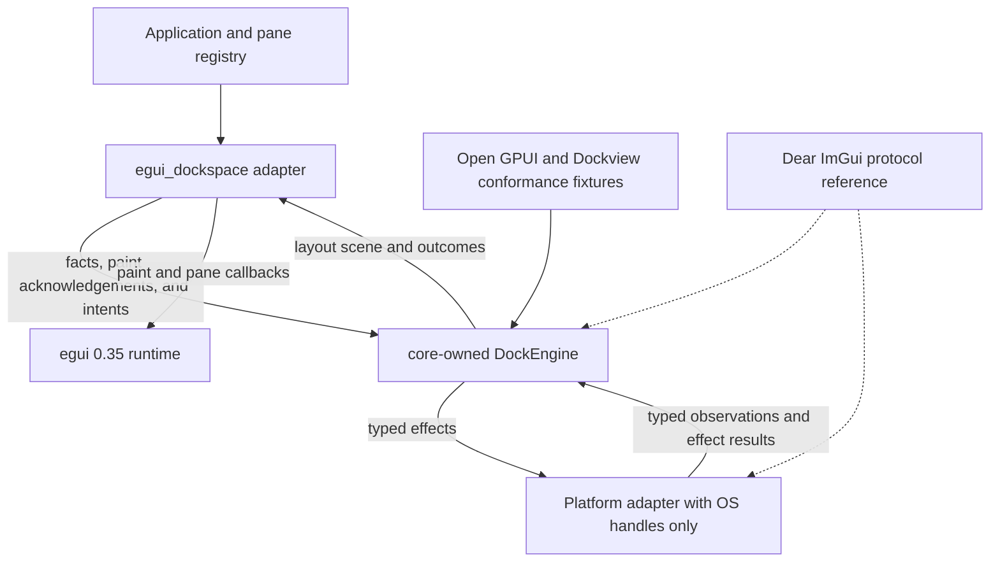
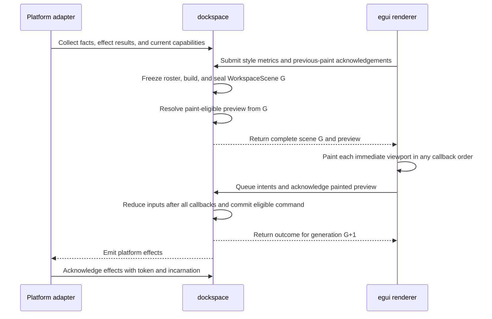
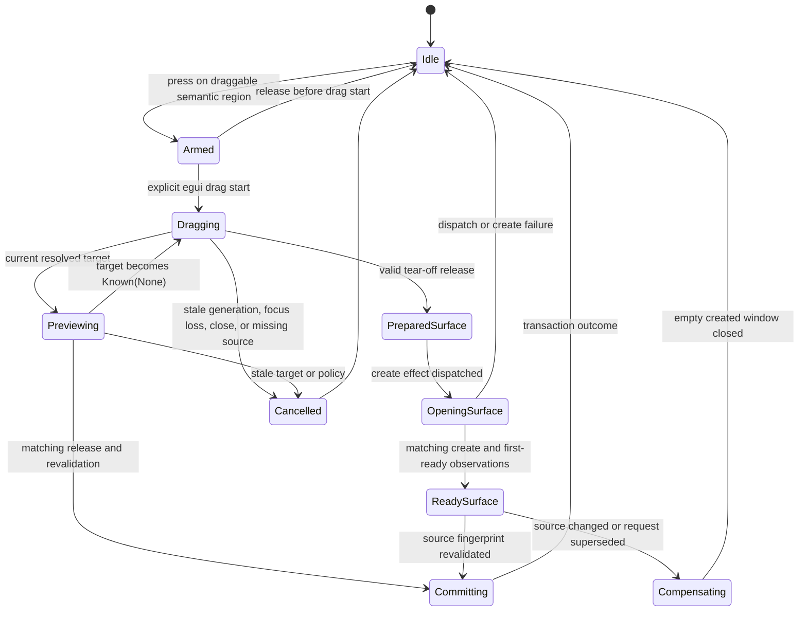
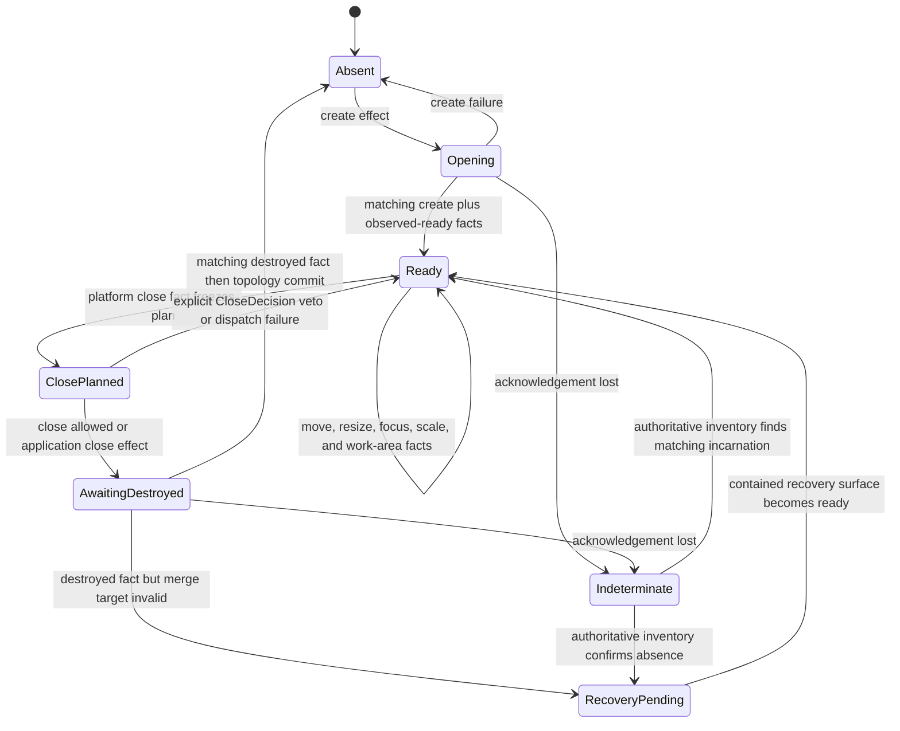
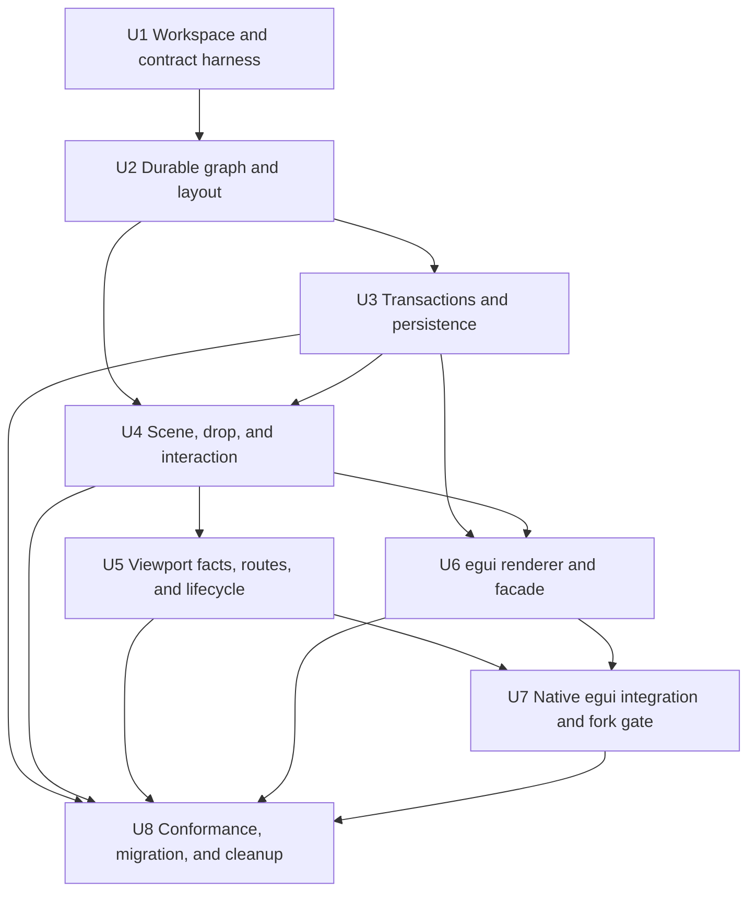

# Headless Dockspace and egui_dockspace Fearless Refactor - Plan

## Goal Capsule

| Field | Contract |
| --- | --- |
| Objective | Replace the current `egui_tiles` bridge with a renderer-neutral `dockspace` state engine and a thin `egui_dockspace` adapter that delivers deterministic docking, contained floating surfaces, and native multi-viewport workflows. |
| Authority | User requirements and session-settled decisions override this plan. This plan overrides prior architecture documentation. Open GPUI is the primary semantic source, Dear ImGui is the platform/docking protocol reference, Dockview is a regression corpus, and the current implementation is characterization evidence only. |
| Execution profile | Breaking refactor on a feature branch. Delete obsolete code and APIs. Land reviewable Conventional Commits as dependency-complete units pass their gates. |
| Stop conditions | Stop rather than guess if a change requires publishing, pushing, or another irreversible remote mutation that has not been authorized; if a platform cannot provide an authoritative fact, report the capability as unavailable and take the specified deterministic fallback. |
| Tail ownership | The top-level `ce-work` goal owns implementation, local verification, simplification, code review, commits, and final cleanup. Upstream PR submission and remote publication are separate external actions. |

---

## Product Contract

### Summary

Build `dockspace` as the single authoritative docking model and state machine. Build `egui_dockspace` as its egui renderer and native viewport adapter. The result must retain the mature docking behavior found in Open GPUI and Dear ImGui without importing renderer state, DOM ownership, implicit global state, or fallible remove-then-insert mutation paths into the core.

### Problem Frame

The current crate combines persistent layout, temporary interaction state, frame geometry, egui rendering, platform inference, persistence, and filesystem debugging inside one mutable bridge. `egui_tiles` and the bridge can both mutate topology, while cross-host operations extract source content before target insertion is known to succeed. This creates real pane-loss paths, render-order-dependent behavior, ambiguous release ownership, malformed-state panics, and mixed-DPI coordinate errors.

The prior direction was useful in proving desired UX and discovering missing egui platform capabilities. It is not a sound state ownership model. Correctness now requires a new core boundary rather than further patches to the bridge.

### Actors

- A1. Application integrator: constructs a workspace, supplies pane identities and pane UI, persists layouts, and chooses docking policy.
- A2. Renderer/backend integrator: translates framework input and platform observations into typed facts, paints a core-produced scene, and executes typed effects.
- A3. End user: rearranges tabs and splits, tears content into contained or native surfaces, re-docks across surfaces, resizes regions, and closes or restores surfaces without losing content.

### Requirements

**Headless model and correctness**

- R1. `dockspace` must have no dependency on egui, eframe, egui-winit, Open GPUI, winit, DOM concepts, native window handles, or renderer callbacks.
- R2. The core must model stable item and dock-space identities, generational runtime node identities, N-ary split nodes, tab stacks, central regions, and validated presentation ownership that keeps dock-space roots, logical surfaces, contained floating placements, and native window incarnations distinct.
- R3. Every topology mutation must enter through a checked command or transaction that stages changes, validates invariants, and either commits completely or leaves the observable workspace unchanged.
- R4. The core layout solver must deterministically honor axis, ordered children, normalized weights, minimum and maximum extents, central-region semantics, and splitter constraints. Pane visibility is expressed by explicit topology or application content policy; the core does not carry a speculative hidden-node state.
- R5. Persistence must use a versioned renderer-neutral schema, reject malformed or unsupported input without panic, detect cycles and duplicate ownership, resolve pane IDs through an application registry, and replace live state only after complete validation.

**Interaction and multi-viewport protocol**

- R6. `DockEngine` must build generation-stamped scenes from pre-frame provider facts and a frozen active-surface roster. Render callbacks only paint a complete `Sealed` generation and enqueue inputs for the next reduction boundary; they never contribute geometry to the generation being painted. Missing required facts deterministically make the dependent operation `Unavailable`, and late facts belong to the next generation.
- R7. Preview and delivery must share one resolved drop-target representation and policy path. Delivery must revalidate source, target, policy, and scene generation before committing.
- R8. Drag sessions must have explicit identities and generations, consume at most one authoritative matching release, and define cancellation for stale or unknown button state, capture loss, vanished content, unavailable targets, focus loss, and surface closure.
- R9. Coordinate, scale, time, frame, surface, platform-window, and effect identities must be distinct typed concepts. Cross-surface calculations must never mix surface-local logical points with desktop physical pixels implicitly.
- R10. Platform knowledge must distinguish `Unknown`, authoritative `Known(None)`, and `Known(Some(value))`. The default policy must not infer hovered windows from rectangle area, focus recency, pointer deltas, elapsed-time thresholds, or window ordering.
- R11. Native surface lifecycle must use a core-owned coordinator and effect ledger with window tokens, incarnations, workspace epochs, and `Requested`, `DispatchFailed`, `ObservedApplied`, `Unsupported`, `Indeterminate`, and destroyed-result phases. Create and close transitions must preserve ownership until matching observations permit an atomic commit or compensation. A lost acknowledgement enters `Indeterminate`; non-idempotent effects are not redispatched until authoritative inventory or cancellation resolves the outcome, and stale results are harmless.

**egui integration and migration**

- R12. `egui_dockspace` must expose a new pane registry/view contract, workspace builder, frame/show API, style and policy configuration, persistence helpers, and structured capability/status reporting without exposing `egui_tiles` types.
- R13. The adapter must render tabs, tab bars, splitters, empty central regions, drop overlays, contained floating chrome, drag ghosts, and focus/selection states itself while the core remains the only mutation authority.
- R14. Native egui viewports must support tear-off, cross-viewport preview and delivery, re-docking, close veto, merge-back, focus restoration, and placement clamping whenever the backend reports the required facts. Unsupported facts must disable only the affected operation and expose the reason.
- R15. The workspace must update to egui/eframe 0.35 and Rust 1.92. The existing egui fork patch must be discarded and rebuilt from current upstream only where a typed, tested platform seam is proven necessary.
- R16. The package must be renamed to `egui_dockspace`, the neutral crate must be named `dockspace`, and production dependencies, APIs, tests, examples, documentation, IDs, and persistence formats tied to `egui_docking` or `egui_tiles` must be removed or replaced.

**Evidence and delivery quality**

- R17. Open GPUI operation fixtures and applicable graph, transaction, drop, interaction, and viewport behavior must become shared conformance evidence for `dockspace`; formal Open GPUI dependency migration must wait for a portable crate version or pinned remote revision.
- R18. Dockview split/normalization and popup-failure cases may be ported as behavior tests, but DOM ownership, raw windows, global DnD singletons, destructive restore, and threshold heuristics must not enter the design.
- R19. Unit, property/model, integration, documentation, examples, and CI gates must demonstrate item conservation, forest validity, atomic failure, deterministic replay, persistence totality, preview/delivery parity, lifecycle idempotence, and graceful platform degradation.

### Key Flows

- F1. Frame projection and render: before paint, the adapter submits acknowledged surface bounds, platform facts, and style metrics; the core freezes the active-surface roster, builds and seals scene generation G from that frozen input, and resolves any preview eligible for painting. Each egui viewport paints G and queues sequenced semantic inputs only. After all callbacks, the core reduces those inputs into one atomic transition for G+1, applies eligible workspace commands, and returns effects. Geometry observed during paint can only become an acknowledged pre-frame fact for G+1. A new surface without acknowledged content bounds receives a sealed, non-interactive bootstrap scene and cannot preview or deliver until its first acknowledged bounds arrive.
- F2. In-surface docking: a tab or subtree drag opens one session, resolves center or edge targets from the current scene, paints that exact target, and commits the same target on the matching release.
- F3. Tear-off and cross-surface docking: a valid release first freezes a source fingerprint while leaving payload ownership unchanged, then requests a native surface. A matching create and first-ready observation triggers revalidation and the atomic move. Failure, replacement, or invalidation clears the reservation and compensates by closing any empty created window. Later authoritative hover over another ready surface resolves and transactionally merges the payload back.
- F4. Native close: an OS close request creates a frozen close plan without mutating topology and produces a named `CloseDecision`. A root-viewport veto maps to one `CancelClose` request; a child-viewport veto keeps submitting the same viewport, while acceptance removes it from the next viewport roster. Only an enhanced provider's matching destroyed observation may advance `ObservedApplied` and commit the revalidated merge/remove transaction. Dispatch failure, stale incarnation, or invalid target discards or compensates the plan while retaining a recoverable logical root; generic "re-render" is not a close acknowledgement.
- F5. Restore: the application decodes a snapshot, resolves item IDs, validates the complete candidate workspace and placements, then atomically swaps it into service or returns a structured error with every durable and transient state unchanged. Success increments `WorkspaceEpoch`, invalidates all prior scenes, sessions, routes, close/tear-off plans, and effects, then emits reconciliation effects; late old-epoch window creation is compensated with close.
- F6. Capability degradation: capability is reported as structured `Supported`, `Unsupported(reason)`, or `Unknown` status per operation. `Unsupported` disables native tear-off before drag and exposes no invalid native target; `Unknown` during an active operation cancels it with a structured reason. The adapter never silently changes the requested presentation mode. An application may opt into the separately named contained-floating fallback policy and owns any user-facing message.
- F7. Contained floating: an explicit command or opted-in fallback creates a stable contained-floating presentation on a logical surface, clamps it to acknowledged bounds, raises it by explicit focus/z-order facts, and routes move, resize, close-veto, re-dock, and empty-root cleanup through the same engine transaction boundary as tiled docking.

### Acceptance Examples

- AE1. Given a cross-root move whose target insertion conflicts or violates policy, when delivery is attempted, then the command returns an error and every source item, root, selection, and placement remains unchanged.
- AE2. Given a release from drag generation N after generation N has been cancelled or replaced, when that release arrives, then no command or platform effect is produced.
- AE3. Given platform hover is `Unknown`, when a pointer is geometrically inside another native window, then the core does not infer that window as a target and reports cross-viewport delivery unavailable.
- AE4. Given two viewports on monitors with different scale factors, when a desktop-physical pointer is mapped into a target surface, then conversion uses the target's acknowledged origin and scale exactly once and resolves the expected logical drop zone.
- AE5. Given native window creation fails, or succeeds after the source moved, closed, or was superseded, when the tear-off saga revalidates, then the payload remains singly owned at its current source and any empty created window receives exactly one compensating close effect.
- AE6. Given a snapshot with an out-of-range node, cycle, duplicate item owner, invalid weight, or unknown schema version, when restore runs, then it returns a typed validation error without panic or live-state mutation.
- AE7. Given a preview resolved from sealed scene generation G and acknowledged as painted, when any source, target, policy, scene, or workspace-epoch precondition changes before release, then delivery rejects the stale preview; it never commits a target the user did not see.
- AE8. Given non-closeable content receives an OS close request, when policy vetoes closure, then a root viewport emits one matching `CancelClose` request while a child viewport remains in the next submitted roster; neither path mutates content ownership, and only a matching enhanced-provider destruction observation may prove closure.
- AE9. Given generation G lacks any required pre-frame fact, when release arrives, then the dependent operation deterministically resolves `Unavailable`; it never waits for a callback to complete G, and no partial scene or late fact can affect G.
- AE10. Given an active matching drag and authoritative `Known(Released)`, when the sealed and painted scene resolves an eligible target, then resolution uses this precedence: explicit tab gap/reorder, center tab merge, inner leaf-edge split, then outer dock-space-edge split. Equal-class overlap uses declared scene z-order and stable target ID. `Known(None)` may tear off only under an explicit native or contained presentation policy; `Unknown`, capture loss, or missing placement cancels without inference.
- AE11. Given a create effect becomes `Indeterminate`, when another callback or timeout-like application tick occurs, then the engine does not redispatch creation; it waits for authoritative inventory or explicit cancellation, then either adopts the matching incarnation or issues exactly one compensation.
- AE12. Given a contained-floating root is moved, resized, focused, veto-closed, or re-docked, then its stable presentation ID and single item ownership are preserved, placement is clamped to acknowledged bounds, z-order changes only from explicit focus input, and an empty presentation is removed atomically.
- AE13. Given a native window is destroyed and its planned merge target is invalid, then its logical root is re-presented as contained floating on the designated recovery surface at its last acknowledged logical placement. If that surface is not ready, a queryable `RecoveryPending` presentation owns the root and requests one replacement surface; content is never orphaned or hidden.
- AE14. Given keyboard or accessibility input, then tab focus/activation/close, arrow/Home/End tab navigation, Escape drag cancellation, and splitter adjustment produce the same sequenced semantic inputs as pointer interaction; accessibility nodes expose selected, closeable, focused, and adjustable state from the sealed scene.

### Success Criteria

- The final workspace has no normal or dev dependency on `egui_tiles` and no production reference to the old context-data string protocol.
- All core command-sequence tests preserve the exact item multiset and pass strict graph validation after success and after injected failures.
- Upstream-only examples demonstrate tab docking, splits, contained floating, persistence, native lifecycle, and truthful capability degradation. A separate pinned-fork integration harness demonstrates full cross-viewport re-docking, close veto, and mixed-DPI placement when the enhanced fact seam is required.
- A clean checkout can build and test the upstream-egui path without sibling path dependencies. Any enhanced fork integration is isolated, documented, and verified against a local upstream-based fork branch before remote landing.
- Local implementation is complete only when the enhanced provider bridge, fork patch, and portable harness source pass together. A published release may advertise full native cross-window support only after the fork dependency is authorized, remotely resolvable, and pinned; until then crates.io/upstream mode advertises its narrower capability matrix truthfully.

### Scope Boundaries

**In scope**

- Breaking the complete public API and persistence schema.
- Replacing the existing source tree and examples rather than wrapping it.
- Creating and committing changes in this repository and, when required, in the clean `repo-ref/egui` fork on an upstream-based feature branch.
- Porting owned Open GPUI code and MIT-compatible Dockview algorithms or fixtures with attribution.

**Deferred, not required for local completion**

- Publishing `dockspace`/`egui_dockspace`, pushing fork branches, or opening upstream pull requests.
- Turning the locally verified enhanced-provider bridge into a default or published dependency before its fork revision is remotely resolvable. This is a release-landing gate, not permission to omit the bridge or its full workflow tests locally.
- Permanently switching Open GPUI to the shared crate before `dockspace` has a remotely resolvable version or revision.
- Guaranteeing native cross-window operations on platforms that cannot provide authoritative global placement or hover facts, notably constrained Wayland environments.

**Out of scope**

- Backward compatibility with the `egui_docking` API, legacy RON schema, or `egui_tiles` tree IDs.
- Copying Dockview's DOM architecture or reproducing every Dear ImGui styling detail.
- Building a general-purpose operating-system window manager inside the core.

---

## Planning Contract

### Priority Order

- P0 - Correctness foundation: neutral graph, strict invariants, checked transactions, total persistence, deterministic scene/drop protocol, interaction generations, and early Open GPUI/Dockview conformance evidence that prevents the core boundary from drifting toward egui.
- P1 - Product baseline: `egui_dockspace` public API, custom rendering, single-surface docking, split resize, contained floating, and migration examples.
- P2 - Native multi-viewport: explicit platform facts/effects, lifecycle, tear-off, cross-window preview/delivery, close/focus/placement behavior, capability reporting, and the evidence-based minimal egui fork decision.
- P3 - Convergence and hardening: final differential audit, legacy deletion, documentation, CI, distribution checks, and review cleanup.

### Context and Research

- The current `src/multi_viewport/mod.rs` owns durable layout, interaction, frame geometry, platform inference, persistence, and rendering. Its deferred-action idea is useful, but detached rendering temporarily removes live state and cross-host moves are not atomic.
- `repo-ref/egui_tiles_docking/src/tree.rs` exposes subtree operations and docking hooks, but insertion can fail by logging and returning `()`. The bridge then reports success after source extraction. `Tree::ui` also combines layout, render, garbage collection, simplification, drag resolution, and mutation.
- `repo-ref/open-gpui/crates/gpui_docking` supplies the strongest model: stable semantic IDs, N-ary graph, layout validation, checked workspace transactions, shared preview/delivery targets, and explicit viewport runtime concepts. Framework geometry, entities, views, and window handles must be removed during extraction.
- Dear ImGui's docking branch separates queued undock/dock phases, uses a central node, renders preview from the same split decision carried into the request, distinguishes platform requests, and prefers authoritative hovered-viewport backend input over its documented flawed fallback.
- Dockview's `dockview-core` remains DOM-driven. Its split solver, same-axis flattening, per-surface roots, serialization samples, and blocked-popup/no-orphan tests are useful; its object model, mutation brackets, destructive restore, raw coordinate math, and DnD thresholds are not.
- Upstream egui 0.35 already provides native mouse-motion events, viewport pass-through commands, close cancellation, all-viewport info, and current winit integration. The old fork's raw-delta integration, fake pointer events, duplicated Glow/WGPU routing, and string context keys must not be ported.

### Key Technical Decisions

- KTD1. Neutral core ownership (session-settled: user-directed - chosen over an egui-only core: the same deterministic model must support egui and future Open GPUI integration). One core `DockEngine` owns durable `Workspace`, interaction state, sealed scenes, viewport coordination, and the effect ledger; adapters own only framework objects, OS handles, and token-to-handle execution mappings.
- KTD2. Rename and break cleanly (session-settled: user-directed - chosen over compatibility wrappers: the user explicitly authorized deletion and breaking changes). The old API and schema receive no compatibility layer.
- KTD3. Remove `egui_tiles` from production (session-settled: user-approved - chosen over deepening the fork: its render loop and mutation authority cannot satisfy atomic cross-surface transactions). Only behavior and painting lessons may be copied.
- KTD4. Use Open GPUI as the semantic source, Dear ImGui as the protocol reference, and Dockview as a test corpus. No reference implementation is copied wholesale because each mixes framework concerns at different boundaries.
- KTD5. Use an N-ary validated forest with independent identity domains. Runtime node IDs are generational; application item IDs, dock-space/root IDs, logical surface IDs, and contained-floating presentation IDs are stable semantic identities; native windows use ephemeral token/incarnation pairs. Every root has exactly one presentation owner, every surface has one main root and may host multiple contained-floating roots, and window replacement does not replace its logical root.
- KTD6. Use two mutation boundaries. `WorkspaceCommand` is the only durable topology mutation; `EngineInput -> EngineTransition` is the only transient reducer and atomically publishes candidate workspace, interaction, scene, viewport, event, and effect-ledger changes. Adapters never mutate either state class.
- KTD7. Make explicit facts replace heuristics (session-settled: user-directed - chosen over geometric/focus/time inference: state, interaction, and heuristic errors were identified as the highest-risk area). Unknown authority disables the dependent action; optional fallback policies must be separately named and default off.
- KTD8. Bind preview and commit to the same resolved target. Resolution carries source/target identities, operation, split geometry, policy proof, sealed scene generation, workspace epoch, and a renderer acknowledgement that the preview was painted. Release revalidation is mandatory; a changed target is rejected rather than committed unseen.
- KTD9. Separate durable, session, scene, and platform state. Persistence contains only durable workspace and placement preferences; transient input, frame facts, effects, and platform window incarnations never enter the snapshot. Successful restore advances a workspace epoch and reconciles platform state; core persistence APIs encode/decode values and do not perform non-atomic filesystem writes.
- KTD10. Start from upstream egui 0.35 and produce two native integration artifacts. The root workspace contains the provider contract, initially crate-private, plus an upstream provider that reports only facts it can observe; any enhanced typed backend-facts seam and bridge live on an independent upstream-based egui fork branch and are verified by a separate pinned integration harness. No ordinary root feature may compile only with an unpublished fork.
- KTD11. Use strict capability-based native behavior. Full cross-window docking is available only when hover, coordinates, placement, and pass-through facts are authoritative. Single-surface and contained-floating workflows remain available everywhere.
- KTD12. Keep Open GPUI's formal dependency migration behind a distribution gate. Local differential tests and source extraction are required now; a committed cross-repository dependency must use a published version or pinned remote revision, never a sibling path.
- KTD13. Raise the workspace MSRV to Rust 1.92 to align with egui/eframe 0.35 and Open GPUI instead of maintaining compatibility shims for Rust 1.88.
- KTD14. Land dependency-complete Conventional Commits autonomously (session-settled: user-directed - chosen over confirmation before each commit: the user authorized intermediate commits for this long refactor). Commits must never include unrelated user changes or non-portable sibling paths.
- KTD15. Serialize engine input through one non-reentrant writer. Every adapter assigns a monotonic input sequence within its source stream; the engine merges immutable batches in the fixed order `LifecycleControl > PlatformObservation > ApplicationCommand > RendererIntent > Maintenance`, then by per-source sequence, and publishes one `EngineTransition`. Restore/replace therefore invalidates same-batch stale releases, while platform destruction/capture facts precede UI intent. Inputs emitted reentrantly by pane callbacks, effect execution, or event handlers are queued for the next boundary.
- KTD16. Use normative target and tear-off tables rather than geometry-derived preference. Eligible targets resolve in semantic order: explicit tab gap/reorder, center tab merge, inner leaf-edge split, then outer root-edge split; equal classes use declared scene z-order and stable target ID. Native versus contained tear-off is selected only by an explicit command/policy and authoritative facts.
- KTD17. Keep enhanced-provider exposure staged. The provider SPI is crate-private until the upstream provider and a second enhanced provider pass the same conformance suite; then only the smallest stable fact/effect interface becomes public. Local implementation completion includes the enhanced bridge and independent harness source, while release readiness additionally requires an authorized remotely resolvable fork revision.

### High-Level Technical Design

The following sketches define ownership and information flow, not exact Rust APIs.

### Deterministic Interaction Tables

| Drop candidate | Eligibility | Priority | Same-class tie-break |
| --- | --- | --- | --- |
| Explicit tab gap/reorder | Payload and exact insertion gap are policy-allowed | 1 | Declared scene z-order, then stable target ID |
| Center tab merge | Target tab stack or empty central region accepts payload | 2 | Declared scene z-order, then stable target ID |
| Inner leaf-edge split | Target leaf edge accepts axis/side operation | 3 | Declared scene z-order, then stable target ID |
| Outer dock-space-edge split | No eligible inner candidate and root edge accepts payload | 4 | Declared scene z-order, then stable target ID |

All hit regions use documented half-open boundaries. Candidate area, focus age, pointer delta, elapsed time, callback order, and collection traversal order are never tie-breakers.

| Authoritative release state | Resolved dock target | Presentation policy/capability | Result |
| --- | --- | --- | --- |
| Not matching `Known(Released)` | Any | Any | Keep or cancel the session according to the explicit input; never deliver |
| Matching `Known(Released)` | Eligible `Known(Some(target))` with painted acknowledgement | Dock allowed | Revalidate and commit that exact target |
| Matching `Known(Released)` | `Known(None)` | Explicit native policy and all required facts `Supported` | Start native tear-off saga without moving content |
| Matching `Known(Released)` | `Known(None)` | Explicit contained policy, or explicitly enabled contained fallback | Commit contained-floating presentation |
| Matching `Known(Released)` | `Known(None)` | Native `Unsupported(reason)` and no explicit fallback | Return `OperationUnavailable(reason)` |
| Matching `Known(Released)` | `Unknown`, capture lost, or placement unknown | Any | Cancel with a structured reason; never infer or silently fall back |

| Capability state | Before operation | During operation | Adapter/UI contract |
| --- | --- | --- | --- |
| `Supported` | Expose eligible native operation | Continue while all required observations remain authoritative | Paint only valid targets |
| `Unsupported(reason)` | Disable the affected native operation | Cancel if capability is revoked | Emit structured status; application owns user-visible messaging |
| `Unknown` | Do not advertise the affected operation as available | Cancel the active dependent operation | No heuristic fallback or invalid overlay |

### State Ownership

| Layer | Owns | Must not own |
| --- | --- | --- |
| Durable workspace | Items, nodes, roots, central metadata, selection, split weights, placement preferences | Pointer state, egui IDs, native handles, frame rectangles |
| Interaction session | Drag identity, source snapshot, release ledger, active resolved target | Graph mutation or renderer callbacks |
| Scene registry | Generation-stamped logical geometry, hit regions, visual affordances | Durable topology or inferred platform truth |
| Core viewport coordinator | Capabilities, observed facts, logical surfaces, window tokens/incarnations, close/tear-off plans, pending effect ledger | OS handles or framework callbacks |
| Platform adapter | OS handles, token-to-handle mapping, effect dispatch, raw observation collection | Pending-effect authority, pane content, or graph ownership |
| egui adapter | Style metrics, pane callbacks, widget responses, paint commands, painted-scene acknowledgements | Independent docking topology or unvalidated cross-surface moves |

`DockEngine` is the only input writer. Adapters enqueue source-tagged inputs; a reduction boundary orders them by declared source priority and monotonic per-source sequence. Event consumers and effect executors cannot re-enter the active reduction and can only enqueue the next batch.

### Core Invariants and Failure Semantics

- The live graph is a forest rooted only by declared dock spaces; no orphan runtime node is valid after a command boundary.
- Every item has exactly one owner. Successful commands preserve the item multiset except explicit add/remove commands; failed commands preserve the complete observable state.
- Split children and weights have equal non-zero cardinality, finite non-negative weights, and a deterministic normalization. Empty and single-child containers follow explicit canonicalization rules.
- A tab stack has no duplicate items and selects either one owned item or none only when empty.
- Scene, drag, release, route, effect, and window-incarnation generations are checked before state changes.
- A scene generation freezes its active-surface roster and transitions once from `Building` to `Sealed`; only sealed scenes may resolve targets, and late facts cannot reopen them.
- A surface without acknowledged bounds contributes a sealed non-interactive bootstrap scene. It cannot accept preview or delivery until a later generation contains acknowledged bounds.
- Eligible drop targets follow the normative semantic precedence in KTD16. Ties never use area, timestamp, focus recency, or traversal accident.
- Platform effects are idempotent by effect identity. Results for an old incarnation cannot mutate a replacement window.
- A non-idempotent effect in `Indeterminate` is never redispatched until authoritative inventory or explicit cancellation resolves it.
- Create and close are sagas: logical ownership changes only after matching observed platform state and revalidation; every partial external success has a deterministic compensating or recoverable state.
- A destroyed root with no valid merge target is owned by a contained `RecoveryPending` presentation on the designated recovery surface, or by a queryable pending replacement when that surface is unavailable; destruction never makes a root invisible.
- Snapshot decode and restore are total over untrusted bytes: all errors are values, and success is the only path that swaps live state.
- A successful restore advances `WorkspaceEpoch`; every input, plan, scene, route, and effect result from an older epoch is rejected or compensated.

### Assumptions

- The final repository is a Cargo workspace with `crates/dockspace` and `crates/egui_dockspace`; examples live with the egui adapter.
- Item content remains application-owned and is addressed by a stable application-provided item ID and registry.
- Rust 1.92 and edition 2024 are acceptable breaking baseline requirements.
- Native multi-viewport validation will be executed on the current macOS host; Windows and Linux backend behavior is enforced through deterministic adapters and CI compile/test coverage until real-host automation exists.
- Local reference repositories are clean, independent Git repositories. Their commits are never assumed to be included in the root repository.
- Remote pushes, crate publication, and upstream PR creation require a separate explicit action and are not silently performed by this plan.

### System-Wide Impact

- Public API: every current type exposing `egui_tiles` or `DockingMultiViewport` is removed. Application code migrates to item IDs, a pane registry, `dockspace` workspace state, and an `egui_dockspace` surface/show facade.
- Persistence: schema version restarts at a new renderer-neutral version. Legacy files return `UnsupportedVersion`; they are not partially imported.
- Rendering: tab/split/floating chrome moves into the adapter. Style metrics become explicit layout input so the scene used for hit testing matches paint output.
- Platform integration: platform state becomes a capability/fact/effect protocol with observed application states rather than command-send assumptions. Glow and WGPU share the same platform observation path if a fork patch is needed.
- Performance: the core may clone a candidate graph initially for transactional correctness. Benchmarks guide later copy-on-write or undo-log optimization without weakening atomicity.
- Accessibility: semantic tab, close, splitter, surface, and selected-state information is produced by the adapter from the same scene; visual-only hit regions are insufficient.
- Distribution: `dockspace` can be versioned independently. Open GPUI cannot consume an uncommitted sibling path, so distribution precedes its permanent dependency switch.

### Risks and Dependencies

| Risk | Consequence | Mitigation |
| --- | --- | --- |
| Scope is large and cross-layer | A long rewrite can accumulate two competing architectures | Keep the old source out of the new workspace build, land dependency-ordered units, and delete legacy once equivalent fixtures pass |
| Immediate-mode callback ordering | Preview or release could observe incomplete surface geometry | Pre-project deterministic scenes from acknowledged surface facts, generation-stamp all submissions, and reject stale delivery |
| OS hover/placement limitations | Native cross-window docking may be unavailable or wrong | Use explicit capability states, pass-through only when acknowledged, no default geometric fallback, and visible status reporting |
| Mixed-DPI desktop coordinates | Wrong target or drifting native placement | Keep desktop physical and surface logical types separate; test conversions in both directions at non-equal scales |
| Fork drift | A large patch becomes unmergeable and duplicated across renderers | Start a new branch at upstream 0.35, prove the missing seam first, centralize platform handling, and keep upstream as the default path |
| Transaction cost | Full candidate clones may be expensive for very large workspaces | Establish correctness first, benchmark representative graph sizes, then replace internals behind the same command contract if needed |
| Copied prior-art licensing | Attribution could be lost during extraction | Preserve original headers, record MIT/Apache provenance, and add third-party notices for substantial copied algorithms or fixtures |
| Cross-repository dependency | Open GPUI commit could become non-reproducible | Require a published crate or pinned accessible Git revision before changing its permanent manifest |
| External effect succeeds after local state changes | An empty native window, duplicate owner, or premature merge could remain | Use source fingerprints, workspace epochs, observed-ready/destroyed facts, and compensating close/reconciliation effects |

### Deferred Questions

- Which remote branch/revision or crates.io release will become the first portable `dockspace` dependency for Open GPUI? Deferred until local API and conformance tests stabilize; it does not change current core semantics.
- What exact public shape should an egui platform-facts upstream PR use? Deferred until upstream-only native conformance identifies the smallest missing fact set.
- Which real-host CI service should exercise Windows, X11, and Wayland drag behavior? Deferred; deterministic backend tests and build matrices are required now, while hosted GUI automation is a later operational decision.

### Dependency Sequence

---

## Implementation Units

### U1. Establish the workspace and executable behavior contract

- **Goal:** Create the final two-crate workspace shape, rename the product surface, and capture reference behaviors as framework-neutral fixtures before production code is ported.
- **Requirements:** R1, R15, R16, R17, R18, R19.
- **Dependencies:** None.
- **Files:** `Cargo.toml`, `Cargo.lock`, `rust-toolchain.toml`, `crates/dockspace/Cargo.toml`, `crates/dockspace/src/lib.rs`, `crates/dockspace/tests/fixtures/`, `crates/egui_dockspace/Cargo.toml`, `crates/egui_dockspace/src/lib.rs`, `THIRD_PARTY.md`, legacy root `src/`, legacy root `examples/`, and obsolete root tests/configuration.
- **Approach:** Convert the repository to a virtual workspace pinned to Rust 1.92. Add minimal compiling crates with feature boundaries for serialization and native integration. Translate current overlay expectations plus selected Open GPUI operation traces and Dockview topology/popout failure cases into renderer-neutral fixture vocabulary with provenance. Once those characterization fixtures exist, delete the legacy root source tree, old examples, debug protocol, `egui_tiles` dependency, and obsolete tests in the same unit. No dual implementation remains available to become an accidental authority.
- **Test scenarios:** Fixture decoding rejects unknown fixture versions; identical operation traces produce identical normalized expected states; provenance metadata is present for copied fixtures; `dockspace` dependency inspection contains no UI framework.
- **Verification:** Both crate skeletons compile independently; fixture tests run without egui/eframe; a dependency-tree check confirms the core boundary.

### U2. Implement the durable graph, layout solver, and strict validation

- **Goal:** Provide the complete renderer-neutral workspace model and deterministic layout projection on which all later state machines depend.
- **Requirements:** R1, R2, R4, R9, R18, R19.
- **Dependencies:** U1.
- **Files:** `crates/dockspace/src/ids.rs`, `crates/dockspace/src/geometry.rs`, `crates/dockspace/src/graph.rs`, `crates/dockspace/src/layout.rs`, `crates/dockspace/src/validation.rs`, `crates/dockspace/src/canonical.rs`, `crates/dockspace/src/policy.rs`, `crates/dockspace/tests/graph_model.rs`, `crates/dockspace/tests/layout_solver.rs`, plus an independent Open GPUI adapter compile/behavior spike under `repo-ref/open-gpui/crates/gpui_docking` on its own branch.
- **Patterns:** Port semantics from `repo-ref/open-gpui/crates/gpui_docking/src/ids.rs`, `graph*.rs`, `layout.rs`, and `layout_validation.rs`. Adapt Dockview's same-axis flattening and min/max resize cases without DOM paths or implicit depth axes.
- **Approach:** Use stable semantic IDs for items, dock-space roots, logical surfaces, and contained-floating presentations plus generational arena IDs for runtime nodes. Represent splits as ordered N-ary children with explicit axes and weights. Add a validated presentation map: each root has one owner, each surface has one main root and zero or more floating roots, and a native window incarnation is only a transient presentation of a surface. Implement strict forest, ownership, selection, central-region, fraction, reachability, presentation, and geometry validation. Layout is a pure projection from workspace, surface bounds, placements, and explicit style/constraint metrics. Before interaction or viewport work starts, compile a thin Open GPUI adapter facade and replay graph/layout traces against this API to prove that no egui type or immediate-mode callback assumption leaked into the core.
- **Test scenarios:** Empty and populated tabs; nested and same-axis splits; central region remaining-space behavior; min/max conflicts; deterministic canonicalization; duplicate item or root ownership; cycles; missing children; orphan nodes; non-finite weights; contained floating moved across hosts; floating inside a native surface; seeded arbitrary graph validation and layout determinism; Open GPUI adapter compilation and canonical trace parity.
- **Verification:** Unit and model tests prove strict validation catches every injected corruption and layout replay yields byte-equivalent normalized scenes for the same input. The independent Open GPUI adapter spike compiles and passes without adding a sibling path to any root-repository manifest; its changes are committed separately in that reference repository.

### U3. Implement checked commands, workspace transactions, and total persistence

- **Goal:** Make atomic commands the only topology mutation path and make durable restore safe for untrusted snapshots.
- **Requirements:** R3, R5, R7, R16, R17, R19.
- **Dependencies:** U2.
- **Files:** `crates/dockspace/src/command.rs`, `crates/dockspace/src/operation.rs`, `crates/dockspace/src/transaction.rs`, `crates/dockspace/src/workspace.rs`, `crates/dockspace/src/engine.rs`, `crates/dockspace/src/transition.rs`, `crates/dockspace/src/event.rs`, `crates/dockspace/src/persistence.rs`, `crates/dockspace/src/error.rs`, `crates/dockspace/tests/command_sequences.rs`, `crates/dockspace/tests/transaction_atomicity.rs`, `crates/dockspace/tests/engine_atomicity.rs`, `crates/dockspace/tests/persistence.rs`.
- **Patterns:** Extract checked operation and workspace transaction semantics from Open GPUI's `op.rs`, `graph_op_validation.rs`, `workspace_*_transaction.rs`, and `dock_op_sequences_v1.json`. Correct its permissive orphan policy at the shared-core boundary.
- **Approach:** Define add/remove/select/reorder/split/merge/move/resize/create-root/remove-root commands with preconditions and structured outcomes. Apply through an isolated candidate state first; optimize only after benchmarks show a need. Implement the stable `DockEngine`, `EngineInput`, and `EngineTransition` shell now: one non-reentrant sequenced input batch produces candidate workspace, interaction, scene, viewport, event, and effect-ledger state, validates them together, and publishes them atomically. Events are generated only after commit. Define a versioned snapshot with explicit node records, semantic IDs, presentation preferences, and registry resolution. Decode into a temporary representation, validate references and cycles iteratively, build a candidate workspace, then swap. Successful restore advances `WorkspaceEpoch` and produces explicit invalidation/reconciliation outputs; serialization remains side-effect-free and filesystem I/O stays application-owned.
- **Test scenarios:** Every cross-root operation succeeds and preserves items or fails with a deep-equal original state; target ID collision; policy rejection; missing source; stale node ID; injected failure at each transaction phase; atomic publication across all engine state classes; deterministic source-priority/sequence ordering; reentrant input deferred to the next boundary; malformed schema indices/cycles/duplicates/non-finite values; missing registered item; unsupported version; round-trip canonical equality; seeded operation sequences with item-multiset assertions; successful restore advances epoch and emits invalidation, while failed restore leaves the complete engine unchanged.
- **Verification:** Property/model tests run thousands of command steps and validate after every step; all failure injection points prove atomicity; malformed persistence never panics or mutates the live workspace.

### U4. Implement scene facts, deterministic drop resolution, and drag sessions

- **Goal:** Replace render-order-dependent interactions with a generation-stamped semantic protocol whose preview and delivery cannot diverge.
- **Requirements:** R6, R7, R8, R9, R10, R17, R19.
- **Dependencies:** U2, U3.
- **Files:** `crates/dockspace/src/scene.rs`, `crates/dockspace/src/hit_region.rs`, `crates/dockspace/src/drop_target.rs`, `crates/dockspace/src/drop_resolver.rs`, `crates/dockspace/src/interaction.rs`, `crates/dockspace/src/intent.rs`, `crates/dockspace/tests/drop_resolution.rs`, `crates/dockspace/tests/interaction_state_machine.rs`, `crates/dockspace/tests/preview_delivery_parity.rs`.
- **Patterns:** Port Open GPUI `drop_target/*`, `drop_scene_fact.rs`, `drop_runtime.rs`, `interaction.rs`, and current overlay characterization rules. Use Dear ImGui's explicit center/side availability and queued delivery as protocol guidance, not its fallback hover heuristic.
- **Approach:** Define immutable per-generation surface scenes containing node rectangles, tab and tab-bar regions, split targets, outer/inner zones, declared z-order, and policy availability. The engine freezes the pre-frame active-surface roster, emits a non-interactive bootstrap scene for any surface missing acknowledged bounds, and seals exactly once; renderer callbacks cannot add facts to the active generation. Translate responses into source-tagged press/drag/release/cancel/resize inputs and reduce them through the U3 engine boundary. Resolve eligible targets by the normative order `TabGap > CenterMerge > InnerEdge > OuterEdge`; equal classes use declared z-order and stable target ID, with half-open region boundaries. Carry that exact proof into preview. Delivery requires an authoritative matching button release plus acknowledgement that the same preview was painted; it verifies session, epoch, source, sealed scene, target, and policy before converting the resolution to a workspace command. Tear-off is eligible only for a matching active drag with authoritative `Known(Released)`, painted preview state, authoritative `Known(None)` dock target, known placement, and explicit native or contained presentation policy; `Unknown` or capture loss cancels.
- **Test scenarios:** The complete target-precedence matrix; half-open boundary ties; center versus side availability; empty central region; same-stack reorder; subtree payload; overlapping regions with declared z-order and stable-ID tie-break; explicit native versus contained tear-off; `Unknown` target authority or button state; bootstrap, stale, and partially built scenes; every source/target/root callback ordering; missing or closing target surface; late fact after seal; duplicate release; release without active session; source removal mid-drag; capture loss; new drag replacing old drag; resize cancellation; preview target changed before delivery; successful and failed restore during active drag with old-generation inputs rejected.
- **Verification:** A generated matrix of payload/target/zone/policy/callback-order cases shows painted preview and committed operation parity; each drag generation produces zero or one delivery; only sealed scenes resolve; no geometry-area, focus-recency, raw-delta, or timer inference exists in default resolution.

### U5. Implement platform facts, viewport routing, effects, and lifecycle

- **Goal:** Make native surfaces a deterministic state machine that can be tested without an operating system or UI framework.
- **Requirements:** R8, R9, R10, R11, R14, R17, R19.
- **Dependencies:** U3, U4.
- **Files:** `crates/dockspace/src/platform.rs`, `crates/dockspace/src/coordinates.rs`, `crates/dockspace/src/viewport.rs`, `crates/dockspace/src/viewport_registry.rs`, `crates/dockspace/src/viewport_route.rs`, `crates/dockspace/src/effect.rs`, `crates/dockspace/src/frame.rs`, `crates/dockspace/tests/viewport_lifecycle.rs`, `crates/dockspace/tests/viewport_routes.rs`, `crates/dockspace/tests/mixed_dpi.rs`.
- **Patterns:** Extract identity, coordinate, registry, route/delivery, placement, close, focus, and runtime-effect semantics from Open GPUI's `viewport_*` modules. Retain trusted-none versus unavailable distinctions and remove focus-stamp fallback from the default path.
- **Approach:** Model capabilities separately from observations inside the core viewport coordinator. Associate each native window with a stable surface ID and ephemeral token/incarnation; adapters retain only OS handles and execute effects. Route pointer facts to scenes only when coordinate conversion inputs are acknowledged. Extend the U3 reducer and effect ledger with `Requested`, `DispatchFailed`, `ObservedApplied`, `Unsupported`, `Indeterminate`, and destroyed transitions. Create freezes a source fingerprint without moving content, commits only after matching ready observation and revalidation, and compensates an empty window on failure. A lost acknowledgement becomes `Indeterminate` and blocks redispatch of non-idempotent creation until authoritative inventory or explicit cancellation resolves it. Close freezes a plan and emits `CloseDecision` without changing ownership, commits only after a matching destruction observation, and distinguishes root cancellation from child roster retention. If destruction invalidates the planned merge, atomically attach the root as contained floating on the designated recovery surface at its last acknowledged logical placement; if no recovery surface is ready, retain a queryable `RecoveryPending` owner and request one replacement.
- **Test scenarios:** Create success/failure/never-ready/indeterminate; authoritative inventory adopts or compensates an indeterminate create; created window after request replacement; source moved or closed while opening; commit failure after create and compensating close; root close veto via cancel request; child close veto via roster retention; child close acceptance via roster removal; close dispatch failure; repeated close request; direct destruction without a plan; merge target invalid after destruction with contained recovery; recovery surface unavailable then ready; stale effect result; token reuse with new incarnation; native window recreation with the same logical surface/root; successful and failed restore during pending create and pending close; late old-epoch callback; surface disappears during drag; authoritative hovered none; unavailable hover or button state; pass-through requested but not observed; capability revoked mid-drag; foreign window above target; source/target at 1.0/1.5/2.0 scales; missing global placement; work-area clamp; route generation rollover.
- **Verification:** A fake platform drives the complete lifecycle, saga compensation, and cross-surface route matrix deterministically; stale/duplicate results are no-ops; no content moves before observed readiness/destruction; mixed-DPI expectations use exact typed conversions.

### U6. Build the egui renderer, pane API, and contained-floating product surface

- **Goal:** Deliver the renamed upstream-egui-compatible crate with custom rendering and all non-native docking workflows.
- **Requirements:** R12, R13, R15, R16, R19, F7, AE12, AE14.
- **Dependencies:** U3, U4.
- **Files:** `crates/egui_dockspace/src/lib.rs`, `crates/egui_dockspace/src/dockspace.rs`, `crates/egui_dockspace/src/pane.rs`, `crates/egui_dockspace/src/builder.rs`, `crates/egui_dockspace/src/style.rs`, `crates/egui_dockspace/src/renderer.rs`, `crates/egui_dockspace/src/tabs.rs`, `crates/egui_dockspace/src/splits.rs`, `crates/egui_dockspace/src/floating.rs`, `crates/egui_dockspace/src/interaction.rs`, `crates/egui_dockspace/src/persistence.rs`, `crates/egui_dockspace/tests/egui_integration.rs`.
- **Patterns:** Copy only useful tab, splitter, ghost, and floating chrome behavior from the current crate and tiles fork. Use upstream egui window/pass/widget primitives; do not patch private egui window chrome.
- **Approach:** Expose an application-owned pane registry keyed by core item IDs and a facade that advances the core frame around egui painting. Submit acknowledged facts and style metrics before scene construction, paint only a complete sealed scene and already resolved preview, queue source-tagged semantic inputs during each immediate viewport callback, then reduce them after all callbacks for the next generation. Geometry learned during paint cannot alter the generation being painted. Implement tab selection/close/reorder, subtree drag, splitter resize, central area, empty states, drag ghost, and the full contained-floating flow: explicit creation/fallback selection, bounds clamping, deterministic focus/z-order, move/resize, close veto, re-dock, and empty cleanup. Implement arrow/Home/End tab navigation, Enter/Space activation, policy-checked close, Escape drag cancellation, keyboard splitter adjustment, and AccessKit semantics from the sealed scene. Keep advanced core access available without duplicating state.
- **Test scenarios:** Builder creates canonical layouts; missing pane registry entry renders a recoverable placeholder; tab close veto; selected tab focus; same-stack reorder; split resize constraints; every contained-floating transition in AE12; explicit fallback off/on; style metric changes; pane callback adds/removes content safely through next-boundary commands; keyboard/pointer command parity; accessibility selected/closeable/focused/adjustable assertions; adapter never changes graph during paint.
- **Verification:** egui integration tests compare core state and semantic scene outcomes; contained-floating and accessibility matrices pass; examples compile against only public APIs; default features build against crates.io egui 0.35 with no fork or tiles dependency.

### U7. Deliver native egui multi-viewport and decide the minimal fork patch by evidence

- **Goal:** Connect U5 to egui/eframe native viewports, prove the upstream-only capability envelope, and rebuild the egui fork only for facts that cannot be obtained correctly upstream.
- **Requirements:** R9, R10, R11, R14, R15, R19.
- **Dependencies:** U5, U6.
- **Files:** `crates/egui_dockspace/src/platform_adapter.rs`, `crates/egui_dockspace/src/native_viewport.rs`, `crates/egui_dockspace/src/native_runtime.rs`, `crates/egui_dockspace/tests/native_adapter.rs`, `crates/egui_dockspace/examples/native_multiview.rs`, root workspace `exclude` configuration, `integration/egui-fork-harness/Cargo.toml`, `integration/egui-fork-harness/src/`, `integration/egui-fork-harness/tests/`, `scripts/run_egui_fork_harness.py`, and, only if the gate fires, `repo-ref/egui/crates/egui/src/data/input/`, `repo-ref/egui/crates/egui-winit/src/lib.rs`, `repo-ref/egui/crates/eframe/src/native/`.
- **Patterns:** Use egui 0.35 `RawInput` viewport facts, per-viewport input, `ViewportCommand::MousePassthrough`, `StartDrag`, `CancelClose`, placement commands, and native mouse-motion handling first. Mirror Dear ImGui's backend hover authority and platform request separation only for facts upstream cannot represent.
- **Approach:** Keep the provider SPI crate-private while implementing the upstream-only egui provider and shared conformance suite; expose it only after the independent enhanced provider passes the same suite. Treat platform commands as requests until effects are observed applied and fail closed when egui cannot acknowledge pass-through, hover, global placement, work area, authoritative button state, or destruction. Map root close veto to `ViewportCommand::CancelClose`; map child veto to continued `show_viewport_*` submission and child acceptance to roster removal. If upstream facts block full cross-window behavior, create a fresh fork feature branch at upstream 0.35 and add the smallest typed observation/result seam plus shared eframe routing. Connect it through `integration/egui-fork-harness`, which is excluded from the root workspace and declares version dependencies only. The Python runner canonicalizes local paths and supplies Cargo command-line `patch.crates-io` entries for `dockspace`, `egui_dockspace`, `egui`, `eframe`, and `egui-winit`, ensuring one Cargo source per egui type without committing sibling paths. Document the equivalent pinned-remote command for the release-landing gate. Do not port fake `PointerMoved`, raw-delta desktop integration, smallest-window inference, string context keys, or Glow/WGPU duplication.
- **Test scenarios:** Upstream capability discovery and truthful degradation; native create and first-ready frame; non-interactive bootstrap frame before acknowledged bounds; pass-through requested but not observed; cross-viewport preview/delivery under the enhanced provider; authoritative release outside all known viewports; unknown/capture-lost release; tear-off failure and compensation; root and child close veto through their distinct egui mechanisms; merge-back only after matching enhanced-provider destruction; focus restoration; mixed-scale placement; unknown Wayland position; stale viewport callback; both Glow and WGPU compile against one routing implementation if patched.
- **Verification:** Fake-provider tests cover all native branches; the upstream macOS example proves native lifecycle and exact degradation without claiming unavailable cross-window behavior; the excluded fork harness completes tear-off, cross-window re-dock, root/child close veto, merge-back, recovery, and mixed-DPI placement without pane loss. Any fork diff is small, tested, based on upstream 0.35, committed separately, and absent from ordinary root features/manifests until remotely resolvable. Local completion requires this source and harness to pass; published full-support claims remain gated on the authorized pinned remote revision.

### U8. Prove conformance, remove legacy code, and finish the distribution surface

- **Goal:** Demonstrate that the new architecture subsumes required behavior, then delete the old implementation and leave a clean, documented, reproducible repository.
- **Requirements:** R16, R17, R18, R19 and all acceptance examples.
- **Dependencies:** U3, U4, U5, U6, U7.
- **Files:** `crates/dockspace/tests/open_gpui_conformance.rs`, `crates/dockspace/tests/dockview_regressions.rs`, `crates/egui_dockspace/examples/basic.rs`, `crates/egui_dockspace/examples/workspace_persistence.rs`, `crates/egui_dockspace/examples/native_multiview.rs`, `README.md`, `docs/ARCHITECTURE.md`, `docs/MIGRATION.md`, `docs/PLATFORM_SUPPORT.md`, `.github/workflows/ci.yml`, `CONCEPTS.md`, and final obsolete-reference cleanup in `Cargo.toml`/`Cargo.lock`.
- **Patterns:** Differentially replay Open GPUI fixtures rather than importing GPUI entities or rendering. Port Dockview's split/popout regression inputs with attribution. Preserve only old tests whose behavior remains intentional under the new contract.
- **Approach:** Run shared command traces through the new core and compare canonical snapshots. Add regressions for every pane-loss, malformed-restore, stale-release, lifecycle-indeterminate, contained-recovery, and mixed-DPI defect identified during research. Confirm the legacy tree deleted in U1 never re-entered through copied compatibility code. Write architecture, migration, platform capability, public API, provider landing, and attribution documentation in English. Add Rust 1.92 formatting, nextest, clippy, docs, dependency-boundary, and platform build gates. Audit dead code, feature combinations, public exports, licenses, and README examples.
- **Test scenarios:** All AE1-AE14 cases; clean checkout without `repo-ref`; default and all-feature builds; serialization on/off; native feature capability unavailable; docs examples; no legacy names in production code, manifests, or public APIs; migration/provenance documents and named fixtures may refer to old projects intentionally; deterministic fixture replay; CI matrix on macOS, Windows, and Linux using Rust 1.92.
- **Verification:** Repository-wide searches find no production `egui_tiles`, `egui_docking`, legacy context keys, or non-portable sibling dependency; references that remain are restricted to migration, provenance, or explicit fixtures; all Verification Contract gates pass; code review has no unresolved P0/P1 finding; abandoned experimental code is removed.

---

## Verification Contract

| Gate | Command or method | Required result | Units |
| --- | --- | --- | --- |
| Rust baseline | `cargo +1.92.0 check --workspace --all-targets --all-features` and the same pinned toolchain in CI | No newer language or library feature is required | U1-U8 |
| Formatting | `cargo fmt --all --check` | No diff | U1-U8 |
| Full Rust tests | `cargo nextest run --workspace --all-features --all-targets` | All tests pass | U1-U8 |
| Core isolation | `cargo tree -p dockspace --edges normal` plus manifest inspection | No egui, eframe, egui-winit, winit, Open GPUI, or platform backend dependency | U1-U5, U8 |
| Lints | `cargo clippy --workspace --all-targets --all-features -- -D warnings` | No warnings | U2-U8 |
| Documentation | `RUSTDOCFLAGS="-D warnings" cargo doc --workspace --all-features --no-deps` | Documentation builds without warnings | U6-U8 |
| Minimal features | `cargo nextest run -p dockspace` and `cargo check -p egui_dockspace --no-default-features` | Core and upstream egui baseline pass independently | U2-U8 |
| Conformance | Run the named Open GPUI fixture, Dockview regression, transaction model, preview/delivery, viewport route, and persistence suites | Canonical expected states and failure semantics match | U2-U5, U8 |
| Open GPUI adapter spike | On an independent `repo-ref/open-gpui` branch, compile the thin `dockspace` adapter and replay its graph/layout traces using an uncommitted local Cargo source override; commit only portable source changes in that repository | Adapter compiles before interaction work proceeds; canonical outputs match and neither repository commits a sibling path | U2 |
| Native upstream macOS | Run `native_multiview` with crates.io egui/eframe and execute native lifecycle plus every operation its reported capabilities permit | No pane loss; unsupported cross-window facts fail closed and status is truthful | U7-U8 |
| Fork integration gate | If U7 creates a fork patch, run targeted egui-winit/eframe tests, build both native renderers, then run `python3 scripts/run_egui_fork_harness.py --egui-repo repo-ref/egui`; the runner invokes the excluded `integration/egui-fork-harness/Cargo.toml` with command-line patches for all local crates | Tear-off, cross-window re-dock, root/child close veto, merge-back, recovery, and mixed-scale placement pass; one egui source is used and no renderer-specific state machine or root-manifest sibling dependency remains | U7 |
| Remote landing audit | Render and dry-run the documented harness command with the enhanced egui dependencies pinned to an authorized remote revision | Required before publishing or advertising full native cross-window support; not required to authorize a remote mutation during local implementation | U7-U8 |
| Clean-checkout audit | Build with `repo-ref` absent/ignored and inspect Cargo metadata | No sibling path is required; all Git dependencies are accessible and pinned as intended | U8 |

---

## Definition of Done

### Global Completion

- `dockspace` is the sole authority for topology, transactions, interaction, drop resolution, persistence, and viewport lifecycle.
- `egui_dockspace` delivers single-surface, contained-floating, and capability-driven native multi-viewport workflows through public APIs; upstream mode never claims facts it cannot observe, and the separate enhanced-provider gate proves full cross-window behavior when required.
- The workspace consumes egui/eframe 0.35, has no `egui_tiles` dependency, and contains no active legacy bridge or context-key protocol.
- Every required gate in the Verification Contract has an observed result. Platform-specific gates unavailable on the current host are represented by deterministic fake-platform tests and a documented CI/manual follow-up, not silently claimed as passed.
- All committed manifests are portable from a clean checkout. Independent reference-repository commits are reported separately and never hidden behind local paths.
- The enhanced provider, minimal egui fork patch, and excluded integration harness pass locally as source-complete artifacts. Release/full-support claims remain explicitly blocked until the separate authorized remote-landing audit passes.
- Simplification and code review have run on the final diff; all eligible P0/P1 findings are fixed, residual lower-severity findings are documented, and abandoned experiments are removed.
- The branch contains only intentional plan and implementation changes, split into reviewable Conventional Commits without unrelated user edits.

### Per-Unit Completion

| Unit | Done signal |
| --- | --- |
| U1 | Final workspace skeleton and versioned conformance fixtures compile without UI dependencies; the legacy implementation, examples, debug protocol, and `egui_tiles` dependency are deleted |
| U2 | Strict graph validation and deterministic layout/model tests pass, including orphan and corruption cases; the independent Open GPUI adapter spike compiles and matches canonical traces |
| U3 | `DockEngine` publishes sequenced transitions atomically, all checked commands are atomic, persistence is total over malformed input, and restore epoch invalidation is deterministic |
| U4 | Sealed-scene callback-order matrices, drag generation, authoritative one-release semantics, and painted-preview/delivery parity pass without default heuristics |
| U5 | Fake-platform viewport saga, indeterminate-effect, close-decision, recovery, compensation, routing, stale-result, and mixed-DPI suites pass |
| U6 | Public egui API, renderer, complete contained-floating flow, keyboard/accessibility semantics, persistence helpers, and upstream-only examples pass |
| U7 | Upstream native macOS lifecycle/degradation is observed; the enhanced provider completes the excluded full workflow harness and remains portable outside ordinary root features/manifests |
| U8 | Differential fixtures, CI, docs, migration guide, dependency audit, legacy deletion, final review, and cleanup are complete |

---

## Appendix

### Primary Source Map

- Current failure characterization: `src/multi_viewport/`, especially `drop_apply.rs`, `detached.rs`, `floating.rs`, `session.rs`, `drag_state.rs`, `geometry.rs`, and `persistence.rs`.
- Open GPUI semantic source: `repo-ref/open-gpui/crates/gpui_docking/src/ids.rs`, `graph*.rs`, `layout*.rs`, `workspace_*_transaction.rs`, `drop_target/`, `interaction.rs`, and `viewport_*`.
- Dear ImGui protocol source: `repo-ref/imgui/imgui.cpp` docking queue/process/preview/tree functions and `repo-ref/imgui/imgui.h` backend/viewport contracts.
- Dockview regression source: `repo-ref/dockview/packages/dockview-core/src/gridview/`, `splitview/`, `dockview/dockviewComponent.ts`, and related docking/popout tests.
- egui baseline and possible fork seam: `repo-ref/egui/crates/egui/src/data/input/`, `repo-ref/egui/crates/egui-winit/src/lib.rs`, and `repo-ref/egui/crates/eframe/src/native/` at upstream 0.35.
