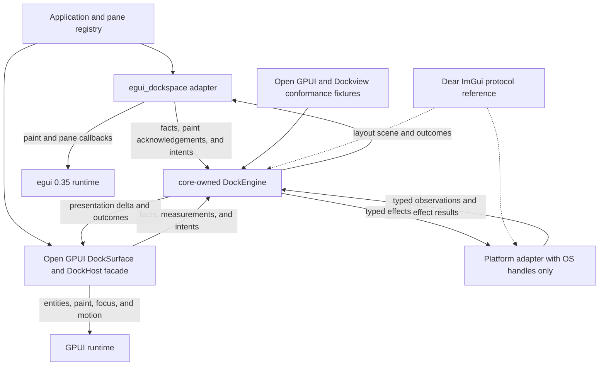
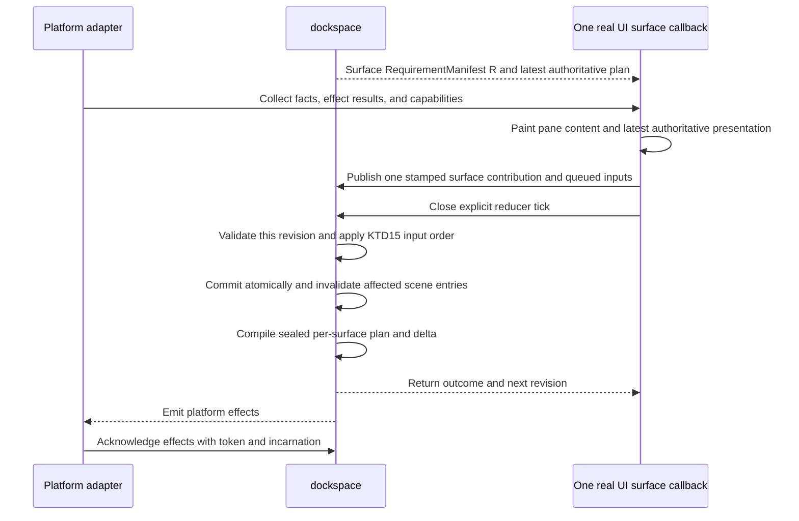
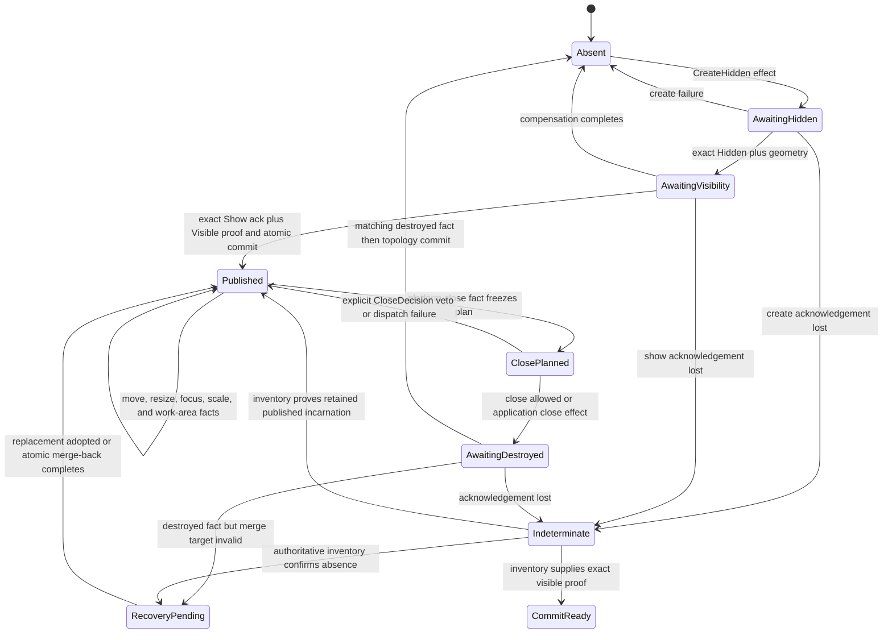
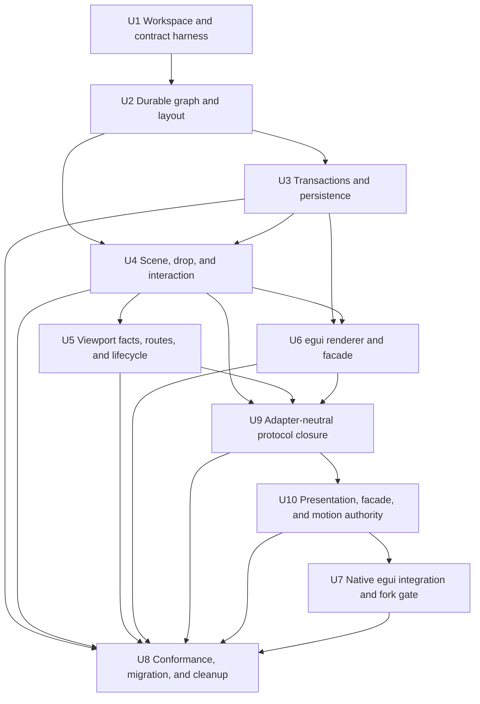

# Headless Dockspace and egui_dockspace Fearless Refactor - Plan

## Goal Capsule

| Field | Contract |
| --- | --- |
| Objective | Replace the current `egui_tiles` bridge with a renderer-neutral `dockspace` state engine, a thin `egui_dockspace` adapter, and renderer-neutral `dockspace_motion` support that together deliver deterministic docking, contained floating surfaces, and native multi-viewport workflows. |
| Authority | User requirements and session-settled decisions override this plan. This plan overrides prior architecture documentation. Open GPUI is the primary semantic source, Dear ImGui is the platform/docking protocol reference, Dockview is a regression corpus, and the current implementation is characterization evidence only. |
| Execution profile | Breaking refactor on a feature branch. Delete obsolete code and APIs. Land reviewable Conventional Commits as dependency-complete units pass their gates. |
| Stop conditions | Stop rather than guess if a change requires publishing, pushing, or another irreversible remote mutation that has not been authorized; if a platform cannot provide an authoritative fact, report the capability as unavailable and take the specified deterministic fallback. |
| Tail ownership | The top-level `ce-work` goal owns implementation, local verification, simplification, code review, commits, and final cleanup. Upstream PR submission and remote publication are separate external actions. |

---

## Execution Update - 2026-07-19

- U1-U5 foundation baselines and the U6 renderer baseline are present, but their completion gates are reopened by this audit. Explicit five-way inner guides, four-way outer guides, all-direction item delivery, and unified contained-title move-or-redock are present; fixture execution, global interaction convergence, projection authority, vacancy/focus lifecycle, and adapter-neutral conformance remain incomplete.
- The basic upstream-egui example builds and remains running without a panic. Visual desktop capture is unavailable in the current automation environment, so this is a startup result rather than a completed visual QA claim.
- The current `native` feature and public presentation mode do not form a production native multi-viewport call chain; existing fake-provider tests and the single-space Open GPUI graph/layout spike are evidence scaffolding, not a runnable full docking-plus-multiview example or interaction parity proof.
- The U7 fork evidence gate is resolved: upstream egui/eframe 0.35 can support truthful degraded native lifecycle, but it does not expose the complete typed snapshot/acknowledgement set required for exact cross-window hover, capture, incarnation, destruction, and pass-through causality. Full native support therefore requires a fresh minimal upstream-based fork seam; U7 still minimizes its shape through provider conformance rather than porting the old patch.
- A post-U6 maturity audit found four blockers which now precede native integration: fail-closed drag-source routing, durable pointer pass-through restoration, atomic full-surface-roster recovery, and moving contained-title drag state from the egui facade into the core.
- Deterministic tab-strip overflow and complete complex-floating gesture coverage are also required before U6 is considered mature. The current topology remains the selected architecture; Dockview's DOM ownership and anchor-group model are not adopted.
- The current implementation is classified as a high-correctness-oriented headless docking prototype, not yet as a mature Dear ImGui docking plus native multi-viewport product. The validated graph, checked-command, transaction, layout, and persistence foundations remain; `engine/frame/scene/drag` boundaries and egui host-frame orchestration are explicitly open to fearless replacement rather than compatibility repair.
- `repo-ref/open-gpui/crates/gpui_docking` is the authoritative GPUI behavior, public-facade, focus, close, route, tear-off, and interaction-feel source. Its GPUI runtime ownership, 16 ms outside-release polling, radial guide selection, best-valid-after-rejection resolver behavior, and platform fallback heuristics are adapter evidence or defects to correct, not semantics to copy into `dockspace`.
- Native integration cannot begin until one adapter-neutral interaction protocol, a complete scene requirement manifest, revisioned cross-surface publication with explicit reducer ticks, and a minimal second adapter pass the same Open GPUI-derived conformance traces. This is U9 and is a hard dependency of U7 rather than a post-native cleanup task.

---

## Product Contract

### Summary

Build `dockspace` as the single authoritative docking model and state machine. Build `egui_dockspace` as its egui renderer and native viewport adapter. Add `dockspace_motion` only after presentation identity stabilizes, as reusable math/runtime without a framework clock or scheduler. The result must retain the mature docking behavior found in Open GPUI and Dear ImGui without importing renderer state, DOM ownership, implicit global state, or fallible remove-then-insert mutation paths into the core.

### Problem Frame

The current crate combines persistent layout, temporary interaction state, frame geometry, egui rendering, platform inference, persistence, and filesystem debugging inside one mutable bridge. `egui_tiles` and the bridge can both mutate topology, while cross-host operations extract source content before target insertion is known to succeed. This creates real pane-loss paths, render-order-dependent behavior, ambiguous release ownership, malformed-state panics, and mixed-DPI coordinate errors.

The prior direction was useful in proving desired UX and discovering missing egui platform capabilities. It is not a sound state ownership model. Correctness now requires a new core boundary rather than further patches to the bridge.

The replacement does not mean deleting the Open GPUI product layer. Its `DockSurface`, `DockHost`, panel factory, entity/focus lifecycle, rendering, motion executor, accessibility mapping, native-window integration, and DevTools hooks remain a framework facade. Graph, commands, transactions, drop resolution, interaction, viewport sagas, and persistence move behind that facade incrementally. Production may have one graph authority only; dual engines are restricted to differential tests.

### Actors

- A1. Application integrator: constructs a workspace, supplies pane identities and pane UI, persists layouts, and chooses docking policy.
- A2. Renderer/backend integrator: translates framework input and platform observations into typed facts, paints a core-produced scene, and executes typed effects.
- A3. End user: rearranges tabs and splits, tears content into contained or native surfaces, re-docks across surfaces, resizes regions, and closes or restores surfaces without losing content.

### Requirements

**Headless model and correctness**

- R1. `dockspace` must have no dependency on egui, eframe, egui-winit, Open GPUI, winit, DOM concepts, native window handles, or renderer callbacks.
- R2. The core must model stable item and dock-space identities, generational runtime node identities, N-ary split nodes, tab stacks, central regions, and validated presentation ownership that keeps dock-space roots, logical surfaces, contained floating placements, and native window incarnations distinct. Tab selection is stored by item identity with explicit deterministic MRU history; moving a stack preserves item order, selection, and history.
- R3. Every topology mutation must enter through a checked command or transaction that stages changes, validates invariants, and either commits completely or leaves the observable workspace unchanged.
- R4. The core layout solver must deterministically honor axis, ordered children, normalized weights, minimum and maximum extents, central-region semantics, and splitter constraints. Pane visibility is expressed by explicit topology or application content policy; the core does not carry a speculative hidden-node state.
- R5. Persistence must use a versioned renderer-neutral schema, preserve stable selection/MRU and presentation preferences, reject malformed or unsupported input without panic, detect cycles, invalid history, and duplicate ownership, resolve pane IDs through an application registry, and replace live state only after complete validation.

**Interaction and multi-viewport protocol**

- R6. `DockEngine` must own the complete active-surface roster, core-derived semantic manifests, and a latest-authoritative set of independently revisioned surface scenes. A render callback paints its latest sealed or explicit bootstrap/stale presentation, publishes measured facts only for the next surface revision, and closes a reducer tick before returning; it never changes the geometry currently being painted. Missing facts make dependent operations `Unavailable`, and a deferred child callback progresses without waiting for a root or sibling callback.
- R7. Preview and delivery must share one resolved drop-target representation and policy path. Delivery must revalidate source, target, policy, and scene generation before committing.
- R8. Drag sessions must have explicit device, pointer, button, session, and source identities plus generations, consume at most one authoritative matching release, and define cancellation for stale or unknown button state, authoritative capture loss, vanished content, unavailable targets, source closure, and explicit cancellation. Local callback blur, `PointerGone`, or absence is surface-local unknown authority rather than global cancellation.
- R9. Coordinate, scale, time, frame, surface, platform-window, and effect identities must be distinct typed concepts. Cross-surface calculations must never mix surface-local logical points with desktop physical pixels implicitly.
- R10. Platform knowledge must distinguish `Unknown`, authoritative `Known(None)`, and `Known(Some(value))`. The default policy must not infer hovered windows from rectangle area, focus recency, pointer deltas, elapsed-time thresholds, or window ordering.
- R11. Native surface lifecycle must use a core-owned coordinator and effect ledger with window tokens, incarnations, workspace epochs, and `Requested`, `DispatchFailed`, `ObservedApplied`, `Unsupported`, `Indeterminate`, and destroyed-result phases. Create, visibility, and close transitions preserve ownership until matching observations permit an atomic commit or compensation. Native creation is staged `CreateHidden -> HiddenGeometryObserved(g_hidden) -> ShowRequested(after = g_hidden) -> ShowAcknowledged(g_ack) -> VisibleObserved(g_visible) -> RevalidateAndCommit`. Commit requires a typed `VisiblePresentationProof` binding the exact viewport incarnation, hidden baseline, `ShowWindow` effect ID, exact provider acknowledgement, and presentation generations with `g_visible >= g_ack > g_hidden`; a first-ready, unrelated, unacknowledged, or late visible observation cannot move topology. The uncommitted empty window remains unpublished and non-routeable. Definitive show failure cleans up only the empty window; indeterminate show waits for authoritative presentation inventory without blind redispatch. A lost acknowledgement enters `Indeterminate`; non-idempotent effects are not redispatched until authoritative inventory or cancellation resolves the outcome, and stale results are harmless. Drag-source identity is frozen independently of pointer-hit-test control; missing source pass-through proof fails closed. Pointer-input effects for one binding form one causally ordered property lane: a restore may be queued as the explicit successor of an unresolved enable, and the provider cannot apply that successor before its predecessor terminates. A requested restoration remains a durable obligation until authoritative input observation causally proves restoration, including dispatch failure, indeterminate or lost results, late observations, and multiple pointer holders. A terminal restore report freezes the provider-observation watermark visible at report reduction; a sampled original state captured before that watermark cannot settle the restore, even when its generation is newer than effect issuance, while an exact restore acknowledgement may settle directly. The property-lane tail outlives semantic settlement until its effect terminates, so a later enable remains ordered after every unresolved predecessor. Every observation, including unknown state or acknowledgement, carries the provider capture generation so revocation advances authority rather than permitting stale resurrection. Close and destruction plans use a typed optional-main disposition plus the surface's complete contained-root roster atomically; no arbitrary workspace command or partial-root plan may claim that a composite surface was evacuated.

**egui integration and migration**

- R12. `egui_dockspace` must expose a new pane registry/view contract, workspace builder, frame/show API, style and policy configuration, persistence helpers, and structured capability/status reporting without exposing `egui_tiles` types.
- R13. The adapter must render tabs, tab bars, splitters, empty central regions, explicit docking-guide clusters, drop previews, contained floating chrome, drag ghosts, and focus/selection states itself while the core remains the only mutation authority. Every inner cluster is complete (`Center + Left + Right + Top + Bottom`), every outer cluster is complete (`Left + Right + Top + Bottom`), and hit, draw, and future-placement geometry are independent sealed facts. Tab strips preserve an operable minimum width, expose explicit deterministic scrolling and overflow selection, reveal the selected/focused/dragged item, and publish hit geometry only for the visible clipped strip; scroll offsets and menu state remain adapter-transient. Overflow popup state follows the framework's actual popup ownership, including external close or replacement, without reopening from a stale adapter cache. The key which opens a popup cannot activate its first row in the same input edge, and wheel ownership consumes both raw and continued smooth-scroll motion while the pointer remains in the strip or popup so no delta leaks to an ancestor scroller.
- R14. Native egui viewports must support tear-off, cross-viewport preview and delivery, re-docking, close veto, merge-back, focus restoration, and placement clamping whenever the backend reports the required facts. Unsupported facts must disable only the affected operation and expose the reason.
- R15. The workspace must update to egui/eframe 0.35 and Rust 1.92. The old egui fork patch must be discarded. For full native support, rebuild from current upstream the smallest typed, tested backend snapshot/effect-acknowledgement seam required by the already-fired U7 evidence gate; upstream-only mode remains supported with truthful narrower capabilities.
- R16. The UI package must be renamed to `egui_dockspace`, the neutral engine crate must be named `dockspace`, the optional renderer-neutral motion package must be named `dockspace_motion`, and production dependencies, APIs, tests, examples, documentation, IDs, and persistence formats tied to `egui_docking` or `egui_tiles` must be removed or replaced.

**Evidence and delivery quality**

- R17. Open GPUI operation/runtime fixtures and applicable graph, transaction, drop, route, tear-off, vacancy, close, focus, interaction, facade, presentation, and viewport behavior must become typed executable conformance evidence for `dockspace`; formal Open GPUI dependency migration must wait for a portable crate version or pinned remote revision.
- R18. Dockview split/normalization and popup-failure cases may be ported as behavior tests, but DOM ownership, raw windows, global DnD singletons, destructive restore, and threshold heuristics must not enter the design.
- R19. Unit, property/model, integration, documentation, examples, and CI gates must demonstrate item conservation, forest validity, atomic failure, deterministic executable replay, persistence totality, preview/delivery parity, lifecycle idempotence, ownership-aware vacancy, focus causality, presentation parity, and graceful platform degradation.

**Protocol closure and cross-adapter maturity**

- R20. The core must derive a complete semantic scene requirement manifest from the workspace, frozen surface/viewport inventory, policy, and presentation ownership before adapters publish measurements. An adapter may satisfy declared bounds, tab metrics, pane constraints, coordinates, and platform observations, but may neither invent nor omit semantic requirements. An empty or incomplete submission cannot become authoritative `Ready`. A per-surface `PreviewAuthorityDependencies` vector binds the exact workspace, inventory, scene, policy, route, coordinate, scale, work-area, and paint generations actually used by that preview; unrelated viewport facts do not invalidate it globally.
- R21. Exactly one device-independent global interaction session protocol must cover pointers inside a known surface, authoritatively outside every known surface, and `Unknown`. It carries exact pointer/button identity, source sequence, capture ownership, source presentation, and release authority. The legacy release/resolver protocol must be deleted after both adapters migrate; no egui callback or per-surface drag state may remain a second authority.
- R22. The core must own a complete `SurfaceSceneSet` whose entries have independent requirement and scene revisions. Each real framework callback submits one immutable roster-bound surface contribution plus sequenced inputs, and core ingress assigns a monotonic `ReducerTickId` before reducing that tick immediately; it never waits for an inferred all-viewport barrier or time threshold. Cross-tick order is explicit causal order and is not retroactively reprioritized. A callback's measured contribution becomes a next surface revision and cannot satisfy an input in the same tick; input proofs may reference only authority present at tick start, subject to higher-priority invalidation within that tick. A real host epoch may batch several contributions, but absence of that capability cannot be simulated. Fact-only distinct-surface ticks commute in canonical scene/effect state; input-bearing ticks are compared only at fixed tick placement and use KTD15 total ordering. Workspace/inventory/policy changes mark every no-longer-satisfied entry `Stale` or `Bootstrap`. Local `PointerGone`, blur, or callback absence becomes surface-local `Unknown`; it cannot cancel a global session while authoritative global pointer/capture facts keep that session alive.
- R23. `DockPolicy` must express dock class and source/item/target compatibility, no-undocking, axis-specific resize, tab-bar visibility and interaction, close and deferred-close capability, central-node restrictions, and presentation-mode permissions. Adapters may visualize policy outcomes but must not add framework-private docking semantics.
- R24. A graph commit must publish final semantic topology, stable visual identities, `PresentationDelta`, and transition cause immediately, but geometry is authoritative for interaction only after required measurements seal the new presentation. Before that, the core exposes an explicit provisional non-interactive plan. Spatial motion waits for measured final geometry. Adapters always paint final interactive content at the same measured rectangles used for hit testing; any spatial transition is a pointer-transparent decorative snapshot/outline that cannot be the only visible representation of a control. Drop-target identity changes animate only non-spatial presence at the new fixed bounds. The core owns no clock, interpolation progress, animation-frame scheduling, framework animation handle, or animated-position hit test.
- R25. Framework-facing stable item identities must map to core identities through an explicit persisted bijection. Open GPUI string `DockItemId` values must never be assigned numeric `ItemId` values by runtime enumeration, sort order, or current graph traversal; add/remove/reorder and process restart preserve the mapping.
- R26. Every committed topology transition must atomically derive a complete `SurfaceRosterDelta`. When cross-surface delivery or tear-off vacates a source presentation, the delta binds its exact viewport incarnation and window ownership. A core/runtime-owned child may emit `ReleaseChild`; an external or root host only unbinds or refreshes its dockspace presentation and is never closed by the core. Vacate clears active route, preview, focus, pass-through lease, and drag-source state while installing or advancing an incarnation-bound retirement tombstone, so a later platform close is an idempotent retirement observation rather than unexpected destruction or duplicate recovery.
- R27. Cross-surface authority must preserve coordinate provenance as `GlobalPhysical`, `TrustedHoveredLocal`, exact `EventReceiverLocal`, or `SourceLocalOnly`, together with exact viewport binding/incarnation, surface scene revision, platform-facts generation, pointer identity, and drag session. The authority lattice distinguishes `Unknown`, trusted outside-all-surfaces, exact target, opaque blocker, unavailable, and rejected. Preview replacement and invalidation return every affected surface for deterministic repaint/cleanup, and structured reasons retain provenance. Focus or creation order is never default authority.
- R28. The core must coordinate viewport activation and pane focus separately. Platform snapshots expose one provider-generated `FocusObservationGeneration` envelope containing a globally consistent focused-window authority (`Dock(binding)`, `Foreign`, `None`, or `Unknown`), not contradictory independent booleans. Global focus observation and window-activation control are separate capabilities. An exact current focus binding depends on inventory/lifecycle identity, not pointer routeability, coordinates, scale, or presentation readiness. The core records three distinct per-surface states: no history, `PanelFocus::Item`, and explicit `PanelFocus::None`. It owns explicit activation requests bound to exact incarnation, observation baseline, and monotonic `ActivationGeneration`; only explicit activation may request platform focus. Ordinary platform activation may restore pane history only when a core-derived gate proves there was no authoritative mouse-down in the same platform snapshot and this is not the one-shot OS fallback after the previously focused viewport was destroyed; explicit activation bypasses that gate. `CloseRecovery` is observe-only: it applies or records pane intent without raising a window, and may act immediately only when its target is already the authoritative focused dock window. Drop and tear-off freeze the core panel-focus record before mutation and carry an item only when it belongs to the exact payload; stale or out-of-payload focus becomes explicit `None` rather than selected-tab inference. Source priority `CloseRecovery > ExplicitViewportActivation > PlatformActivation` applies only to same-generation pane-intent conflicts; any later explicit activation or global focus observation supersedes older recovery intent. `EngineTransition` publishes one aggregate `FocusDelta` for activation, pane-intent install/clear/supersede, effect settlement, and cleanup; adapters consume only that delta and return exact pane-focus acknowledgement. Pane focus waits for causally newer matching backend confirmation where activation was requested, no item is guessed from tree order, and internal reducer generations alone never make published state or `FocusDelta` appear changed.
- R28a. Installing `PaneFocusIntent::Item` atomically validates exact membership and selects the item's containing tabs node as a core-owned reveal prerequisite before the adapter can focus it, matching Open GPUI's select-then-focus behavior. Selection is neither pane-focus observation nor acknowledgement. `CloseRecovery` performs this reveal only when its observe-only request becomes an active pane intent on an already-authoritatively-focused target. Stale membership or rejected selection clears the intent structurally; an unavailable adapter focus target leaves the valid intent pending and never permits selected-tab, tab-chrome focus, or a request call to masquerade as acknowledgement.
- R29. A sealed `PresentationPlan` must describe pane, tab bar, tab label, splitter, contained-floating outer/title/content, focus region, overlay anchor, drop body/insertion/payload, guide, and ghost records with stable structural visual ID, semantic/draw/hit bounds, measurement authority (`Provisional` or `Measured`), and explicit layer. Paint, hit testing, accessibility, debug inspection, and motion derivation consume the same records. Exact measured facts replace provisional layout; an interaction requiring exact geometry cannot fall back to an estimate. Layer order is `Content < ContainedFloating < CommittedTransition < DropBody/Insertion/Payload < Guides < Ghost`; overlapping floating targets use only explicit stack/occlusion facts, never area, traversal order, or node ID.
- R30. The ordinary `egui_dockspace` and retained Open GPUI facades must support item/surface-centric build, show, open, select, close, float, dock, raise, query, persist, and typed viewport readiness/open/close outcomes such as `Opened`, `Reused`, `Replaced`, and `Unavailable`. Ordinary application code must not depend on runtime `NodeId`, `DockEngine` internals, provider types, effect-ledger types, or FSM modules; a clearly named advanced read-only/query escape hatch may expose stable snapshots. Durable layout and viewport-placement sidecars exclude live tokens, incarnations, proofs, and animation state.
- R31. A logical surface owns zero or one main root plus zero or more contained roots, and remains valid without a main root while contained membership is non-empty. Moving or closing the main root never implicitly promotes a contained root by z-order, tree order, focus, MRU, or area. Promotion is an explicit typed command naming the exact contained presentation; otherwise the stable surface remains rootless, and only evacuation of its final root removes the logical presentation. Validation, persistence, layout, manifests, close/recovery rosters, and vacancy decisions use complete membership rather than treating the main root as an anchor identity.
- R32. `SurfacePresentation.contained` is the sole durable owner and back-to-front order for contained floating identities. A floating record stores only root and geometry; it does not duplicate its map key, owner surface, or numeric z-order. Creation and transfer use typed `Front`, `Before(id)`, or `After(id)` positions; raise stably moves the identity to the roster end; recovery appends the frozen source roster as one contiguous order-preserving block. Missing, self, or wrong-surface anchors reject atomically. Persistence stores membership/order only in each surface roster, scene layers derive from roster index, and no `max + 1`, z collision, overflow, or compaction protocol exists.

### Key Flows

- F1. Frame projection and render: the core exposes the latest authoritative `SurfaceSceneSet` plus a semantic requirement manifest for each roster entry. A viewport callback paints pane content and that latest presentation, then submits one immutable next-revision measurement/paint-ack contribution plus its semantic inputs. Core ingress assigns `ReducerTickId`. Inputs reduce in KTD15 order against tick-start scene authority, with same-tick higher-class invalidations applied; the newly measured contribution cannot authorize them. After the atomic input transition, the contribution installs only if its manifest dependencies still match, otherwise it becomes stale/bootstrap. Fact-only distinct-surface ticks commute, while input-bearing tick placement is explicit causal order. Deferred egui callbacks never wait for root or siblings. Stale projection disables only hit graph/actions; pane content still paints.
- F2. In-surface docking: a tab or subtree drag opens the one global device-independent session, activates the frontmost complete guide cluster from the current authoritative scene, paints every payload-eligible guide, resolves one geometric winner using exact half-open guide-button or visible tab-gap hits, validates only that winner, paints that exact future placement, and commits the same target on the matching release. A rejected winner remains visibly unavailable and cannot fall through. Pointer presence inside a cluster but outside every button produces a guide-only affordance and no deliverable preview. A contained-title drag freezes its presentation identity, source rectangle, initial global pointer, minimum size, and one optional new-presentation identity offer in the core; exact docking always wins, while authoritative outside-target state produces a core-calculated contained move or creation fallback selected only by explicit policy.
- F3. Tear-off and cross-surface docking: the same global session represents an exact target, authoritative outside all registered surfaces, an opaque blocker, or unknown authority without switching protocols. A valid outside release freezes the Open GPUI-compatible source fingerprint, grab offset, source size, pointer anchor, coordinate provenance, and optional native identity/geometry offer while leaving payload ownership unchanged, then requests a hidden native surface. Matching geometry readiness requests visibility but still leaves source ownership unchanged and the empty target non-routeable. Only a matching authoritative visible observation triggers final source/policy revalidation and the atomic move; definitive show failure cleans up the empty window, while indeterminate show waits for authoritative presentation inventory without redispatch. Replacement, destruction, or source invalidation before commit clears the reservation and compensates the empty window. Later exact hover or event-receiver authority over another ready surface resolves and transactionally merges the payload back. The same commit derives source vacancy: runtime-owned empty children retire, external/root hosts only unbind, and every source-bound route, preview, focus, and lease is cleared.
- F4. Native close: an OS close request creates a frozen full-surface-roster plan without mutating topology and produces a named `CloseDecision`. The plan gives the optional main root and every contained member an explicit atomic disposition plus recorded `PanelFocus` intent. A root-viewport veto maps to one `CancelClose` request; a child-viewport veto keeps submitting the same viewport, while acceptance removes it from the next viewport roster only after the full disposition is valid. Only an enhanced provider's matching destroyed observation may advance `ObservedApplied` and commit the revalidated roster transaction. Dispatch failure, stale incarnation, invalid target, unavailable recovery host, or missing source/target coordinate provenance retains the complete logical surface for replacement or later atomic recovery; generic "re-render" is not a close acknowledgement. Recovery converts each contained rectangle from its exact frozen source coordinate space into acknowledged target-local geometry, clamps it to acknowledged target bounds, and appends the stable source roster as one contiguous front block above every existing target floating. A rootless roster merge moves only its contained forest. Recovery never copies cross-surface local rectangles, guesses DPI, allocates numeric z values, or invents a main root. It restores recorded focus only after exact backend activation and never selects by tree order.
- F5. Restore: the application decodes a snapshot, resolves item IDs, validates the complete candidate workspace and placements, then atomically swaps it into service or returns a structured error with every durable and transient state unchanged. Success increments `WorkspaceEpoch`, invalidates all prior scenes, sessions, routes, close/tear-off plans, and effects, then emits reconciliation effects; late old-epoch window creation is compensated with close. Retired-window obligations outlive repeated restores: unresolved pointer-input restoration and emitted close/release cleanup migrate as explicit new-epoch obligations without losing their causal predecessor or blindly redispatching a non-idempotent effect, and authoritative inventory/effect evidence remains able to settle them. A retained child may rebind only when its complete recovery contract is revalidated and migrated to the new incarnation; otherwise restore must retire it rather than preserve a host whose later destruction cannot recover its roster.
- F6. Capability degradation: capability is reported as structured `Supported`, `Unsupported(reason)`, or `Unknown` status per operation. `Unsupported` disables native tear-off before drag and exposes no invalid native target; `Unknown` during an active operation cancels it with a structured reason. The adapter never silently changes the requested presentation mode. An application may opt into the separately named contained-floating fallback policy and owns any user-facing message.
- F7. Contained floating: an explicit command or opted-in fallback creates a stable contained-floating presentation at a typed roster position on a logical surface, clamps it to acknowledged bounds, and raises it only from explicit contained activation as a stable move to the back-to-front roster's end. Pointer activation, raise, and gesture arm share one reducer tick and scene proof; a rejected raise cannot start a gesture against an occluded source. The surface roster is the only owner and stack-order authority, while transient hit/paint layer is derived from roster index; a floating record owns only an arbitrary split/tabs root and rectangle. Move, resize, close-veto, re-dock, and empty-root cleanup use the same engine transaction boundary as tiled docking, and contained presentations remain surface-level siblings rather than recursively nested presentation nodes.
- F8. Presentation and motion: a committed graph change immediately produces final semantic topology, a provisional non-interactive plan when measurements are stale, and a cause such as `DropCommitted`, `SelectionChanged`, or `SurfaceRecovered`. The next manifest-complete contribution seals measured final geometry and a spatial motion destination. The adapter paints final interactive content at measured final hit rectangles; a pointer-transparent decorative snapshot/outline may move from the previous sample without hiding the final interactive representation. Provisional records may animate only non-spatial feedback. New measured transitions retarget decorative samples from their current position; direct drag/splitter tracking remains 1:1, unrelated drop identities never spatially interpolate, and reduced motion displays the final sample immediately.
- F9. Viewport activation and focus: a typed platform envelope first establishes one global focused-window authority and provider-owned `FocusObservationGeneration`. Exact focus binding validity is checked against lifecycle inventory independently of pointer routing and geometry. Explicit viewport activation, platform activation, and close-recovery pane intents enter with exact binding, `ActivationGeneration`, and source priority used only for same-generation conflicts. Only explicit viewport activation requests platform focus when needed and retains pane intent until a causally newer matching observation confirms the exact incarnation. Platform activation consumes observation only and restores history only when the same authoritative snapshot has no mouse-down and no one-shot destroyed-previous fallback suppression. Close recovery is `ObserveOnly`: it never raises its target, freezes pane intent from the core's per-surface record at the close edge, maps missing or invalid recorded focus to explicit `PanelFocus::None`, and applies immediately only when that target is already authoritatively focused. Drop and tear-off freeze payload-contained pane focus before graph mutation and carry it through prepare, visibility, and commit. A later explicit activation or global focus observation supersedes older recovery intent even if that recovery window becomes ready afterward. Rebind, vacate, close, foreign focus, and stale incarnation deterministically clear pending intent. Every install, clear, supersede, effect settlement, and cleanup enters the transition's aggregate `FocusDelta`; the adapter applies it and reports exact pane acknowledgement without inspecting internal reducer outcomes.
- F9a. When an item pane intent becomes active, the same engine candidate selects its exact containing tabs node so the pane will be rendered; failure rolls back or clears the focus transition atomically. The adapter then addresses the pane's explicitly registered focus target and reports acknowledgement only after a later real focused observation. `PanelFocus::None` likewise requires a real pane-focus-none observation rather than inference from selection or window focus.

### Acceptance Examples

- AE1. Given a cross-root move whose target insertion conflicts or violates policy, when delivery is attempted, then the command returns an error and every source item, root, selection, and placement remains unchanged.
- AE2. Given a release from drag generation N after generation N has been cancelled or replaced, when that release arrives, then no command or platform effect is produced.
- AE3. Given platform hover is `Unknown`, when a pointer is geometrically inside another native window, then the core does not infer that window as a target and reports cross-viewport delivery unavailable.
- AE4. Given two viewports on monitors with different scale factors, when a desktop-physical pointer is mapped into a target surface, then conversion uses the target's acknowledged origin and scale exactly once and resolves the expected logical drop zone.
- AE5. Given native window creation fails, or succeeds after the source moved, closed, or was superseded, when the tear-off saga revalidates, then the payload remains singly owned at its current source and any empty created window receives exactly one compensating close effect.
- AE6. Given a snapshot with an out-of-range node, cycle, duplicate item owner, invalid weight, or unknown schema version, when restore runs, then it returns a typed validation error without panic or live-state mutation.
- AE7. Given a preview resolved from sealed scene generation G and acknowledged as painted, when any source, target, policy, scene, or workspace-epoch precondition changes before release, then delivery rejects the stale preview; it never commits a target the user did not see.
- AE8. Given non-closeable content receives an OS close request, when policy vetoes closure, then a root viewport emits one matching `CancelClose` request while a child viewport remains in the next submitted roster; neither path mutates content ownership, and only a matching enhanced-provider destruction observation may prove closure.
- AE9. Given a surface revision lacks any fact required by its core manifest, when release arrives, then the dependent operation deterministically resolves `Unavailable`; it never waits for another callback to complete that revision, and no partial scene or late fact can reopen it.
- AE10. Given an active matching drag and authoritative `Known(Released)`, when the sealed and painted scene resolves an eligible target, then an exact visible guide-button hit is the unique geometric winner; an exact tab gap participates only when no guide button is hit. A rejected winner remains visibly unavailable and never falls through to another guide, tab gap, root, or lower occluded surface. Cluster activation uses declared scene z-order and stable structural identity only; an overlapping local inner button wins over its matching outer button. When payload removal will consume its complete source root, that root and its exact contained presentation occlusion are excluded from this query while every other occlusion remains authoritative. Partial payloads and central roots are never excluded. `Known(None)` may tear off only under an explicit native or contained presentation policy; `Unknown`, capture loss, or missing placement cancels without inference.
- AE10a. Given a single-tabs root, when its guide activates, then exactly one inner five-way cluster is visible and its four edge buttons split the root; no semantically duplicate outer cluster is published. Given a nested leaf, all four local edge buttons remain present even when that leaf touches any root boundary, and the root may additionally publish one complete four-way outer cluster.
- AE11. Given a create effect becomes `Indeterminate`, when another callback or explicit maintenance tick occurs, then the engine does not redispatch creation; it waits for authoritative inventory or explicit cancellation, then either adopts the matching incarnation or issues exactly one compensation.
- AE12. Given a contained-floating root is moved, resized, focused, veto-closed, or re-docked, then its stable presentation ID and single item ownership are preserved, placement is clamped to acknowledged bounds, stack order changes only from explicit focus input as a stable roster move, and an empty presentation is removed atomically. One title-bar drag owns both an exact dock candidate and an exact move fallback: an acknowledged dock target wins, otherwise release commits the last acknowledged translated placement. Existing contained presentations remain movable when creation of new tear-offs is disabled. A new contained presentation reserves identity at most once per drag session, retains that reservation across frames with no fallback, and recomputes geometry from the current pointer instead of reusing stale placement. Complete contained-root drags suppress the smaller tab ghost. No separate dock grip, distance threshold, pointer speed, dwell timer, or modifier inference selects between outcomes.
- AE13. Given a native window whose surface owns an optional main root and multiple contained members is accepted for close or unexpectedly destroyed, then a typed retain, prevent, or merge-back disposition freezes every root and the complete roster moves atomically, or the unchanged logical surface remains recoverable for replacement. The recovery target cannot be the closing surface, and no arbitrary workspace command may stand in for main-root disposition. Recovery across different bounds or scale factors uses one batch-frozen source/target coordinate-and-scene dependency and clamps every converted rectangle. When merge-back converts a source main root into a contained presentation, the block appended above every existing target floating is exactly `converted main, A, B...` in frozen source-roster order; a rootless source appends only `A, B...` and never invents a main root. It fails closed on missing or changed placement facts, never on numeric stack exhaustion. If the recovery host is not ready, one queryable pending surface roster owns all roots; a matching replacement incarnation may explicitly adopt that roster without moving it through a partial command, and no partial recovery may claim completion. Unplanned root-host destruction unbinds runtime presentation without deleting the logical roster, so the same surface can be registered again; content is never orphaned, hidden behind another recovered member, or placed outside acknowledged bounds.
- AE14. Given keyboard or accessibility input, then tab focus/activation/close, arrow/Home/End tab navigation, Escape drag cancellation, and splitter adjustment produce the same sequenced semantic inputs as pointer interaction; accessibility nodes expose selected, closeable, focused, and adjustable state from the sealed scene.
- AE15. Given a cross-surface drag whose source cannot be proven pointer-pass-through, then the source binding remains explicit and routing is unavailable rather than being published without a source. Input mode is derived only from the accepted typed observation stream, independently of geometry readiness. Once pass-through may have been requested, restoration remains pending across failed, indeterminate, lost, or late results; the last holder immediately queues one idempotent restore after the enable on the same property lane, and only a causally newer authoritative observation of the original mode clears it. Concurrent pointer holders cannot restore early, and a generation-bearing unknown observation revokes authority without allowing an older fact to resurrect it.
- AE16. Given more tabs than the available strip can display at the operable minimum width, then tabs are not compressed into zero-width select or drag regions. Explicit scrolling and overflow selection reveal the selected/focused/dragged tab, hidden tabs publish no hit regions, and every visible closeable tab retains distinct select/drag and close geometry. The overflow selector has an acknowledged bounded viewport and deterministic vertical scrolling; only each measured row rectangle clipped to that viewport may receive pointer input. With at least 50 tabs in a small viewport, every item remains reachable by pointer, keyboard, and accessibility action. While the foreground selector overlaps a tiled or contained-floating tab strip, its viewport owns wheel and pointer input so the occluded strip cannot scroll or activate.
- AE17. Given an empty or incomplete surface fact submission labeled ready, when its callback closes the explicit reducer tick, then validation against the core-generated requirement manifest leaves that surface incomplete/bootstrap with no authoritative target. Its preview proof cannot be reused after any dependency in its per-surface authority vector changes, while an unrelated viewport generation does not invalidate it.
- AE18. Given fact-only contributions for distinct surfaces arrive in any tick order with no intervening semantic input, then final canonical scene/effect state and normalized affected-surface set are identical. Given an input-bearing callback, its core-assigned `ReducerTickId` is causal: moving a target fact from before to after a release may intentionally change commit to `Unavailable`, and a later higher-class input cannot rewrite the committed earlier tick. Within one tick, equal source sequences from different sources are ordered by stable source ID and a duplicate sequence for one source is rejected. A deferred child progresses without a root callback, while local `PointerGone`, blur, or callback absence affects only that surface's authority.
- AE19. Given pass-through enable effect E is requested and a restore becomes logically necessary before E is observed, then exactly one idempotent restore effect R is queued immediately with `after = E` on the same binding's pointer-input property lane. The provider treats dispatch failure as terminal for ordering and never applies R before E terminates, while lost or unknown acknowledgement of E cannot block R. A pre-existing authoritative pass-through state needs neither E nor R; otherwise routing requires either exact E acknowledgement or a pass-through observation whose provider generation is causally newer than E's request baseline. The obligation clears only when an authoritative observation causally proves R restored the original typed input mode, so a late enable can never leave the window permanently non-interactive.
- AE20. Given projection authority becomes stale while a pane remains selected, then the adapter still invokes and paints the pane UI using the available presentation geometry. Until a current sealed hit graph exists, docking, close, selection, resize, and drop actions from that projection are suppressed rather than suppressing application content and relying on a framework discard pass.
- AE21. Given the same Open GPUI-derived route, tear-off, close, focus, and drop traces run through egui and a minimal in-memory adapter, then both produce identical core transitions and failure outcomes without either adapter owning topology or a second drag state machine.
- AE22. Given stable Open GPUI item IDs A and B, when items are inserted, removed, reordered, restored, or enumerated in a different process order, then their persisted core-ID mapping remains unchanged and collision-free; no transient enumeration determines identity.
- AE23. Given the core-owned global drag protocol observes an authoritative matching release outside every registered surface plus a policy-approved native geometry/identity offer, then that same session creates one native tear-off request preserving grab offset, source size, and pointer anchor. `Unknown`, stale binding, mismatched device/button, or missing offer produces no native request. After migration, no legacy input variant is needed for this successful path.
- AE24. Given cross-window delivery or native tear-off commits and vacates the source presentation, then the same atomic transition emits one exact ownership-aware roster delta, clears every active source-bound route/preview/focus/lease, records an incarnation-bound retirement tombstone, and retires only a runtime-owned child window. An external or root host remains open and merely unbinds or refreshes; a later close observation is idempotent and cannot recover already-delivered content.
- AE25. Given trusted hovered-window authority is unavailable but the receiving native callback provides exact local event provenance, then `EventReceiverLocal` may resolve only for that callback's current viewport binding/incarnation, scene revision, facts generation, pointer, and drag session. A stale callback or opaque blocker cannot deliver. Replacing or cancelling the routed preview returns both old and new affected surfaces for repaint cleanup.
- AE26. Given explicit viewport activation, platform activation, or close recovery contributes pane intent in one causal generation, then priority is `CloseRecovery > ExplicitViewportActivation > PlatformActivation`, `PanelFocus::None` blurs rather than guessing, and no-history is a distinct no-op state. Exact lifecycle binding remains valid through a coordinate or presentation-readiness gap and is not cancelled merely because pointer routing is unavailable. Only explicit viewport activation may emit `RequestFocus`; pane intent then waits for a matching exact-incarnation observation whose provider generation is newer than the request baseline. Ordinary platform activation with an authoritative mouse-down does not steal focus from the clicked chrome/tab by restoring old pane history, and the OS fallback after the previously focused viewport is destroyed is suppressed exactly once; explicit activation bypasses both gates. Close recovery never emits `RequestFocus`; if its target is not already the authoritative focused dock window it records state without raising or immediately focusing that pane. Given recovery A exists and the user later activates B, then B advances `ActivationGeneration`; A becoming ready afterward cannot focus A, reveal a hidden tab, or override the newer dock/foreign focus observation. Every install, clear, supersede, effect settlement, and pane acknowledgement appears in one aggregate `FocusDelta`, while an unrelated input that advances only an internal reducer generation emits no focus change.
- AE27. Given a ready surface contains tiled and overlapping contained-floating content plus an active drop, then its sealed presentation contains stable pane/tab/tab-bar/splitter/floating outer-title-content/focus/overlay/drop/guide/ghost records and the normative layer order. Paint, hit, accessibility, debug, and motion inputs use the same rectangles and IDs; only explicit floating stack/occlusion selects the front target.
- AE28. Given visual metadata such as title or color changes without structural target/zone/scope/payload-index change, then the visual identity and running transition remain stable. A structural identity change terminates or retargets explicitly. `Allowed`, `GuideOnly`, and `Rejected` remain distinct domain states: center may show insertion plus ordered payload tabs, edge omits payload tabs, and rejected stays visible but undeliverable.
- AE29. Given a selected, keyboard-focused, or actively dragged tab is outside the visible strip, then deterministic scrolling or overflow presentation reveals it. Hidden tabs publish no scene or hit record, and tab-strip state resets only when its epoch, structure, style, width, or live identity changes; dead keys are pruned. Real allocated overflow-menu item geometry participates in projection authority, and stale pointer clicks cannot mutate popup state.
- AE30. Given a graph commit invalidates measurements, then topology changes immediately but the plan remains provisional and non-interactive until a matching measured contribution seals final hit geometry. Spatial motion starts or retargets only then. Throughout animation, final interactive content is visibly painted at exactly its authoritative hit rectangle; any moving snapshot/outline is pointer-transparent, decorative, and not the sole visible control. Drag/splitter movement is 1:1, unrelated target identities do not spatially interpolate, reduced motion publishes one final sample with no frame demand, and animated motion emits exactly one terminal sample before demand clears.
- AE31. Given an ordinary application uses either facade, then item/surface APIs cover build/show/open/select/close/float/dock/raise/query/persist and typed viewport readiness/open/close outcomes without naming `NodeId`, internal `DockEngine` state, provider/effect/FSM types, or live placement proofs. Layout snapshots and placement sidecars round-trip independently of window incarnation and animation state.
- AE32. Given payload A and payload B hover the same exact target under different dock-class or item/source/target policy, then the pure policy snapshot returns an explicit allowed or rejected decision with reason for each payload. Preview and delivery consume the same decision; the rejected payload remains visible as rejected and cannot fall through or commit through an adapter callback.
- AE33. Given a selected tab closes, then the most recently selected remaining item is restored by stable identity; if no MRU entry remains, one documented deterministic adjacency rule applies. Moving a whole stack preserves item order, selected item, and valid MRU history, while non-selected pane content remains unmounted except where an explicit application content policy says otherwise.
- AE34. Given a surface has main root M and contained roots A and B, when M is delivered elsewhere, then the same atomic transition keeps the original `SurfaceId` with `main_root = None` and A/B membership unchanged. No contained root is promoted implicitly, the native or contained host remains present, background docking may install a new explicit main root, and moving the final remaining root removes the now-empty surface according to ownership-aware vacancy rules. A separately issued `PromoteContained(A)` preserves A's root identity while consuming only its named floating presentation.
- AE35. Given native tear-off creates a hidden geometry-ready window at presentation generation `g_hidden`, then source ownership remains unchanged while `ShowWindow` is requested with `after = g_hidden` and the empty reservation publishes no routeable scene. `DispatchFailed` or `Unsupported` show results close only that empty window; `Indeterminate` waits for authoritative presentation inventory and never redispatches blindly. Only a typed proof for the exact binding and `ShowWindow` effect, with exact acknowledgement generation `g_ack > g_hidden` and matching visible generation `g_visible >= g_ack`, permits source revalidation and one atomic topology commit. A first-ready, pre-show, unacknowledged, wrong-effect, wrong-incarnation, stale, or conflicting `Visible` observation cannot commit and is compensated. If the source changed or the window was destroyed before commit, the source remains intact and the empty window is compensated; content is never committed to an unproven invisible surface.
- AE36. Given surface S contains A, B, C back-to-front, then raising B yields A, C, B and raising B again is unchanged. Moving B and C to target T at `Front` removes them from S and appends B, C as one contiguous block to T without changing their relative order or identities. `Before/After` a missing, self, or foreign-surface anchor rejects with workspace and persistence bytes unchanged. Snapshot round-trip preserves the roster exactly, old numeric-z snapshots reject by schema version, and repository searches find no durable `z_order`, `ContainedStackKey`, ownership field on floating records, or `max + 1` stack allocation.
- AE37. Given workspace restore N retires a child while its pointer restore or emitted close/release cleanup is requested or indeterminate, when restore N+1 commits in a later reducer boundary, then the retired obligation and property-lane predecessor survive under the new epoch until authoritative inventory or exact effect evidence settles them; a late old-epoch result cannot silently discharge or strand the new obligation. Given restore safely rebinds a retained child, when that new incarnation is later destroyed, then its revalidated recovery contract still atomically retains or recovers the complete optional-main plus contained roster.
- AE38. Given an item, tabs root, or subtree payload is dropped or torn off while one pane inside that exact payload owns recorded focus, then release/prepare freezes that item before mutation and the resulting activation follows it through delivery or native visibility commit. A stale item or focus outside the payload becomes explicit `PanelFocus::None`; selected tab, traversal order, and post-mutation ownership are never used as substitutes.
- AE39. Given a valid pane focus intent names an item hidden behind another selected tab, when the intent becomes active, then core atomically selects that exact item in its containing tabs node and publishes the reveal plus focus delta together. The adapter does not acknowledge until the pane's explicit focus target is actually focused on a later observation. If no focus-target provider exists, the pane remains revealed and the intent remains pending or explicitly unavailable; tab selection and tab chrome focus never complete it.

### Success Criteria

- The final workspace has no normal or dev dependency on `egui_tiles` and no production reference to the old context-data string protocol.
- All core command-sequence tests preserve the exact item multiset and pass strict graph validation after success and after injected failures.
- Upstream-only examples demonstrate tab docking, splits, contained floating, persistence, native lifecycle, and truthful capability degradation. A separate pinned-fork integration harness demonstrates full cross-viewport re-docking, close veto, and mixed-DPI placement when the enhanced fact seam is required.
- A clean checkout can build and test the upstream-egui path without sibling path dependencies. Any enhanced fork integration is isolated, documented, and verified against a local upstream-based fork branch before remote landing.
- Local implementation is complete only when the enhanced provider bridge, fork patch, and portable harness source pass together. A published release may advertise full native cross-window support only after the fork dependency is authorized, remotely resolvable, and pinned; until then crates.io/upstream mode advertises its narrower capability matrix truthfully.
- The project remains labeled a prototype until U9 proves adapter-neutral semantic parity and U7 passes the full Open GPUI-derived native workflow matrix. Rendering polish or a runnable example alone cannot promote the maturity claim.

### Scope Boundaries

**In scope**

- Breaking the complete public API and persistence schema.
- Replacing the existing source tree and examples rather than wrapping it.
- Creating and committing changes in this repository and, when required, in the clean `repo-ref/egui` fork on an upstream-based feature branch.
- Porting owned Open GPUI code and MIT-compatible Dockview algorithms or fixtures with attribution.

**Deferred, not required for local completion**

- Publishing `dockspace`/`egui_dockspace`, pushing fork branches, or opening upstream pull requests.
- Turning the locally verified enhanced-provider bridge into a default or published dependency before its fork revision is remotely resolvable. This is a release-landing gate, not permission to omit the bridge or its full workflow tests locally.
- Permanently switching Open GPUI to the shared crate before `dockspace` has a remotely resolvable version or revision.
- Guaranteeing native cross-window operations on platforms that cannot provide authoritative global placement or hover facts, notably constrained Wayland environments.

**Out of scope**

- Backward compatibility with the `egui_docking` API, legacy RON schema, or `egui_tiles` tree IDs.
- Copying Dockview's DOM architecture or reproducing every Dear ImGui styling detail.
- Building a general-purpose operating-system window manager inside the core.

---

## Planning Contract

### Priority Order

- P0 - Correctness foundation: neutral graph, strict invariants, checked transactions, total persistence, a core-defined complete projection manifest, one global interaction FSM, atomic full-roster lifecycle, causal effect observations, and early Open GPUI/Dockview conformance evidence that prevents the core boundary from drifting toward egui.
- P1 - Product baseline: `egui_dockspace` public API, custom rendering, single-surface docking, split resize, contained floating, and migration examples.
- P2 - Adapter-neutral closure, then native multi-viewport: revisioned surface publication, explicit reducer ticks, and a minimal second UI adapter must pass before typed platform facts/effects, tear-off, cross-window preview/delivery, close/focus/placement behavior, capability reporting, and the evidence-based minimal egui fork decision.
- P3 - Convergence and hardening: final differential audit, legacy deletion, documentation, CI, distribution checks, and review cleanup.

### Immediate Execution Order - 2026-07-19

1. Stabilize and independently re-review the already-active causal lanes without declaring U5 complete: source-binding and scene-provenance fail-closed behavior; pass-through enable/restore ordering including repeated-restore retired obligations; exact focusable binding, platform-restore gates, payload focus freeze, aggregate `FocusDelta`, and the global viewport-activation plus typed `PanelFocus::{Item, None}` coordinator. Resolve tab-overflow findings separately.
2. Perform R31/R32 as one atomic cross-layer migration before finalizing roster lifecycle: remove main-root and numeric-z anchor semantics across model, commands, transactions, persistence V2, scene/manifests, recovery, and egui projection; support rootless surfaces; and make the contained roster the sole owner and back-to-front order authority with typed positioning. Intermediate full-roster recovery code is provisional until this migration passes as a unit.
3. Rewrite native creation around exact visibility proof, then finish the U5 roster lane against the new model: require `VisiblePresentationProof` with `g_visible >= g_ack > g_hidden`, make uncommitted reservations non-routeable, atomically recover `optional main_root + contained roots`, migrate a revalidated recovery contract across safe child rebind, derive ownership-aware `SurfaceRosterDelta` from every delivery, retire or unbind only a truly empty source, and clear binding-scoped state.
4. Complete the U4 semantic requirement manifest, independent per-surface revisions, dependency vectors, core-assigned reducer ticks, and the revisioned host-frame exchange. A real callback may submit only its own surface and close its tick immediately; `publish_all_surfaces` is a conformance helper, never a runtime barrier.
5. Add the private `dockspace_conformance` crate, typed Trace V2 runner, canonicalizer, and minimal in-memory adapter. Prove child-only progress, fact-order commutativity, tick causality, stale contribution rejection, and selected Open GPUI traces before migrating egui.
6. Fearlessly migrate egui to the proven exchange and global interaction session, then delete the dual drag protocol, compatibility resolver, per-surface next-callback queues, and adapter-owned contained drag state in the same milestone. The new delivery path consumes the completed vacancy/retirement coordinator rather than owning a second cleanup protocol.
7. Close policy and presentation correctness: unique geometric winner before validation, exact event-receiver provenance, stale-content rendering, rich pure policy decisions, affected-surface cleanup, sealed presentation/layer authority, item/surface facade, and renderer-local motion integration.
8. Implement the real upstream and enhanced egui native providers, rebuild the fork patch only for the typed missing snapshot/acknowledgement seam, and pass the Open GPUI native workflow matrix.
9. Bound structural cost, seal public exports, complete Open GPUI facade migration evidence, documentation, distribution audits, final Codex review, and cleanup. Motion polish cannot move ahead of lifecycle, route, interaction, and projection correctness gates.

### Context and Research

- The current `src/multi_viewport/mod.rs` owns durable layout, interaction, frame geometry, platform inference, persistence, and rendering. Its deferred-action idea is useful, but detached rendering temporarily removes live state and cross-host moves are not atomic.
- `repo-ref/egui_tiles_docking/src/tree.rs` exposes subtree operations and docking hooks, but insertion can fail by logging and returning `()`. The bridge then reports success after source extraction. `Tree::ui` also combines layout, render, garbage collection, simplification, drag resolution, and mutation.
- `repo-ref/open-gpui/crates/gpui_docking` supplies the strongest model: stable semantic IDs, N-ary graph, layout validation, checked workspace transactions, shared preview/delivery targets, and explicit viewport runtime concepts. Framework geometry, entities, views, and window handles must be removed during extraction.
- Dear ImGui's docking branch separates queued undock/dock phases, uses a central node, renders preview from the same split decision carried into the request, distinguishes platform requests, and prefers authoritative hovered-viewport backend input over its documented flawed fallback.
- Dockview's `dockview-core` remains DOM-driven. Its split solver, same-axis flattening, per-surface roots, serialization samples, and blocked-popup/no-orphan tests are useful; its object model, mutation brackets, destructive restore, raw coordinate math, and DnD thresholds are not.
- Upstream egui 0.35 already provides native mouse-motion events, viewport pass-through commands, close cancellation, all-viewport info, and current winit integration. The old fork's raw-delta integration, fake pointer events, duplicated Glow/WGPU routing, and string context keys must not be ported.

### Key Technical Decisions

- KTD1. Neutral core ownership (session-settled: user-directed - chosen over an egui-only core: the same deterministic model must support egui and future Open GPUI integration). One core `DockEngine` owns durable `Workspace`, interaction state, sealed scenes, viewport coordination, and the effect ledger; adapters own only framework objects, OS handles, and token-to-handle execution mappings.
- KTD2. Rename and break cleanly (session-settled: user-directed - chosen over compatibility wrappers: the user explicitly authorized deletion and breaking changes). The old API and schema receive no compatibility layer.
- KTD3. Remove `egui_tiles` from production (session-settled: user-approved - chosen over deepening the fork: its render loop and mutation authority cannot satisfy atomic cross-surface transactions). Only behavior and painting lessons may be copied.
- KTD4. Use this repository's `repo-ref/open-gpui` fork as the authoritative GPUI behavior and facade source, Dear ImGui as the protocol reference, and Dockview as a test corpus. Preserve Open GPUI's `DockSurface`/`DockHost` product contract and port its route, tear-off, close, focus, and interaction failure semantics into executable traces. Do not copy its Entity/View/Window runtime, outside-release polling, radial guide heuristic, resolver fallthrough, or fallback platform inference into the core.
- KTD5. Use an N-ary validated forest with four independent identity domains: stable application/presentation IDs, generational runtime topology IDs, exact platform binding token/incarnation IDs, and observation/session generations. Titles, tab indices, traversal order, focus state, diagnostic numeric conversions, and `max + 1` scans never derive durable or widget identity. Every root has exactly one presentation owner, every non-empty surface has zero or one main root plus zero or more contained-floating roots, and window replacement does not replace its logical surface or roots.
- KTD6. Use two mutation boundaries. `WorkspaceCommand` is the only durable topology mutation; `EngineInput -> EngineTransition` is the only transient reducer and atomically publishes candidate workspace, interaction, scene, viewport, event, and effect-ledger changes. Adapters never mutate either state class.
- KTD7. Make explicit facts replace heuristics (session-settled: user-directed - chosen over geometric/focus/time inference: state, interaction, and heuristic errors were identified as the highest-risk area). Unknown authority disables the dependent action; optional fallback policies must be separately named and default off.
- KTD8. Bind preview and commit to the same resolved target. Resolution carries source/target identities, operation, split geometry, policy proof, sealed scene generation, workspace epoch, and a renderer acknowledgement that the preview was painted. Release revalidation is mandatory; a changed target is rejected rather than committed unseen.
- KTD9. Separate durable, session, scene, and platform state. Persistence contains only durable workspace and placement preferences; transient input, frame facts, effects, and platform window incarnations never enter the snapshot. Successful restore advances a workspace epoch and reconciles platform state; core persistence APIs encode/decode values and do not perform non-atomic filesystem writes.
- KTD10. Start from upstream egui 0.35 and produce two native integration artifacts. The root workspace contains the provider contract plus an upstream provider that reports only facts it can observe. The required enhanced typed backend-snapshot/effect-acknowledgement seam and bridge live on an independent upstream-based egui fork branch and are verified by a separate pinned integration harness. No ordinary root feature may compile only with an unpublished fork.
- KTD11. Use strict capability-based native behavior. Full cross-window docking is available only when hover, coordinates, placement, and pass-through facts are authoritative. Single-surface and contained-floating workflows remain available everywhere.
- KTD12. Keep Open GPUI's formal dependency migration behind a distribution gate. Local differential tests and source extraction are required now; a committed cross-repository dependency must use a published version or pinned remote revision, never a sibling path.
- KTD13. Raise the workspace MSRV to Rust 1.92 to align with egui/eframe 0.35 and Open GPUI instead of maintaining compatibility shims for Rust 1.88.
- KTD14. Land dependency-complete Conventional Commits autonomously (session-settled: user-directed - chosen over confirmation before each commit: the user authorized intermediate commits for this long refactor). Commits must never include unrelated user changes or non-portable sibling paths.
- KTD15. Serialize engine input through one non-reentrant writer and two explicit order levels. Core ingress assigns each submitted batch a monotonic `ReducerTickId`; tick order is causal and never retroactively reprioritized. Within a tick, the total key is `(InputClass, StableInputSourceId, SourceSequence)`, where class order is `LifecycleControl > PlatformObservation > ApplicationCommand > RendererIntent > Maintenance`, source IDs are stable semantic IDs, and each source sequence must be unique and monotonic. Renderer/application inputs collected while a UI callback paints join that callback's tick, but its newly measured surface contribution is staged for the next scene revision and cannot authorize those inputs. Inputs emitted while reduction, effect-result handling, or committed-event delivery is active defer to a later core-assigned tick. Restore/replace can invalidate lower-class same-tick releases, while a later high-class input cannot rewrite an earlier committed tick.
- KTD16. Select exactly one geometric winner before policy validation. Exact guide buttons precede overlapping tab gaps, an overlapping inner button precedes its outer counterpart, and equal classes use declared scene z-order and stable target ID. Validate only that winner; a policy or transaction rejection terminates resolution and never exposes a lower or occluded candidate. Native versus contained tear-off is selected only by an explicit command/policy and authoritative facts.
- KTD17. Keep enhanced-provider exposure staged. The provider SPI is crate-private until the upstream provider and a second enhanced provider pass the same conformance suite; then only the smallest stable fact/effect interface becomes public. Local implementation completion includes the enhanced bridge and independent harness source, while release readiness additionally requires an authorized remotely resolvable fork revision.
- KTD18. Make projection completeness core-defined. The core emits a semantic requirement manifest before accepting adapter measurements, and a per-surface dependency vector binds exactly the workspace, inventory, scene, policy, route, coordinate/scale, work-area, and paint generations used by a preview. `ReadySurfaceScene` is a validated outcome, not a label an adapter can assert, and unrelated viewport changes do not cause global invalidation.
- KTD19. Keep one global device-independent interaction FSM. Known-surface hover, authoritative outside-all-surfaces, and unknown authority are states of the same session carrying exact device/button/capture identity. The current legacy resolver/release path and adapter-owned contained drag protocol are migration scaffolding and must be deleted in U9.
- KTD20. Use a revisioned per-surface exchange plus core-assigned reducer ticks, not a fictional global frame barrier. Each actual callback submits at most one stamped next-revision contribution and one input batch; semantic inputs resolve against prior authoritative revisions, then the contribution installs if still current. Fact-only ticks for distinct surfaces commute after canonical normalization, input-bearing tick placement is causal, and cross-surface proofs bind exact source/target revisions. A real framework host epoch may batch multiple entries as an optimization, but deferred egui callbacks never wait for a root/sibling callback or timer.
- KTD21. Put motion intent, not animation execution, in the core. `PresentationDelta` supplies stable visual identities, final geometry, and transition cause. Framework adapters own time, sampling, repaint scheduling, clipping, and interpolation; optional shared motion code is renderer-neutral math only.
- KTD22. Preserve the Open GPUI facade while replacing its semantic internals incrementally. `DockSurface`, `DockHost`, panel/entity/focus integration, rendering, motion execution, accessibility, and native-window tooling remain in Open GPUI. Production has one core graph authority; dual Open GPUI and dockspace engines are legal only in differential tests, and each migrated subsystem deletes its prior semantic implementation.
- KTD23. Preserve framework item identity through an explicit durable mapping. Open GPUI's string `DockItemId` is the application key; a persisted bijection allocates or resolves core `ItemId` values without depending on enumeration, ordering, graph shape, or process-local insertion history.

### High-Level Technical Design

The following sketches define ownership and information flow, not exact Rust APIs.

```mermaid
stateDiagram-v2
  [*] --> Idle
  Idle --> Armed: press on draggable semantic region
  Armed --> Dragging: explicit egui drag start
  Armed --> Idle: release before drag start
  Dragging --> Previewing: current resolved target
  Previewing --> Dragging: target becomes Known(None)
  Dragging --> PreparedSurface: valid tear-off release
  Previewing --> Committing: matching release and revalidation
  Committing --> Idle: transaction outcome
  PreparedSurface --> AwaitingHidden: CreateHidden effect dispatched
  AwaitingHidden --> AwaitingVisibility: exact Hidden plus geometry; ShowWindow after g_hidden
  AwaitingHidden --> Idle: dispatch or create failure
  AwaitingVisibility --> CommitReady: exact ShowWindow ack and Visible proof
  AwaitingVisibility --> Compensating: show failure, malformed proof, or supersession
  CommitReady --> Committing: source, policy, binding, and proof revalidated
  CommitReady --> Compensating: revalidation fails
  Compensating --> Idle: empty created window closed
  Dragging --> Cancelled: stale generation, authoritative capture loss, close, or missing source
  Previewing --> Cancelled: stale target or policy
  Cancelled --> Idle
```

### Deterministic Interaction Tables

| Geometric candidate | Exact match requirement | Priority | Same-class tie-break |
| --- | --- | --- | --- |
| Inner guide button, including center | Pointer is inside its exact half-open hit rectangle | 1 | Declared scene z-order, then stable target ID |
| Outer guide button | Pointer is inside its exact half-open hit rectangle and no overlapping inner button won | 2 | Declared scene z-order, then stable target ID |
| Explicit visible tab gap/reorder | Pointer is inside the clipped insertion gap and no guide button won | 3 | Declared scene z-order, then stable target ID |

All hit regions use documented half-open boundaries. Policy and operation validity are evaluated only after this table selects one winner. Rejection ends resolution; it does not restart the table. Candidate area, focus age, pointer delta, elapsed time, callback order, and collection traversal order are never tie-breakers.

| Authoritative release state | Resolved dock target | Presentation policy/capability | Result |
| --- | --- | --- | --- |
| Not matching `Known(Released)` | Any | Any | Keep or cancel the session according to the explicit input; never deliver |
| Matching `Known(Released)` | Eligible `Known(Some(target))` with painted acknowledgement | Dock allowed | Revalidate and commit that exact target |
| Matching `Known(Released)` | `Known(None)` | Explicit native policy and all required facts `Supported` | Start native tear-off saga without moving content |
| Matching `Known(Released)` | `Known(None)` | Explicit contained policy, or explicitly enabled contained fallback | Commit contained-floating presentation |
| Matching `Known(Released)` | `Known(None)` | Native `Unsupported(reason)` and no explicit fallback | Return `OperationUnavailable(reason)` |
| Matching `Known(Released)` | `Unknown`, capture lost, or placement unknown | Any | Cancel with a structured reason; never infer or silently fall back |

| Capability state | Before operation | During operation | Adapter/UI contract |
| --- | --- | --- | --- |
| `Supported` | Expose eligible native operation | Continue while all required observations remain authoritative | Paint only valid targets |
| `Unsupported(reason)` | Disable the affected native operation | Cancel if capability is revoked | Emit structured status; application owns user-visible messaging |
| `Unknown` | Do not advertise the affected operation as available | Cancel the active dependent operation | No heuristic fallback or invalid overlay |

### State Ownership

| Layer | Owns | Must not own |
| --- | --- | --- |
| Durable workspace | Items, nodes, roots, central metadata, selection, split weights, placement preferences | Pointer state, egui IDs, native handles, frame rectangles |
| Interaction session | Drag identity, source snapshot, release ledger, active resolved target | Graph mutation or renderer callbacks |
| Projection compiler | Requirement manifest, per-surface authority dependency vector, final scene geometry, hit graph, stable visual identities, presentation delta and transition cause | Adapter-invented semantics, animation clock, interpolation progress, or inferred platform truth |
| Core viewport coordinator | Capabilities, observed facts, logical surfaces, window tokens/incarnations, close/tear-off plans, pending effect ledger | OS handles or framework callbacks |
| Core activation coordinator | One global focused-window authority, per-surface panel focus, pending activation intent, command-source priority, and close-recovery focus | Framework focus handles, independent contradictory window-focus booleans, or tree-order guesses |
| Platform adapter | OS handles, token-to-handle mapping, effect dispatch, raw observation collection | Pending-effect authority, pane content, or graph ownership |
| UI adapter | Surface measurements, pane callbacks, raw framework responses, paint commands, accessibility mapping, animation clock/sampling, and painted-scene acknowledgements | Independent docking topology, a second drag FSM, animated-position hit testing, or unvalidated cross-surface moves |

`DockEngine` is the only input writer. Adapters enqueue source-tagged inputs; a reduction boundary orders them by declared source priority and monotonic per-source sequence. Event consumers and effect executors cannot re-enter the active reduction and can only enqueue the next batch.

### Core Invariants and Failure Semantics

- The live graph is a forest rooted only by declared dock spaces; no orphan runtime node is valid after a command boundary.
- Every item has exactly one owner. Successful commands preserve the item multiset except explicit add/remove commands; failed commands preserve the complete observable state.
- Split children and weights have equal non-zero cardinality, finite non-negative weights, and a deterministic normalization. Empty and single-child containers follow explicit canonicalization rules.
- A tab stack has no duplicate items and selects either one owned item or none only when empty.
- Scene, drag, release, route, effect, and window-incarnation generations are checked before state changes.
- A scene generation freezes its active-surface roster and core-derived requirement manifest, then transitions once from `Building` to validated `Sealed`; only complete sealed scenes may resolve targets, and late facts cannot reopen them.
- A surface without acknowledged bounds contributes a sealed non-interactive bootstrap scene. It cannot accept preview or delivery until a later generation contains acknowledged bounds.
- Drop resolution chooses one geometric winner according to KTD16 before policy validation. A rejected winner cannot fall through; ties never use area, timestamp, focus recency, or traversal accident.
- Platform effects are idempotent by effect identity. Results for an old incarnation cannot mutate a replacement window.
- A non-idempotent effect in `Indeterminate` is never redispatched until authoritative inventory or explicit cancellation resolves it.
- Create and close are sagas: logical ownership changes only after matching observed platform state and revalidation; every partial external success has a deterministic compensating or recoverable state.
- Every successful workspace transition derives its surface roster delta in the same atomic publication. An empty source presentation is retired according to explicit window ownership; a runtime-owned child may close, while an external/root host only unbinds. Vacated bindings cannot later enter destruction recovery.
- A destroyed root with no valid merge target is owned by a contained `RecoveryPending` presentation on the designated recovery surface, or by a queryable pending replacement when that surface is unavailable; destruction never makes a root invisible.
- Cross-surface local authority is valid only with exact event-receiver or trusted-hover coordinate provenance bound to the current viewport incarnation and scene/facts revision. Route replacement returns affected surfaces, and opaque blockers never fall through.
- At most one backend window is authoritatively focused in a platform snapshot. Pane focus is restored only from an explicit recorded item or `None` after matching activation confirmation, never from topology order.
- Snapshot decode and restore are total over untrusted bytes: all errors are values, and success is the only path that swaps live state.
- A successful restore advances `WorkspaceEpoch`; old inputs, plans, scenes, and routes cannot directly mutate new-epoch state. An old effect result is rejected or compensated unless a typed migrated retired obligation binds that exact effect, incarnation, and causal predecessor, in which case the result may be consumed only as evidence to settle or advance that obligation; it never becomes general current-epoch authority.

### Assumptions

- The final repository is a Cargo workspace with `crates/dockspace`, `crates/dockspace_motion`, and `crates/egui_dockspace`; examples live with the egui adapter. `dockspace` does not depend on the optional motion crate.
- Item content remains application-owned and is addressed by a stable application-provided item ID and registry.
- Rust 1.92 and edition 2024 are acceptable breaking baseline requirements.
- Native multi-viewport validation will be executed on the current macOS host; Windows and Linux backend behavior is enforced through deterministic adapters and CI compile/test coverage until real-host automation exists.
- Local reference repositories are clean, independent Git repositories. Their commits are never assumed to be included in the root repository.
- Remote pushes, crate publication, and upstream PR creation require a separate explicit action and are not silently performed by this plan.

### System-Wide Impact

- Public API: every current type exposing `egui_tiles` or `DockingMultiViewport` is removed. Application code migrates to item IDs, a pane registry, `dockspace` workspace state, and an `egui_dockspace` surface/show facade.
- Persistence: schema version restarts at a new renderer-neutral version. Legacy files return `UnsupportedVersion`; they are not partially imported.
- Rendering: tab/split/floating chrome moves into the adapter. Style metrics become explicit layout input so the scene used for hit testing matches paint output.
- Platform integration: platform state becomes a capability/fact/effect protocol with observed application states rather than command-send assumptions. Glow and WGPU share the same platform observation path if a fork patch is needed.
- Performance: the core may clone one candidate workspace initially for transactional correctness, but it may not rebuild a full-root fingerprint for every target or clone a workspace per candidate. Cache structural fingerprints by workspace revision and use benchmark counters to bound graph traversals and candidate clones before choosing copy-on-write or undo-log internals.
- Accessibility: semantic tab, close, splitter, surface, and selected-state information is produced by the adapter from the same scene; visual-only hit regions are insufficient.
- Distribution: `dockspace` and `dockspace_motion` can be versioned independently. Open GPUI cannot consume an uncommitted sibling path, so distribution precedes its permanent dependency switch.

### Risks and Dependencies

| Risk | Consequence | Mitigation |
| --- | --- | --- |
| Scope is large and cross-layer | A long rewrite can accumulate two competing architectures | Keep the old source out of the new workspace build, land dependency-ordered units, and delete legacy once equivalent fixtures pass |
| Immediate-mode callback ordering | Preview or release could observe incomplete surface geometry | Pre-project deterministic scenes from acknowledged surface facts, generation-stamp all submissions, and reject stale delivery |
| OS hover/placement limitations | Native cross-window docking may be unavailable or wrong | Use explicit capability states, pass-through only when acknowledged, no default geometric fallback, and visible status reporting |
| Mixed-DPI desktop coordinates | Wrong target or drifting native placement | Keep desktop physical and surface logical types separate; test conversions in both directions at non-equal scales |
| Fork drift | A large patch becomes unmergeable and duplicated across renderers | Start a new branch at upstream 0.35, prove the missing seam first, centralize platform handling, and keep upstream as the default path |
| Transaction cost | Full candidate clones may be expensive for very large workspaces | Establish correctness first, benchmark representative graph sizes, then replace internals behind the same command contract if needed |
| Copied prior-art licensing | Attribution could be lost during extraction | Preserve original headers, record MIT/Apache provenance, and add third-party notices for substantial copied algorithms or fixtures |
| Cross-repository dependency | Open GPUI commit could become non-reproducible | Require a published crate or pinned accessible Git revision before changing its permanent manifest |
| External effect succeeds after local state changes | An empty native window, duplicate owner, or premature merge could remain | Use source fingerprints, workspace epochs, observed-ready/destroyed facts, and compensating close/reconciliation effects |
| Dual adapter or graph authority | Open GPUI facade migration could regress feel or commit divergent topology | Keep dual engines only in differential tests; migrate one semantic subsystem at a time and delete the replaced implementation before production enablement |
| Incomplete scene reported as ready | Missing surfaces, guides, or targets could become authoritative absence | Generate a core requirement manifest, bind each preview to its exact dependency vector, and reject incomplete submissions at explicit frame seal |
| Animation geometry diverges from hit geometry | Users could click an interpolated visual that does not match the committed target | Wait for measured geometry; paint final interactive content at final hit bounds; keep moving snapshots pointer-transparent, decorative, and never the sole visible control; drop identity changes animate presence only |
| Framework identity enumeration | Item mappings could drift after reorder, restart, or partial restore | Persist an explicit application-key to core-ID bijection and test order-independent reconstruction |
| Target-count multiplied traversal | Large workspaces could approach `O(target_count * root_size)` projection cost | Cache root fingerprints per workspace revision, add structural counters and representative benchmarks, and gate regressions without flaky wall-clock assertions |

### Deferred Questions

- Which remote branch/revision or crates.io release will become the first portable `dockspace` dependency for Open GPUI? Deferred until local API and conformance tests stabilize; it does not change current core semantics.
- What exact public shape should an egui platform-facts upstream PR use? Deferred until upstream-only native conformance identifies the smallest missing fact set.
- Which real-host CI service should exercise Windows, X11, and Wayland drag behavior? Deferred; deterministic backend tests and build matrices are required now, while hosted GUI automation is a later operational decision.

### Dependency Sequence

---

## Implementation Units

### U1. Establish the workspace and typed behavior contract

- **Goal:** Create the initial engine/adapter workspace shape, rename the product surface, and freeze reference behavior vocabulary plus expected outcomes as typed framework-neutral fixtures before production code is ported.
- **Requirements:** R1, R15, R16, R17, R18, R19.
- **Dependencies:** None.
- **Files:** `Cargo.toml`, `Cargo.lock`, `rust-toolchain.toml`, `crates/dockspace/Cargo.toml`, `crates/dockspace/src/lib.rs`, `crates/dockspace/tests/fixtures/`, `crates/egui_dockspace/Cargo.toml`, `crates/egui_dockspace/src/lib.rs`, `THIRD_PARTY.md`, legacy root `src/`, legacy root `examples/`, and obsolete root tests/configuration.
- **Approach:** Convert the repository to a virtual workspace pinned to Rust 1.92. Add minimal `dockspace` and `egui_dockspace` skeletons with feature boundaries; U10 adds `dockspace_motion` only after presentation identity exists. Translate current overlay expectations plus selected Open GPUI operation/runtime traces and Dockview topology/popout failures into typed input, step, expected-output, and provenance schemas; opaque `serde_json::Value` shape tests are insufficient. U1 validates schema, versioning, typed decode, and round-trip only because the real graph/reducer does not exist yet. U2-U5 attach each trace family to the real implementation as it appears, and U9 makes full executable replay a hard gate. Once typed source characterization is frozen, delete the legacy root source, examples, debug protocol, `egui_tiles` dependency, and obsolete tests without building a temporary second interpreter.
- **Test scenarios:** Fixture decoding rejects unknown versions and structurally invalid typed records; round-trip preserves typed inputs, steps, expected values, and provenance; fixture IDs are unique; copied-source metadata is present; `dockspace` dependency inspection contains no UI framework.
- **Verification:** The initial crate skeletons compile independently; typed fixture schema/decode/round-trip passes without pretending to execute absent semantics; a dependency-tree check confirms the core boundary. U1 completes the schema/provenance gate, while executable behavior ownership is explicitly assigned to U2-U5 and U9.

### U2. Implement the durable graph, layout solver, and strict validation

- **Goal:** Provide the complete renderer-neutral workspace model and deterministic layout projection on which all later state machines depend.
- **Requirements:** R1, R2, R4, R9, R18, R19, R31, R32.
- **Dependencies:** U1.
- **Files:** `crates/dockspace/src/ids.rs`, `crates/dockspace/src/geometry.rs`, `crates/dockspace/src/graph.rs`, `crates/dockspace/src/layout.rs`, `crates/dockspace/src/validation.rs`, `crates/dockspace/src/canonical.rs`, `crates/dockspace/src/policy.rs`, `crates/dockspace/tests/graph_model.rs`, `crates/dockspace/tests/layout_solver.rs`, plus an independent Open GPUI adapter compile/behavior spike under `repo-ref/open-gpui/crates/gpui_docking` on its own branch.
- **Patterns:** Port semantics from `repo-ref/open-gpui/crates/gpui_docking/src/ids.rs`, `graph*.rs`, `layout.rs`, and `layout_validation.rs`. Adapt Dockview's same-axis flattening and min/max resize cases without DOM paths or implicit depth axes.
- **Approach:** Use stable semantic IDs for items, dock-space roots, logical surfaces, and contained-floating presentations plus generational arena IDs for runtime nodes. Represent splits as ordered N-ary children with explicit axes and weights. Store tab selection by item identity with validated MRU history; stack moves preserve order, selection, and history, and close uses MRU before one documented adjacency fallback. Add a validated presentation map: each root has one owner; each non-empty surface has zero or one main root plus one sole back-to-front contained roster; a rootless surface is valid only while contained membership remains; and a native window incarnation is only a transient presentation of a surface. Contained records store only root and rectangle; owner and order come exclusively from the surface roster. Main-root removal preserves a rootless surface, explicit promotion names one exact contained presentation, and final-root evacuation removes the surface. Typed contained positioning is `Front/Before/After`; raise is a stable move to roster end. Implement strict forest, ownership, selection, central-region, fraction, reachability, presentation, and geometry validation. Layout and scene layers are pure projections from workspace roster order, surface bounds, placements, and explicit style/constraint metrics. Before interaction or viewport work starts, compile a thin Open GPUI adapter facade and replay graph/layout traces against this API to prove that no egui type or immediate-mode callback assumption leaked into the core.
- **Test scenarios:** Empty and populated tabs; selected close restores MRU then deterministic adjacency; moving a complete stack preserves order/selection/history; nested and same-axis splits; central region remaining-space behavior; min/max conflicts; deterministic canonicalization; duplicate item or root ownership; cycles; missing children; orphan nodes; invalid MRU references; non-finite weights; contained floating moved across hosts with Front/Before/After; missing/self/foreign anchors; idempotent raise and order-preserving block transfer; no duplicate floating owner field or numeric z; main-root evacuation preserves a rootless surface with multiple contained roots; explicit contained promotion; final-root evacuation removes the empty surface; rootless layout parity; floating inside a native surface; seeded arbitrary graph validation and layout determinism; Open GPUI adapter compilation and canonical trace parity. Persistence, manifest, recovery, and egui projection coverage for the same model complete in U3-U6 rather than being claimed by U2 alone.
- **Verification:** Unit and model tests prove strict validation catches every injected corruption and layout replay yields byte-equivalent normalized scenes for the same input. The independent Open GPUI adapter spike compiles and passes without adding a sibling path to any root-repository manifest; its changes are committed separately in that reference repository.

### U3. Implement checked commands, workspace transactions, and total persistence

- **Goal:** Make atomic commands the only topology mutation path and make durable restore safe for untrusted snapshots.
- **Requirements:** R3, R5, R7, R16, R17, R19, R25, R31, R32 and the reducer-order foundation of R22.
- **Dependencies:** U2.
- **Files:** `crates/dockspace/src/command.rs`, `crates/dockspace/src/operation.rs`, `crates/dockspace/src/transaction.rs`, `crates/dockspace/src/workspace.rs`, `crates/dockspace/src/external_item_key.rs`, `crates/dockspace/src/input.rs`, `crates/dockspace/src/reducer.rs`, `crates/dockspace/src/engine.rs`, `crates/dockspace/src/transition.rs`, `crates/dockspace/src/event.rs`, `crates/dockspace/src/persistence.rs`, `crates/dockspace/src/error.rs`, `crates/dockspace/tests/command_sequences.rs`, `crates/dockspace/tests/transaction_atomicity.rs`, `crates/dockspace/tests/engine_atomicity.rs`, `crates/dockspace/tests/external_item_keys.rs`, `crates/dockspace/tests/reducer_order.rs`, `crates/dockspace/tests/persistence.rs`.
- **Patterns:** Extract checked operation and workspace transaction semantics from Open GPUI's `op.rs`, `graph_op_validation.rs`, `workspace_*_transaction.rs`, and `dock_op_sequences_v1.json`. Correct its permissive orphan policy at the shared-core boundary.
- **Approach:** Define add/remove/select/reorder/split/merge/move/resize/create-root/remove-root commands with preconditions and structured outcomes. Apply through an isolated candidate state first; optimize only after benchmarks show a need. Add a renderer-neutral versioned `ExternalItemKeyMap` sidecar that stores canonical external keys, allocated `ItemId` values, and monotonic allocator state; it never scans current IDs, sorts live items, or derives mapping from graph traversal. Implement the stable `DockEngine`, input/transition shell, core-assigned `ReducerTickId`, and stable input-source registry. Each tick validates source sequences, sorts by KTD15 total key, builds all candidate state classes, validates together, and publishes atomically. Tick order is causal; active-reducer reentrancy opens a later tick. Define workspace snapshot V2 with node records, semantic IDs, selection history, `main_root: Option<RootId>`, sole-owner ordered contained rosters, presentation preferences, external-key mapping reference/version, and registry resolution. Reject the numeric-z V1 schema explicitly rather than deriving structural order heuristically. Decode and validate temporary state before swapping; successful restore advances epoch and reconciles, while serialization remains side-effect-free and filesystem I/O application-owned.
- **Test scenarios:** Every cross-root operation is atomic; target collision/policy/missing/stale/injected failure; external keys retain IDs across add/remove/reorder/restart; allocator state never reuses/collides; duplicate key/ID and malformed mapping reject atomically; same sequence from different stable sources orders deterministically; duplicate/non-monotonic source sequence rejects; late high-class input cannot rewrite earlier tick; same-tick restore invalidates release; reentrant input gets later tick; malformed graph/schema/history; missing registry item; unsupported version; rootless V2 and structural-roster round-trip; numeric-z V1 rejection; failed anchored transfer leaves workspace and persistence bytes unchanged; round-trip canonical equality; seeded operation sequences preserve item multiset; restore epoch behavior.
- **Verification:** Property/model tests run thousands of command steps and validate after every step; all failure injection points prove atomicity; reducer-order traces prove the two-level total order; external-key maps survive reconstruction without renumbering; malformed persistence never panics or mutates live state.

### U4. Implement scene facts, deterministic drop resolution, and drag sessions

- **Goal:** Replace render-order-dependent interactions with a complete core-defined projection protocol and one generation-stamped global drag FSM whose preview and delivery cannot diverge.
- **Requirements:** R6, R7, R8, R17, R19, R20, R21, R23, R31, R32.
- **Dependencies:** U2, U3.
- **Files:** `crates/dockspace/src/scene.rs`, `crates/dockspace/src/scene_manifest.rs`, `crates/dockspace/src/hit_region.rs`, `crates/dockspace/src/drop_target.rs`, `crates/dockspace/src/drop_guide.rs`, `crates/dockspace/src/drop_resolver.rs`, `crates/dockspace/src/interaction.rs`, `crates/dockspace/src/intent.rs`, `crates/dockspace/tests/scene_completeness.rs`, `crates/dockspace/tests/drop_resolution.rs`, `crates/dockspace/tests/drop_guide_resolution.rs`, `crates/dockspace/tests/interaction_state_machine.rs`, `crates/dockspace/tests/preview_delivery_parity.rs`.
- **Patterns:** Port Open GPUI `drop_target/*`, `drop_scene_fact.rs`, `drop_runtime.rs`, `interaction.rs`, and current overlay characterization rules. Use Dear ImGui's explicit center/side availability and queued delivery as protocol guidance, not its fallback hover heuristic.
- **Approach:** Derive `SceneRequirementManifest` from workspace topology, the semantic surface roster, presentation ownership, policy, and style/measurement requirements already available without native platform state. Compile a sealed surface-local scene only when its workspace/semantic-roster/scene/policy/paint dependencies and every declared measurement slot match. Reserve an extensible opaque route-proof dependency slot, but U4 neither defines native viewport inventory nor interprets coordinate/scale/work-area facts; U5 supplies and validates those proofs later. Define immutable scenes containing node rectangles, tab/tab-bar regions, complete inner/outer guide clusters, independent hit/draw/future-placement rectangles, declared stack/occlusion, and policy availability. Introduce and fully test the final core device-independent session carrying pointer/button/capture identity, source sequence, presentation source, payload fingerprint, and semantic target state `SurfaceTarget`, `OutsideAllSurfaces`, or `Unknown`; the private compatibility bridge remains temporarily so existing adapters compile until U9 exclusively migrates them and deletes it. An outside state may carry an opaque presentation proposal, but U4 emits no native effect. Select one geometric candidate using exact regions, explicit layers, structural identity, and KTD16; validate only that winner. Carry the exact proof into preview and delivery, which revalidates session, core dependencies, source, target, policy, and painted acknowledgement before producing one workspace command or a contained/outside proposal for U5.
- **Test scenarios:** Empty/incomplete ready-scene rejection; manifest omission/addition; semantic roster, workspace, policy, paint, and scene-generation mismatch; rootless manifest completeness with contained-only records and roster-derived layers; opaque route proof change without interpretation; complete inner-five/outer-four clusters; single-root no duplicate; nested leaves keep all directions; guide-only activation; all directions; half-open boundaries; inner-over-outer and guide-over-tab-gap; rejected-winner no-fallthrough even when a lower candidate is valid, including no-guide compatibility input; payload-specific policy; source-root suppression; contained occlusion; same-stack reorder; subtree payload; contained fallback; semantic surface target, outside-all proposal, and unknown; exact pointer/button mismatch; bootstrap/stale/partial scene; duplicate release; missing source; authoritative capture loss; replacement drag; resize cancellation; changed preview before delivery; restore invalidates old session. Native route, coordinate, placement, work-area, and successful native-create cases are explicitly deferred to U5/U9.
- **Verification:** A generated payload/target/zone/policy/core-authority matrix proves preview/delivery parity, unique-winner rejection, and zero-or-one delivery; only manifest-complete surface-local scenes resolve, and no native/platform vocabulary or default heuristic leaks into U4.

### U5. Implement platform facts, viewport routing, effects, and lifecycle

- **Goal:** Make native surfaces a deterministic state machine that can be tested without an operating system or UI framework.
- **Requirements:** R8, R9, R10, R11, R14, R17, R19, R26, R27, R28, R31, R32.
- **Dependencies:** U3, U4.
- **Files:** `crates/dockspace/src/platform.rs`, `crates/dockspace/src/coordinates.rs`, `crates/dockspace/src/viewport.rs`, `crates/dockspace/src/viewport_registry.rs`, `crates/dockspace/src/viewport_route.rs`, `crates/dockspace/src/route_authority.rs`, `crates/dockspace/src/surface_roster_delta.rs`, `crates/dockspace/src/surface_recovery.rs`, `crates/dockspace/src/viewport_focus.rs`, `crates/dockspace/src/effect.rs`, `crates/dockspace/src/frame.rs`, `crates/dockspace/tests/viewport_lifecycle.rs`, `crates/dockspace/tests/viewport_routes.rs`, `crates/dockspace/tests/viewport_vacancy.rs`, `crates/dockspace/tests/viewport_focus.rs`, `crates/dockspace/tests/viewport_surface_roster.rs`, `crates/dockspace/tests/mixed_dpi.rs`.
- **Patterns:** Extract identity, coordinate, registry, route/delivery, placement, close, focus, and runtime-effect semantics from Open GPUI's `viewport_*` modules. Retain trusted-none versus unavailable distinctions and remove focus-stamp fallback from the default path.
- **Approach:** Model capabilities separately from observations inside the core viewport coordinator. Associate each native window with a stable surface ID and ephemeral token/incarnation; adapters retain only OS handles and execute effects. Route authority records global/trusted-hover/event-receiver/source-only coordinate provenance and exact pointer, session, binding, scene, and facts revisions; an opaque blocker or stale receiver returns a typed unavailable/rejected reason, while replacement returns affected surfaces for cleanup. A queued scene contribution captures the exact binding and coordinate generation present when it was enqueued; reduction can never attach newer coordinates to older measurements, and recovery dependencies bind the accepted scene revision explicitly. Extend the U3 reducer and effect ledger with `Requested`, `DispatchFailed`, `ObservedApplied`, `Unsupported`, `Indeterminate`, and destroyed transitions. Create freezes a source fingerprint without moving content. A matching versioned `Hidden` presentation observation with complete geometry establishes `g_hidden` and may request `ShowWindow { after: g_hidden }`, but it cannot move topology. The coordinator accepts visibility only through a typed `VisiblePresentationProof` for the exact binding and show effect, with exact provider acknowledgement at `g_ack > g_hidden` and matching visible observation at `g_visible >= g_ack`; first-ready, pre-show, unacknowledged, wrong-effect, wrong-incarnation, stale, and conflicting visible observations keep the reservation unpublished and trigger compensation. Final source/policy/binding/proof revalidation and topology publication occur in one candidate transition. A failed revalidation or visibility effect compensates only the still-empty window. A lost acknowledgement becomes `Indeterminate` and blocks redispatch of non-idempotent creation until authoritative inventory or explicit cancellation resolves it. Model pass-through as orthogonal holders, typed original mode, optional enable attempt, and durable restore obligation rather than one mutually exclusive phase. Every binding has a causally ordered pointer-input effect lane, so the last holder can immediately enqueue restore as the successor of an unresolved enable; effect-report reduction reconciles and emits any compensation in the same transition. Provider generation envelopes state and acknowledgement authority independently, including unknown tombstones and equal-generation conflict rejection; route authorization distinguishes pre-existing pass-through from a causally newer core-issued enable. Every successful workspace commit derives `SurfaceRosterDelta`; vacated sources retire only when their optional-main plus contained membership is empty, according to exact ownership, while clearing binding-scoped active state and recording a retirement tombstone. Close/destruction freezes a typed retain, prevent, or merge-back `SurfaceRosterDisposition` for the optional main root plus every contained root, validates one batch-frozen coordinate/scene dependency, and commits one candidate transaction or retains the unchanged roster as recovery-owned for explicit replacement adoption. Add one provider-generated global focus envelope, separate observation/control capabilities, three-state per-surface panel-focus records, and exact-incarnation pending explicit activations with `ActivationGeneration` plus provider observation baselines. A successful merge-back atomically records a close-recovery activation carrying the explicit `PanelFocus::Item/None`; tab selection is never substituted for pane focus. Close plans freeze focus from core records, close recovery is observe-only, source priority applies only to same-generation pane-intent conflicts, and later explicit/global focus supersedes older recovery intent.
- **Test scenarios:** Hidden create success/failure/never-ready/indeterminate; geometry-ready remains uncommitted; show success/failure/unsupported/indeterminate; same-envelope ack-plus-visible success; separate exact ack then visible success; first-ready, pre-show visible, `g_ack <= g_hidden`, `g_visible < g_ack`, missing/wrong show acknowledgement, wrong binding/incarnation, stale/equal-conflicting generation, and unknown tombstone; source stale or target destroyed between proof and commit; authoritative presentation inventory adopts or compensates an indeterminate create/show; created window after request replacement; source moved or closed while opening; commit failure after visibility and compensating empty close; malformed or provider-contract-violating precommit `Visible` remains non-routeable and is compensated rather than silently promoted; cross-window center/edge delivery and tear-off vacate a runtime-owned child; the same operations unbind but never close an external/root host; late source close cannot recover already moved content; vacate clears preview/route/focus/lease and records an exact retirement tombstone; root/child close veto and acceptance; close dispatch failure; repeated/direct destruction; invalid merge target with full-roster recovery; merge-back appends `converted main, A, B...`, while a rootless source appends only `A, B...`; stale effect/incarnation; restore during pending create/close; exact current/stale `EventReceiverLocal`; trusted none; opaque blocker; route replacement affected surfaces; source-only unavailable; coordinate provenance and mixed scales; one global focused dock/foreign/none/unknown envelope; contradictory legacy per-window focus cannot enter the protocol; stale/equal-generation focus observations; same-generation pane-intent priority; explicit activation waits for causally newer backend focus; close recovery already-focused versus foreign/other-dock observe-only behavior; recovery A then later user activation B cannot steal; no-history versus `PanelFocus::None`; recovery with recorded/gone/hidden/no panel; late epoch callback; surface disappears during drag; unavailable/capability-revoked facts; missing placement/work-area clamp; route generation rollover.
- **Verification:** A fake platform drives the complete lifecycle, vacancy, activation/focus, saga compensation, and cross-surface route matrix deterministically; stale/duplicate results are no-ops; no content moves before causally proven visibility or authoritative destruction, and an uncommitted native reservation never participates in routing; only runtime-owned children close on vacancy; exact coordinate provenance and mixed-DPI conversions are preserved.

**2026-07-19 hardening amendment:** Drag-source binding is frozen independently of pointer-hit-test control, and routing requires authoritative source pass-through observation. Pass-through uses an explicit multi-holder lease, typed original mode, generation-bearing authority tombstones, and a provider-enforced causal property lane. Restore is queued immediately after a possibly unresolved enable, survives dispatch failure and indeterminate, lost, or late results, and clears only after a causally authoritative observation proves the original input mode. Terminal restore failure/unsupported reports record their own observation watermark, and the lane tail remains available to order a subsequent drag until the predecessor effect terminates. Native close and destruction freeze the complete `optional main_root + contained roots` roster under a typed retain/prevent/merge-back disposition and either commit one atomic transaction against batch-frozen placement facts or retain one recoverable logical surface for explicit replacement adoption. Successful merge-back creates an exact-binding close-recovery activation with explicit panel/no-panel focus instead of discarding focus or inferring it from tab selection. Successful delivery derives ownership-aware source vacancy from complete membership rather than waiting for a later destroy callback or treating main-root removal as vacancy. The required matrix adds unsupported hit-test control, late/failed enable, restore requested before enable observation, restore failure preceded by a cached post-issuance/pre-report original-state sample, new drag before predecessor restore termination, failed/retried restore, versioned unknown observations, equal-generation conflicts, original pass-through, multiple pointer holders, geometry-independent restore, an old scene measurement queued around a newer coordinate snapshot, exact event-receiver authority, activation/focus cleanup, and a rootless or main-root-plus-multiple-contained roster through delivery, accepted close, unplanned destruction and re-registration, unavailable recovery, replacement adoption, same-surface rejection, veto, and stale source.

**2026-07-19 focus and restore amendment:** Focus binding authority is a lifecycle/inventory proof independent of route geometry. Derive ordinary platform-restore permission inside the reducer from the same snapshot's authoritative button facts and a one-shot previous-focused-destroyed marker; never accept an adapter convenience boolean. Freeze payload-contained `PanelFocus` before drop or tear-off mutation and carry it through prepared native creation. Publish one aggregate `FocusDelta`, consumed and exactly acknowledged by every adapter, while internal generation movement alone remains unobservable. Across separate restore boundaries, migrate every retired pointer-restore and emitted cleanup obligation with its causal predecessor; do not clear it merely because its result belongs to an old epoch, and do not blindly redispatch uncertain non-idempotent cleanup. Safe child rebind also migrates a revalidated complete recovery contract. Add focused tests for geometry-unready current bindings, mouse-down and destroyed-fallback suppression, explicit bypass, item/tabs/subtree payload focus, stale/out-of-payload focus, drop/close/A-to-B deltas and acknowledgements, unrelated-input no-delta, repeated cross-frame restore with late results, and rebind-then-destroy full-roster recovery.

An active item focus intent must also prove exact workspace membership and apply core-owned tab reveal in the same candidate before adapter delivery. Extend `PaneView` with an explicit pane focus-target/observation provider; missing capability cannot be filled by selection, tab-widget focus, or synthetic acknowledgement. Test hidden-tab reveal for explicit activation, platform activation, and already-focused close recovery, plus selection-without-focus and provider-unavailable pending behavior.

### U6. Build the egui renderer, pane API, and contained-floating product surface

- **Goal:** Deliver the renamed upstream-egui-compatible crate with custom rendering and all non-native docking workflows.
- **Requirements:** R12, R13, R15, R16, R19, R31, R32, F7, AE12, AE14, AE16, AE20, AE34, AE36.
- **Dependencies:** U3, U4.
- **Files:** `crates/egui_dockspace/src/lib.rs`, `crates/egui_dockspace/src/dockspace.rs`, `crates/egui_dockspace/src/pane.rs`, `crates/egui_dockspace/src/builder.rs`, `crates/egui_dockspace/src/style.rs`, `crates/egui_dockspace/src/projection.rs`, `crates/egui_dockspace/src/drop_guides.rs`, `crates/egui_dockspace/src/renderer.rs`, `crates/egui_dockspace/src/tabs.rs`, `crates/egui_dockspace/src/splits.rs`, `crates/egui_dockspace/src/floating.rs`, `crates/egui_dockspace/src/interaction.rs`, `crates/egui_dockspace/src/persistence.rs`, `crates/egui_dockspace/tests/egui_integration.rs`.
- **Patterns:** Copy only useful tab, splitter, ghost, and floating chrome behavior from the current crate and tiles fork. Use upstream egui window/pass/widget primitives; do not patch private egui window chrome.
- **Approach:** Expose the application-owned pane registry, workspace builder, show facade, style/policy configuration, persistence helpers, and an explicit advanced core escape hatch without `egui_tiles` types. Paint the U4 sealed scene with custom tabs, splitters, central area, contained-floating chrome, preview, guides, ghost, focus, and accessibility while the core remains the only topology authority. Project `main_root` only when present and always project contained roots directly in roster order; a contained-only rootless surface retains its background docking area without synthesizing or promoting a main root. Projection staleness disables only semantic interaction and hit publication: selected pane callbacks still run and paint without relying on egui discard/replay. Paint body preview before a dedicated foreground guide layer so complete five-way/four-way controls remain visible, and keep exact guide hit geometry separate from paint decoration. Implement tab selection/close/reorder, subtree drag, splitter resize, keyboard/accessibility parity, and the full contained-floating move-or-redock flow. Preserve operable tab widths, deterministic scrolling/overflow selection, selected/focused/dragged reveal, clipped visible hit regions, real overflow-menu layout authority, and stale-click immunity. This unit provides the runnable upstream-egui baseline; U9 replaces callback/reducer orchestration and U10 deepens presentation, facade, and motion authority rather than maintaining parallel semantics.
- **Test scenarios:** Builder creates canonical layouts; complete inner/outer guide matrices; foreground guide visibility; all-direction delivery and exact tab insertion; contained title move-or-redock; contained-only rootless projection preserves roster paint/layer order and background docking; main-root removal never synthesizes or implicitly promotes contained content; explicit promotion and final-root evacuation; stale projection still invokes pane UI but produces no semantic action; missing pane placeholder; close veto; same-stack reorder; split constraints; every AE12 transition; selected/focused/dragged tab reveal; hidden-tab no-hit; overflow real menu geometry and stale-click immunity; pane callback mutations enter a declared later engine boundary; keyboard/pointer parity; accessibility state; adapter never mutates topology during paint.
- **Verification:** egui integration tests compare core state and semantic scene outcomes; rootless and contained-floating projection, docking, and accessibility matrices pass; examples compile against only public APIs; default features build against crates.io egui 0.35 with no fork or tiles dependency.

**2026-07-19 maturity amendment:** The adapter submits typed pointer, minimum-size, and identity facts; the core freezes contained source geometry, calculates movement, owns the per-session identity reservation, and chooses one typed contained-roster insertion. Explicit activation moves an existing contained identity to the roster end in the same reducer tick that arms its gesture. Add transient deterministic tab-strip scrolling, selected/focused/dragged reveal, overflow selection, and clipped sealed hit geometry without persisting UI state. Overflow state authority includes the real allocated menu-item hit geometry and menu style inputs; stale projections cannot mutate popup state through framework-owned click-outside behavior. Opening by keyboard consumes that input edge before row activation; framework `close_all` or popup replacement closes adapter state without resurrection; raw and continued smooth wheel motion over the strip or popup cannot move an ancestor `ScrollArea`; scrollbar visibility and reserved width change without an animation-only intermediate authority; and strict popup bounds use the same width budget as their child content. Gesture tests cover complete split-root docking on all four edges, main-to-contained, contained-to-contained, tabs-root center/tab-gap, same-stack reorder/no-op/close exclusion, item conservation, selected-item preservation, and source-presentation cleanup. Narrow tab strips must retain distinct operable select/drag and close regions.

### U9. Close the adapter-neutral projection and interaction protocol

- **Goal:** Prove that `dockspace` is the sole semantic authority by migrating egui to the revisioned surface-exchange, explicit reducer-tick, and global-session protocols, deleting the legacy paths, and replaying the same behavioral contract through a minimal non-egui adapter before native integration.
- **Requirements:** R6-R8, R10, R17, R19-R23, R26-R28, R31, R32, AE17-AE21, AE23-AE26, AE32, AE34, AE36.
- **Dependencies:** U4, U5, U6.
- **Files:** `crates/dockspace/src/frame.rs`, `crates/dockspace/src/scene_manifest.rs`, `crates/dockspace/src/interaction.rs`, `crates/dockspace/src/policy.rs`, private `crates/dockspace_conformance/{Cargo.toml,src,tests}`, `crates/dockspace/tests/open_gpui_runtime_traces.rs`, `crates/dockspace/tests/policy_matrix.rs`, `crates/egui_dockspace/src/dockspace.rs`, `crates/egui_dockspace/src/projection.rs`, `crates/egui_dockspace/src/interaction.rs`, `crates/egui_dockspace/tests/surface_revision_order.rs`, `crates/egui_dockspace/tests/projection_authority.rs`, and obsolete legacy drag/resolver modules and exports.
- **Patterns:** Encode the behavior observed in `repo-ref/open-gpui/crates/gpui_docking/src/interaction.rs`, `drag.rs`, `viewport_tear_off*.rs`, `viewport_close.rs`, `workspace_merge_transaction.rs`, `host_viewport_*_tests.rs`, and `docs/verification.md`. Preserve its grab-offset, source-size, preflight, route-ready, close, explicit-focus, and failure outcomes. Do not import GPUI entities, `Window`, 16 ms polling, radial guide selection, resolver fallthrough, or platform fallback inference.
- **Approach:** Finish the U4 manifest compiler and U5 authority, vacancy, and focus coordinators, then expose one adapter protocol with `begin_host_frame`, zero or more stamped roster-bound surface contributions and sequenced inputs, and one `end_host_frame` reduction. Core alone assigns reducer ticks and input classes. A real callback may publish one surface and end immediately; an all-surface publisher exists only inside conformance tests. Implement a tiny in-memory UI adapter with deterministic text metrics, surface facts, input batches, paint acknowledgements, and no UI framework types in a non-published `dockspace_conformance` crate that owns no topology or drag state. Replace shape-only JSON fixtures with typed executable Trace V2 records that decode, enqueue, reduce, and assert canonical workspace/session/per-surface requirement and scene revision/event/effect/paint output. Replay Open GPUI route, exact event-receiver, outside tear-off, vacated-source, close, focus, guide, policy, and failure traces first through the in-memory adapter and then through egui. Expand policy to the R23 matrix. Move all contained, tab, subtree, outside-surface, and cross-surface drag state into the single core FSM. After parity passes, delete legacy `UpdateDrag`/`ReleaseDrag`, compatibility resolver state, per-surface next-callback action queues, facade-owned drag reservation/movement, and any adapter enum that can commit topology. Keep the native provider SPI crate-private until U7 proves a second enhanced provider.
- **Test scenarios:** Empty/incomplete manifests; independent surface-order permutations; deferred child without root; duplicate/stale revision; local pointer-gone/blur during global capture; inside/exact outside/unknown route; exact pointer/button/release; new-protocol native tear-off without legacy input; exact/stale event receiver and opaque blocker; tab/subtree/contained-title/re-dock; ownership-aware vacancy; close/full-roster recovery; activation/focus priority; affected-surface preview cleanup; unique geometric winner rejected while lower target is valid; dock-class and item/source/target policy; no-undocking; per-axis resize; tab-bar and deferred-close; typed executable fixture failure on wrong expected output; egui and in-memory UI adapter parity; repository search proving one drag protocol remains.
- **Verification:** Both UI adapters pass the same conformance suite with revision-order-independent fact outcomes and sequenced-input canonical output; production searches find no legacy drag/release/resolver authority or per-surface next-callback action queue; policy outcomes contain no egui or GPUI type; all selected pane callbacks remain observable under stale projection while semantic actions remain disabled.

**Focus delivery gate:** The host-frame protocol carries the aggregate core `FocusDelta` beside topology, scene, roster, and platform effects. The in-memory and egui adapters must apply pane intent, report exact pane acknowledgement, and observe identical install/clear/supersede ordering for drop, native tear-off, close recovery, explicit activation, platform activation, rebind, vacate, and foreign focus. Neither adapter may inspect `ReducedInput`, query an internal coordinator to infer a missed command, or synthesize focus from selected tabs.

### U10. Deepen presentation, facade, and renderer-neutral motion authority

- **Goal:** After semantic protocol convergence, make one sealed presentation contract serve paint, hit testing, accessibility, diagnostics, and motion while exposing mature item/surface facades for egui and future Open GPUI migration.
- **Requirements:** R12, R13, R17, R19, R24, R29, R30 and AE27-AE31.
- **Dependencies:** U6, U9.
- **Files:** `crates/dockspace/src/presentation.rs`, `crates/dockspace/src/visual_affordance.rs`, `crates/dockspace/tests/presentation_contract.rs`, `crates/dockspace_motion/Cargo.toml`, `crates/dockspace_motion/src/lib.rs`, `crates/dockspace_motion/src/runtime.rs`, `crates/dockspace_motion/src/transition.rs`, `crates/dockspace_motion/tests/motion_contract.rs`, `crates/egui_dockspace/src/facade.rs`, `crates/egui_dockspace/src/viewport.rs`, `crates/egui_dockspace/src/projection.rs`, `crates/egui_dockspace/src/renderer.rs`, `crates/egui_dockspace/src/motion.rs`, `crates/egui_dockspace/tests/public_facade.rs`, `crates/egui_dockspace/tests/presentation_parity.rs`, and `crates/egui_dockspace/tests/motion_integration.rs`.
- **Patterns:** Port semantic structure and owned behavior tests from Open GPUI `presentation_scene.rs`, `visual_affordance_scene.rs`, `transition_geometry.rs`, `transition_executor.rs`, `surface/panel.rs`, `surface/viewport.rs`, `public_surface_tests.rs`, and the framework-neutral `crates/motion`. Retain current dockspace explicit floating stack/occlusion, proof, and revision semantics instead of Open GPUI's area/traversal candidate fallback.
- **Approach:** Compile one provisional or measured `PresentationPlan` from the U9 scene set and interaction state. Pane, tab bar/label, splitter, floating outer/title/content, focus, overlay, drop body/insertion/payload, guide, and ghost records carry stable structural IDs, measurement authority, semantic/draw/hit bounds, accessibility/debug descriptors, and typed layers. A graph commit emits topology plus provisional non-interactive records; measured facts later seal the authoritative hit plan, and exact interaction never falls back to estimates. Paint, hit, AccessKit, debug, and transition derivation consume those same records with `Content < ContainedFloating < CommittedTransition < DropBody/Insertion/Payload < Guides < Ghost` and explicit floating stack/occlusion. Build `Allowed`, `GuideOnly`, and `Rejected` affordances from one resolution; center carries insertion and ordered payload tabs, edge omits payload tabs. Expose an item/surface facade for build/show/open/select/close/float/dock/raise/query/persist plus typed viewport readiness/outcomes, while moving `DockEngine` access behind a named advanced read-only/query surface. Create `dockspace_motion` by adapting the owned renderer-neutral math: adapters supply elapsed time/scheduling, same structural IDs retarget from current decorative samples only after measured destination exists, unrelated drop targets animate presence rather than position, and the runtime returns `Idle/NeedsFrame` plus one terminal or reduced-motion final sample. egui always paints interactive content at measured final hit bounds; spatial transition snapshots/outlines are pointer-transparent decoration and cannot hide the final control. egui retains `Instant`, repaint requests, painter/layer objects, clipping, and execution.
- **Test scenarios:** Graph commit produces provisional non-interactive plan; matching measurements seal it; exact-hit estimate rejection; measured plan versus paint/hit/a11y/debug parity for every R29 record; normative layer order; overlapping floating targets use explicit stack; metadata change preserves visual ID, structural change replaces it; center/edge/guide-only/rejected affordances; ordered payload tabs; facade compile fixtures without low-level imports; typed `Opened`/`Reused`/`Replaced`/`Unavailable`; layout versus placement sidecar round-trip; same-ID decorative retarget from current sample after measured destination; final interactive content visible at exact hit bounds during motion; moving overlay pointer-transparent and non-occluding; unrelated-target presence-only transition; direct drag/resize bypass; deterministic midpoint/end/clip/occlusion; exactly one terminal sample; reduced motion final sample with no frame demand.
- **Verification:** Core presentation/public types contain no egui or GPUI types; `dockspace_motion` has no UI framework or clock/scheduler dependency; egui geometry parity and facade compile tests pass; all motion tests end at the same authoritative semantic scene; ordinary examples use no NodeId, engine FSM, provider, effect-ledger, live token, or proof type.

### U7. Deliver native egui multi-viewport and the minimal typed fork seam

- **Goal:** Connect U5 to egui/eframe native viewports, prove the upstream-only degradation envelope, and deliver the minimal typed fork seam required for the full Open GPUI-derived workflow matrix.
- **Requirements:** R9, R10, R11, R14, R15, R19-R22, R26-R28, R30.
- **Dependencies:** U10.
- **Files:** `crates/egui_dockspace/src/platform_adapter.rs`, `crates/egui_dockspace/src/native_viewport.rs`, `crates/egui_dockspace/src/native_runtime.rs`, `crates/egui_dockspace/tests/native_adapter.rs`, `crates/egui_dockspace/examples/native_multiview.rs`, root workspace `exclude` configuration, `integration/egui-fork-harness/Cargo.toml`, `integration/egui-fork-harness/src/`, `integration/egui-fork-harness/tests/`, `scripts/run_egui_fork_harness.py`, `repo-ref/egui/crates/egui/src/data/input/`, `repo-ref/egui/crates/egui-winit/src/lib.rs`, and `repo-ref/egui/crates/eframe/src/native/`.
- **Patterns:** Use egui 0.35 `RawInput` viewport facts, per-viewport input, `ViewportCommand::MousePassthrough`, `StartDrag`, `CancelClose`, placement commands, and native mouse-motion handling first. Mirror Dear ImGui's backend hover authority and platform request separation only for facts upstream cannot represent.
- **Approach:** Keep the provider SPI crate-private while implementing the upstream-only egui provider and shared native-provider conformance suite; the U9 in-memory UI adapter proves semantic neutrality but does not satisfy this independent enhanced-native-provider gate. The provider publishes one typed backend snapshot containing global physical pointer, exact hovered viewport as `Known` or `Unknown`, exact event-receiver binding/local point, capture owner, exact pointer/button/release identity, one global focused-window observation, window token/incarnation/ownership, physical rect, scale, work area, viewport inventory generation, `PresentationObservationGeneration`, authoritative hidden/visible/unknown presentation state, and exact acknowledged effect identity plus generation. `ShowWindow` carries its hidden-observation barrier, and the provider must preserve enough evidence for core to prove the exact `g_visible >= g_ack > g_hidden` chain. Treat commands as requests until effects are observed applied and fail closed when upstream cannot acknowledge required facts. Map root/child close and ownership-aware vacancy through their distinct egui mechanisms. Create a fresh fork feature branch at upstream 0.35 and add only the missing typed snapshot/result seam plus shared eframe routing proven by provider tests. Connect it through the excluded `integration/egui-fork-harness`; its Python runner supplies command-line patches for all local crates and egui packages, ensuring one Cargo source without committed sibling paths. Document the pinned-remote release command. Do not port string keys, minimum-area inference, mixed-DPI division, whole-window synthetic release, fake pointer events, raw-delta integration, focus fallback, or renderer duplication.
- **Test scenarios:** Upstream capability discovery and truthful degradation; first-ready frame remains unpublished; exact hidden baseline, show acknowledgement, and visible proof atomically publish; malformed or stale proof compensates; non-interactive bootstrap before acknowledged bounds; pass-through requested but not observed; cross-viewport preview/delivery under the enhanced provider; exact event-receiver local delivery; authoritative release outside all known viewports through the new session; unknown/capture-lost release; tear-off failure and compensation; owned-child versus external/root vacancy; root and child close veto through their distinct egui mechanisms; full-roster merge-back only after matching enhanced-provider destruction; one global focused-window observation, pending activation, panel focus/blur, and close-recovery priority; mixed-scale placement; unknown Wayland position; stale viewport callback; both Glow and WGPU compile against one routing implementation if patched.
- **Verification:** Fake-provider tests cover all native branches; the upstream macOS example proves native lifecycle and exact degradation without claiming unavailable cross-window behavior; the excluded fork harness completes the Open GPUI `docs/verification.md` multi-viewport behavior matrix, including tear-off, preserved grab offset/source size, route readiness, cross-window re-dock, root/child close veto, full-roster merge-back/recovery, explicit focus restoration, and mixed-DPI placement without pane loss. Any fork diff is small, typed, tested, based on upstream 0.35, committed separately, and absent from ordinary root features/manifests until remotely resolvable. Local completion requires this source and harness to pass; published full-support claims remain gated on the authorized pinned remote revision.

### U8. Prove conformance, remove legacy code, and finish the distribution surface

- **Goal:** Demonstrate that the new architecture subsumes required behavior, then delete the old implementation and leave a clean, documented, reproducible repository.
- **Requirements:** R16-R32 and all acceptance examples.
- **Dependencies:** U3, U4, U5, U6, U9, U10, U7.
- **Files:** `crates/dockspace/tests/open_gpui_conformance.rs`, `crates/dockspace/tests/dockview_regressions.rs`, `crates/dockspace/tests/public_api.rs`, `crates/dockspace/benches/projection.rs`, `crates/dockspace/benches/transactions.rs`, `crates/egui_dockspace/examples/basic.rs`, `crates/egui_dockspace/examples/workspace_persistence.rs`, `crates/egui_dockspace/examples/native_multiview.rs`, `repo-ref/open-gpui/crates/gpui_docking/src/dockspace_adapter_tests.rs`, `README.md`, `docs/ARCHITECTURE.md`, `docs/MIGRATION.md`, `docs/PLATFORM_SUPPORT.md`, `.github/workflows/ci.yml`, `CONCEPTS.md`, and final obsolete-reference cleanup in `Cargo.toml`/`Cargo.lock`.
- **Patterns:** Differentially replay Open GPUI fixtures rather than importing GPUI entities or rendering. Port Dockview's split/popout regression inputs with attribution. Preserve only old tests whose behavior remains intentional under the new contract.
- **Approach:** Run shared command and runtime traces through the new core and compare canonical snapshots. Add regressions for every pane-loss, malformed-restore, stale-release, scene-incompleteness, lifecycle-indeterminate, contained-recovery, callback-order, and mixed-DPI defect identified during research. Cache root/source fingerprints per workspace revision and instrument structural traversal plus candidate-workspace clone counts; representative graphs must show work bounded by graph size plus candidate count rather than target count multiplied by root size. Keep atomicity while removing repeated clones, using counters and trends rather than flaky wall-clock thresholds. Seal `dockspace::lib` behind intentional facades. In the independent Open GPUI repository, retain `DockSurface`/`DockHost`, replace its sorted-enumeration spike mapping with U3 `ExternalItemKeyMap`, and prove string `DockItemId` stability across add/remove/reorder/restart and collision/restore failures. Replace only differential-test semantic paths until a portable dependency exists; never enable a second production graph or commit a sibling path. Write architecture, migration, motion, platform, public API, provider landing, and attribution docs. Add Rust 1.92 formatting, nextest, clippy, docs, dependency-boundary, platform build, and public-export gates; audit dead code, features, exports, licenses, and examples.
- **Test scenarios:** All AE1-AE36 cases; clean checkout without `repo-ref`; default and all-feature builds; serialization on/off; native feature capability unavailable; docs examples; no legacy names in production code, manifests, or public APIs; no public internal FSM modules; stable Open GPUI item mapping across reorder/restart; small/medium/large projection and transaction structural counters; no per-target full-root fingerprint or workspace clone; migration/provenance documents and named fixtures may refer to old projects intentionally; typed deterministic fixture replay fails when expected canonical output changes; CI matrix on macOS, Windows, and Linux using Rust 1.92.
- **Verification:** Repository-wide searches find no production `egui_tiles`, `egui_docking`, legacy context keys, duplicate drag protocol, public internal state-machine module, or non-portable sibling dependency; references that remain are restricted to migration, provenance, or explicit fixtures. Structural benchmarks and counters meet the documented complexity boundary. All Verification Contract gates pass, code review has no unresolved P0/P1 finding, and abandoned experimental code is removed.

---

## Verification Contract

| Gate | Command or method | Required result | Units |
| --- | --- | --- | --- |
| Rust baseline | `cargo +1.92.0 check --workspace --all-targets --all-features` and the same pinned toolchain in CI | No newer language or library feature is required | U1-U10 |
| Formatting | `cargo fmt --all --check` | No diff | U1-U10 |
| Full Rust tests | `cargo nextest run --workspace --all-features --all-targets` | All tests pass | U1-U10 |
| Core isolation | `cargo tree -p dockspace --edges normal` plus manifest inspection | No egui, eframe, egui-winit, winit, Open GPUI, platform backend, or `dockspace_motion` dependency | U1-U5, U8-U10 |
| Motion isolation | `cargo tree -p dockspace_motion --edges normal` plus public-type inspection | Depends only on renderer-neutral data/math; no egui, GPUI, native backend, clock source, or repaint scheduler | U10 |
| Lints | `cargo clippy --workspace --all-targets --all-features -- -D warnings` | No warnings | U2-U10 |
| Documentation | `RUSTDOCFLAGS="-D warnings" cargo doc --workspace --all-features --no-deps` | Documentation builds without warnings | U6-U10 |
| Minimal core/UI features | `cargo nextest run -p dockspace` and `cargo check -p egui_dockspace --no-default-features` | Core and upstream egui baseline pass independently | U2-U10 |
| Minimal motion features | `cargo nextest run -p dockspace_motion` | Renderer-neutral motion math passes independently once introduced | U10 |
| Conformance | Run the named Open GPUI fixture, Dockview regression, transaction model, preview/delivery, viewport route, persistence, runtime-trace, and presentation suites | Canonical expected states and failure semantics match | U2-U5, U8-U10 |
| Executable trace contract | Decode retained traces into typed inputs, enqueue through the public reducer, and assert canonical output; mutate one expected result in a negative harness | U1 schema is progressively bound to the real U2-U5 implementations; U9 full replay executes behavior rather than only shape/provenance/round-trip, and a wrong expected outcome fails | U2-U5, U8-U9 |
| Projection completeness | Run `scene_completeness`, authority-dependency, rejected-winner, and stale-projection suites | An adapter cannot assert empty/incomplete ready state; dependency changes invalidate authority; a rejected winner never falls through; pane content remains painted while stale actions are suppressed | U4, U6, U9 |
| Adapter exchange parity | Replay independent surface-order permutations, deferred-child-without-root, and sequenced shared-input traces through the in-memory and egui adapters | Each real callback closes an explicit reducer tick; independent facts yield identical canonical scene/effect obligations and affected-surface sets, shared input order is stable, no next-callback action remains pending, and local callback state never cancels global authority | U9 |
| Open GPUI runtime contract | Replay the selected coordinate-provenance, exact-event-receiver, outside-release, tear-off, grab-offset, source-vacancy, close, full-roster merge-back, focus/activation, preview-cleanup, and failure traces sourced from `repo-ref/open-gpui` | The in-memory and egui adapters match the fork's intended outcomes while known GPUI heuristics and resolver fallthrough remain excluded | U5, U9, U7-U8 |
| Viewport vacancy and focus | Run owned-child/external-root vacancy, stale-close, route-cleanup, one-global-focus, activation-confirmation, command-priority, panel-none, and close-recovery suites | Vacated content cannot recover twice; only owned children close; stale receiver/focus facts are inert; pane focus follows exact backend confirmation and never tree order | U5, U7, U9 |
| Presentation authority | Compare sealed presentation records against paint, hit, accessibility, debug, occlusion, and motion inputs across provisional/measured tiled/floating/drop states | U10 R29 records and layers are the single geometry source; provisional is non-interactive; final content is visible at measured hit bounds; moving decoration is pointer-transparent; explicit stack and affordance states remain authoritative | U10, U8 |
| Motion boundary | Inspect public types and run presentation-delta/retarget/reduced-motion tests | Core exposes identity, provisional/measured plan, cause, and intent only; `dockspace_motion` owns reusable math but no clock/scheduler; egui owns execution; animated positions never become hit authority | U10, U8 |
| Facade contract | Compile ordinary egui and Open GPUI usage fixtures and inventory referenced public types | Item/surface build/show/open/select/close/float/dock/raise/query/persist and typed viewport outcomes require no NodeId, engine internals, provider/effect/FSM types, live token, proof, or animation state | U10, U8 |
| External item identity | Run `ExternalItemKeyMap` persistence/collision tests, then the Open GPUI adapter mapping suite across add/remove/reorder/restart | Canonical external keys retain the same core `ItemId`; no live sorting, enumeration, graph traversal, or reused allocator value derives identity | U3, U8 |
| Structural performance | Run projection/transaction benchmarks with deterministic traversal, fingerprint-build, and workspace-clone counters on representative graphs | Root fingerprints are cached per workspace revision; projection does not rebuild a root per target or clone a workspace per candidate; no flaky wall-clock threshold is used | U8 |
| Public API seal | Generate rustdoc/public-item inventory and inspect `dockspace/src/lib.rs` | Internal scene, drag, route, effect, and lifecycle FSM modules are private; only intentional model/command/policy/frame/presentation/persistence/status facades are public | U8 |
| Open GPUI adapter spike | On an independent `repo-ref/open-gpui` branch, compile the thin `dockspace` adapter and replay its graph/layout traces using an uncommitted local Cargo source override; commit only portable source changes in that repository | Adapter compiles before interaction work proceeds; canonical outputs match and neither repository commits a sibling path | U2 |
| Native upstream macOS | Run `native_multiview` with crates.io egui/eframe and execute native lifecycle plus every operation its reported capabilities permit | No pane loss; unsupported cross-window facts fail closed and status is truthful | U7-U8 |
| Native provider independence | Run the same typed provider conformance suite against the upstream provider and the independently implemented enhanced provider | Both native providers satisfy the SPI without using the U9 in-memory UI adapter as substitute evidence; unavailable facts degrade exactly | U7 |
| Fork integration gate | Run targeted egui-winit/eframe tests, build both native renderers, then run `python3 scripts/run_egui_fork_harness.py --egui-repo repo-ref/egui`; the runner invokes the excluded `integration/egui-fork-harness/Cargo.toml` with command-line patches for all local crates | The selected Open GPUI `docs/verification.md` native matrix passes, including preserved grab geometry, tear-off, route-ready cross-window re-dock, root/child close veto, atomic full-roster merge-back/recovery, explicit focus, and mixed-scale placement; one egui source and one core state machine are used | U7 |
| Remote landing audit | Render and dry-run the documented harness command with the enhanced egui dependencies pinned to an authorized remote revision | Required before publishing or advertising full native cross-window support; not required to authorize a remote mutation during local implementation | U7-U8 |
| Clean-checkout audit | Build with `repo-ref` absent/ignored and inspect Cargo metadata | No sibling path is required; all Git dependencies are accessible and pinned as intended | U8 |

---

## Definition of Done

### Global Completion

- `dockspace` is the sole authority for topology, transactions, interaction, drop resolution, persistence, and viewport lifecycle.
- One core-generated requirement manifest, one per-surface authority-dependency vector, one global interaction FSM, and one explicit reducer-tick protocol serve every adapter; no legacy drag authority or next-callback action queue remains.
- Surface roster deltas, vacancy, exact route provenance, one global focused-window authority, activation, and pane-focus recovery commit through the same core transition as topology; late platform facts cannot resurrect or refocus stale content.
- One provisional/measured presentation authority supplies stable geometry and identity to paint, hit testing, accessibility, debug, and motion; `dockspace_motion` provides renderer-neutral sampling, while framework clocks, scheduling, and execution remain outside the core.
- `egui_dockspace` delivers single-surface, contained-floating, and capability-driven native multi-viewport workflows through public APIs; upstream mode never claims facts it cannot observe, and the separate enhanced-provider gate proves full cross-window behavior when required.
- Open GPUI keeps its `DockSurface`/`DockHost` product facade and framework integrations, but any production migration uses `dockspace` as the only semantic graph authority with a stable persisted item-ID mapping.
- The workspace consumes egui/eframe 0.35, has no `egui_tiles` dependency, and contains no active legacy bridge or context-key protocol.
- Every required gate in the Verification Contract has an observed result. Platform-specific gates unavailable on the current host are represented by deterministic fake-platform tests and a documented CI/manual follow-up, not silently claimed as passed.
- All committed manifests are portable from a clean checkout. Independent reference-repository commits are reported separately and never hidden behind local paths.
- The enhanced provider, minimal egui fork patch, and excluded integration harness pass locally as source-complete artifacts. Release/full-support claims remain explicitly blocked until the separate authorized remote-landing audit passes.
- Simplification and code review have run on the final diff; all eligible P0/P1 findings are fixed, residual lower-severity findings are documented, and abandoned experiments are removed.
- The branch contains only intentional plan and implementation changes, split into reviewable Conventional Commits without unrelated user edits.

### Per-Unit Completion

| Unit | Done signal |
| --- | --- |
| U1 | Initial engine/adapter workspace skeleton and versioned typed fixture schemas compile without UI dependencies; provenance/round-trip pass; no temporary interpreter is created; the legacy implementation, examples, debug protocol, and `egui_tiles` dependency are deleted |
| U2 | Strict graph validation and deterministic layout/model tests pass, including orphan and corruption cases; the independent Open GPUI adapter spike compiles and matches canonical traces |
| U3 | `DockEngine` publishes core-assigned totally ordered ticks atomically; commands and restore are atomic; persistence is total; selection history and `ExternalItemKeyMap` survive reorder/restart without collision |
| U4 | Core-generated surface-local manifests, complete guides, and the final core inside/outside/unknown session pass unique-winner and preview/delivery tests without platform vocabulary; the private compatibility bridge may remain only until U9 |
| U5 | Fake-platform viewport saga, causal pass-through including repeated-restore retired obligations, revalidated recovery-contract rebind, atomic full-roster close/recovery, ownership-aware vacancy, exact route provenance, affected-surface cleanup, independent focus-binding authority, platform-restore gates, payload focus freeze, atomic hidden-pane reveal, explicit pane focus target and acknowledgement, aggregate `FocusDelta`, compensation, stale-result, and mixed-DPI suites pass |
| U6 | Runnable upstream-egui baseline, rootless contained-only projection and background docking without implicit promotion, foreground guides, tab insertion preview, all-direction/contained gestures, stale-pane rendering, selected/focused/dragged overflow reveal, real menu geometry, stale-click immunity, and accessibility tests pass |
| U9 | In-memory and egui UI adapters pass typed executable Open GPUI-derived protocol/policy traces, including aggregate focus-delta delivery and exact pane acknowledgement, through revisioned exchange and core-assigned ticks; legacy drag/resolver/next-callback queues are deleted repository-wide |
| U10 | Provisional/measured presentation parity, explicit layers/occlusion/affordances, item/surface facade compile tests, `dockspace_motion` retarget/terminal/reduced-motion contracts, and final-visible-content versus hit-geometry tests pass |
| U7 | Upstream native macOS lifecycle/degradation is observed; an independent enhanced native provider completes the excluded full workflow harness and remains portable outside ordinary root features/manifests |
| U8 | Differential fixtures, structural performance bounds, sealed public API, stable Open GPUI external-item mapping/facade migration contract, CI, docs, migration guide, dependency audit, legacy deletion, final review, and cleanup are complete |

---

## Appendix

### Primary Source Map

- Current failure characterization: `src/multi_viewport/`, especially `drop_apply.rs`, `detached.rs`, `floating.rs`, `session.rs`, `drag_state.rs`, `geometry.rs`, and `persistence.rs`.
- Open GPUI behavior and facade source: `repo-ref/open-gpui/crates/gpui_docking/README.md`, `docs/verification.md`, `src/host.rs`, `src/viewport_runtime.rs`, `src/drag.rs`, `src/interaction.rs`, `src/viewport_tear_off*.rs`, `src/viewport_close.rs`, `src/workspace_merge_transaction.rs`, `src/host_viewport_*_tests.rs`, `src/presentation_scene.rs`, `src/transition_*.rs`, `src/render.rs`, and `src/dockspace_adapter_tests.rs`.
- Open GPUI mechanisms explicitly not promoted to core semantics: `src/host_outside_release.rs` polling, `src/geometry.rs` radial guide selection, `src/drop_target/candidate.rs` best-valid fallthrough, and `src/viewport_platform_signals.rs` fallback inference.
- Renderer-neutral motion reference: `repo-ref/open-gpui/crates/motion/src/lib.rs`; `dockspace_motion` owns reusable sampling/retarget math and returns frame demand, while clocks, repaint scheduling, clipping, and render execution remain adapter-owned.
- Dear ImGui protocol source: `repo-ref/imgui/imgui.cpp` docking queue/process/preview/tree functions and `repo-ref/imgui/imgui.h` backend/viewport contracts.
- Dockview regression source: `repo-ref/dockview/packages/dockview-core/src/gridview/`, `splitview/`, `dockview/dockviewComponent.ts`, and related docking/popout tests.
- egui baseline and possible fork seam: `repo-ref/egui/crates/egui/src/data/input/`, `repo-ref/egui/crates/egui-winit/src/lib.rs`, and `repo-ref/egui/crates/eframe/src/native/` at upstream 0.35.
