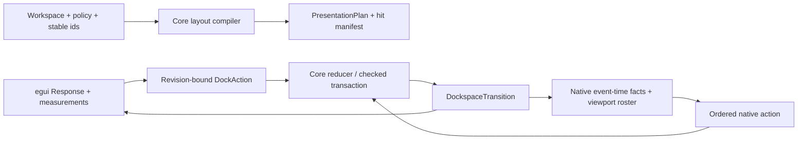
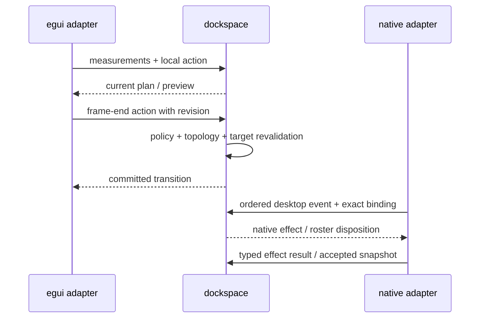

# Fearless dockspace product-boundary refactor

## Goal Capsule

| Field | Contract |
| --- | --- |
| Objective | Turn the current protocol-heavy trial into a usable, renderer-neutral `dockspace` semantic core, an interactive official-egui `egui_dockspace` adapter, and a minimal optional native multi-viewport runtime. |
| Authority | `dockspace` owns topology, layout semantics, policy, drop resolution, action validation, persistence, close intent, and surface ownership outcomes. UI adapters provide measurements, rendering, input facts, and platform effects only. |
| Compatibility | Breaking changes are intentional. Do not add deprecated aliases or preserve raw `WorkspaceCommand`/`NodeId` product entry points. |
| Fork baseline | Start from upstream egui 0.36.1 and reapply only seams proven necessary by the native vertical slice. Keep the current 0.35 fork as an archived behavior reference until migration evidence is complete. |
| Test posture | Prefer ordinary Rust unit/property/integration tests and one deterministic real-window smoke. Do not build a test engine, source parser, SHA/digest gate, screenshot matrix, or multi-scenario E2E framework. |
| Stop conditions | Report a capability as `Unknown`/unavailable when the platform cannot provide an authoritative fact. Stop before remote publication or upstream PR creation; those are separate authorized actions. |

The July 18 plan is superseded by this document. Its historical evidence remains useful, but its presentation-settlement and broad backend-protocol sequencing is no longer authoritative.

---

## Product Contract

### Summary

The current graph and transaction core is valuable, but the default egui product path is paint-only: a normal non-test `show_single_surface` session cannot bootstrap interaction authority. The next refactor must make the ordinary single-window example genuinely interactive before expanding native multi-viewport behavior.

The result is not a second docking implementation in egui. Core semantics remain shared by egui, GPUI, and future adapters; adapters translate their local facts into core actions and render the resulting plan.

### Problem Frame

The current implementation has accumulated a large authority transport layer around ordinary docking frames: provider leases, presentation streams, settlement tickets, savepoints, watermarks, replacement tickets, and a custom protocol oracle. These mechanisms make native lifecycle reasoning difficult and incorrectly gate local egui interaction on an unobservable renderer fact.

The fork has also grown into a broad runtime patch rather than a small upstreamable seam. A clean egui 0.36.1 baseline is needed before deciding which platform facts genuinely require a fork.

### Requirements

- R1. A production official-egui single-surface session must support tab selection, tab close, tab reorder/drag, edge and center docking, splitter resize, and contained floating move/resize without `cfg(test)` presentation providers.
- R2. `dockspace` remains the sole semantic authority for topology, N-ary split canonicalization, central-area semantics, tab order/selection/MRU, policy enforcement, drop winner selection, preview/commit equivalence, and atomic graph mutation.
- R3. Core layout compilation consumes renderer-neutral measurements and emits one `PresentationPlan`/hit manifest. egui must not maintain a competing complete docking projection.
- R4. Local egui input uses current-frame `Response` and widget-layer facts. Every generated action carries the relevant workspace/plan revision and is revalidated by core at frame end.
- R5. Native multi-viewport uses a global ordered input owner, exact surface/binding incarnation, typed platform effect/result outcomes, complete surface-roster recovery, and a first-live ownership barrier. Unknown platform facts fail closed.
- R6. Core-native lifecycle semantics are shared across adapters, while OS window objects, event-loop scheduling, focus dispatch, and renderer callbacks remain native-adapter responsibilities.
- R7. The public product facade is item/surface-centric and does not expose `NodeId`, raw `Workspace`, internal fingerprints, `WorkspaceCommand`, reducer ticks, leases, watermarks, or provider FSMs.
- R8. Persistence keeps atomic workspace validation and external-item identity pairing. Document, key-map, and viewport-placement restoration must commit as one authority domain.
- R9. The production dependency graph no longer uses the old `egui_tiles` bridge or the current 0.35 docking fork. The new fork begins from egui 0.36.1 and contains only justified seams.
- R10. Cross-adapter behavior is proven by black-box Rust conformance cases. The custom `dockspace_core_protocol` trace/harness is retired after valuable cases are migrated; it is not expanded into a second reducer.
- R11. Code is reorganized into deep modules with narrow public surfaces. Large engine/frame files are split by domain as part of the migration, not left as a final cleanup task.
- R12. CI remains proportionate: formatting, locked compilation, nextest, downstream API fixtures, one fork harness, and one native real-window smoke. No digest protocol or custom validation framework is added.

### Scope Boundaries

In scope:

- The `dockspace` model/layout/action/persistence boundary.
- Official-egui local interaction and the basic example.
- Minimal native lifecycle and cross-window tear-off/redock vertical slice.
- Required egui/eframe/winit fork seams and clean pinned workspaces.
- Open-GPUI migration of shared semantic actions and behavior tests where the facade is sufficient.
- Deletion of obsolete bridge, settlement, provider, trace, and raw product APIs.

Deferred to follow-up work:

- Motion/animation infrastructure and product theme polish after authoritative interaction is stable.
- Full hardware-input certification and exhaustive platform matrix.
- Automatic upstream PR submission and publication.
- Auto-hide, advanced docking classes, window menus, and complete accessibility parity beyond the vertical slice.

Explicit non-goals:

- Replacing the N-ary graph with ImGui's binary storage model solely for structural similarity.
- Copying GPUI Entity/View/window runtime into the headless core.
- Making egui_tiles the semantic owner again.
- Adding a general-purpose benchmark runner, test DSL, source parser, or hash-based release oracle.

### Sources and Research

- `repo-ref/open-gpui/crates/gpui_docking/src`: semantic graph, placement intents, viewport behavior, and failure tests.
- `repo-ref/imgui/imgui.cpp` and `repo-ref/imgui/imgui_internal.h`: frame-phase queueing, preview/delivery, central node, and independent viewport lifecycle.
- `repo-ref/dockview/packages/dockview-core/src`: tab/group/floating UX cases and regression vocabulary, not core authority.
- `crates/egui_dockspace/src/dockspace/driver.rs`: current paint-only gate and local frame orchestration.
- `crates/dockspace/src/backend.rs`, `backend_ingress.rs`, `presentation_observation.rs`: protocol surface and deletion candidates.
- Official egui 0.36.1 and egui 0.36.0 release notes; upstream egui_tiles 0.17.0 and winit 0.30.13 release baselines.

---

## Planning Contract

### Key Technical Decisions

- KTD1. **Keep a deep semantic core, delete the current transport algebra.** Preserve layout/drop/policy/transaction invariants, but replace public leases, savepoints, watermarks, and presentation-stream types with narrow facts, actions, and outcomes. (session-settled: user-directed — chosen over continuing the July protocol expansion: current complexity prevents the default product path from being interactive.)
- KTD2. **Response-driven local egui interaction.** Current egui `Response` is authoritative local receiver evidence; core revalidates the action against the current revision. Renderer accepted/dropped facts are required only for native cross-window routing and first-live admission, never as a local click prerequisite. (session-settled: user-directed — chosen over waiting for GPU/presentation settlement: upstream egui cannot provide that fact and ImGui does not require it.)
- KTD3. **Retain N-ary normalized layout.** Same-axis flattening, central semantics, touching-leaf splitter rules, and future-layout projection stay renderer-neutral. Do not clone ImGui's binary storage or GPUI's runtime.
- KTD4. **One action vocabulary across adapters.** A core `DockAction`/`DockPlacement` family is shared by egui and Open-GPUI. Adapters never implement their own target-selection or policy semantics.
- KTD5. **Fresh fork, minimal seams.** Pin upstream egui 0.36.1, archive the current 0.35 fork, and add a fork seam only after a native test demonstrates an unrepresentable fact. Event-time winit facts are the first candidate; broad event-envelope and hosted-cycle patches are not ported by default.
- KTD6. **Black-box conformance, not a protocol interpreter.** Migrate high-value protocol traces into ordinary Rust behavior tests that compare public transition outcomes. Delete the custom trace oracle once no production path depends on it.
- KTD7. **One desktop/native coordinator, local adapters remain thin.** Core owns lifecycle meaning and complete roster disposition; native runtime owns OS execution and scheduling. No second authority island in `DockspaceDocumentSession` or egui.
- KTD8. **Modularize during migration.** New deep modules must own one concept and expose a narrow facade. Do not preserve 10K-line files as temporary “later cleanup” buckets.

### High-Level Technical Design

The precise method names and storage layout are implementation-time decisions. The authority direction and result categories above are fixed.

### Migration Constraints

- Keep current graph invariants and characterization tests until equivalent black-box tests pass.
- Do not add compatibility aliases for deleted public types.
- Never make a platform `Known` fact from callback absence, guessed geometry, or a stale viewport token.
- Do not implement a second complete projection in an adapter.
- Reuse the existing `target` directory and run Cargo serially (`-j1`) unless a test requires otherwise.

### Assumptions

- egui 0.36.1 and winit 0.30.13 APIs are available from the pinned upstream release baseline.
- `repo-ref/open-gpui`, `repo-ref/imgui`, and `repo-ref/dockview` are owned reference code and may be copied selectively.
- The current branch is the only active canonical checkout; no user edits are present at plan creation.
- Native support remains an optional unpublished crate until the real-window vertical slice passes.

---

## Implementation Units

### U1. Establish the egui 0.36.1 baseline

**Goal:** Upgrade the official workspace to egui 0.36.1 and record a clean 0.36.1 fork baseline without prematurely porting the native runtime.

**Requirements:** R9, R12; KTD5.

**Dependencies:** None.

**Files:** `Cargo.toml`, `Cargo.lock`, `rust-toolchain.toml`, `crates/egui_dockspace/Cargo.toml`, `integration/egui-official-harness/Cargo.toml`, `integration/egui-official-harness/tests/public_api.rs`, `repo-ref/egui-release` reference metadata and README instructions.

**Approach:** Update the official workspace and Rust toolchain first. Record upstream 0.36.1 as the clean future fork base. Preserve the old 0.35 fork revision as source-only behavior reference, but suspend its adapter/native build gate: the current `egui_dockspace` path dependency now targets 0.36.1 and must not be forced into a misleading mixed-version workspace. U7 recreates one clean fork/native workspace from the 0.36.1 baseline after each necessary seam is proven.

**Test scenarios:**

- Official-egui workspace compiles with egui/eframe 0.36.1 and no fork-only cfg.
- The old fork source revisions remain recorded, while CI and README no longer claim that the obsolete 0.35 adapter/native workspace can build against the 0.36.1 product crate.
- Repeated egui passes, aborts, and externally owned outputs preserve single ownership of renderer texture commands.
- A downstream fixture can use the product facade without importing fork-only types.

**Verification:** Locked workspace check and official downstream harness pass on the new version baseline.

### U2. Introduce the core product model and action facade

**Goal:** Hide raw graph storage behind item/surface-centric layout, placement, query, and action types while preserving the existing N-ary engine internally.

**Requirements:** R2, R7, R8; KTD1, KTD3, KTD4, KTD7.

**Dependencies:** U1.

**Files:** `crates/dockspace/src/runtime.rs`, `crates/dockspace/src/lib.rs`, new `crates/dockspace/src/model/` modules, `crates/dockspace/src/operation.rs`, `crates/dockspace/src/persistence.rs`, new `crates/dockspace/tests/product_model.rs`, new `crates/dockspace/tests/product_actions.rs`, `crates/egui_dockspace/src/builder.rs`, `crates/egui_dockspace/src/response.rs`.

**Approach:** Add a core-owned `DockspaceLayout`/`DockspaceView` and typed actions such as select, close, dock, float, raise, and bring-into-view. Resolve stable anchors inside the reducer candidate, allocate dynamic identities inside the same rollback boundary, and map internal errors to opaque product rejections. Keep raw graph APIs backend-only during migration.

**Test scenarios:**

- Build a central root, N-ary split, contained floating root, and rootless surface from stable item/layout data.
- Select, close, dock, and float by `ItemId`/`SurfaceId`; missing anchors reject without graph or ID-frontier mutation.
- Persistence round-trip preserves item-key bijection and placement sidecar atomically.
- A failed policy or validation action leaves topology, selection, MRU, and identity frontiers unchanged.

**Verification:** Product facade tests pass without importing `NodeId`, `WorkspaceCommand`, or raw `Workspace` from the default API.

### U3. Make official-egui single-surface interaction real

**Goal:** Replace the paint-only convenience path with current-frame Response evidence and frame-end core revalidation.

**Requirements:** R1, R3, R4, R10; KTD2, KTD4.

**Dependencies:** U1, U2.

**Files:** `crates/egui_dockspace/src/dockspace.rs`, `crates/egui_dockspace/src/dockspace/driver.rs`, `crates/egui_dockspace/src/renderer.rs`, `crates/egui_dockspace/src/tabs.rs`, `crates/egui_dockspace/src/splits.rs`, `crates/egui_dockspace/src/floating.rs`, `crates/egui_dockspace/examples/basic.rs`, new `integration/egui-official-harness/tests/interaction.rs`, `crates/egui_dockspace/tests/egui_integration.rs`.

**Approach:** Always paint pane content. Let egui own raw local pointer capture, drag threshold, and widget receiver selection; core owns source identity, semantic proposal, preview, policy, and commit. Emit begin/update/release actions bound to the current plan revision and let core perform the sole policy/topology check. Delete the non-test `presentation_authority_available == false` gate and test-only provider dependency. Retain stale-plan fail-closed behavior for actions, not for painting.

**Execution note:** Start with a downstream non-`cfg(test)` failing interaction test, then implement the local action path.

**Test scenarios:**

- A normal `basic` application selects a tab and commits the change on the next frame.
- A tab close, center dock, each four-way edge dock, and contained move/resize use the actual Response receiver and commit exactly once.
- A stale action after a topology change is rejected while pane content still paints.
- A press/release in one `RawInput` batch remains a valid click and does not cancel correlation.
- Keyboard and AccessKit actions use the same local receiver facts and are disabled only when the target is genuinely stale or unsupported.

**Verification:** Official-egui downstream interaction tests pass in a production build; the basic example is manually runnable and no longer silently paint-only.

### U4. Replace the broad host/backend seam with a narrow frame contract

**Goal:** Make adapter integration depend on facts, plans, ordered actions, and outcomes rather than internal authority ledgers.

**Requirements:** R3, R4, R5, R6, R10, R11; KTD1, KTD2, KTD7, KTD8.

**Dependencies:** U2, U3.

**Files:** `crates/dockspace/src/backend.rs`, `crates/dockspace/src/backend_ingress.rs`, `crates/dockspace/src/engine/host_frame.rs`, `crates/dockspace/src/presentation_observation.rs`, `crates/dockspace/src/transition.rs`, new `crates/dockspace/src/host/` modules, new `crates/dockspace_host_conformance/tests/host_contract.rs`.

**Approach:** Define the small contract around frame requirements, surface facts, ordered input batches, presentation plan, and host results. Keep lifecycle invariants private behind a core coordinator. Remove ordinary-frame savepoints, presentation stream settlement, and full-engine candidate cloning from the adapter-facing path; use domain-local candidates or write sets where needed.

**Test scenarios:**

- A host can publish all surface measurements in one frame and receive one deterministic plan.
- Local action order is preserved independently of surface callback ordering.
- Native effect results are correlated by opaque request identity and stale results are rejected.
- A dropped/aborted host frame either replays captured input or retires its provider and gesture; it never leaves a half-committed authority.

**Verification:** Host conformance runs through only the narrow public contract and does not import presentation leases, watermarks, provider tickets, or reducer internals.

### U5. Retire the protocol oracle and obsolete bridge code

**Goal:** Remove the custom reducer-like trace engine and old `egui_tiles`/settlement bridge after behavior coverage has moved to black-box tests.

**Requirements:** R8, R10, R12; KTD6, KTD8.

**Dependencies:** U3, U4.

**Files:** `crates/dockspace_core_protocol/`, `crates/egui_dockspace/src/behavior_tests.rs`, `crates/dockspace_host_conformance/tests/host_contract.rs`, new `crates/dockspace_host_conformance/tests/migrated_protocol_cases.rs`, `repo-ref/egui_tiles_docking` references, workspace manifests, CI and scripts.

**Approach:** Port only tests that assert public layout, roster, action, close, and effect outcomes. Delete the custom trace schema/harness, test-only presentation provider, obsolete `egui_tiles` bridge, and custom cfg/RUSTFLAGS injection. Keep fork/native scripts as thin Cargo process wrappers.

**Test scenarios:**

- Every retained protocol scenario has a black-box Rust test with a product-visible assertion.
- Deleting the trace crate does not remove coverage for unique winner, preview/commit equivalence, close/recovery, or native effect failure.
- Cargo metadata shows no production dependency on `egui_tiles` or the retired bridge.

**Verification:** Workspace and downstream harnesses compile without the deleted crate or cfg; no test depends on internal reducer serialization.

### U6. Build the minimal renderer-neutral native coordinator

**Goal:** Preserve exact multi-viewport lifecycle meaning without exposing the current provider/presentation algebra.

**Requirements:** R5, R6, R8; KTD1, KTD7.

**Dependencies:** U4, U5.

**Files:** `crates/dockspace/src/viewport/`, `crates/dockspace/src/effects/`, `crates/dockspace/src/close/`, new `crates/dockspace/tests/native_coordinator.rs`, `crates/egui_dockspace_native/src/`, `crates/egui_dockspace_native/tests/native_lifecycle.rs`, `integration/egui-native-e2e/src/main.rs`.

**Approach:** Keep binding incarnation, complete surface roster, ordered desktop pointer, typed effect result, close/recovery semantics, and the compact create sequence `CreateHidden → StagingAccepted → Visible → TransferOwnership → FirstLiveAccepted`. Move OS event-loop and renderer scheduling into native adapter code. Keep source content visible until first-live acceptance and process main plus contained roots atomically on surface destruction.

**Test scenarios:**

- Outside-all tear-off preserves grab offset and source content until the child first-live result.
- Cross-window redock selects one winner and commits once; rejected winner does not fall through.
- Destroying a surface rehomes all main and contained roots, or reports an explicit unavailable outcome.
- Create/show/focus/first-live failure leaves source ownership recoverable and does not strand a pending effect.
- A stale binding incarnation or delayed pointer event is rejected without affecting the successor window.

**Verification:** Native helper tests cover each lifecycle transition and the existing single real-window smoke passes through the new coordinator.

### U7. Rebuild the fork seam and native vertical slice

**Goal:** Reapply only platform facts that official egui/eframe cannot express and prove one real two-window path.

**Requirements:** R5, R9, R12; KTD5.

**Dependencies:** U1, U6.

**Files:** `repo-ref/egui-release/`, `repo-ref/winit-release/`, `crates/egui_dockspace_native/`, `integration/egui-fork-workspace/`, `integration/egui-fork-harness/tests/backend_authority.rs`, `integration/egui-native-e2e/src/main.rs`, `scripts/run_egui_fork_harness.py`, `scripts/run_native_e2e.py`.

**Approach:** Base the new fork branch on upstream egui 0.36.1. Keep only event-time pointer position/modifier facts and a narrow accepted/dropped output hook if the vertical slice proves it necessary. Replace implicit custom cfg with an explicit fork feature; do not add dependency API probes. Keep one deterministic smoke for tear-off, cross-window redock, close/veto, focus, and mixed-DPI facts that are available on the host.

**Test scenarios:**

- Pinned fork and native crate compile from a clean checkout without dirty local directories.
- Event-time button/wheel position and modifiers survive into the native ordered input batch.
- Two real OS windows complete tear-off, first-live, redock, and child retirement.
- A platform that cannot provide an exact desktop fact reports unsupported/unknown rather than guessing.

**Verification:** Fork target tests, native helper tests, and the single real-window smoke pass; no additional E2E framework is introduced.

### U8. Migrate Open-GPUI and seal the public API

**Goal:** Make Open-GPUI consume the same semantic core and publish a narrow item/surface-centric facade.

**Requirements:** R2, R6, R7, R8, R11; KTD1, KTD4, KTD7, KTD8.

**Dependencies:** U2, U4, U6.

**Files:** `repo-ref/open-gpui/crates/gpui_docking/`, `repo-ref/open-gpui/crates/gpui_docking/src/dockspace_adapter_tests.rs`, `crates/dockspace/src/lib.rs`, `crates/egui_dockspace/src/lib.rs`, `crates/egui_dockspace_native/src/lib.rs`, `integration/egui-official-harness/tests/public_api.rs`, `docs/knowledge/dockspace-public-api-seal.md`, README and examples.

**Approach:** Keep GPUI panel factories, focus handles, native window runtime, motion, and accessibility rendering in GPUI. Replace its graph/action/drop authority with the shared core through a small adapter. Hide raw graph/engine modules by default and expose stable item/surface snapshots, actions, outcomes, persistence, and capability status.

**Test scenarios:**

- GPUI and egui apply the same select/dock/close/float actions to an equivalent layout and produce equivalent core outcomes.
- Product downstream fixtures compile without `NodeId`, raw `Workspace`, or `EngineTransition`.
- Persistence and close outcomes remain available through the unified session facade.

**Verification:** Public API compile fixtures, Open-GPUI docking behavior tests, rustdoc, and adapter conformance pass after raw exports are removed.

---

## Verification Contract

Run checks serially and reuse the normal repository `target` directory.

- Formatting and diff hygiene: `cargo fmt --all -- --check`, `git diff --check`.
- Locked workspace compilation: `cargo check --workspace --all-features --all-targets --locked -j1`.
- Core and egui behavior: nextest for `dockspace` and `egui_dockspace` with all targets/features.
- Black-box host conformance: `dockspace_host_conformance` and official-egui downstream harness.
- Fork/native verification: the existing thin fork harness, native helper tests, and one real-window smoke.
- API/publishing gate: downstream compile fixtures, rustdoc, and `cargo package --dry-run` for publishable crates.
- Performance evidence: retain structural 16/128/1024 tests and targeted clone/scan counters; do not make wall-clock thresholds or digest files a CI gate.

The verification suite must prove the default production path, not only `cfg(test)` behavior. A green test count is insufficient if the basic example remains paint-only.

---

## Definition of Done

- `show_single_surface` is interactive in a non-test official-egui consumer, including tab select/close, four-way and center docking, splitter resize, and contained floating interaction.
- Core is the only implementation of docking topology, policy, target selection, preview, commit, and surface ownership semantics.
- The public default APIs do not expose raw graph storage or authority transport internals.
- The old `egui_tiles` bridge, custom protocol oracle, test-only presentation provider, and obsolete fork protocol are deleted or isolated as non-production reference material.
- A clean checkout builds the official workspace and the pinned fork/native workspace without ignored local source directories.
- One real two-window smoke demonstrates tear-off, first-live admission, cross-window redock, close/recovery, and no content loss.
- Open-GPUI can run shared core actions without maintaining a second graph/drop resolver.
- Large engine/frame/protocol files are split into domain modules with no new monolithic replacement.
- Required format, locked build, nextest, downstream, fork/native, rustdoc, API, and package gates pass.
- Abandoned migration attempts, stale compatibility aliases, and dead test scaffolding are removed before completion.

## Deferred to Follow-Up Work

- Motion/spring/easing extraction and visual transition polish.
- Full platform certification, hardware input, and exhaustive accessibility matrix.
- Auto-hide, dock classes, window menus, and advanced ImGui flags not needed for the vertical slice.
- Upstream PRs, publishing, and remote branch operations.
