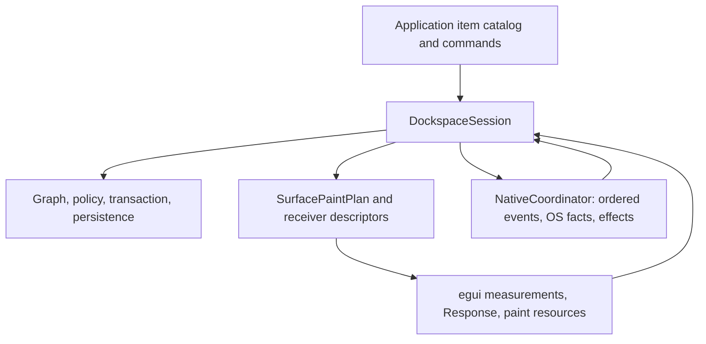
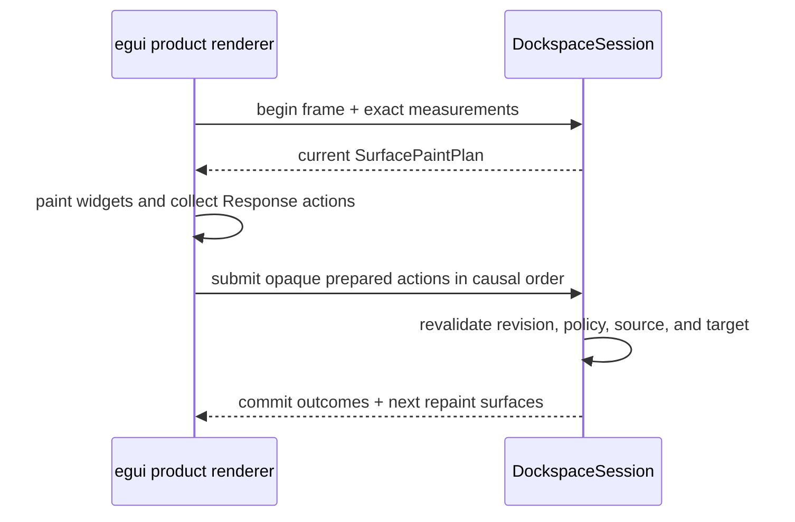
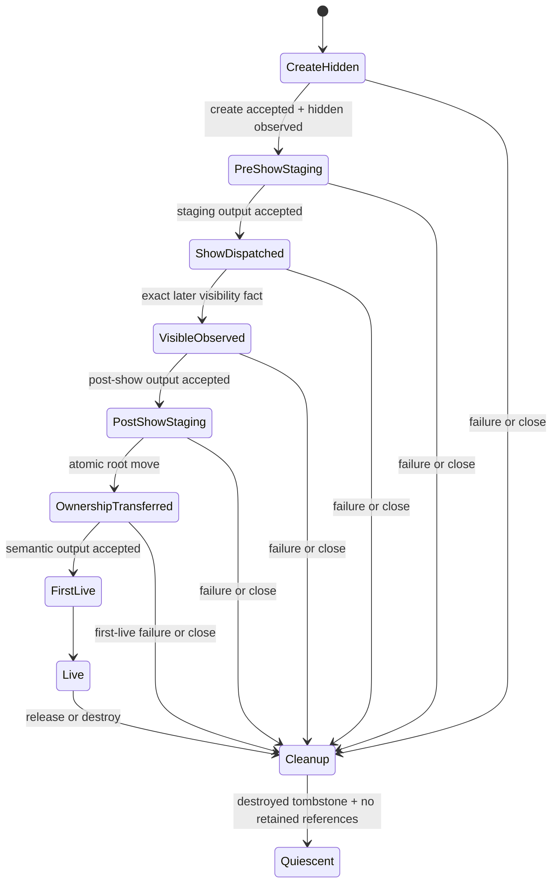
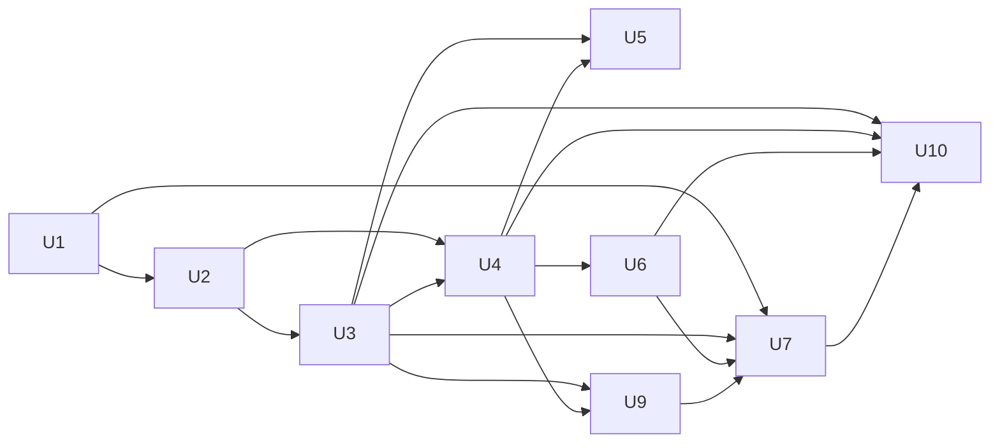

# Fearless dockspace product-boundary refactor

## Goal Capsule

| Field | Contract |
| --- | --- |
| Objective | Finish the transition from a correctness-heavy docking protocol prototype into a renderer-neutral `dockspace` core, an interactive official-egui `egui_dockspace` product crate, and one optional fork-backed native multiview runtime. |
| Authority | `dockspace` owns topology, stable identities, normalized layout, policy, drop resolution, action validation, persistence, close intent, and surface ownership. UI/runtime adapters own measurement, paint resources, local receiver facts, platform observations, OS effects, clocks, accessibility rendering, and motion. |
| Product boundary | Ordinary applications use item/surface-centric layouts, views, actions, persistence, and outcomes. Raw graph nodes, engine transitions, authority ledgers, provider replacement state, scene stamps, and platform receipts remain private or temporary backend-only migration seams. |
| Compatibility | Breaking changes and deletion are intentional. Do not preserve deprecated aliases, dual engines, legacy fallback mutation, or raw `WorkspaceCommand` product entry points. |
| Test posture | Prefer ordinary Rust unit, property, integration, and downstream tests. Keep exactly one bounded real-window smoke for the irreducible event-loop/window boundary. Do not add a test DSL, source parser, ABI analyzer, hash/digest oracle, screenshot matrix, or multi-scenario E2E framework. |
| Stop conditions | Unknown or unsupported platform facts fail closed. Remote publication, upstream PR creation, and crates.io release remain separately authorized actions. |

The July 18 plan is historical evidence only. This document is the current implementation contract and reflects the official egui 0.36.1 migration, the pinned native seams, the product renderer, and session-owned persistence. Open-GPUI integration is explicitly deferred and is not a completion gate for this plan.

---

## Product Contract

### Summary

The pure graph, validation, transaction, drop, and lifecycle invariants are worth preserving. The remaining problem is not another graph rewrite: it is completing the product chain around that core without retaining two render projections, two input authorities, two persistence owners, or two production graphs.

The official-egui default path now proves a substantial local interaction slice, and product persistence is session-owned. The highest-risk remaining work is the native event-loop boundary, where exact binding, output, visibility, close, and retirement facts must form one causal chain.

### Problem Frame

The repository has accumulated strong internal protocols but still exposes or duplicates too much of them at integration boundaries. Large orchestration files combine unrelated state machines, backend-only types remain visible through public signatures, and the fork/native workspace is not yet proven by one real two-window lifecycle.

The intended product is closer to ImGui's layering than to its storage implementation: a pure docking model, a frame-bound action reducer, immediate adapter rendering, and an independent platform viewport driver. The core keeps normalized N-ary splits rather than adopting ImGui's binary tree. Open-GPUI remains reference evidence for product behavior and failure cases only during this plan; Dockview contributes interaction regressions, not a semantic model.

### Requirements

#### Product core and local interaction

- R1. A default-feature official-egui consumer supports tab selection, tab close, reorder/drag, center and four-way edge docking, splitter resize, contained floating move/resize, keyboard cancellation, and the supported accessibility actions without `cfg(test)` or backend authority.
- R2. `dockspace` is the only implementation of topology, N-ary split canonicalization, central-area semantics, tab order/selection/MRU, policy enforcement, drop winner selection, preview/commit validation, and atomic graph mutation.
- R3. Core consumes renderer-neutral measurements and emits one product paint/receiver plan. An adapter may cache paint resources, but it must not rebuild a competing complete workspace projection or infer semantic targets from geometry.
- R4. Local egui actions are produced from current `Response`/AccessKit facts, preserve multipass causality, carry opaque revision-bound authority, and are revalidated once by core at frame end.

#### Native multiview

- R5. Native multiview uses one ordered desktop event owner, exact `SurfaceId` plus binding incarnation, typed effect/result outcomes, complete live-window and detached monitor/work-area rosters, complete surface recovery, and a first-live admission barrier after ownership transfer. A failed monitor refresh may retain the previous complete batch as stale evidence, but fallback provenance never becomes current exact placement authority.
- R6. Platform capabilities are truthful profiles. Missing hover, focus, placement, capture, work-area, visibility, or create-result evidence remains `Unknown` or `Unsupported`; callback absence and guessed geometry never become authoritative facts.

#### Product API and persistence

- R7. The public facade is item/surface-centric and does not expose `NodeId`, raw `Workspace`, `WorkspaceCommand`, `DockEngine`, scene stamps, reducer ticks, leases, watermarks, provider tickets, or backend FSM types.
- R8. A `DockspaceSession` owns document lineage, append-only external item identity, workspace state, allocator frontiers, and viewport placement as one atomic persistence domain.

#### Migration and engineering quality

- R9. Production dependencies use official egui 0.36.1, one pinned minimal egui/eframe fork, and one pinned minimal winit event-time fork only where exact native facts are otherwise unavailable. No active code depends on the old `egui_tiles` bridge or the retired 0.35 hosted-cycle fork.
- R10. Cross-adapter behavior is proven through public black-box Rust tests. The deleted protocol trace/oracle remains deleted; valuable historical scenarios are migrated as direct behavior tests rather than reimplemented in a new runner.
- R11. Orchestration code is split into deep modules by state ownership while the migration is active. New wrappers must eliminate responsibility from callers, not merely forward calls or move line counts.
- R12. CI is proportionate and reproducible: formatting, locked compilation, focused Clippy policy, nextest, downstream product/API fixtures, pinned fork/native tests, packaging checks, and one real-window smoke. Scripts remain thin Cargo/process launchers.

### Acceptance Examples

- AE1. **Local dock action**
  - **Given:** A default-feature official-egui application has two tabs and no backend feature.
  - **When:** The user drags one tab to a current edge guide and releases after the preview is painted.
  - **Then:** Core revalidates the same target, commits once, and the next plan reflects the new split without any adapter-owned graph mutation.
  - **Covers:** R1, R2, R3, R4.

- AE2. **Native child admission**
  - **Given:** A managed native host receives an exact outside-all release for a docked root.
  - **When:** The host creates a hidden child, presents pre-show staging, dispatches show, later observes exact visibility, presents post-show staging, transfers ownership, and presents the first live semantic output.
  - **Then:** Source content remains recoverable until transfer, the child becomes interactive only after first-live admission, and no pending effect or route survives retirement.
  - **Covers:** R5, R6, R12.

- AE3. **Atomic document restore**
  - **Given:** A bound session has live topology, append-only item keys, and viewport placement.
  - **When:** A same-lineage document with a mismatched key association or invalid placement is restored.
  - **Then:** Restore rejects before publication and leaves view, version, key history, placement, generation, and identity frontiers unchanged.
  - **Covers:** R7, R8.

- AE4. **Sealed downstream product API**
  - **Given:** An application depends on the packaged default-feature crates.
  - **When:** It builds layouts, renders a surface, applies product actions, and saves or restores a document.
  - **Then:** It can complete those workflows through item/surface APIs and JSON bytes without naming raw graph nodes, engine transitions, scene authority, provider receipts, or persistence candidates.
  - **Covers:** R2, R7, R8, R10.

- AE5. **Unsupported platform fact**
  - **Given:** A platform cannot provide exact desktop hover or hidden-window visibility.
  - **When:** A cross-window action requires that fact.
  - **Then:** The capability reports unsupported or the observation remains unknown; no placement, ownership transfer, or drop is inferred.
  - **Covers:** R5, R6.

- AE6. **Native tear-off, redock, and close policy**
  - **Given:** A managed desktop host has two admitted native surfaces and exact event-time routing facts.
  - **When:** A root is torn off outside all windows, redocked into the other window, and the emptied child receives an OS close request under immediate, vetoable, or deferred close policy.
  - **Then:** Each ownership change is committed once by core, focus recovers to the deterministic MRU target, deferred close owns one token, stale or duplicate resolution is typed, and no adapter fallback mutates topology.
  - **Covers:** R2, R5, R6, R10.

### Minimum Interaction and Lifecycle Contract

| Domain | Required behavior |
| --- | --- |
| Accessibility | Tabs expose focus, select, and close only when executable; tab-list and overflow controls expose keyboard navigation and activation; splitters and junctions expose increment/decrement only when operable; contained close/title/resize controls advertise only actions that core can execute; hidden or disabled controls expose no dead action. Successful focus lands on the selected pane or the exact product control requested by the action. |
| Gesture terminality | `Unknown` facts never acquire or commit docking authority. During an already-owned gesture, `Unknown` may preserve the gesture only while the exact terminal source can still arrive. Exact release, cancel, provider retirement, destroyed binding, or unrecoverable route loss terminates once, clears capture and transient preview state, and cannot be replayed against a successor binding. A release that resolves a new target remains pending until that exact preview is painted. |
| Close policy | Disabled close exposes no close action. Immediate close commits once. Deferred close creates one affine token; duplicate or stale resolution returns a typed outcome, and the UI remains non-destructive while pending. Accept or veto restores focus deterministically. Closing a surface plans all main and contained roots atomically. |
| Pre-admission native UI | Before first-live admission, a child paints staging content only: pane semantics, docking receivers, pane focus, and accessibility actions are disabled and the cursor remains neutral. A close request enters staging cleanup. On failure, source ownership remains or is restored and the child is retired. After exact first-live presentation, semantic content, input, focus, and accessibility become active together. |

### Scope Boundaries

In scope:

- The renderer-neutral model, action, paint-plan, native-fact, close, and persistence facades.
- The official-egui default product renderer and local interaction paths.
- One managed native coordinator and one real two-window lifecycle smoke.
- The minimum egui/eframe/winit fork seams required by that smoke.
- Removal of active legacy bridges, duplicate projections/ledgers, raw public APIs, stale scripts, and dead test scaffolding.
- Domain-based modularization, bounded retention, and structural performance evidence.

Deferred for later:

- Motion/spring/easing extraction and visual polish after authority is stable.
- Full Wayland/global-desktop parity where the platform cannot expose the required facts.
- Full hardware-input, accessibility, renderer, and OS matrix certification.
- Open-GPUI production cutover, legacy import, and space-to-surface identity migration.
- Auto-hide, dock classes, window menus, dirty markers, and advanced ImGui docking flags not required by the vertical slice.
- Upstream PRs, publication, release signing, and remote branch operations.

Explicit non-goals:

- Replacing normalized N-ary splits with ImGui's binary storage model for cosmetic similarity.
- Moving GPUI view/entity/focus/motion/window ownership into the headless core.
- Reintroducing `egui_tiles` as a model or runtime dependency.
- Treating screenshots, root-worktree SHA/diff digests, source grep, AST parsing, ABI inference, or a bespoke trace language as release evidence. Exact dependency revisions remain normal reproducibility inputs.
- Expanding the single smoke into a reusable E2E engine or scenario framework.

### Sources and Research

- `repo-ref/imgui/imgui_internal.h` and `repo-ref/imgui/imgui.cpp`: queued frame phases, central-node semantics, preview/commit separation, and independent platform viewport lifecycle.
- `repo-ref/dear-imgui-rs/` at v0.16.0 / `abac30563`: recent winit multi-viewport integration, detached monitor transactions, per-viewport renderer ownership, root-loop wake behavior, and teardown cases. It is a platform-boundary reference only; its TLS registries, pointer/context identity, timeout-based focus settlement, and geometry offsets are not authority models for this project.
- `repo-ref/open-gpui/crates/gpui_docking/src`: panel catalog, stable string identities, placement intent, close/focus behavior, recovery cases, and the partial shared-core adapter.
- `repo-ref/dockview/packages/dockview-core/src/__tests__/`: pointer leave/drop cancellation, long-press, splitter, hidden group, selection, and floating regressions.
- `crates/dockspace/src/runtime/`, `crates/dockspace/src/frame/`, and `crates/dockspace/src/engine/`: current renderer-neutral product and lifecycle seams.
- `crates/egui_dockspace/src/product_dockspace.rs` and `crates/egui_dockspace/src/product_render/`: default product frame and renderer.
- `crates/egui_dockspace_native/src`: fork-backed coordinator, mailbox, viewport, presentation, effect, and retirement ownership.
- `docs/knowledge/dockspace-public-api-seal.md`: intended product/API boundary.

---

## Planning Contract

### Key Technical Decisions

- KTD1. **Preserve the semantic core and hide the authority machinery.** Graph validation, transactions, drop resolution, lifecycle correctness, and private candidate rollback remain. Public and adapter-facing APIs expose only product facts, revision-bound actions, paint/receiver descriptions, native observations, effects, and outcomes. (session-settled: user-directed — chosen over either discarding proven invariants or continuing to export protocol internals.)
- KTD2. **Use current egui responses for local interaction.** Current-frame `Response` and AccessKit facts authorize local widget actions; renderer terminal facts are reserved for retained/native routing and first-live admission. (session-settled: user-directed — chosen over requiring unobservable GPU presentation for a local click.)
- KTD3. **Retain normalized N-ary layout.** Same-axis flattening, central-root metadata, touching-leaf splitter rules, and future-layout projection stay in core; binary ImGui nodes and GPUI runtime nodes are reference behavior only.
- KTD4. **Use one action vocabulary.** Every current or future adapter submits the same product actions and consumes the same product outcomes. No adapter gets its own resolver, policy evaluator, or fallback graph mutation.
- KTD5. **Pin official egui 0.36.1 plus two minimal native seams.** The egui/eframe fork is based on upstream 0.36.1 and pinned at `a3c5ee57f4158ef717b5a956bf0d5c4aeda186ed`; the winit event-time fork is pinned at `180bfc09743586137fec014ef5543cdde56ce5d0`. Each fork change requires a missing-fact test, a narrow seam, and a deletion or upstream condition. Broad hosted-cycle code is not revived.
- KTD6. **Keep tests black-box and ordinary.** Characterization, state-machine, property, downstream, and one smoke test replace the old protocol interpreter. A test helper may assemble domain fixtures, but it may not become a second engine or source analyzer.
- KTD7. **One engine owner in every production path.** `DockspaceSession` owns core state. egui rendering, native coordination, and document persistence attach to that owner instead of wrapping their own `DockEngine` or dual-writing another graph.
- KTD8. **Make persistence session-owned and bytes-only.** Versioned UTF-8 JSON bytes are the stable wire boundary. External item identity, topology, placement, frontiers, lineage, and generation publish atomically. Raw snapshot parts and mutable candidate assembly remain private.
- KTD9. **Distinguish dispatch, observation, transfer, and admission.** A host dispatch acknowledgement is not visibility; visibility is not first-live presentation; first-live presentation is not renderer/GPU proof beyond the adapter's accepted/dropped output contract.
- KTD10. **Keep one thin real-window smoke.** The smoke proves only the opaque output token, event-loop window creation, hidden staging, visibility dispatch, first-live, destroy, and quiescence boundary. Deterministic Rust tests own drop geometry, policy, ABA, failure, redock, and close matrices.
- KTD11. **Deepen modules by state ownership.** Split a file only when the extracted module owns an invariant, state machine, or resource lifetime and reduces the caller's knowledge. Do not introduce forwarding layers, generic protocol frameworks, or line-count-only shuffles.
- KTD12. **Defer Open-GPUI integration.** The current plan does not modify or gate on Open-GPUI. Its source remains reference evidence only; any future cutover requires a separate plan and must integrate through the sealed `DockspaceSession` facade without reopening raw graph authority. (session-settled: user-directed.)

### High-Level Technical Design

### System-Wide Impact

- **Data lifecycle:** External item and surface keys become append-only identities. Closed identities remain tombstones until a new document lineage, preventing ABA and accidental pane reassignment.
- **Failure model:** Adapter uncertainty remains typed and retryable only where a future exact fact can genuinely arrive. Structural errors are returned, not swallowed or converted to repaint loops.
- **Performance posture:** Whole-engine candidate cloning remains the private rollback baseline until structural counters or profiling justify a write-set/COW change. Retention stores gain explicit watermarks and soak tests before native publication.
- **Platform posture:** Wayland may support surface-local exact input while global desktop placement remains unsupported. Capability tables describe real host support rather than enum availability.
- **Release posture:** `egui_dockspace_native` remains unpublished until the real-window smoke and clean pinned egui/eframe plus winit gates pass. The headless and official-egui crates may be packaged independently once U9 gates pass.

### Migration Constraints

- Preserve concurrent worktree changes and stage only owned files or hunks. Never use reset, restore, checkout, stash, or broad deletion to manufacture a clean tree.
- Keep current graph/lifecycle tests until equivalent public behavior tests pass.
- Do not add compatibility aliases for removed product types.
- Do not infer a `Known` platform fact from callback absence, a window rectangle, the latest cursor sample, a stale token, or another coordinate space.
- Do not keep a second complete projection or graph for compatibility after its consumer has migrated.
- Before core commit, a recoverable host-frame failure preserves the exact raw input journal for retry. Only permanent loss of the producer, binding, or raw fact may retire the exact provider, and that retirement must commit terminal gesture/capture cancellation before adapter state is cleared.
- Reuse the normal `target` directory and run Cargo serially unless a specific test requires otherwise.
- Treat module size as a design smell, not a numeric release gate. The gate is clear state ownership and a narrower caller interface.

### Risks and Dependencies

- The native vertical slice depends on the pinned egui/eframe opaque-output seam and the pinned winit event-time seam; upstream changes must be merged and reverified in their owning branch before updating root pins.
- Real window smoke behavior is environment-sensitive. Keep its scope fixed and move all semantic assertions that do not require a real event loop into deterministic Rust tests.
- Removing backend-only egui code before the product/native renderer covers its remaining menu, receiver, and accessibility paths would create silent capability loss. Delete by completed vertical slice, not by file age.
- Whole-engine clone and unbounded history risks must be measured structurally; premature generic COW or a universal retention framework would increase complexity before proving value.

---

## Implementation Units

The repository already contains meaningful evidence for several units: official egui 0.36.1, the pinned `a3c5ee57f4158ef717b5a956bf0d5c4aeda186ed` fork, default product interaction tests, session-owned JSON persistence, removal of the protocol oracle, and no active `egui_tiles` dependency. `ce-work` must inspect the current tree and execute only the unmet contract in each unit; it must not replay landed work or use commit SHAs as test gates.

### U1. Reproducible egui and fork baseline

- **Goal:** Make the official and fork-backed workspaces reproducible from clean checkouts and remove stale version claims.
- **Requirements:** R9, R12.
- **Dependencies:** None.
- **Files:** `Cargo.toml`, `Cargo.lock`, `rust-toolchain.toml`, `integration/egui-fork-workspace/Cargo.toml`, `integration/egui-fork-workspace/Cargo.lock`, `.github/workflows/ci.yml`, `README.md`, `repo-ref/egui-release` metadata, `repo-ref/winit-release` metadata.
- **Approach:** Keep official egui/eframe at exact 0.36.1, the egui/eframe fork at `a3c5ee57f4158ef717b5a956bf0d5c4aeda186ed`, and the winit fork at `180bfc09743586137fec014ef5543cdde56ce5d0`. Update CI and documentation to those same revisions. Verify that each pinned commit contains every API used by native code and that no ignored dirty directory is required. Do not chase unreleased upstream `main`; reconsider the baseline only from a later stable egui tag. Dependency pins are reproducibility inputs; root commit SHAs and worktree digests are not behavior or completion gates.
- **Test scenarios:**
  - A clean root checkout builds against official egui without fork-only cfg.
  - A clean fork workspace resolves the exact pinned revision and compiles egui, eframe, egui-winit, and the native crate.
  - The native host seam compiles for both Glow and WGPU even though the single real-window smoke uses Glow.
  - Bypassing the pinned fork feature fails explicitly rather than silently using a reduced fallback.
  - README, CI, and manifests name the same official version and both fork revisions.
- **Verification:** Root locked check, fork harness, fork native-host-seam tests, and documentation diff inspection pass.

### U2. Complete the product model, actions, and session-owned persistence

- **Goal:** Finish the narrow item/surface facade required by current product adapters without reopening raw graph APIs.
- **Requirements:** R2, R7, R8.
- **Dependencies:** U1.
- **Files:** `crates/dockspace/src/model/`, `crates/dockspace/src/runtime/`, `crates/dockspace/src/document.rs`, `crates/dockspace/src/persistence.rs`, `crates/dockspace/tests/product_actions.rs`, `crates/dockspace/tests/document.rs`, `integration/egui-product-harness/tests/persistence.rs`.
- **Approach:** Keep one `DockspaceSession` owner. Expose only the selection, close, item/root dock, float/raise/bring-into-view, and placement operations demonstrated by real adapters. All prepared operations retain their creation revision and session authority. Consolidate duplicate document-session validation/capture helpers into the session-owned implementation; cache append-only item identity scope rather than rebuilding it every frame. Keep JSON bytes as the only stable wire format. Restore callbacks validate that an external key is recognized and authorized; they never supply, remap, or swap the persisted numeric `ItemId`. U2 prepares and validates an atomic replacement; U4 publishes it through the session frame boundary.
- **Test scenarios:**
  - A prepared action stays valid across save and cannot cross sessions; U4 verifies that successful live restore stales earlier actions.
  - Complete singleton root promotion/rehome preserves `RootId`; item-only movement still rejects whole-root extraction.
  - Same-lineage append-only key history survives save, restore, removal, reopen, and older-generation restore without ID reuse.
  - Wrong lineage, swapped key association, invalid placement, malformed JSON, or unsupported version rejects atomically.
  - Capture encoding failure does not consume a generation; restore never moves item/root/surface/floating frontiers backward.
- **Verification:** Product/core persistence tests use only public layouts, sessions, views, JSON bytes, and stable product error categories.

### U3. Finish the official-egui product renderer and remove local dual authority

- **Goal:** Make the default product renderer carry the complete official-egui local product interaction set; U4 removes the remaining legacy path after this slice is proven.
- **Requirements:** R1, R3, R4, R7.
- **Dependencies:** U2.
- **Files:** `crates/egui_dockspace/src/product_dockspace.rs`, `crates/egui_dockspace/src/product_render/`, `crates/egui_dockspace/src/product_render/measurement.rs`, `crates/egui_dockspace/src/builder.rs`, `crates/egui_dockspace/src/response.rs`, `integration/egui-product-harness/tests/product.rs`, `integration/egui-official-harness/tests/interaction.rs`, `crates/egui_dockspace/examples/basic.rs`.
- **Approach:** Measure through core's exact manifest, paint from `SurfacePaintPlan`, and submit opaque prepared actions. Preserve local-response actions across egui multipass, but keep preview acknowledgements final-pass only. Ensure transient splitter/contained resize recompiles current overrides instead of retaining stale geometry. Add the remaining overflow/menu, receiver-descriptor, contained-transform preview, and accessibility actions before deleting their legacy renderer equivalents. During this unit, split measurement/resource ownership, tab/menu actions, split interaction, contained interaction, and overlay painting into modules that own those responsibilities; do not postpone renderer modularization to U10.
- **Test scenarios:**
  - Tab select/close/reorder, center/four-edge docking, splitter, contained move/resize, Escape, keyboard, and the minimum accessibility matrix work with default features.
  - A first-pass local action survives `request_discard` and commits once; a first-pass presentation acknowledgement does not survive into the final pass.
  - Splitter and contained resize geometry tracks each pointer move before release.
  - Release at a changed preview point waits for the newly painted preview rather than consuming the gesture or committing an unpainted target.
  - Stale actions reject without disabling pane rendering; blocked/unknown receivers never fall through to a lower docking receiver.
- **Verification:** The no-backend product harness and official-egui consumer pass; `crates/egui_dockspace/examples/basic.rs` is an interactive product example, not a paint-only demonstration; the product renderer root only orders ownership-bearing submodules.

### U4. Collapse the backend and host boundary to one deep session contract

- **Goal:** Remove adapter dependence on internal engine/protocol types and eliminate the second egui engine owner.
- **Requirements:** R3, R4, R5, R7, R11.
- **Dependencies:** U2, U3.
- **Files:** `crates/dockspace/src/runtime.rs`, `crates/dockspace/src/runtime/`, `crates/dockspace/src/backend.rs`, `crates/dockspace/src/backend_ingress.rs`, `crates/dockspace/src/engine/host_frame.rs`, `crates/egui_dockspace/src/dockspace.rs`, `crates/egui_dockspace/src/dockspace/`, `crates/dockspace_host_conformance/src/`.
- **Approach:** Make `DockspaceSession` the only engine owner for product and native rendering. The public host frame accepts typed measurements, surface facts, ordered semantic/native input, configuration/document replacement, and synchronous receiver answers; it returns paint plans, product outcomes, affine native effects, and repaint needs. Keep candidate rollback, leases, ordinals, and receipts private. A recoverable pre-commit failure retains the exact raw input and prepared document candidate for retry; permanent producer or binding loss retires that exact authority and commits cancellation before adapter state is cleared. Extract application/configuration reduction, product-frame orchestration, document publication, and host commit/abort into ownership-bearing modules during this unit. Remove the legacy egui backend renderer and facade when native/product paths no longer import them.
- **Test scenarios:**
  - Host callback order across surfaces cannot change semantic input order.
  - A dropped or failed prepared frame either preserves raw input for retry or retires the owning provider and gesture; it cannot lose a physical release while retaining core capture.
  - Successful live document replacement atomically publishes graph, key history, placement, generation, and frontiers, then stales all pre-restore actions; any failure leaves the session unchanged.
  - Native and local frames use the same session/version/action results without constructing another engine.
  - Default public code cannot name backend ingress, engine transition, provider, or scene authority types.
- **Verification:** Host conformance and downstream adapters compile through the narrow runtime facade only; backend-only modules have no production consumer before deletion.

### U5. Keep obsolete protocol and bridge code deleted

- **Goal:** Preserve valuable behavior coverage while preventing the retired oracle, `egui_tiles` bridge, and test-only authority from returning.
- **Requirements:** R9, R10, R12.
- **Dependencies:** U3, U4.
- **Files:** workspace manifests, `crates/dockspace_host_conformance/`, `integration/egui-product-harness/`, `repo-ref/egui_tiles_docking` references, `scripts/`, `.github/workflows/ci.yml`.
- **Approach:** Keep `repo-ref/egui_tiles_docking` only as optional source reference or remove it when no document cites it. Do not add it to Cargo. Migrate any still-valuable protocol case directly into core, host, product, or native tests and delete the old fixture. Scripts may select a workspace and invoke Cargo; they may not parse Rust or infer safety from source text.
- **Test scenarios:**
  - Cargo metadata contains no active `egui_tiles` or retired protocol crate.
  - Unique winner, no fallthrough, preview/commit, close/recovery, ABA, and lifecycle failures remain covered by direct behavior assertions.
  - The product and fork workspaces run without custom cfg discovery, source parsing, or digest files.
- **Verification:** Cargo metadata, locked builds, and ordinary test suites prove the obsolete crates are not active and the named behavior cases remain. A simple repository search may help locate stale references, but it is not a release gate or semantic proof.

### U6. Close the renderer-neutral managed-native protocol

- **Goal:** Complete exact lifecycle, pointer, receiver, effect, recovery, retirement, and quiescence semantics behind the headless facade.
- **Requirements:** R5, R6, R8.
- **Dependencies:** U4.
- **Files:** `crates/dockspace/src/runtime/native/`, `crates/dockspace/src/runtime/native_effect.rs`, `crates/dockspace/src/runtime/presentation.rs`, `crates/dockspace/src/frame/`, `crates/dockspace/src/engine/native_admission.rs`, `crates/dockspace/src/engine/pointer_*`, `crates/dockspace/src/behavior_tests.rs`, `crates/dockspace/tests/`.
- **Approach:** Keep one managed desktop provider with complete capability and roster envelopes. Publish monitor/display identity and usable work-area facts as one detached atomic roster rather than mutating individual entries. A refresh failure may retain the previous complete roster as explicitly stale evidence, but stale or fallback provenance cannot mint current placement authority. Separate delivery, hover, capture, scroll owner, surface-local, and desktop-global facts. Bind work-area evidence to provider and generation. Keep display bounds, usable work area, client and outer geometry, native and presentation scale, backend window identity, and core binding identity as distinct facts; mutable or reused adapter IDs never transfer authority. Expose typed affine effects and terminal results; keep request correlation private. Unify staging abort with cleanup obligations, retain exact routes until destroyed tombstones commit, and report quiescence only when every pointer, effect, output, deferred viewport, receiver, and tombstone reference is gone. Destroying a binding terminally retires its mouse-button, wheel, touch, focus, capture, and gesture ownership before compaction. Split native fact compilation, pointer reduction, effect settlement, staging/admission, recovery cleanup, and retention into modules that own their state and leave the session facade as an ordering boundary.
- **Test scenarios:**
  - No-input frames create no button or pointer facts; an explicit all-released checkpoint terminates an old gesture once.
  - Unknown facts never acquire or commit a gesture. Exact release/cancel/retirement/destroyed binding terminates the owner once; recoverable replay preserves the same edge and permanent loss cancels before adapter state clear.
  - Delivery/capture on surface A and hover on surface B resolve independently against exact presented outputs.
  - Outside-all tear-off requires current work-area binding; stale generation, missing display authority, or unknown route produces no target or commit.
  - A failed monitor refresh retains at most the previous complete roster as stale diagnostics; it never mixes old and new monitors, publishes a partial roster, or authorizes exact placement until a complete successor commits.
  - Create/show/focus/cleanup failure leaves source ownership recoverable and every affine effect terminal.
  - Destroy/recreate rejects delayed A1 snapshot, pointer, output, and effect results against A2.
  - Client and outer rectangles remain distinct; scale changes do not reinterpret historical desktop coordinates, presentation scale does not alter native hit-test coordinates, and missing geometry remains unknown.
  - Reused adapter window/UI identities cannot transfer route, output, focus, or receiver authority to a successor binding.
  - Destroying a binding while mouse-button, wheel, touch, capture, or focus ownership is active terminates each exact core owner once and leaves no replayable core sidecar state.
  - Surface destruction rehomes main and all contained roots atomically; release/compensating close keeps its route until exact destroyed settlement and then reaches quiescence.
  - Disabled, immediate, vetoable, and deferred close policies follow the minimum close contract for pane and whole-surface close, including duplicate/stale token outcomes and deterministic focus recovery.
  - Before first-live admission, staging output exposes no pane receiver, focus, or accessibility action; admission enables all semantic lanes together.
- **Verification:** Renderer-neutral tests cover the full happy path and failure state machine without constructing fork output tokens or adding a public lifecycle DSL.

### U7. Finish the minimal fork-backed native runtime and one real smoke

- **Goal:** Execute the U6 protocol through real eframe/winit windows using the smallest justified fork seam.
- **Requirements:** R5, R6, R9, R12.
- **Dependencies:** U1, U3, U6, U9.
- **Files:** `repo-ref/egui-release/`, `repo-ref/winit-release/`, `crates/egui_dockspace_native/src/`, `integration/egui-fork-workspace/`, one `integration/egui-native-smoke/` binary, `scripts/run_egui_fork_harness.py`, `.github/workflows/ci.yml`.
- **Approach:** Use one `NativeCoordinator` with one ordered callback mailbox, one exact viewport map, one effect owner, one presentation-token bridge, and one retirement owner. Install that runtime as a single transactional attachment whose event-loop capability cannot escape into ordinary product code: reject a second attachment before mutation, and roll back callback claims, viewport registration, root binding, and presentation state in reverse order if construction fails. Mint native event ordinals before WGPU/Glow routing. Keep raw `WindowEvent` observation read-only and do not suppress lifecycle handling. Use deferred viewports only while a prepared host frame is active; reject immediate viewports. Bind output tokens to final exact binding and semantic output after app update, not to a stale pre-update map. A private cycle supervisor distinguishes retryable pre-commit abort, binding-local permanent failure, and whole-session shutdown; every path terminally settles or preserves the exact raw event, output, effect, route, and retirement obligation it owns. Preserve the first causal failure while recording later cleanup faults in order, and continue settling the remaining owned resources. Dispatch each supported `NativeEffectOperation` through one explicit operation-to-host-action-to-result-to-observed-fact matrix rather than property lanes or timeout inference. During viewport destruction, settle renderer output and release renderer resources before the platform viewport and its route are removed. Ensure every secondary-window event or post-commit result leaves at least one root cycle pending; duplicate wake requests may coalesce, but mailbox progress cannot depend on animation timers or polling. Separate mailbox ownership, viewport binding, effect dispatch, presentation settlement, surface-frame driving, and retirement/quiescence during this unit. The smoke is a small Rust binary with a bounded explicit phase enum and one process timeout, not a framework.
- **Test scenarios:**
  - Pinned fork compile/tests exercise ordered event observation, opaque output scope, visibility dispatch result, create failure, and output presented/not-presented callbacks.
  - The native effect table covers create, show, focus, pointer pass-through, root-close request/cancel, child retain/release, close resolution, replacement, and cleanup; unsupported operations fail before mutation, and every consumed affine request reaches one terminal result.
  - A secondary-window input, lifecycle, effect, or presentation callback guarantees a pending root cycle without relying on an animation timer or polling interval; duplicate wake requests may coalesce without losing mailbox progress.
  - A second active native attachment is rejected before mutation. Failure after any partial construction stage rolls back installed callbacks, viewport registration, root binding, and presentation state so a new generation can attach without inheriting stale sidecars.
  - Shutdown retains the primary causal failure, appends cleanup faults as ordered diagnostics, and continues terminal settlement for every remaining owned request and sidecar.
  - Destroying a secondary window while adapter-owned keyboard, IME, touch, or pointer state is active clears that exact viewport state without transferring it to another window.
  - Retryable cycle abort preserves its ordered records; binding-local permanent failure retires only that binding; session shutdown settles all owned requests and sidecars before dropping the coordinator.
  - Late A1 output/retirement cannot overwrite or clear A2 viewport/receiver authority.
  - Aborted native frame preserves captured release for retry or explicitly cancels the provider-owned gesture.
  - One X11/Glow/Xvfb run completes root → hidden child → pre-show staging → show dispatch → visible observation → post-show staging → ownership transfer → first live → release/destroy → quiescence.
  - The smoke uses state outcomes and exit status only; it does not inject a scenario DSL, screenshot, digest, timing benchmark, or platform matrix.
- **Verification:** Fork tests, native nextest, and the one real-window smoke pass from a clean pinned workspace. Unsupported platforms remain typed rather than skipped as success.

### U8. Deferred: Open-GPUI cutover

U8 is reserved for a separate future plan and is not part of this plan's execution graph, CI matrix, or definition of done. The future cutover must start from the sealed `DockspaceSession` product boundary, use one core authority, and define stable external item/space identity and one-time legacy import without modifying the current dockspace plan or native release gate.

### U9. Seal core and official-egui APIs, packages, examples, and documentation

- **Goal:** Expose only the renderer-neutral core and official-egui product contracts, early enough that the optional native runtime and any future adapter must integrate through the sealed facade.
- **Requirements:** R7, R8, R9, R12.
- **Dependencies:** U3, U4.
- **Files:** `crates/dockspace/src/lib.rs`, `crates/dockspace/src/runtime.rs`, `crates/dockspace/src/error.rs`, `crates/egui_dockspace/src/lib.rs`, `README.md`, `docs/knowledge/dockspace-public-api-seal.md`, examples and downstream public API tests.
- **Approach:** Precisely re-export stable layouts, views, prepared actions, paint records, document APIs, capability statuses, native observations/effects, and opaque error kinds needed by product adapters. Move raw scene/drop/intent/persistence candidates and exact backend conversions behind private modules or delete them. Use manually curated error categories that describe caller action, not engine module names. Update the core/official-egui README capability claims from runnable fixtures and remove stale plan/fork descriptions. U7 seals the optional native crate around this facade; future adapters must consume the same sealed boundary without widening it.
- **Test scenarios:**
  - A default consumer cannot name raw graph, node, engine, scene stamp, drop target, provider, receipt, or persistence candidate types.
  - Product serde remains additive with other features and never switches to a different facade.
  - Rustdoc has no links or signatures involving private implementation types.
  - `cargo package --dry-run` includes required docs/examples and excludes ignored fork/native build artifacts.
- **Verification:** Product API fixture, official consumer, rustdoc, package dry-runs, and README capability matrix agree.

### U10. Bound retention and verify scale without new infrastructure

- **Goal:** Finish the refactor with bounded long-session state and measured structural cost after ownership-bearing modularization has landed in U3, U4, U6, and U7.
- **Requirements:** R11, R12.
- **Dependencies:** U3, U4, U6, U7.
- **Files:** `crates/dockspace/src/engine.rs`, `crates/dockspace/src/frame.rs`, `crates/dockspace/src/runtime.rs`, `crates/dockspace/src/viewport_focus.rs`, `crates/dockspace/src/drop_resolver.rs`, `crates/egui_dockspace/src/product_render/`, `crates/egui_dockspace_native/src/coordinator.rs`, existing domain submodules and focused tests.
- **Approach:** Define explicit retention manifests and watermarks for effects, close plans, outputs, pointer streams, routes, and tombstones. After quiescence and one authorized compaction, active, unsettled, and detailed terminal records are zero; historical identity is represented only by monotonic frontiers or merged intervals. Remaining record count is bounded by active producers, live surfaces, active streams, and non-contiguous retained intervals, never by the number of completed cycles. Use existing 16/128/1024 structural fixtures and counters to find repeated full scans/clones; optimize confirmed hot paths with indexes, shared immutable maps, or moved values rather than a generic cache/COW framework.
- **Test scenarios:**
  - Ten-thousand-cycle lifecycle/close/presentation tests reach zero active/unsettled/detail records after quiescence and one compaction; only documented frontier or merged-interval history remains.
  - Pointer motion does not rebuild or clone every surface output when only one delivery/hover surface is queried.
  - Drop affordance work scales with indexed candidates rather than full workspace clone per visible guide.
  - No new script parses source, computes API digests, or duplicates Cargo/test discovery.
- **Verification:** Structural counters, retention soak tests, formatting, Clippy policy, and the full test matrix pass with simpler public and internal boundaries.

### Dependency Sequence

---

## Verification Contract

Run Cargo serially and reuse the repository's normal `target` directories.

| Gate | Scope | Command or evidence | Done signal |
| --- | --- | --- | --- |
| Formatting | Root publishable workspace | `cargo fmt --all -- --check` | No formatting diff. |
| Diff hygiene | All owned changes | `git diff --check` | No whitespace errors; concurrent unowned files remain untouched. |
| Locked build | Root workspace | `cargo check --workspace --all-features --all-targets --locked -j1` | All root crates and targets compile. |
| Core/product behavior | Root workspace | `cargo nextest run --workspace --all-features --all-targets --test-threads=1` | All non-ignored tests, including `dockspace_host_conformance`, pass. |
| Product downstream | Product harness | `cargo nextest run --manifest-path integration/egui-product-harness/Cargo.toml --all-features --test-threads=1` | Default/no-backend interaction and persistence cases pass. |
| Official downstream | Official harness | `cargo nextest run --manifest-path integration/egui-official-harness/Cargo.toml --all-features --test-threads=1` | Official-egui consumer and public API cases pass. |
| Fork/native | Pinned fork workspace | Existing thin Python launcher as the sole native-workspace nextest entry, plus direct fork-internal host-seam tests | Exact pinned revisions, host seam, and native helper tests pass without duplicate suite discovery. |
| Real-window boundary | Single smoke binary | One CI invocation under Ubuntu Xvfb, X11, and Glow with one process timeout | The fixed create-to-quiescence state sequence completes once. |
| Documentation/API | Publishable crates | Rustdoc, downstream compile fixtures, and `cargo package --dry-run` | No private-type links, missing files, or unintended dependencies. |
| Lint policy | Root and fork-owned changes | Repository CI's correctness/suspicious Clippy policy | No new correctness/suspicious diagnostics; broader warning debt is handled by scoped cleanup, not a surprise global rewrite. |
| Scale/retention | Focused ordinary Rust tests | Existing 16/128/1024 structural fixtures plus 10k terminal-state soaks | After quiescence and one compaction, active/unsettled/detail counts are zero; remaining history is bounded by active producers/surfaces/streams and merged intervals, not terminal cycle count. No wall-clock threshold or digest gate. |

Failure in any gate is fixed in the owning implementation unit. A green aggregate count does not substitute for the product fixture, real-window boundary, or API/package checks.

---

## Definition of Done

- The official-egui default product facade is interactively usable for the R1 gesture/action set and does not instantiate the legacy backend engine.
- `DockspaceSession` is the sole graph/document/native semantic owner in every production path; adapters do not dual-write topology, selection, drop, close, or placement state.
- Core emits the only semantic paint/receiver plan, while egui and the optional native runtime supply resources and draw it without reconstructing a competing graph.
- Product persistence atomically restores lineage, append-only item identity, topology, allocator frontiers, and viewport placement through JSON bytes and stable opaque outcomes.
- The pinned egui/eframe 0.36.1 fork and pinned winit event-time fork build from clean checkouts, contain only justified seams, and match CI, manifests, and README.
- One real two-window smoke proves the opaque event/output/window boundary from hidden creation through first-live and exact child quiescence; no generalized E2E framework exists.
- Default public APIs do not expose raw nodes, workspace/engine types, scene/drop authority, provider/receipt machinery, or persistence candidates.
- No active Cargo dependency or production code path uses `egui_tiles`, the retired protocol oracle, the 0.35 hosted-cycle runtime, or test-only presentation authority.
- Product rendering, host framing, managed-native core, and native coordination have been deepened during their owning implementation units; effect, close, pointer, output, route, and tombstone retention have explicit bounds.
- Formatting, locked builds, nextest suites, downstream fixtures, fork/native tests, rustdoc, package dry-runs, and the single smoke pass without touching unrelated concurrent changes.
- Dead compatibility aliases, duplicate projections/ledgers, obsolete scripts, stale documentation claims, and abandoned migration scaffolding are removed before declaring completion.

---

## Appendix

### Reference behaviors to preserve

- Dear ImGui: frame-bound queued mutations, central-root persistence, preview/commit separation, touching-leaf splitter constraints, and independent platform viewport lifecycle.
- Open-GPUI: stable application item/space identity, panel catalog ownership, focus-after-selection behavior, close/recovery cases, and placement intent.
- Dockview: pointer-leave target clearing, deferred cancellation, long-press cancellation, splitter restoration, hidden-edge group preservation, active selection, and floating group close/move regressions.

### Explicit deletion targets

- The legacy official-egui backend renderer, projection, pointer, receiver, and presentation ledgers after the product/native renderer covers their remaining behaviors.
- Backend-only public re-exports and raw product accessors once no in-tree adapter imports them.
- Stale fork revisions in CI/docs, obsolete hosted-cycle code, duplicate native effect/presentation state, and ignored build artifacts.
- Any script or test helper that evolves into Rust parsing, call-graph inference, ABI provenance, provider-route inference, digest generation, or scenario-engine behavior.
