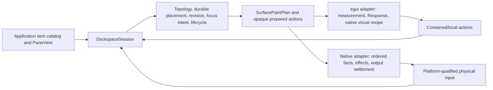
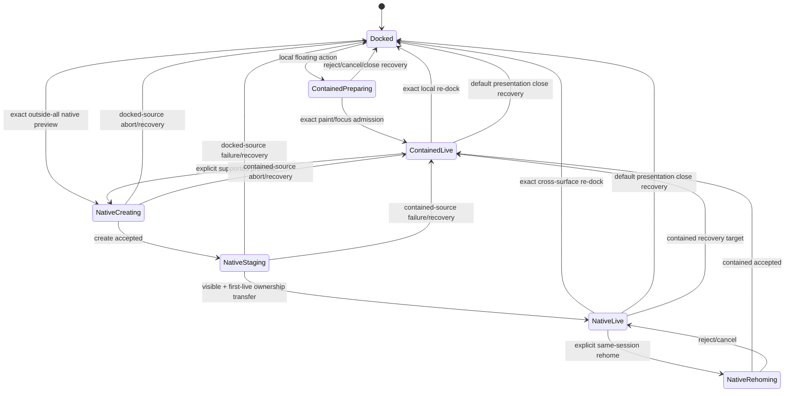
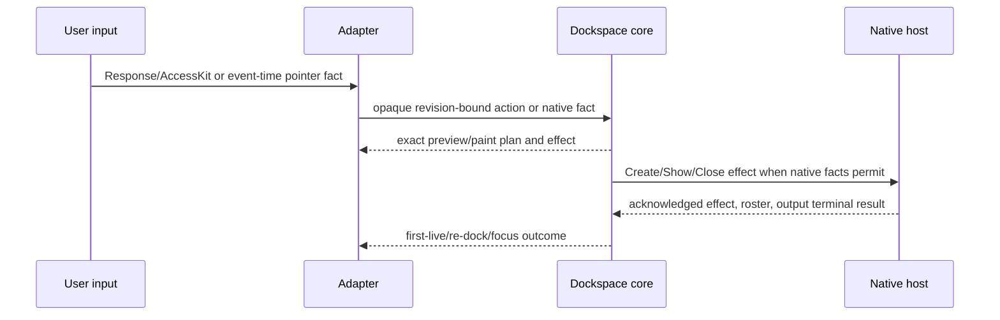

# Dockspace interaction, floating, and multiview conformance

## Goal Capsule

| Field | Contract |
| --- | --- |
| Objective | Make Dockspace feel like a native egui docking surface while supporting coherent docked, contained-floating, and native-child workflows with honest bidirectional docking and evidence. |
| Means | Deepen the existing `DockspaceSession` and product-render seams, reuse egui 0.36.1's `egui_kittest`, and add a thin Dockspace-specific conformance catalog rather than introducing a general GUI test engine. |
| Authority | `dockspace` owns topology, durable floating placement, revisions, drop/preview decisions, focus intent, and native lifecycle. egui adapters own measurement, `Response`/AccessKit facts, visual recipes, and adapter-local decoration. Native adapters own event-time OS facts, effects, and terminal output settlement. |
| Hosting modes | A logical docked root, a contained floating presentation in the same egui context, and a native child window are three presentations of one product state. They are not three graph owners. |
| Test posture | Ordinary Rust and black-box conformance assertions are primary. `egui_kittest` proves egui-local behavior; coordinator tests prove production-shaped native causality; one real-window smoke proves the irreducible event-loop boundary. Physical pointer drag is a separate platform lane until exact facts exist. |
| Compatibility | Reintroducing `egui_tiles` as a model, copying Dear ImGui internals, exposing raw scene/receipt types, or adding a second floating/window state owner is out of scope. |
| Stop conditions | Unknown or unsupported platform facts fail closed. A programmatic native lifecycle may be complete without implying physical cross-window drag support. Repository and fork pushes are authorized after their gates pass; upstream PR creation and crates.io release remain separately authorized. |

## Product Contract

### Summary

Dockspace already has a strong renderer-neutral core and a functioning programmatic native lifecycle. The next product gap is the interaction layer: tab dragging does not yet feel like the former egui_tiles surface, contained floating chrome is visually separate from egui, and a real mouse drag cannot currently be claimed to create a native child window.

This plan completes the product shape without returning topology authority to a renderer. Local docking, contained floating, and native multiview use one action/revision vocabulary. The visual result should use egui's own window and interaction tokens, while the exact geometry and lifecycle facts remain core-owned.

### Problem Frame

The current implementation can render a second native window through an explicit product action, but the running example does not prove a physical tab drag. The tab bar also lacks several small feedback details that make egui_tiles and Dear ImGui feel immediate: broad drag affordances, Grab/Grabbing cursors, a source gap, and a pointer ghost. A separate bespoke floating style would make the product look disconnected from egui and would create another visual policy to maintain.

The test suite has the opposite problem: it has several honest layers, but no small shared vocabulary for expressing a docking scenario across them. Replacing those layers with a generic test engine would either leak core authority into tests or hide native failures behind fabricated facts. The plan therefore strengthens each existing layer and connects them with a narrow semantic catalog.

### Requirements

#### egui interaction and visual integration

- R1. A default-feature official-egui consumer can select, close, reorder, and edge/center-dock tabs through current `Response` and AccessKit facts. The tab body, tab strip, close control, splitter, junction, guide, and contained chrome use egui interaction states without changing core hit geometry.
- R2. A tab bar exposes exact drag regions for tabs, close controls, and unused group-drag space. Tab and close regions remain mutually exclusive; group dragging never steals a tab or close action.
- R3. A drag has visible Grab/Grabbing feedback, a source gap, and a pointer-following ghost; dimming may supplement but never replace the gap. Escape, capture loss, pointer cancellation, stale authority, invalid release, and unsupported native promotion each produce one terminal outcome, clear transient decoration, restore the source/focus, and leave topology unchanged. Decorative motion may be adapter-local, but the acknowledged docking preview always uses the exact current core plan.
- R4. The default comfortable guide preset uses a 48 logical-point visible extent, 6-point hit padding, 12-point inter-guide gap, and 72-point outer inset. Core may uniformly compact the complete directional cluster for a small surface, but must preserve semantic slots, non-overlap, and coherent draw, hit, preview, and acknowledgement geometry.
- R5. Contained floating uses egui-native window visual tokens for fill, stroke, corner radius, shadow, margins, and interaction emphasis. Core-provided outer/title/content/resize geometry remains unchanged by the visual recipe.

#### hosting transitions and accessibility

- R6. The product supports bidirectional transitions among docked roots, contained floating roots, and native child roots through one `Float` intent. A release outside every valid dock target but still inside the current logical surface creates a contained floating presentation; an exact outside-all release promotes to a native child only when the platform capability contract is complete. Explicit `Float`, `Move to New Window`, and `Dock Back` commands provide the keyboard/AccessKit and capability fallback path. Item ownership, selection, focus intent, durable placement, and revision lineage remain atomic across dock, float, re-dock, close, and recovery.
- R7. A contained floating root can move, resize, close, and re-dock without using `egui::Window` as a second durable geometry owner. A native child can be created, admitted after first-live presentation, re-docked, closed, and retired through the existing typed effect/observation protocol.
- R8. Focus, stacking, and accessibility are part of each transition. An effective press on contained title/content/chrome raises that presentation through a revision-bound core action before focus is reported. Selected panes receive the exact focus request that core emits. Tabs and close controls expose select/close; splitters, junctions, and contained resize handles expose axis-correct increment/decrement; floating/group controls expose `Float`, `Move to New Window`, `Dock Back`, and Escape. Pointer-only guide decoration is not presented as keyboard-focusable; semantic direction commands provide the accessible docking path.

#### conformance and native evidence

- R9. `egui_kittest` is used for egui-local semantic queries, pointer/keyboard/AccessKit actions, stable frame progression, and a small visual contract. Existing direct `Context::run_ui` tests remain for multipass discard and final-pass settlement.
- R10. The Dockspace conformance catalog expresses semantic selectors, actions, observations, and capability requirements without exposing raw graph IDs, scene stamps, receipts, hit resolvers, or adapter-derived coordinates. It remains an internal test module until a second UI adapter needs the same interface.
- R11. Native coordinator tests prove event-time pointer facts, lane separation, output ordering, first-live admission, redock, close, ABA isolation, and quiescence. They distinguish fabricated protocol evidence from real OS evidence.
- R12. Physical cross-window drag is enabled only for platforms that provide exact desktop position, hovered-window/capture facts, work-area authority, and native lifecycle results. Unsupported platforms report typed capability gaps instead of guessing.

#### native progress and input retention

- R13. A retained presented framebuffer remains visible while native input backlog or a deferred lifecycle action is being settled. A waiting state must not paint an opaque mask over a valid last presentation unless no valid presentation exists.
- R14. Pointer event retention is lossless during an active gesture. Any idle-only motion coalescing is guarded by both translator-idle and core-interaction-idle state and never crosses a lifecycle, output, sidecar, capture, scroll, or button boundary.

#### public boundary

- R15. Public and adapter-facing interfaces stay item/surface-centric. Internal placement, preview, viewport binding, native output, and persistence authority remain private or opaque.

### Actors

- Application authors provide item catalogs and pane views; they do not own docking topology or native viewport state.
- End users interact with tabs, empty tab-bar space, splitters, contained floating chrome, guides, and native windows.
- The official-egui adapter translates framework responses and AccessKit actions into product actions.
- The native adapter translates ordered Winit/eframe facts and effects into the same session owner.
- Conformance authors add semantic scenarios and capability requirements without becoming a second reducer.

### Hosting Transition Contract

| User intent and release fact | Product result | Evidence and fallback |
| --- | --- | --- |
| Drag a tab or group onto a valid guide in the current surface | Dock/reorder in that surface | The exact painted core preview is acknowledged before release commits. |
| Drag a docked tab or group beyond its source and release inside the current logical surface with no valid dock target | Create a contained floating presentation | Core derives the durable contained rectangle from the frozen source and pointer anchor; the adapter does not choose placement. |
| Drag a contained title/group onto a valid guide | Re-dock to that target | The contained presentation remains live until the exact target preview is accepted. |
| Release an eligible tab/group at exact outside-all desktop space | Create or promote to a native child | Requires complete desktop position, hover/capture, work-area, lifecycle, receiver, and output facts. Missing facts keep the source presentation live and return typed unsupported/unknown. |
| Drag from a native child onto a valid target-surface guide | Re-dock into that target | Ownership and source vacancy commit atomically; native retirement continues as a sidecar lifecycle. |
| Drag from a native child into a target surface but outside every valid dock target | Rehome as contained floating in that target surface | The contained presentation must be accepted before the native source is retired. |
| Invoke `Float`, `Move to New Window`, or `Dock Back` | Perform the corresponding revision-bound transition | These commands are the accessible and deterministic fallback; unavailable commands are disabled with a typed reason. |

### Interaction and Accessibility Contract

| Product concept | Pointer behavior | Keyboard and AccessKit behavior | Availability and naming |
| --- | --- | --- | --- |
| Tab body | Click selects; drag starts the exact tab payload. | A tab role accepts focus and select/press. | The accessible name is the application pane title; selected and disabled state come from the current core plan. |
| Tab close | A disjoint button response closes the item. | A button role accepts press; focus never starts a tab drag. | The close rectangle remains stable when its idle paint is hidden; the name includes the pane title. |
| Group/unused tab-bar region | Drag starts the exact group/root payload without stealing tab or close input. | A visible tab-strip command menu exposes `Float`, `Move to New Window`, and `Dock Back` as ordinary pressable items. | Each command is enabled only when the current revision-bound core action can be prepared; a typed unavailable reason is retained for diagnostics. |
| Splitter | Drag changes the exact adjacent shares. | A splitter role exposes orientation-correct increment/decrement. | Bounds, minimums, maximums, and operability come from the core record. |
| Splitter junction | Drag performs the atomic two-axis gesture. | Two axis-specific child controls expose horizontal and vertical increment/decrement; the junction is not represented as one ambiguous scalar action. | Only axes with an executable prepared action are exposed. |
| Contained title/chrome | Effective press raises; title drag moves; close and resize use disjoint responses. | Focus, close, Escape, and the same presentation command menu are reachable without pointer dragging. Cardinal resize controls use orientation-correct increment/decrement. | The title uses the selected pane title; active/inactive state and stacking come from core. |
| Dock guide | Hover/release uses the exact core draw/hit/preview record. | Decorative guides are not focusable. Directional `Dock Left/Right/Top/Bottom/Center` commands are exposed as ordinary semantic actions in the command surface. | Rejected or unavailable directions remain disabled and never fabricate a target. |
| Pane content | The application receives the core content rectangle and its ordinary egui input. | The final pass resolves the exact core focus request through `PaneView::focus_target` and reports `PaneView::focus_state`. | Missing bindings fail closed as `PaneFocusBindingUnavailable`; selection is never guessed to mean focus. |

Presentation close is distinct from item close. The default product policy restores the owned root to its current validated recovery anchor and then retires the presentation; it never destroys pane content. If the anchor is stale or unavailable, close is vetoed/deferred and the current presentation remains visible. `RetainLayout` and content destruction remain explicit application policies, and examples must name their consequence instead of promising recovery they do not perform. Closing during native creation/staging follows the same recovery rule before compensating cleanup; an already-empty child retires directly.

### Key Flows

#### F1. Local tab docking

1. The adapter measures the current surface and receives a core paint/receiver plan.
2. A tab or exact group-drag region receives a `Response` and produces a revision-bound product action.
3. Core validates the current preview and commits the topology once.
4. The next plan paints the new topology, focus target, and guide state.

#### F2. Contained floating and re-dock

1. Core prepares a contained placement with durable outer geometry and a source presentation authority.
2. The adapter paints the root with egui-native window visuals over core geometry and collects title/resize/close responses.
3. Move and resize update the durable placement through revision-bound actions; visual feedback never becomes a second geometry authority.
4. A re-dock action stays pending until the exact current preview is painted, then atomically returns the root to a dock target and restores focus.

#### F3. Native detach and first-live admission

1. Exact desktop pointer facts and the final presented receiver authorize an outside-all preview.
2. Core emits a typed native create effect while retaining source recovery state.
3. The native adapter creates a hidden child, presents staging output, dispatches visibility, observes the later visible roster, and presents post-show staging while core retains source recovery authority.
4. The first exact live presentation atomically transfers ownership and admits semantic input. A failure or close before that boundary restores the source and retires the child without leaving a route.

#### F4. Native re-dock and close

1. A live child receives an exact cross-window drag or a product re-dock action.
2. Core commits the target ownership and source vacancy atomically after preview presentation.
3. The empty child follows typed close/retirement policy, including veto/deferred acknowledgement and exact destruction.
4. Focus recovers to the core-selected target; stale A1 observations cannot mutate successor A2.

#### F5. Layered conformance execution

1. A semantic scenario declares selectors, actions, observations, and required capabilities.
2. A selected executor maps those concepts to its own framework facts.
3. The executor reports product outcomes, terminal lifecycle status, and unsupported capability edges.
4. The scenario never supplies core geometry or fabricates native output/presentation evidence.

### Acceptance Examples

- AE1. **egui-native tab feel**
  - **Given:** A tab bar contains two tabs and unused trailing space.
  - **When:** The pointer hovers, presses, crosses the drag threshold, and releases over a valid edge guide.
  - **Then:** The tab shows Grab/Grabbing feedback, the source gap and ghost are visible, the exact preview is painted before release, and core commits one edge dock.
  - **Covers:** R1, R2, R3, R4.

- AE2. **Contained floating style and re-dock**
  - **Given:** A docked root has a valid recovery anchor and no active dock target at the release point inside its logical surface.
  - **When:** The user releases the tab/group to float it, moves/resizes the contained presentation, and then drags it to a dock target.
  - **Then:** The root becomes contained rather than native, its chrome follows egui window visuals, durable geometry changes only through core actions, and re-dock restores item ownership and focus exactly once.
  - **Covers:** R5, R6, R7, R8.

- AE3. **Programmatic native child**
  - **Given:** A managed host has complete lifecycle and work-area facts.
  - **When:** A product tear-off creates a child and the host completes hidden staging, show/visible observation, post-show staging, and first-live presentation.
  - **Then:** The child becomes interactive only after first-live, ownership is transferred once, and redock/retirement leaves no route or pending effect.
  - **Covers:** R6, R7, R11.

- AE4. **Physical drag capability gate**
  - **Given:** A platform lacks exact desktop motion or work-area facts.
  - **When:** The user drags a tab toward outside-all space.
  - **Then:** The action remains in its current local/contained presentation and reports typed unsupported/unknown; no child window is created from guessed geometry.
  - **Covers:** R11, R12, R15.

- AE5. **Waiting without visual occlusion**
  - **Given:** A valid presented child framebuffer exists while ordered native input or output settlement is pending.
  - **When:** The host is waiting for the next causal boundary.
  - **Then:** The last valid presentation remains visible, no opaque mask covers it, and the coordinator remains live until its obligations settle.
  - **Covers:** R11, R13.

- AE6. **Active gesture retention**
  - **Given:** A splitter or tab drag is active and several pointer moves are interleaved with output records.
  - **When:** The source crosses and returns across the drag threshold before release.
  - **Then:** Every semantically relevant move is preserved; idle-only coalescing cannot remove the move that began the drag or alter a resize preview.
  - **Covers:** R3, R11, R14.

- AE7. **Conformance adapter boundary**
  - **Given:** A semantic scenario asks for `Tab(item_key)` and `Close(item_key)`.
  - **When:** `egui-product-headless` runs it through AccessKit and `native-coordinator-trace` runs its production-shaped event trace.
  - **Then:** Both report product outcomes through public observations, while neither names a scene stamp, receipt, raw node, or guessed hit rectangle.
  - **Covers:** R9, R10, R15.

- AE8. **Presentation close recovers content**
  - **Given:** A contained or native presentation owns panes and has a current validated recovery anchor.
  - **When:** The user closes the presentation rather than explicitly closing its pane content.
  - **Then:** The root returns to the recovery target, focus follows the core-selected pane, and the obsolete contained/native presentation retires exactly once. An application-selected `RetainLayout` policy instead reports that explicit outcome and never claims content recovery.
  - **Covers:** R6, R7, R8.

### Success Criteria

- The official-egui product harness contains deterministic coverage for tab/group drag feedback, contained floating transitions, native-style chrome inheritance, focus, and guide density without relying on image comparison as the primary oracle.
- The native lifecycle smoke continues to pass and is named as programmatic real-window lifecycle evidence; it is not described as physical drag evidence.
- The conformance catalog has explicit executor and capability assignments for local, contained, programmatic native, and physical-platform scenarios.
- Programmatic multiview and physical multiview are separate milestones. The repository is not described as physical-multiview-complete until at least one reference backend passes the real OS-input smoke.
- A platform that cannot provide exact desktop facts cannot advertise physical tear-off support.
- A valid last presentation remains visible during native backlog/settlement, and active drag/resize pointer records are not lost through unsafe ingress coalescing.
- The public facade and adapter seams contain no new raw graph, scene, receipt, or second-window-authority exposure.

### Scope Boundaries

In scope:

- Official-egui local interaction and contained floating product behavior.
- egui-native visual recipes for contained floating and shared content chrome.
- Bidirectional dock/contained/native transitions, focus, close, recovery, and retirement.
- Existing managed native coordinator correctness and honest waiting/backpressure behavior.
- `egui_kittest` adoption where it reduces duplicate local harness code.
- An internal semantic conformance catalog and executor matrix.
- Platform-specific physical pointer enablement only where facts are complete.

Deferred:

- A second UI adapter and the extraction of a stable public driver trait.
- Full Wayland desktop-global drag support where the compositor does not expose the required facts.
- Cross-platform hardware-input certification, screenshots, and video baselines.
- Open-GPUI integration or any production adapter cutover.
- Advanced docking policies, auto-hide, window menus, dirty markers, and ImGui-specific flags not required for the three hosting modes.

Explicit non-goals:

- A general GUI automation engine or a new trace/DSL interpreter.
- Porting `imgui_test_engine` or using its non-uniform license.
- Reintroducing `egui_tiles` as a model, `Behavior`, or mutation authority.
- Letting `egui::Window`, a native viewport map, or a test fixture own durable floating geometry.
- Using screenshots, fixed coordinates, sleeps, core-injected gestures, or guessed window rectangles as universal native evidence.

### Sources and Research

- `docs/knowledge/dockspace-interaction-and-test-infrastructure-research.md`
- `docs/plans/2026-08-08-001-refactor-dockspace-product-boundary-plan.md`
- `repo-ref/egui-release/crates/egui_kittest/README.md` and `repo-ref/egui-release/crates/egui_kittest/src/lib.rs`
- `repo-ref/egui_tiles/src/behavior.rs`, `repo-ref/egui_tiles/src/tree.rs`, and `repo-ref/egui_tiles_docking/src/container/tabs.rs`
- `repo-ref/imgui_test_engine/docs/README.md` and `repo-ref/imgui_test_engine/imgui_test_engine/imgui_te_context.cpp`
- `repo-ref/dear-imgui-rs/` multi-viewport runtime and lifecycle modules
- `crates/dockspace_host_conformance/`
- `integration/egui-product-harness/`
- `integration/egui-native-smoke/`
- `crates/egui_dockspace/src/product_render/`
- `crates/egui_dockspace_native/src/`

## Planning Contract

### Key Technical Decisions

- KTD1. **Keep one semantic owner across all three hosting modes.** Docked, contained-floating, and native-child presentations attach to one `DockspaceSession`; neither egui nor the native coordinator gets a graph or durable placement copy. (session-settled: user-directed — chosen over separate per-mode trees and reconciliation.)
- KTD2. **Use egui-native visual recipes without using egui-native geometry ownership.** Contained floating borrows `Frame::window`/style visuals for fill, stroke, radius, shadow, margins, and interaction state, while core records remain the only draw/hit/resize geometry. (session-settled: user-directed — chosen over a bespoke floating skin.)
- KTD3. **Model contained and native floating as different presentation contracts.** Contained floating is same-context and can use egui-local responses; native child requires event-time platform facts, output tokens, and first-live admission. They share actions and outcomes but not evidence shortcuts.
- KTD4. **Borrow egui_tiles' interaction recipe, not its `Tree`/`Behavior`.** Empty tab-bar drag regions, cursors, source gap, ghost, and hover visuals are adapter feedback over core records; topology, target choice, shares, and payload remain in core.
- KTD5. **Adopt `egui_kittest` selectively.** Use it for semantic widget lookup, AccessKit, pointer/keyboard actions, and stable frame progression. Keep direct `Context::run_ui` for multipass/final-pass and presentation-settlement tests that kittest does not model.
- KTD6. **Keep the conformance kit internal until a second adapter exists.** Start with semantic scenario functions and a capability matrix in the existing test crate; freeze a driver interface only when a real second adapter proves the variation.
- KTD7. **Keep physical native drag as a capability-qualified lane.** Programmatic native lifecycle is a mainline smoke gate; physical cross-window drag is enabled and gated per platform only after exact desktop position, hover/capture, work-area, lifecycle, and output facts are available.
- KTD8. **Keep motion decorative and adapter-owned.** Ghost alpha, hover dwell, and cursor polish may use an adapter clock, but core preview, hit geometry, revision, and presentation acknowledgement always use exact current records.
- KTD9. **Reuse the existing native lifecycle seam.** Do not revive the retired hosted viewport cycle or expose output tokens. Native creation, staging, show, visible observation, first-live, redock, close, and retirement remain in the current coordinator/session protocol.
- KTD10. **Change guide density atomically.** Comfortable guide size changes must update draw, hit, preview, and compaction behavior together through core presentation configuration; painter-only enlargement is rejected.
- KTD11. **Deepen modules by ownership.** New seams should be deep: a small interface hides response mapping, floating visual recipe, focus bridge, scenario execution, or native lifecycle details. Avoid forwarding-only file splits and generic protocol frameworks.
- KTD12. **Do not make physical drag a release blocker for unsupported platforms.** The product can ship local and programmatic native evidence while declaring physical support unavailable on platforms with missing facts; capability truth is more important than a broad but false claim.
- KTD13. **Use one capability-aware `Float` intent.** Local release facts choose contained floating, exact outside-all facts may choose native floating, and explicit commands provide the accessible fallback. The adapter never chooses topology or silently upgrades a contained presentation.
- KTD14. **Treat presentation close as recovery by default.** Closing a contained/native presentation restores its root through the current core recovery anchor; destroying content or retaining a detached layout is an explicit application policy, not the default example behavior.

### Assumptions

- The pinned egui/eframe/winit revisions remain the supported 0.36.1 native seam while this plan executes.
- The application continues to provide pane content through `PaneView` and does not expect Dockspace to own application widget state.
- The native smoke remains X11/Glow in CI; macOS physical input is an optional platform lane rather than a hosted-CI release gate.
- X11/Glow under Xvfb plus a real window manager and XTest is the first automatable physical-input reference lane. macOS first restores exact same-window drag facts locally, then gains physical native promotion when hover/work-area facts are complete.
- A second UI adapter is not part of this plan, so the conformance driver interface remains private/test-only.

### High-Level Technical Design

Native retirement is an orthogonal sidecar lifecycle: any successful native re-dock, rehome, close recovery, or failed create may continue through close acknowledgement, destruction, tombstone, and quiescence after the product presentation has changed. `Quiescent` is evidence that native obligations and references are empty, not a fourth user-visible hosting mode.

The key seam is the current product paint/action interface. The adapter receives exact records, turns framework responses into opaque prepared actions, and returns product observations. The floating visual recipe is deliberately separate from the durable placement contract. The conformance catalog consumes only the public product observations; it never asks core to resolve a test coordinate for it.

### Evidence Executors

| Canonical executor | Evidence boundary |
| --- | --- |
| `core-host` | Renderer-neutral topology, revision, prepared action, lifecycle, and fail-closed semantics. |
| `egui-product-headless` | One-context egui `Response`, AccessKit, paint shapes, direct multipass, and contained behavior. |
| `native-coordinator-trace` | Production-shaped ordered platform facts, receiver challenges, effects, output ordering, and quiescence without claiming real OS provenance. |
| `native-real-window-lifecycle` | Real eframe root/child windows, hidden/show/first-live, programmatic redock, close, destruction, and retirement. |
| `native-physical-platform` | Real OS pointer input through the production Winit journal on one explicitly supported backend. |

### System-Wide Impact

| Area | Impact |
| --- | --- |
| Core model/runtime | Add or complete product-level transitions and observations for contained/native floating, focus, and re-dock; preserve revision and lifecycle atomicity. |
| Official egui adapter | Adopt egui-native window visuals, broaden drag affordances, add drag feedback, junction/focus handling, and keep multipass settlement separate from local actions. |
| Native adapter | Preserve last valid presentation under backlog, keep active pointer events lossless, close native scroll/receiver/capability gaps, and gate physical input by platform facts. |
| Test infrastructure | Add selective `egui_kittest` use and a semantic scenario/capability catalog without a generic runner. |
| CI/docs | Distinguish programmatic native smoke from physical pointer smoke, add focused platform/capability evidence, and document floating mode transitions. |
| Public API | No raw graph, scene, receipt, or viewport token exposure; new product types must remain item/surface-centric or opaque. |

### Delivery Sequence

1. **M1 — seamless single-surface docking and contained floating:** U1-U3 deliver the unified `Float` intent, egui-native floating chrome, drag feedback, guide density, focus, stacking, close recovery, keyboard, and AccessKit. This is independently shippable without native physical drag.
2. **M2 — reusable evidence and programmatic multiview:** U4-U5 establish the private scenario catalog, deterministic multi-surface host coverage, and real-window create/first-live/redock/close/quiescence evidence.
3. **M3 — physical multiview by backend:** U6 certifies one reference backend at a time. Unsupported platforms remain capability-negative without blocking M1/M2.
4. **M4 — consolidation:** U7 removes temporary duplication, aligns feature/package gates, and makes documentation claims match the strongest passing executor.

## Implementation Units

### U1. Unify floating presentation and bidirectional product actions

**Goal:** Make docked, contained-floating, and native-child transitions one revision-bound product contract.

**Requirements:** R6, R7, R8, R15.

**Files:**

- `crates/dockspace/src/engine/product_action.rs`
- `crates/dockspace/src/engine/product_action/contained.rs`
- `crates/dockspace/src/engine/presentation_rehome.rs`
- `crates/dockspace/src/engine/native_tear_off.rs`
- `crates/dockspace/src/engine/local_contained.rs`
- `crates/dockspace/src/runtime.rs`
- `crates/dockspace/src/runtime/paint.rs`
- `crates/dockspace/src/model/action.rs`
- `crates/dockspace/src/close_plan.rs`
- `crates/dockspace/src/engine/close_workflow.rs`
- `crates/dockspace/src/engine/tests/`
- `crates/dockspace/tests/`

**Approach:** Inventory existing item/root/contained/native actions before adding types. Add one engine-private `RootPresentationTransition`/rehome saga rather than three public mutation paths. Public `prepare_float_root`, `prepare_move_root_to_new_window`, and `prepare_dock_root_back` methods accept only stable product identities and return opaque `PreparedDockAction`; core derives contained placement from the exact source/target presentation and pointer anchor, while an explicit native command may accept the existing product-level native placement request. For native-to-contained rehome, retain native ownership while a target contained staging output is painted and presented; only that exact target admission transfers ownership and emits `ReleaseChild`. A rejected/stale/failed staging attempt keeps the native source live. Reuse existing contained geometry and native create sagas, keep durable floating placement, recovery anchors, stacking, and focus intent in core, and make presentation close recover by default while preserving explicit `RetainLayout` and content-close policy choices. Require stale revision, missing source presentation, unsupported native capability, duplicate pending saga, and invalid re-dock to reject atomically with no identity/frontier or ownership mutation.

**Test scenarios:**

- Docked item to contained floating and back preserves item multiset, selection, focus intent, and one version advance.
- Contained root to native child preserves recovery anchor until first-live, then transfers ownership exactly once.
- Native child to contained floating succeeds only after the contained presentation is accepted, then retires the exact native predecessor without losing item, selection, focus, or placement lineage.
- Native child to another surface and native child to contained presentation reject stale/unknown routes without mutating source ownership.
- Default presentation close during contained/native create, staging, live, and empty-child phases restores or retires exactly once; explicit `RetainLayout` never claims recovery.
- Whole-root and single-item actions share the same product outcome vocabulary and never expose internal node identities.

**Verification:** Focused core nextest for product actions, contained geometry, native lifecycle, recovery, and public API/rustdoc checks.

**Dependencies:** None.

### U2. Adopt egui-native floating chrome and response-first drag feedback

**Goal:** Make the default egui renderer visually and interactively continuous with egui while preserving core geometry and authority.

**Requirements:** R1, R2, R3, R4, R5, R8, R15.

**Files:**

- `crates/egui_dockspace/src/product_render/mod.rs`
- `crates/egui_dockspace/src/product_render/tabs.rs`
- `crates/egui_dockspace/src/product_render/tab_chrome.rs`
- `crates/egui_dockspace/src/product_render/contained.rs`
- `crates/egui_dockspace/src/product_render/splitters.rs`
- `crates/egui_dockspace/src/product_render/guides.rs`
- `crates/egui_dockspace/src/product_render/schedule.rs`
- `crates/egui_dockspace/src/style.rs`
- `integration/egui-product-harness/Cargo.toml`
- `integration/egui-product-harness/Cargo.lock`
- `integration/egui-product-harness/tests/product.rs`
- `crates/dockspace/src/scene_compiler/surface.rs`
- `crates/dockspace/src/runtime/paint/tabs.rs`
- `crates/dockspace/src/runtime/paint/guides.rs`

**Approach:** Extend core paint records with exact group-drag regions and any required drag-decoration metadata; do not recompute unused tab-bar geometry in the adapter. Register disjoint `Response`s for tabs, close controls, group regions, splitter junctions, guides, and contained roles. Use egui `Style::interact` and `Frame::window`/window visuals for state and chrome. Add a source gap with optional dimming, pointer ghost, Grab/Grabbing cursor, and the R4 comfortable guide preset while keeping target preview rectangles exact. Add MouseWheel routing and a draggable scrollbar for overflow tab strips/menus. Resolve the current interaction-stroke semantic bug so selected-tab color does not leak into unselected controls, and let cursor state depend on pointer drag rather than focus alone. Introduce `egui_kittest` here for semantic widget lookup and stable interaction stepping; direct context tests remain authoritative for multipass settlement.

**Test scenarios:**

- Empty leading/trailing tab-bar regions start group drag; tab and close rectangles win their own interactions.
- Hover, press, drag threshold, and release produce the expected cursor and source-gap/ghost states without changing hit bounds.
- Escape, invalid release, capture loss, stale authority, and unsupported promotion each clear gap/ghost/guides, restore source/focus, and produce no topology mutation.
- Close hover visibility changes paint only; reserved close geometry and tab row height remain stable.
- Contained chrome inherits fill/stroke/radius/shadow/margins from egui style; changing visuals never changes core geometry or revision.
- The 48/6/12/72 guide preset produces exact full-size geometry and uniformly compacts every semantic slot without overlap on tiny surfaces.
- Overflow tab strips and menus accept wheel input through the exact scroll receiver and expose a pointer-draggable scrollbar.
- Splitter junction has one response, cursor, and AccessKit role for its actual arms; non-operable junctions expose no action.

**Verification:** Default product harness and focused egui adapter nextest, semantic actions through `egui_kittest`, strict rustdoc, and a small number of low-resolution snapshots only for visual regressions that ordinary shape/state assertions cannot express.

**Dependencies:** U1 for transition records and action preparation.

### U3. Complete contained floating behavior, focus, and accessibility

**Goal:** Make same-context floating panels usable as first-class dockable roots, with egui-native appearance and deterministic focus recovery.

**Requirements:** R5, R6, R7, R8.

**Files:**

- `crates/egui_dockspace/src/product_dockspace.rs`
- `crates/egui_dockspace/src/product_render/contained.rs`
- `crates/egui_dockspace/src/product_render/actions.rs`
- `crates/egui_dockspace/src/product_response.rs`
- `crates/egui_dockspace/src/pane.rs`
- `crates/dockspace/src/runtime/interaction.rs`
- `crates/dockspace/src/runtime/local_action.rs`
- `crates/dockspace/src/runtime/focus.rs`
- `crates/dockspace/src/runtime/paint.rs`
- `crates/dockspace/src/engine/tests/focus.rs`
- `integration/egui-product-harness/tests/product.rs`
- `integration/egui-product-harness/tests/persistence.rs`

**Approach:** Generalize focus transport above native `ViewportBinding`: core publishes an opaque, revision-bound `DockspacePaneFocusRequest` in the target `SurfacePaintPlan`, keyed only by product surface/item identity, and the final egui pass resolves it through `PaneView::focus_target`/`focus_state`. The adapter returns an opaque `PreparedPaneFocusObservation` through the host frame; a discarded pass cannot report it. `Focused` completes the exact request, `NotFocused` remains pending until a later exact observation or superseding intent, and `Unavailable` terminates that request generation with `PaneFocusBindingUnavailable` rather than selecting another pane; a later binding/selection revision may issue a new request. Native activation and first-live feed the same presentation-neutral request instead of creating a second focus path. A first effective press on contained title/content/chrome submits the existing revision-bound raise action; core remains the sole stacking owner and the adapter paints active/inactive egui window states from the resulting roster. Paint contained outer/title/content/resize regions through the egui-native frame recipe while preserving core durable rectangles. Separate local actions from presentation acknowledgements across multipass/discard; a discarded pass cannot release a preview or promote a contained transform. Implement the R8 semantic action matrix for focus order, select/close, axis-correct increment/decrement, `Float`, `Move to New Window`, `Dock Back`, and Escape.

**Test scenarios:**

- A contained panel can be moved, resized, selected, focused, closed, and re-docked while preserving item ownership and focus.
- Pressing either of two overlapping contained panels raises exactly the pressed presentation before focus is reported; occluded controls do not receive responses.
- A close or re-dock recovery focuses the exact core-selected pane, not the first visible pane.
- Missing focus target yields one exact `PaneFocusBindingUnavailable` outcome and no guessed fallback; a later focus-binding revision can issue a fresh request without replaying the old observation.
- A discarded multipass preview cannot release a contained drag or resize; the terminal pass can.
- AccessKit title, close, resize, splitter, tab, menu, and pane actions are executable only when the core action is available.
- Same-context contained roots do not create native effects or duplicate viewport bindings.

**Verification:** Product harness default-feature and serde-separated tests, AccessKit assertions through `egui_kittest`, focused core focus/local-contained nextest, and strict rustdoc.

**Dependencies:** U1 and U2, including U2's `egui_kittest` harness integration.

### U4. Establish the Dockspace semantic conformance kit

**Goal:** Make the behavior catalog reusable in principle without prematurely freezing a generic UI test engine interface.

**Requirements:** R9, R10, R11, R15.

**Files:**

- `crates/dockspace_host_conformance/src/lib.rs`
- `crates/dockspace_host_conformance/src/tests.rs`
- `docs/knowledge/open-gpui-docking-conformance-catalog.md`
- `docs/knowledge/dockspace-interaction-and-test-infrastructure-research.md`
- `integration/egui-product-harness/tests/product.rs`
- `integration/egui-official-harness/tests/`

**Approach:** Keep the current deterministic host as the `core-host` executor and add semantic scenario identifiers, selectors, action descriptions, observations, and capability requirements around it. Add a small private transactional multi-surface fixture that freezes a complete surface/input roster, runs each logical surface, settles outputs in production order, and commits or aborts as one host boundary. It is not a generic runner and cannot mint native or presentation evidence. Use product concepts such as item, surface alias, splitter role, drop direction, and lifecycle state; adapters privately map them to AccessKit, response, or native facts. Reuse U2's `egui_kittest` integration for semantic lookup and event scheduling, but retain direct egui context tests for multipass/output settlement. Do not expose raw IDs, receipts, core hit resolution, or coordinates. Defer a public driver trait until a second real UI adapter exists.

**Test scenarios:**

- The same local tab/close/splitter/contained scenario can report product outcomes through `core-host` and `egui-product-headless` without shared raw authority.
- The private multi-surface fixture proves complete-roster commit/abort, stale target, superseded output, target close during drag, unknown owner, and first-live ordering without claiming real OS windows.
- Capability-negative scenarios explicitly skip or reject native-only cases in the single-surface executor.
- Scenario observations distinguish action terminality, presentation, first-live, retirement, and quiescence.
- The catalog marks programmatic lifecycle smoke separately from physical pointer evidence.

**Verification:** Host conformance nextest, product and official harness nextest, and a documentation review confirming every native claim has the correct executor assignment.

**Dependencies:** U1-U3 provide the product behavior to exercise.

### U5. Harden native coordinator progress and programmatic multiview transitions

**Goal:** Keep the existing real-window lifecycle honest and live while adding bidirectional native re-dock/close evidence.

**Requirements:** R6, R7, R11, R13, R14, R15.

**Files:**

- `crates/egui_dockspace_native/src/app.rs`
- `crates/egui_dockspace_native/src/surface_driver.rs`
- `crates/egui_dockspace_native/src/coordinator.rs`
- `crates/egui_dockspace_native/src/coordinator/shutdown.rs`
- `crates/egui_dockspace_native/src/mailbox.rs`
- `crates/egui_dockspace_native/src/pointer_event.rs`
- `crates/egui_dockspace_native/src/receiver.rs`
- `crates/egui_dockspace_native/src/capabilities.rs`
- `crates/egui_dockspace_native/src/error.rs`
- `crates/egui_dockspace_native/src/application_action.rs`
- `crates/egui_dockspace_native/src/coordinator/tests/`
- `integration/egui-native-smoke/src/main.rs`

**Approach:** Preserve the last valid native presentation while ordered input/output obligations are pending and replace the opaque waiting mask with explicit presentation states: `NoFrame` paints a compact egui-native preparing status and disables semantic input; `PresentedPending` keeps the last framebuffer with no overlay; `FatalOrQuarantined` keeps the last framebuffer, permits close, disables mutations, and shows a non-occluding status strip; `FirstLive` removes status and enables input at the committed boundary. Keep pointer prefixes lossless during active core gestures; permit only strictly idle, same-lane motion coalescing, preserving output and lifecycle order. Track button origin, capture, scroll, device identity, and retired-button tombstones independently so Destroyed cancels the exact active stream and late physical release is consumed without entering a successor stream. Complete receiver lane resolution for click/drag/scroll/hover or report unsupported explicitly. Split configuration/unsupported, retryable host protocol, and post-commit internal invariant errors so callers can act truthfully. Preserve terminal action status and affine effect results through post-commit fatal/quarantine paths. Deterministic coordinator tests inject late A1 observations after successor A2 and own the ABA proof. Extend the real-window smoke only with observable create/first-live/redock/default-close/explicit-retain/retirement/quiescence phases; it does not fabricate callback reordering or claim to prove ABA.

**Test scenarios:**

- A child framebuffer remains visible while input or output settlement is queued; no waiting overlay hides a valid presentation.
- `NoFrame`, `PresentedPending`, `FatalOrQuarantined`, recovery, and `FirstLive` each have deterministic paint, accessibility, input-enabled, and exit-state assertions.
- Interleaved move/output records preserve the move that crosses a drag or resize threshold; idle coalescing never crosses output, capture, scroll, lifecycle, or core-active boundaries.
- Native scroll receiver queries distinguish spatial and locked challenges and fail closed when no exact receiver exists.
- A post-commit error retains action status and terminal effect results; repeated fatal entry freezes rather than destroys owned authority.
- A deterministic late predecessor observation after successor admission cannot mutate or retire the successor; the real-window smoke is not the oracle for this forced ordering.
- Press in binding A, Destroyed A, late release in B, and successor press in B terminates one stream and never yields `ButtonNotPressed`; two devices retain independent pointer/scroll identities.
- Configuration mistakes, unsupported platform facts, retryable protocol errors, and post-commit invariants map to distinct public error kinds.
- Programmatic child create → first-live → re-dock → close → destroyed → quiescence leaves no route, pending output, or effect.

**Verification:** Native coordinator focused nextest, fork workspace formatting, pinned eframe/winit tests, existing real-window Glow smoke, and the extended native smoke binary under Xvfb.

**Dependencies:** U1 and U4.

### U6. Add truthful platform physical-drag capability lanes

**Goal:** Make physical tab-to-native-child drag a real, platform-qualified path instead of an implied feature.

**Requirements:** R11, R12, R14.

**Files:**

- `repo-ref/egui-release/crates/egui-winit/`
- `repo-ref/egui-release/crates/eframe/src/native/`
- `repo-ref/winit-release/`
- `integration/egui-fork-workspace/Cargo.toml`
- `integration/egui-fork-workspace/Cargo.lock`
- `docs/knowledge/egui-native-fork-seam-admission.md`
- `README.md`
- `crates/egui_dockspace_native/src/event.rs`
- `crates/egui_dockspace_native/src/pointer_event.rs`
- `crates/egui_dockspace_native/src/work_area.rs`
- `crates/egui_dockspace_native/src/capabilities.rs`
- `crates/egui_dockspace_native/src/coordinator/tests/work_area.rs`
- `crates/egui_dockspace_native/src/coordinator/tests/ingress_create.rs`
- `integration/egui-native-smoke/`
- `.github/workflows/ci.yml`

**Approach:** Start with event-time platform facts, not core or test-driver injection. First restore exact macOS same-window drag motion so ordinary tab/contained gestures can cross the core threshold without claiming native promotion. Use X11/Glow under Xvfb, a real lightweight window manager, and XTest as the first automated physical-native reference lane; its smoke obtains the current presented semantic receiver through a private read-only diagnostic, translates it with current window facts, and injects real OS pointer events through Winit. Ensure supported backends provide exact desktop motion, independent delivery/capture/hover routes, complete work-area/display provenance, native window inventory, and output terminality. Keep macOS, X11, Windows, and Wayland capability profiles honest; do not promote a profile because an enum exists. Add deterministic platform-fact traces first, then the OS-input smoke only when the full contract is present. The diagnostic cannot construct a drop target, bypass the native journal, or become public API. Land platform changes as verified commits in the egui and winit forks, push those authorized commits, then atomically update the native manifest, lockfile, CI checkout, admission document, and README pins. Re-run every pinned gate from a clean checkout; an unpushed local fork commit cannot complete U6.

**Test scenarios:**

- Press/move/release traces preserve desktop position and route facts on each claimed backend.
- Outside-all release creates a child only with exact current work-area binding and no-window observation.
- Unknown hover, capture, work-area, or visibility yields unsupported/unknown rather than a child or guessed target.
- A physical drag smoke on a supported platform reaches preview, create, first-live, and ownership transfer; unsupported platforms skip with a typed capability report.
- Late destruction or successor binding cannot terminate the physical gesture or route of a replacement.

**Verification:** Pinned eframe/winit event tests, native coordinator traces, platform-specific compile gates, macOS same-window drag locally, and the X11/Glow physical OS-input smoke. Physical smoke is a release gate only for a backend whose profile claims the complete capability.

**Dependencies:** U5 and the platform fork seam.

### U7. Modularize deep seams and close documentation/CI evidence gaps

**Goal:** Keep the interaction and native work maintainable and make claims match evidence.

**Requirements:** R9, R10, R11, R12, R15.

**Files:**

- `crates/egui_dockspace/src/product_render/`
- `crates/egui_dockspace/src/product_dockspace.rs`
- `crates/egui_dockspace_native/src/`
- `crates/dockspace_host_conformance/src/`
- `integration/egui-product-harness/Cargo.toml`
- `integration/egui-official-harness/Cargo.toml`
- `integration/egui-fork-workspace/Cargo.toml`
- `.github/workflows/ci.yml`
- `README.md`
- `crates/egui_dockspace/README.md`
- `docs/knowledge/open-gpui-docking-conformance-catalog.md`

**Approach:** Split only when a deep module owns a state machine, invariant, or resource lifetime: interaction/response mapping, tab strip and drag feedback, contained chrome/focus, conformance execution, native receiver resolution, input batch, and output/retirement. Remove forwarding-only wrappers and stale duplicate helpers. Make product/default-feature harnesses truly separate from serde/native feature graphs. Use the canonical executor names from this plan, label M2 as programmatic multiview and M3 as physical multiview per backend, add explicit native workspace formatting and WGPU checks, and update the current plan/catalog links.

**Test scenarios:**

- A module inventory shows each new module has a smaller interface and a clear owner; no second graph or placement owner appears.
- Default-feature product harness compiles without serde and official harness does not gain backend-only authority through feature unification.
- Native workspace `fmt --check`, pinned WGPU compile, fork tests, and smoke are all independently runnable.
- Documentation never calls programmatic redock physical drag evidence and never claims unsupported platform capabilities.

**Verification:** Full workspace fmt/diff, strict rustdoc, locked package/list checks, default/all-feature nextest, fork workspace fmt/tests/WGPU compile, and smoke invocation from CI.

**Dependencies:** U2-U6.

## Verification Contract

### Core and product gates

- `cargo fmt --all -- --check`
- `git diff --check`
- `cargo nextest run -p dockspace --all-features --all-targets --locked -j1`
- `cargo nextest run -p egui_dockspace --all-features --all-targets --locked -j1`
- `cargo nextest run --manifest-path integration/egui-product-harness/Cargo.toml --test product --locked -j1`
- `cargo nextest run --manifest-path integration/egui-product-harness/Cargo.toml --features serde --test persistence --locked -j1`
- `cargo test --manifest-path integration/egui-official-harness/Cargo.toml --locked`
- `RUSTDOCFLAGS='-D warnings' cargo doc --package dockspace --package egui_dockspace --all-features --no-deps --locked`

### Native deterministic gates

- `cargo fmt --manifest-path integration/egui-fork-workspace/Cargo.toml --all -- --check`
- Pinned eframe host-seam tests for Glow and WGPU compile with `native-host-seam`.
- Pinned winit event-model tests for every claimed event-time fact.
- `python3 scripts/run_egui_fork_harness.py` for the native workspace nextest set.
- Focused `egui_dockspace_native` coordinator tests for scroll lanes, work area, focus, close, replacement, retirement, backlog, and pointer cancellation.

### Real-window and optional physical gates

- Build and run the existing one-shot Glow smoke under Xvfb with a bounded timeout and `LIBGL_ALWAYS_SOFTWARE=1`.
- The smoke must report programmatic lifecycle phases separately from physical pointer phases.
- A physical pointer smoke is required only for a backend whose capability profile is complete; it must use real OS events and the production native journal. It is not substituted by a direct core gesture, fixed-coordinate click script, sleep loop, screenshot, or `request_tear_off_root` call.

### Evidence policy

- Ordinary product and core assertions are primary; snapshots are limited to small visual contracts and never decide topology or native lifecycle correctness.
- A green headless, coordinator, or programmatic smoke test cannot promote a physical multiview capability.
- Every native claim names its required facts and executor in `docs/knowledge/open-gpui-docking-conformance-catalog.md`.
- Unknown/unsupported outcomes are tested as first-class negative cases.

## Definition of Done

Global completion requires:

- Docked, contained-floating, and native-child transitions use one core-owned product/action vocabulary and preserve ownership, revision, focus, close, and recovery invariants.
- Contained floating visually follows egui-native window styling without a second durable geometry owner.
- Local tab/group drag, ghost/gap, guide, splitter/junction, focus, and AccessKit behavior is deterministic and documented.
- Native programmatic first-live, cross-surface re-dock, close, retirement, and quiescence smoke remains green.
- Physical drag support is advertised only on platforms with complete exact facts; other platforms report a typed capability gap.
- The conformance catalog, executor assignments, and research notes match the actual evidence.
- No public interface exposes raw scene/graph/receipt/viewport authority, and no generic test engine or duplicate graph is introduced.
- All verification gates in this plan pass at the supported revisions.
- Abandoned experiments, compatibility shims, duplicate projections, stale test helpers, and dead documentation are removed before completion.

Per-unit completion additionally requires every unit's scenarios and verification to pass, with no unresolved P0/P1 review finding in the touched seam.

## Appendix

### Rejected alternatives

- **Copy `imgui_test_engine`:** rejected because its docking driver directly owns internal windows/nodes, invokes internal drop oracles, teleports/hides windows, and carries a non-uniform license. Its named user action vocabulary remains useful reference material.
- **Build a universal GUI test engine now:** rejected because only one UI adapter currently needs a reusable interface; a generic runner would duplicate selector, scheduling, screenshot, and backend ownership and would freeze an unvalidated seam.
- **Expose core hit rectangles to tests:** rejected because it would make test coordinates a second authority and conceal missing framework/native facts.
- **Use `egui::Window` as contained placement owner:** rejected because it would compete with durable core geometry and complicate re-dock/native promotion.
- **Treat programmatic tear-off as physical drag evidence:** rejected because it bypasses event-time desktop position, hovered-window/capture, work-area, and release routing.
- **Make visual animation part of core preview:** rejected because it would make a decorative clock a semantic authority and could acknowledge a rectangle that was never painted.

### Research trace

The detailed source comparison is recorded in `docs/knowledge/dockspace-interaction-and-test-infrastructure-research.md`. The existing product-boundary contract and native lifecycle decisions remain in `docs/plans/2026-08-08-001-refactor-dockspace-product-boundary-plan.md`; this document is a follow-on plan and does not reopen its settled core ownership or Open-GPUI deferral decisions.
